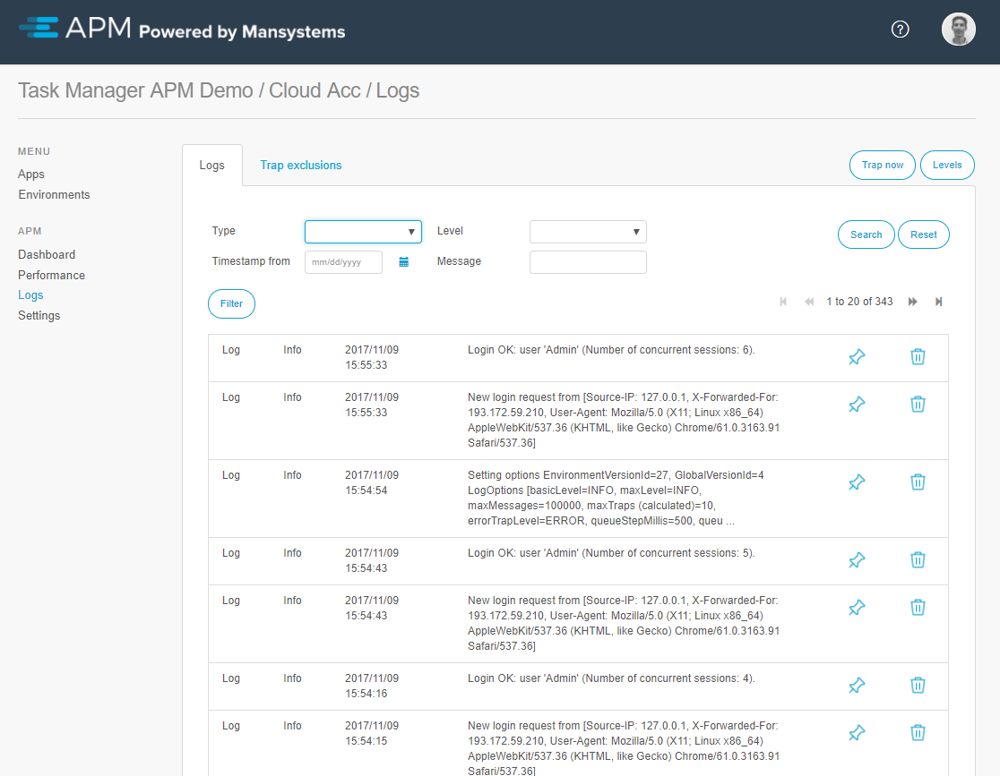
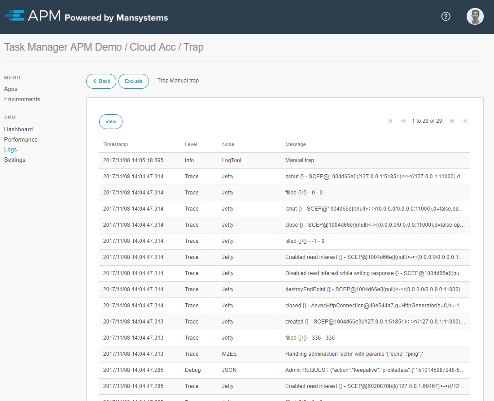
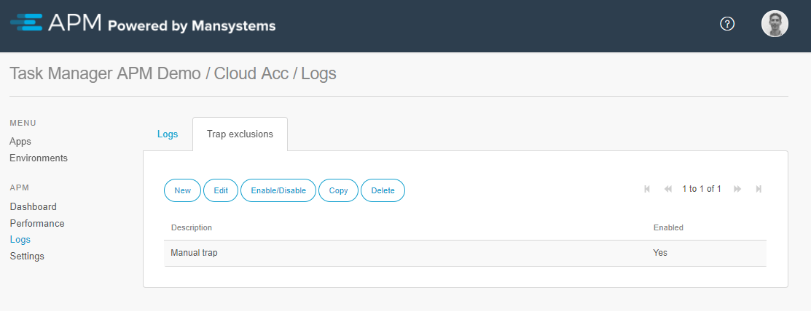
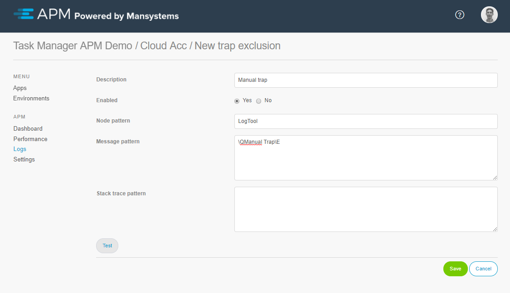

# Logs overview
By selecting logs from the menu the overview of logs and traps is shown.

## Logs
All logging generated by the Mendix application is visible in this overview. 

By selecting the *Levels* button the level of the available lognodes can be changed. This is the same as in the Mendix Modeler.

The *Trap now* button creates a trap right now, storing all trace/debug logging of right before the moment the *Trap now* button was pressed.

The logging will be cleaned up automaticly. The *Pin icon* can be used to prevent log and trap records being deleted by the auto clean-up mechanism. You can also delete logs or traps yourself off course with the *trashcan* button.

## Traps
Trap records can be opened. When opening a trap the list of all low level log records that happened just before the trap are displayed:

The trap now button can be used to simulate a trap. This trap will be saved and can be used to get insights in what is happening in the application.

## Trap Exclusions
If there are traps with errors, warnings or messages that are known, not of interest or don’t need focus at the moment, they can be excluded. By using exclusions only trap information of interest will be generated. Use the exclude button in a trap to create an exclusion.

On the tab *Trap exclusions* it is possible to manage which traps to ignore. It is possible to add, edit, copy, and delete exclusions as well as enable or disable them. By excluding certain errors, warnings, or messages the *Logs* module will only capture information of interest. 

An exclusion contains:

* *Description* to describe what is excluded
* *Enabled* to enable or disable this exclusion
* *Node pattern* to match the node name
* *Message pattern* to match the message
* *Stack trace pattern* to match the stack trace

The patterns are [regular expressions](https://docs.oracle.com/javase/8/docs/api/java/util/regex/Pattern.html), which are used to check if a message should be excluded or not. 

When creating an exclusion from a log or trap message using the *Exlude* button, the special characters in the message are automatically escaped according to the regular expression language by placing \Q before and \E after the text. 

To make the pattern more generic you need to escape according to the regular expression rules. In short place a backslash before any special character, including a backslash itself.

The *Test* button performs a query on the APM manager to see if existing logs or traps match the patterns. This is added for convenience to test if the patterns work as expected.

