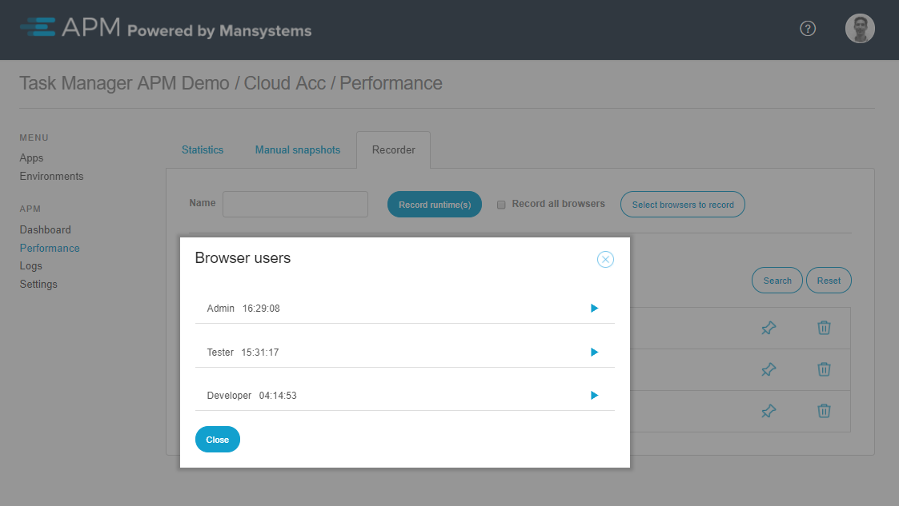
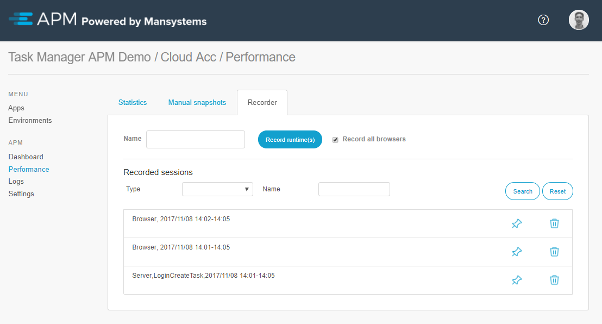

# Performance recorder

The Performance Recorder enables to record each individual action within the Mendix application. There are two recording options. Recording the runtime, records server actions (microflows and client API), and recording the browser(s), which records the users connection to the application.

Recording the runtime is useful to investigate slow microflow, and pinpoint time consuming action(s). Whereas recording the browser shows the performance from the user's perspective, and subsequent actions the browser performs as result of the server responses.

## Record a new session
A new recording session is started by clicking the button *Record runtime(s)*. Optionally a session name can be provided, and the checkbox for the browsers of users can be selected to be recorded as well.

It is possible to record an individual user's browser, without recording the runtime, by unchecking *Record all browsers*, and clicking on the button *Select browsers to record*. A popup shows a list of the users logged in on the current day, in which it is possible to select the users to record the browsers of.

## Recorded results
The results of a recording are found in the Recorded Sessions overview. This tab displays the recordings of the runtime(s) seperate from the browser recordings. 

When clicking recordings of type Browser, the [browser recording results](browser-recorder-results) opens. When clicking the recordings of type Server the [server recording results](runtime-recorder-results) opens.

**Note**: A browser session is per browser window. In case a user uses multiple browser instances to connect with the application, it results in a recorded session for each instance.

### Pinned recording sessions
Recordings are automatically cleaned after a week. If desired, it is possible to pin down a recorded session to prevent automatic removal. For example when you wish to compare the difference in performance after a deployment, but a deployment is not scheduled within a week. 

