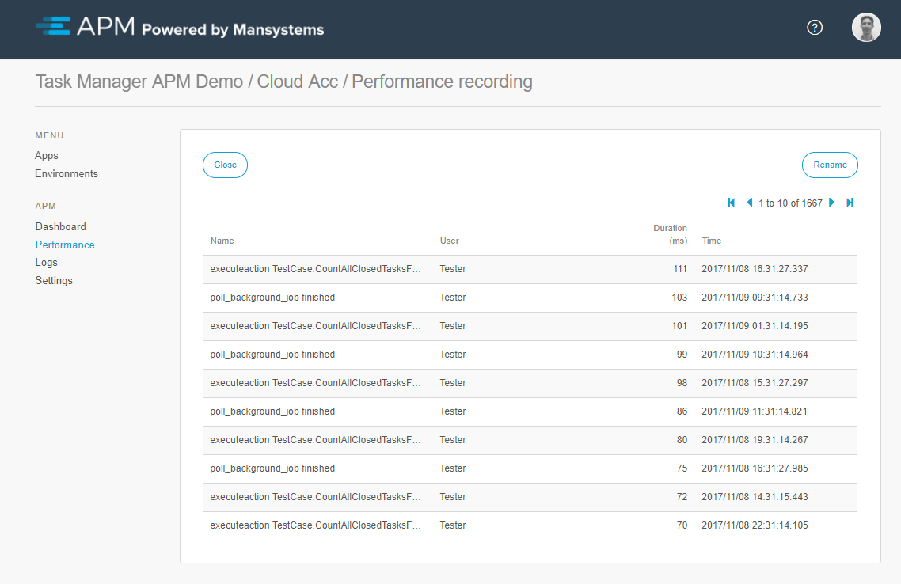
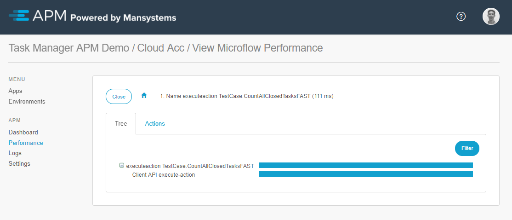
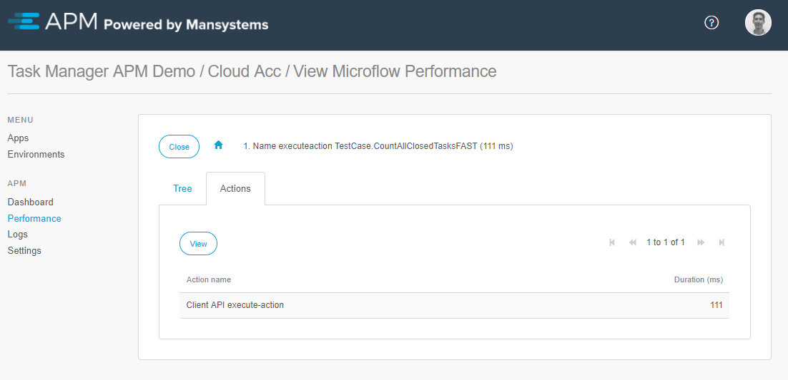

# Runtime recorder
When opening an Runtime recording from the [recorded sessions overview](recorder) the details of this runtime recording will be shown. The results are sorted by duration. All recorded actions are clickable and will show detailed information. By drilling down the exact location of where the time is spent can be pinpointed.

The Tree view will give an overview in duration of the microflows or actions. 

The Actions tab will display actions within the action.
