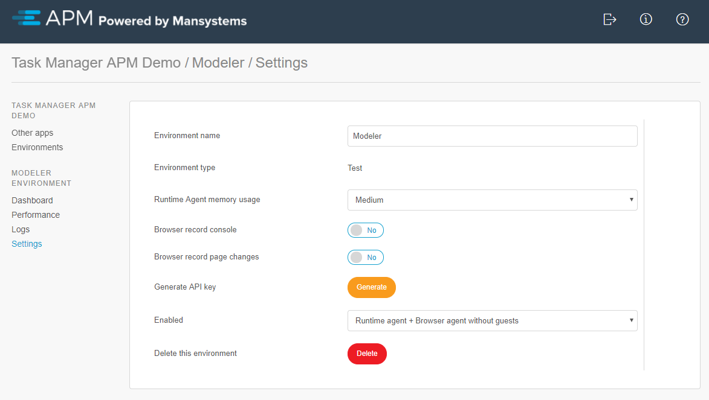
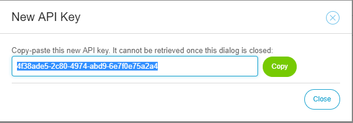

# APM Settings
The following settings are available for an environment:

By default the best options are already selected for the most common situations. The following settings can be changed:

* **Name**
* **Environment Type** Modeler, test, acceptance or production. Modelers are private to the creator of the environment. To use test, acceptance or production you need to be a cloud operator in Mendix.
* **Runtime agent memory usage** (Advised setting is Medium). This determines several technical settings such as maximum trap duration, maximum number of trap records, maximum number of messages or performance nodes recorded in the agent that still need to be sent to the manager. This setting is a protection against too much memory use. In a Modeler you can safely set the to large to record/trap more.
* **Browser record console** (Advised setting is No. If enabled, the Browser Agent will record all Javascript console logging) 
* **Browser record page changes** (Advised setting is No. If enabled, the Browser Agent will record all mutations to the HTML DOM)
* **Enabled** You can configure if browser agent guest users, browser agents or runtimes are allowed to connect to this environment. This is a security setting.
* **Generate API key**
* **Delete this environment** (This button will delete the environment from the APM manager)

When you generate an API key for a runtime/modeler environment, you get to see this key only once, so copy-paste and use it immediately. For more information about the installation see the [installation manual](installation)

You can use the **Copy** button to copy the API key to the clipboard.