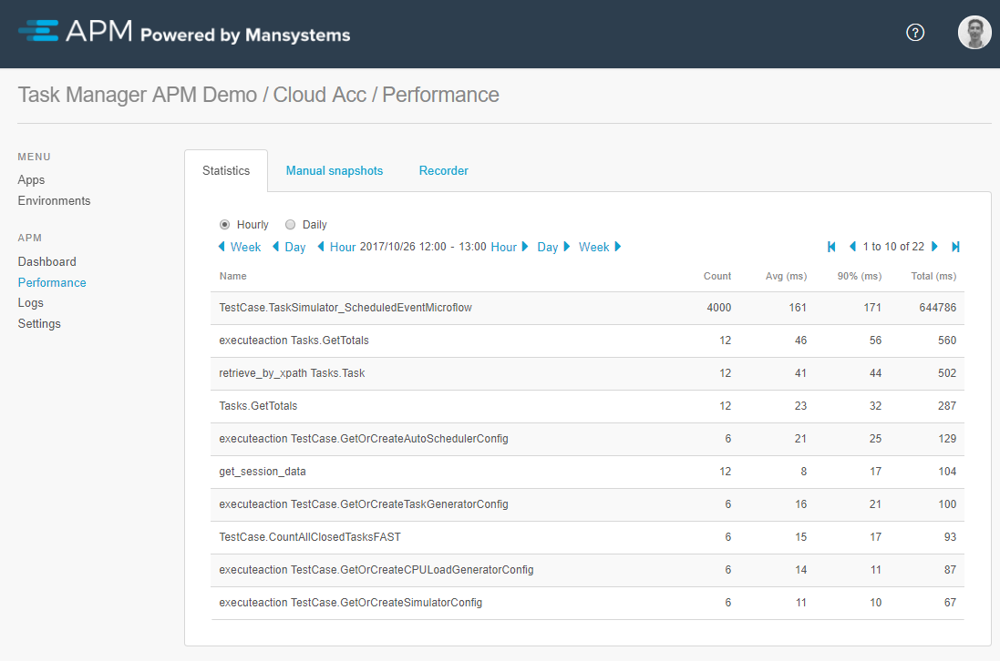
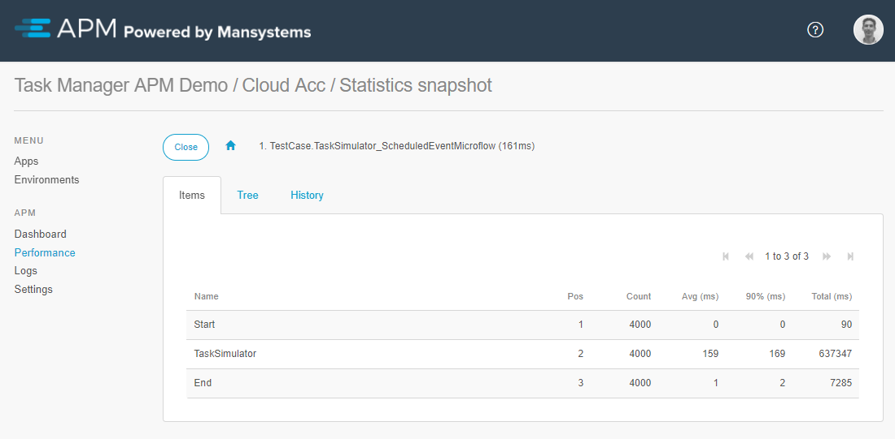
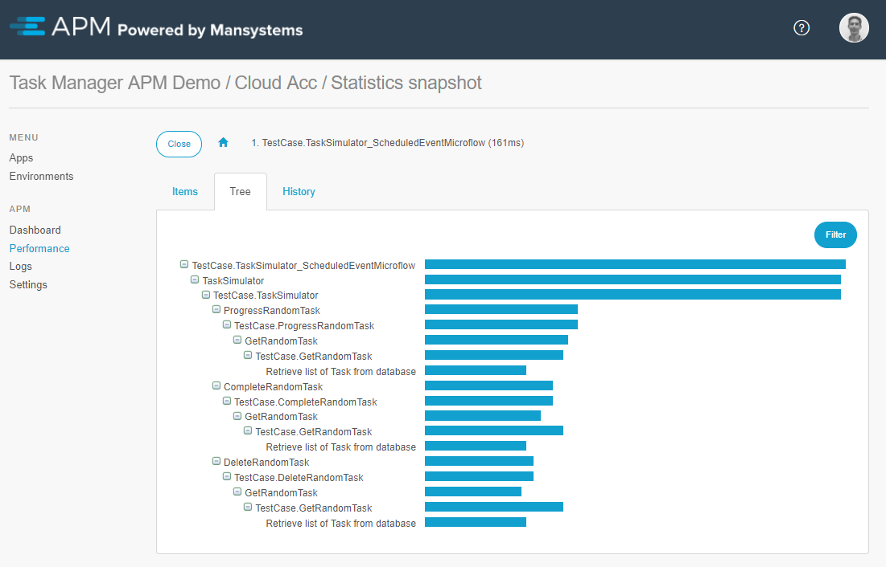
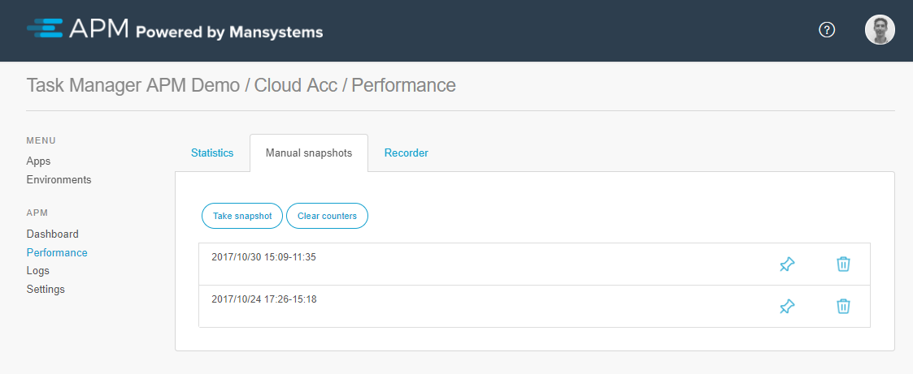

# Performance Statistics
On the Statistics tab the collected statistics are displayed with the following columns:

* *Name*: Name of the microflow or client API call.
* *Count*: Count of the microflow or client API call.
* *Avg (ms)*: Average duration in milliseconds.
* *90% (ms)*: Duration in 90% of the occurrences in milliseconds.
* *Total (ms)*: Total time of all occurrences in milliseconds.

This overview displays the statistics hourly or daily. You can switch between time periods. It is possible to drill down into each microflow, page or client-API call for more information. In case of a microflow, statistics regarding the microflow action(s) and submicroflow(s) are shown, as well as a historic chart. In case of a page, it shows the historic chart, as well as which page(s) the users opened from that page. 

## Microflow Statistics
The *Items* tab provides insight into all actions and submicroflows of the selected microflow from the statistics overview. Drill down displays more details.

The *Tree* tab can be used to see the statistic results in a quick overview. This overview will help pinpoint the actions with the longest duration. Drill down displays more details.

The *History* tab gives insight in to duration and count over time. These insights helps to detect trends and see if optimizations were successful. 

Using the *Manual snapshots* tab, it is possible to create a manual statistics snapshot. When clearing the counters the manual statistics are reset. This can be helpful to collect data over a small period of time.

