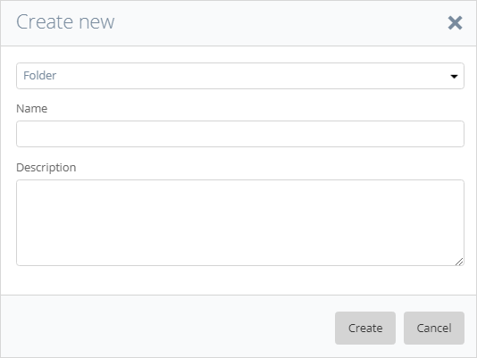
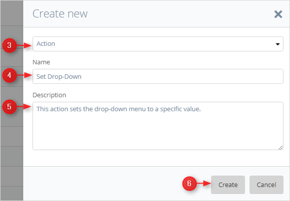
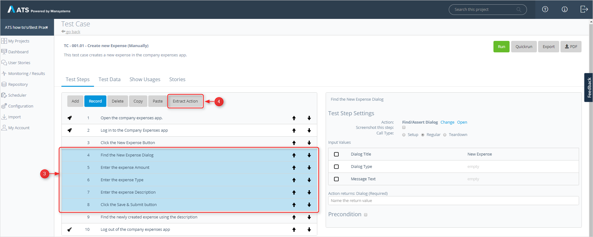
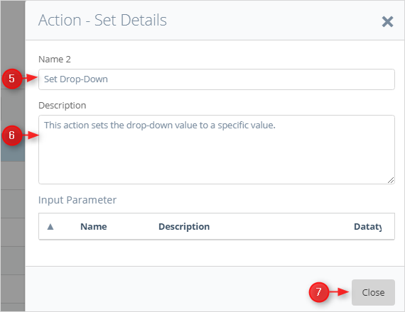
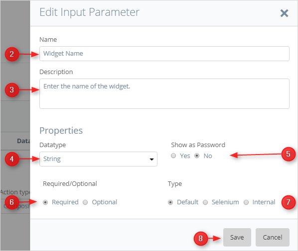
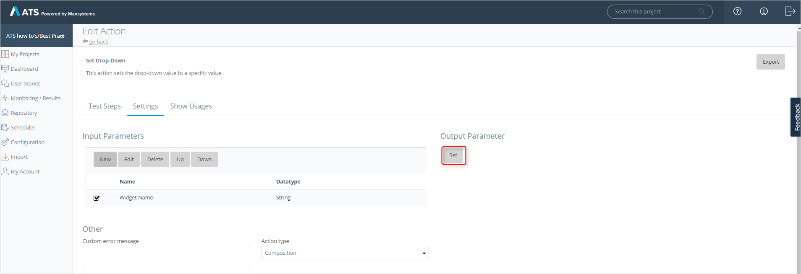
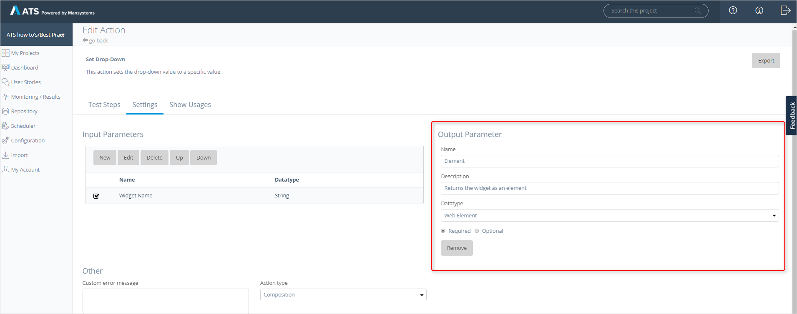
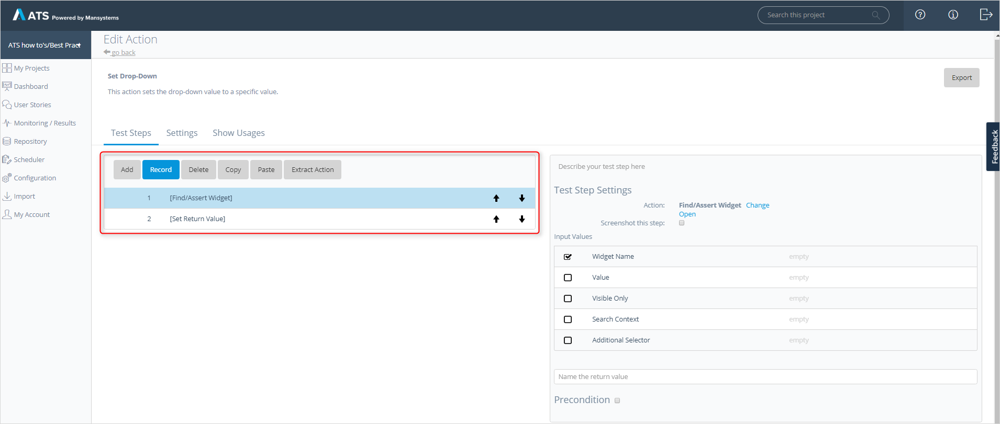
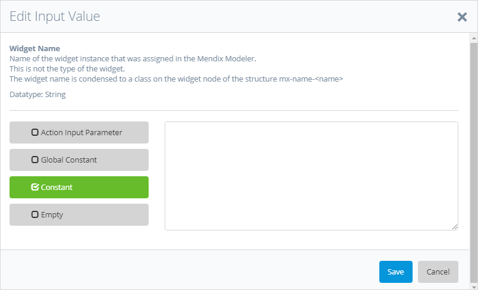
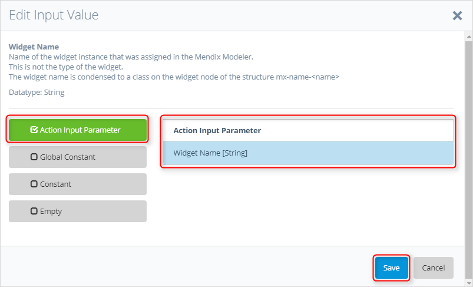

## 1 Introduction

This how-to explains the basics of creating a custom action. You must complete this how-to before proceeding with [How to Create Custom Actions](ht-one-create-custom-actions).

**This how-to will teach you how to do the following:**

* Create a custom action
* Add parameters
* Connect parameters

## 2 Prerequisites

Before starting this how-to, make sure you have completed the following prerequisites:

* Have a general knowledge of ATS
* Complete [How to Get Started](ht-one-getting-started)
* Complete [How to Create a Test Case](ht-one-create-a-test-case)
* Read [Guidelines for Creating a Custom Action](ht-one-guidelines-custom-action)

## 3 Creating a Custom Action

The following sections describe how to create a custom action. There are two options for creating a custom action:

* Use the **Add Item** button in the **Repository**
* Use the **Extract Action** button

### 3.1 Option 1 – Using the Add Item Button in the Repository

1. Open your project in ATS and go to the **Repository**.
2.  Click **Add Item** in the **All Objects** tab:
  
    

    This opens the **Create new** dialog box:
    
    

3. Select **Action** in the drop-down menu.
4. Enter a name in the **Name** field (for example, *Set Drop-Down*). It is advisable to use a name that describes what the action does.
5. Enter a description in the **Description** field (for example, *This action sets the drop-down menu to a specific value*). It is advisable to give each action a detailed description of what it does.
6.  Click **Create**:
  
    

You have now created a custom action from the repository.

### 3.2 Option 2 – Using the Extract Action Button

To use the **Extract Action** button, follow these steps:

1.  Open your project in ATS and go to the **Repository**.
2.  Select a test case or action and open it.
3.  Select the test steps you want to combine in a custom action by holding <kbd>Ctrl</kbd> while clicking the test steps.
4.  Click **Extract Action**:
  
    

    This will open the **Action - Set Details** open.
5.  Enter a name in the **Name** field (for example, *Set Drop-Down*).
6.  Enter a description in the **Description** field (for example, *This action sets the drop-down menu to a specific value*).
7.  Click **Close**:
  
    

8.  Select the newly created action and click **Open**:
  
    

Both ways open the **Edit Action** page. The page works the same as the **Test Case** page. You can add test steps by clicking **Add** or **Record**.

You now know how to create a custom action.

## 4 Adding Parameters

To add parameters to your custom action, follow these steps:

1.  Go to the **Edit Action** page of your action.
2.  Click the **Settings** tab:
  
    

3. Follow the steps in the sections below for adding input and output parameters.

### 4.1 Adding Input Parameters

To add input parameters, follow these steps:

1.  Click **New**:
  
    

    This will open the **Edit Input Parameter** dialog box.

2.  Enter a name in the **Name** field (for example, *Widget Name*).

	{}Use the ATS naming convention
	{}

3.  Enter a description in the **Description** field (for example, *Enter the name of the widget*).

	{}You must make sure everybody understands what information they must enter.
	{}
  
4.  Select a data type from the **Datatype** drop-down menu (for example, **String**).
5.  Select a **Show as Password** option. This makes the parameter field unreadable. The default setting is **No**.
6.  Select a **Required/Optional** option. For example, the **Widget Name** parameter is always required, otherwise the action does not work.
7.  Leave the **Type** field set to **Default**.
8.  Click **Save**:
  
    

You have now created an input parameter. You can add as many input parameters as you need, but remember to keep the action simple.

### 4.2 Adding an Output Parameter

1.  Click **Set**:
  
    

    This opens the different **Output Parameter** fields.

2.  Enter a name in the **Name** field (for example, *Element*).

	{}The user must know what the action returns, so be clear in the name that you enter.
	{}
  
3.  Enter a description in the **Description** field. Use this field to give a more detailed description of what is returned.
4.  Select a data type from the **Datatype** drop-down menu (for example, *Web Element*).
5.  Select a **Required/Optional** option. Only use **Optional** if the action still works whebn nothing is returned.
  
    

6.  The **Output Parameter** requires additional steps. Go to the **Test Steps** tab and click **Add**.
7.  Add the [Find/Assert Widget](rg-one-findassert-widget) action and the [Set Return Value](rg-one-set-return-value) action.

  
    

8.  For ATS to return the outcome of a test step as an **Output Parameter**, it needs to know what it must return. ATS returns the **Value** connected to the **Set Return Value** action. Now connect the outcome of test step 1 to the **Set Return Value** action.
  
	

	ATS now returns the outcome of test step 1.
  
	{}Make sure the datatype of the **Output Parameter** corresponds with datatype of the connected outcome.
	{}

You now know how to add parameters to your custom action.

## 5 Connecting the Input Parameters

To connect the input parameter, follow these steps:

1.  Select the test step to which you want to connect an input parameter.
2.  Open the **Edit Input Value** dialog box:
  
    

3.  Click **Action Input Parameter** and select the input parameter you want to connect.
4.  Click **Save**
  
    

You have now connected your input parameter.

