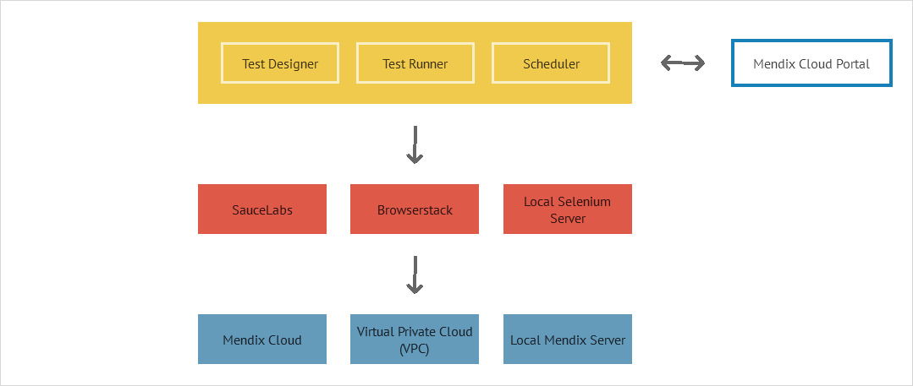
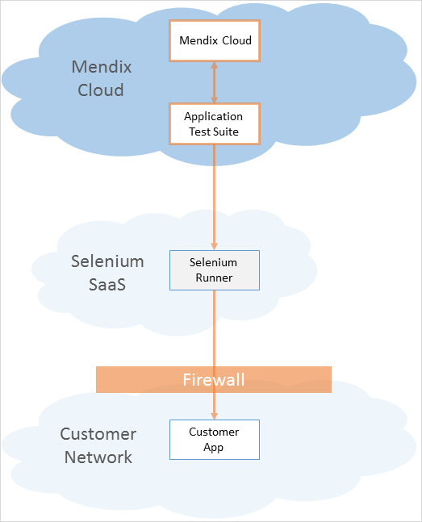

## 1 Introduction

This document describes the supported deployment scenarios for the Application Test Suite (ATS).

Every customer situation is different. We want to make sure there's a convenient deployment option for ATS in all scenarios. The main determinant is where your app is running — either in the cloud or on-premises. The second determinant is the Selenium component, which either can run in the cloud or be hosted on-premises by the customer. For each scenario, we need to ensure secure and reliable communication between the components.

All in all, there are four different supported deployment scenarios. This document describes and compares them.

Please be aware that not every option supports the full set of features. Take a look at [4 Comparing the Options](#4-comparing-the-options) to understand the differences.

## 2 Components

Every ATS deployment consists of four components: the ATS application, the Mendix Developer Portal, a Selenium Runner, and your Application Under Test (AUT).

The following diagram illustrates how the components are connected:



### 2.1 Application Test Suite (ATS) Application

The ATS application provides the GUI to create, manage, and run your tests.

### 2.2 Mendix Developer Portal

The Mendix Developer Portal is provided as a cloud service by Mendix. It hosts your projects, user stories, and other related data that is also used by the ATS application.

### 2.3 Selenium Runner

The Selenium Runner is used to execute your tests. Once you trigger a test run from ATS, ATS will connect to your Selenium Service provider to start the test. The Selenium Runner then starts the browser and executes the commands that it receives from ATS.

### 2.4 Application Under Test (AUT)

The AUT is the deployed Mendix application that you want to test.

## 3 Deployment Options

There is one standard deployment option in addition to three alternative options. The standard option is recommended, since it is optimized in terms of setup, ease of use, maintenance, and features.

### 3.1 Standard

![Standard Option](data:image/png;base64,iVBORw0KGgoAAAANSUhEUgAAAhgAAAHQCAIAAABstYQDAAAAAXNSR0IArs4c6QAAAARnQU1BAACxjwv8YQUAAAAJcEhZcwAAFiUAABYlAUlSJPAAAEJYSURBVHhe7Z3bcxzXfef5pIf4JXqKHkK/pPScKlXZZfk/SJWd8oO2ar1JRWXFpcrupipb2tqkXInNimIpti5erRyxYsmkJUWhZF14AUmQIglRIGmCIEGQAERIvMGgAFCkcJkZAHO/aH89v4ODxumeQU/36enTp7+f+kqF6e7p6RnOnE//+nSf3vEVAAAAEAGIBAAAQCQgEgAAAJGASAAwgtVyY3GtNrNYmr5bHJ0pnLmROza1/MHlL7fNwSuLtDBl5HaBnkuhldCqaIVi1cZTa7RogymzS2V+C/Re+E0pb7ZTeOHxO2vy7S+v18TaQfxAJAAkQLnWnFupTMytUfM3cHVRaRZ1hR0zNb9Or2WUV/KlOjmD2v3TnwVVReicml45dzNPgiG7NJotsQVAKxAJAH2CmnLaWR6bXQ1YamiP2ytkMrFZfaFYbSzkKvTStAG0GcqG9TPkFRIYaYw2SWwciAxEAkCM0C4wtVm0Rxxf2RE6VA1cv1eMtVIheZA4j04uKS9tSGjDRm4X6EOAVCICkQAQC8vrNWpDDfSHN1QhUa2gsTFdXKvRXn8q3rsMaZXqxVoDx77CAJGA5KHddu5rpX1D7mvtHl64zwdnAkJbRe/ixLVkDl5FzJkbOaqfQncksD+MrT+C5OCVxdGZAhVS4i2BYEAkoE/IM3NYBnxaTvQGV56zxGfs3Lyf2Bk79LrnbuaVzUtjqJKgTzL4vjm5c2Iu3f7wht4OvakUnfmWLBAJiBFqW2n3nJyRSCtDdpmaX6e9y7hrF2pu6D0qr572BNEJKyTZzvO4c2p65V6hKt4w6ABEAnRSrDb4rNY+nNbZU45NLXO3KrlNbKsOuCVVXsumkE7oQ/Me7CLBkGbS1QsSJbRTggtTugCRgKhQmzKzWEqq7AgX8hwJIIpUqG2lFjYjLemJa8uyGc2aQtyhLzkOdvkCkYCQUEtKxUfaD+mQ/Mbv9GyUe4WqZV0CQTI2u5pZhbhDnwNOF1aASEDPUDOalhNbgye4Uabm15XnIlkLfflpL0p8IQBEAoKTL9XTfnJnkNAbvHnf/3qCcq1pWt8PkmAm5tbENyPzQCRge2aXyqemV5Rfkd2hXU6qPNynexWrjaSGNkGMDe1YxH1OYCqASEBHGu3hPbLceh68sjg2u7pabsAiSKdQCYsTuiAS4M/MYimD/cmdgh5mpHtol0v8cjIJRAJUaPcKPQEI0muy7BKIpH/UNsYI6Z58qS6e0HdoC8dmV5WfB4IgAZPZU7kgEg1IQ0y3R5GitphHf1K+ZCEycFUMJEXhm/NQ7hWqcciGth/HshAkSg5eWczmFYsQSc9QI05NuRRGggMNnbi2TBtAW8IjFYY+e6TRbOHaCATREvpVekeUsR6IZHuMHT/KN6SW0ZnCzGIp4J4Rvbs+v6+pPf+IaI/yISMJZvxO5q4vgUj8WV53jlOla/wob45NLVPZNNv5rqIkm/6f1Uqt3q03fzz/9i5ES+jDhEhMS4I9nYkAkWxSrjWpzaXdeSvP9aSKm3aUqLSSR8Dou57IO6VWj5q/9UP/gmgJfZgQiWk5Nb3Cv7KMAJE47enE3FqmrtymN0tSSap3R4pE/AOACEAkxmZR6w0LDCe7IlktN6bvFnG5cv8DkWgEIjE2I7cL4h8pA2ROJOVac2axlLWRo4wKRKIRiMTkjM6Ie6lZfx5XhkSSL9VxtZ0JgUg0ApGkJbTzSu0Pn6kv/vEsIhMimVupnNFxeSCiJRCJRiCSlEZ6xY4LGG0WCZWT9O+EXhDTApFoBCKxICeuLU/MraV6CGFrRTK7VMaAH2YGItEIRGJTqMkav5NKo1gokrmVCqoQkwORaAQisTJUo9y8X0rRLbOsEgmZHKdjmR+IRCMQid0ZnSmkokCxRCS1RotKQuXfADEzEIlGIJIs5MyN3L1CVfyTG4kNIqGPGN0hKQpEohGIJDs5Nb2ykDP0fifpFgkVIudu5pWPGzE8EIlGIJKshaoTA0eETLFIltdr6FRPYyASjUAk2cz4nTWjuuLTKpKZxVKCd5RCogQi0QhEktkMXF005y7x6RNJo9kanSkonymSokAkGoFIMp6R24VaI/mBvFImEvrIcIJv2gORaAQiQY5OLiU+fleaRAKL2BGIRCMQCcKZWSyJ70QSpEYksIg1MUckZ8+e/drXvvbll1+Kx5p46qmnvve974kHEQiyeRAJIjOe3L3i0yESWMSmBBQJNcc7duzwtsh79uyh6Y888kixWBSTwiJb6nq9/t3vfjdE688bycinQyRIUjl3M5/IvU/SIRIMAm9TehKJ0pKWy+Wvf/3r3/72txMXCW+J+ym0wbt27eI/IBIkqSRyZ8YUiGRiDmOfWJXgIvnOd75D7Tu3zgy1raSQl19+Wa9IxONeoM3rtA0QCZJsxmZXxfejX5gukrmVivIZIWlPcJFQc7xnzx53e00TySvuiVxM8MEl2ezyxL1791LRQNMfeOCB0dHR9gq+mpmZefDBB3ni888/L58iW39qvuXyXHa8/fbbzjNddJrOuEXSZfPk093C6LR5nYBIEN9M3426m9UTRoskX6rjqkP70pNIqGF96KGHuFmXf0uRKIeklOnSB7Qq7/IsA69I+G9e3j3RjXurvMhnKZtH0/nlOomky+Z1AiJBOqWf5wQbLRJ0jViZnkTCbSsf3SJPcCMrhaE06NT4Pvzww/SwU0utLO8uBdzO4Eb829/+dqd2PKBI3OsnZB0TYvM6AZEgnXJ0cqlvw6iYKxIc1LI1PYmE/uD2dGFhQTa+bpHwgSA3XVpqpWl2P3SLhKCXoFW5u2fcSCWIx1sJLZIum9cJiATpktGZPnW8GyqSRrOFkeFtTa8i4fb3ySeflK1qp4pEErEiYT/RK7o7VxQU8bgJLRJUJIj29GeoYENFMjW/rnwciDXpVST8N9UH8qEUCbfI3ga9U0vNTTnXGWwLr0jc66SJ/EL0twI/3f3StFXyWfwHv5xcxr02ZZltN68TEAnSPf05G9hEkaAcsTshREImcBcHUiT0N7f77WNaDtzydhIJ/c0NNC954cKFnTt3KiKhlcuF3S27F+Wl3cKQf/MaeAG3k+R0ZTM6bV4nIBJk2/ShKDFRJAs59I7YnIAiAUGASJBtMzW/Lr4usWGiSHCylt2BSDQCkSDb5ujkkvi6xIZxIilWG8qngFgWiEQjEAkSJMvr8V5TYpxIZpfKykeAWBaIRCPGiuTv3r7xF69dQ7SEPkzl4+01cQ8yb5xIMLKW9YFINGKsSKj5E5sIIkMfpvLx9hpqV8W64sE4kWC4eOsDkWgEIskC0UUS90nAZomk0Wwp7x+xLxCJRiCSLBBdJGdu5MS64sEskaCnPQuBSDQCkWQBiKQ3IJIsBCLRCESSBSCS3oBIshCIRCMQSRaILpK4b3UFkSD9DkSiEYgkC0QXSbZO/y3Xmsr7R+wLRKIRiCQLRBdJ3MNtmSUSYuAqboloeSASjUAkWSCiSKhRFSuKDeNEgutIrA9EohGIJAtEFEncVyMSxolkdKagfAqIZYFINJIpkTzVvi0NIwfqzwIRRZLFYeTHZleVTwGxLBCJRjIiEr59i1seJJVO94npgvtWMSkiikhOfxbvib9MMiIp15qLa7Wb90vTd4tkjjM3cpRjU8vKR4BYGYhEIxkRCQmg060qeyKDIqGWVqwlTvokEqqtZhZL43fWSBgHr6A7PdOBSDSSBZFwOSLvd+mmy60w6W9xFKx9b8pCoeC9naX7HpfKbTH37t0rb2G5sLDAi7lv09npuQ8//PC+ffsefPDBLjf875XQIqEmV6wiZmIUyb1ClQoOmANRApFoJAsimZmZeeihh3wb5U4i6fQUd0XCz5UPaRY/l0Xi/ptUwS8hCyPlufLez+7n8iwthBPJsanlRrMlVhEzmkVSrjVnl8qjMwXIQ3veu/TFU//0zH/7i7989chFZVa6IkWCaAlE4hUJN+jeThS3SNzlC8FPoVXJP3i671OUTaKnUCFCD5Xn6iKcSPpzUIvRI5JaozWzWEr7mbvcUn+/zdMvv6HMdeffD43wYv/97/7Pby/MK3Njilckbw59+vgP/jp1aqFW79abP6bmz/T85z+pU4wMfZh2i6RL69xJJPQ3P4uKCfchJo0iefDBB9uHtTbxPlcXIURy4toyNcvi+fETVST3CtWx2VU76o93RxeeePJ/sCH+8q8e33d2RlmA4/YNRBIi1OqlIr//xX/95LV/UCYaG+VDTjwaRUK4W3M3XUQioYnSJTFVJBJzREIhl6yWG2IVMRNeJLNLZcvOs2KRkEKe2f2fJIlORQmXI7t+8RotnKxIkPhyfGiEWuezA+8p05GA0SsSrgDcLtmzZw8/lA09N+JekbgbfVpYnv3Fy8t1yllBRKL0kUiMEgll4Ori3EpFrCVOwohkIVch1ylbbEGkSF47con29H0lIVvzfz94HiKxOGP7XnL29H/zk0Ojs8osJEj0ioTgtlscRXJdkMhtN02hJv7ChQs7d+6khp5afF6MkS27PCTldg8vowimu0job2V7eLppIuFMzK3F3evem0gW12oWD2EiRbLv7MxPXnyVyo7/+9YxZRk+mvS/f/wsL+wVCS/gHPZqQ0t65/JEfgnGt/qRPTEEvdA75+8oInFvMD188fUBXtK9Sfwq3bt8ECVcjnBQlISLdpFkmYgioZy7mY/VJUFFUq41rb/m3N0ucyOuaIAiBeMrEm7KFdzLsEie/J//yy0bRmnr3Zpx00UksvNGropfzms7pHtEOcJBURIqEIlGoouEEqtLAonk5v1SFgbldbfL/LdyHMktD69IuNWWzTqlU8veNsJmucP6cT9RLiaXkVO6iEQuxlNwKCxc3OUIB0VJiEAkGtEiEsqp6ZWYTuXaRiRksJHbWRlFUWmXuX13FwruKV6RUA3hbbW5ZZeVDT/09ZN7ovelKV4xeEVC4efSK/quBNk2W8oRDoqS3gORaESXSCgxuaSbSIrVRqYGdVfaZffevXeuIhJZfPgiF+N1uvUjn+s2hDyAJpehBBSJe0uUF0K2jbcc4aAo6TUQiUY0ioQSx/3bO4okX6pn7R5T3nbZ3aBzr4ncwY9PJF5h+C5G8RUJRfbSoxzpNSSMi7/dTaEqhBVy6Z1f0sML7726/9JdZWGkSyASjegVCUX7HUr8RZJBi1C87TK3yNTudzpjShGJt/VXElwk9LrhKhKe2PbIlg4VpKeM/8fPWCQDI7eVWUiQQCQa0S4SykJO5/UlPiLJpkUo3nZZtt3P/vs71C67T+JSRELxPR6lpKdDW+H6SORmyM4SOQsJHogkYiASjcQhkoNXFjVe966KpFxrHp1cUl4yI/Ftl7k5ZtyS8IpEHlDyLianBBSJd1X8RJrSXSSyhKL182rdK0GCByKJGIhEI3GIhKLxnleqSM7cyCkvlp34ioQnytZZma5M5GrAS68ioXhXRRv29//8QheR8EOvkJR3hAQJRBIx5oiEr3L3DmeSImISCWV2qSxeIxpbRDJ9t6i8TKbiKxKK74EmX5FQZDHBKHoILhKKuxjiI1S0JV1E4rudPBEHuHoNRBIx5ojkqaeeevLJJ71jcKWI+ERydHJJy9nAmyIp15q4iQiCcCCSiDFEJDMzMzt37uRbHGofAqtvxCcSipYzuDZFQqtTXgBBMhuIJGIMEYkcJFj+QdTr9ccee2x4eJhHbJSDzHeanjixioTqh+hDpwiRoBxBEHcgkogxQSQ8QC8XIu7B5Hm69AQ5xj04vHc6/Z0ssYqEMrNYEq8UFiESWpGyagTJciCSiDFBJHxcyz3qO9981y0YQo793mk6P0yQuEUS/fQtIZIsn6yFIN5AJBFjgkiopHBuFeKCbzoCkXgT8ZoSIRJlpQiS8UAkEZO4SLwakEe3FGFsO50fJkgfRHLzfqSjW45IyEXKShEk44FIIiZxkbjvZsiwJ3bt2sV/oI/EndGZgnixUDgiWVyrKStFkIwHIomYxEXivkWuhN3AZwPv3buXSpYdW8/a8p2eOH0QybGpZfFioYBIEMQnEEnEJC6SLiiHsCSdpidOH0RCiXJlIkSCID6BSCIGItFIf0RCIhCv1zuOSJbXIRIE2RKIJGIgEo2kQySNZgtXIyKIOxBJxJgsktSRDpEQmbqlLoJsG4gkYiASjaRGJBkf91dLOg0eHGs6jRyMRAxEEjEQiUb6I5J8qS5er3eESDDWVpDIW0VJ3NqASGwKRBIxEIlG+iOSqGdtMSO3C8p6EXfcdwdxIxtxiMSmQCQRA5FopA8iOTq5JF4sFJsioboGRUmnyNtVKXeIoukQiZWBSCIGItFIH0Ry5kakcRs3RULgliS+YUOQRZSbDyqBSGwKRBIxP/jNp9T8GZ6//tWYMsXM0IepfLzaMzW/LjQQii0iqTVax6aWlRdAuBzx3lVXSSeRSA9J5C3cOT3df9d9K196yjvn70AkcQQisTv0z3rhvVeHjxxQpmc2y+vhT9kitoiEoNXhAJcS33uhe+Mrkk49K+5DZMFFwlviBSLRHojE1uy/dPfjowNTv/kJ/eN+dPyEMjebiTjQFqGKhJhdKisvk+Vwg06NtVJGeOMVCRuCnuuWkCwp5AoDikSuTXkiTYFItAcisTLHT1+S/7KU40MjygLZTMTjWoSPSAhcViITvBPCKxIuR7ylDE+XRUlAkfiuLfjmIT0FIrEsfCxLKoQzeGZSWSybiXIFCeMvEgIu4YSuSLo08Yo5AoqEj2spmwGRxBSIxKacHhzkY1lK8I9LGbkd6U4kTEeREHMrFfSXUML1kXRp4nnJnkTSaW0QSUyBSGzK4fPXL73zS+kPGWWxbCZ6OUJ0EwlBr3HiWtbP4+JjSkpD702sFQk/REXSt0Ak9uXib3dLhVCuvvFTZYEMRks5QmwjEqLWaI3Nriovn6lwQ7/t0S1vH0mnUsa3j8T9RIrXEL5rg0hiCkRiWY6c+0Q5ukU1irJM1nLwymKx2hANfTS2Fwlzr1A9OrmkbEd2wk2/u/Xn8ClYLBivSOQJWu7Wn1flbvr5iTRRUYuyWKfTvZTFEC2BSCzL2L6X+B/0wgd7T54cnnj9afpDWSZrmV0qi/Y9MkFFQlBpMjG3ltlek07XcBCdRNLlWUphIUUlITf86JmXFEN410Yv9/f//AJEoj0QiU1xOtu5EPnNTw6NztKUAxfnMn7u79jsqmjZddCDSJhyrZnZI12ydJC4teErEoqsGxjvAhz3JetcmpBdvIZwK4cXI7tAJNoDkVgT+heUB7WGPhxS5mYzx6aWo4z166VnkTDFaoN0gnO6EFsDkVgTefkIOkU4A1cXtZyp5SakSBiqTqbvFrPcd4JYlhOnzn58dIAy8frT3PqcHXiPHp4eHFSWRFKRkyeH+d+RipLD568rczMY2vuPOKyWL5FEIlnIVUZnCihQkLTn+NCIaHe2hnSiLImYn0Ojs1ff+Cn/C9LegDI3g6Em+l6hKlptregRCdNotmYWS1Q3KVuPICmKPL1nMxs9tEi6cn7/G/wvSP+m+y/dVeZmLfFZhNApEtpKjEKPpD3eogTlSBpz/PQl+S+IMbVo/z4+ixB6RFKuNUdncKdexJJsKUpQjqQwVH/Ig1pnD72tzM1aaP9+taznwsNOaBDJ8noN/e2ITfno+AkpEpQjaQz9q/E/H+kk4we1ztzI6T3T15eoIplZLKGPHbEsm/uzKEdSmMEzk2wRyvHTl5S5mcr4nbVGM3aLEJFEQlupbDeCbBv5Izc5N175m8+f+/NbLz+hTDc2yoec2dBOgDwyeX7/NiN2W5yjk0uxdooohBcJLIKEC/3Cb7354/m3dxmdfT+59//+y/x//qM63bzQhwmRyDi30W1bZOL1pzNbTY7NrvbhcJabkCLBba+Q0KEfOTV/64f+xfR88GN1ipGhDxMi4Rw+f12OhnLy5LAyNwvpcyEiCSOSm/dLytYjSPBIkYjvE4gAROKOvHvVxd/uVmZZn4NXFqfm1/tciEh6Fsnyeg2960iUQCQagUhkhj4cYotQUZK1EdJGbhd03VkkHL2JhHSHSw6RiIFINAKRcA6Nzsrh0TI1MNrpz3JxjJ3VK72JZGIOHexI1EAkGoFIOBc+2MsWGdv3kjLL1py5kUukO8SXHkRSrjVxUAuJHohEIxAJ5cSps2wRypFznyhz7cvY7Kr2ceAj0oNIpubXlfeDICECkWgEIjlwcU6OhjJ85IAy16YMXF2cmFtLti+kEz2I5MQ19I4gGgKRaAQi+d2Bt9gi4//xM1tHQxm5XZhbqfTnGvVwBBUJaVB5bwgSLhCJRjIukmPD42wRCv2tzE17Tk2vzCyWyrWm+Mc2mKAiwbUjiK4YIpKnnnrqe9/7nniQWrIsEqo/Lr/1AluE6hJlbnpzbGp5an497vF69RJUJDhfC9GV6CI5e/bsjh07ImpAiqRer3/3u9+NLhVd6+mJLItk+MgBtsjVN36a9tFQDl5ZPHczT/vrpvWiBySoSMZmV5V3jiDhEl0k5IAnn3zya1/72pdffikm9Y4WkbjLGoiknzly7hM5GsqJU2eVuWnJ6c9y03eLi2vJXwgSkaAiOXMjp3wECBIuEUUyMzOzc+fOhYUFarXffvttMbV3tBza0rKSKGRWJHKI3wvvvarMMjlHJ5eoLSV5LOSM7jzvlaAiwQ0QEV2JKJI9e/Zw2y3/IKgaeOyxx4aHh7/+9a/v2LHjgQceGB0d7TKdcDvAW1jQwoTvRK6E3FMIXrLTemTxxBP37t3r3Z5wZFMkpwcH2SLm3zDm1PQKNZ5cdiQ1EFYfQB8J0u9EEQk3xFyIUGny0EMPSWHQdNkuk2Pczb13Ov3tKxJe3j2dXsv9ojzR+0Smy3p8t4emP/LII8VikRcLQQZFMjByWx7UGvpwSJmbVLjUOHczT86g3CtUTRi5pG8EFcn1exg3HtGTKCLh41ruvftdu3bJv2VbXy6XaZff6wA5nf729YFbTp0gG8nW370SQj48e/asNBbRaXuUxUKQQZFceO9Vtsild36pzOpz5lYqVGek4vTcuAkqErKr8iEiSLhEEQk14nywSMJtui6RdGrZSTAPPvigeMmNF6XpEEmfc/LkMFuEipLER0MR/wYguEgIjPuLaElokbg1wMgCQmmgt51Of/uKxLciYYvIlaAiSSqHRmflaCgfHx1Q5vY51B6KfwPQk0jQTYJoSWiReJtdbpd37drFf8TUR+IWCSvBLRL5Nz/k5/Ji7vX4Vk4QSU85v/8Ntsjlt15IfDSUMzdy4t8A9CQSjP6LaElokchm2g27gc8G9p4NxQ2371lS7rW5/2YHtI9gbZ61JQ+p0Rqef/55KQ92jFyy03rk8hBJ6Bw/fYktQhk8M6nM7X9ox1r8G4CeREKgKEGiJ7RIuqA00JJO060hIyKh+kMe1Dp76G1lbiIx514gJtCbSKgoOTq5pHygCNJTIBKNZEQkZwfeY4uQTg5cnFPm9j8HryzadDlhdHoTCbG4htO3kEiBSDSSBZEMnplki1COD40ocxPJuZt58Q8A2vQsEgIHuJAoiUMkmcV6key/dFeOhnJ+/xvK3KSykKuIfwDQJoxICIzhiIQORKIR60Xy8dEBtsjE608bMhrKqekV8emDDUKKhIBLkHCBSDRit0gOn78uR0M5eXJYmZtUUI54CS8SAi5BQgQi0YjdIrn0zi/ZIhd/u1uZlVRw+YgvkURCYAwupNdAJBqxWCRDHw6xRagoodJEmZtIBq4uYmQtX6KKhJhbqdDnq3ziCNIpEIlGbBXJodHZidefZpGcHhxU5iYVauvE5w62okEkBFn63M288qEjiG90iYRP7eVLx924xyyJgrxqneh+AjFvibymvZ/YKpILH+xli4zteynx0VA4Y7Or4kMHHvSIhJldKuNyRWTb6BKJG9/RUwLi+1we4ESOUf/973+/y0AmikiibEyvWCmSE6fOskUoiQ/xy6EdZVyB2AWdIiHos755v4QjXUiXpEIkvsMABwQiiZIDF+c2R0MZeE+Zm0hOTa/AIt3RLBKm1mhN3y1CJ4hv+iAS91Ev96iIZ8+e5YnEI488UigU3AfH3GtQhu9leLXyMJd7yEXeAPfrEvz0ThujBftE8rsDb7FFxv/jZyYc1CKLWHyLXF3EIhIGOkF8E7dIlANN8vYhnYqMTgWEtA4f4CK2FQlPD7Ix/DA6lonk2PA4W4Ry/PQlZW7/c+ZGDhYJQowiYeif4eb9Elld+RdCMpu4RaIIg2qLhx9+mB66uz3cdBIJwwPIszBCiKTTxvDD6NgkEqo/Lr/1AluE6hJlbv8zNruKI1oBiV0kkmK1QUY5cQ23Wcx6+iAS921xGW792SX0sNONSXzhFcrbZ/Uqkk4bowWbRDJ85ABb5OobP018NJTr97RVjVmgfyKRrJYb03eLMEpm0weRbNtPTg6QLtlWJOyP0CIJ3WkfBGtEcuTcJ4aMhnJ0cgn3GumVBEQiyZfqs0vl8TtrOPCVqcQtEqVbwhd3+07P9fZb7NmzR67B1zpc3HQSiVxhkI2JgjUikUP8XnjvVWVWPzNyu4BOkRAkKRKFxbUalZP0D3lsCsWKzYlbJAQ33+JA0kYPB/lAPG4jCwt59Elp7mmdvKT7OJg8OEbrvHDhws6dO70iUVbouzG8ZHTsEMnpwUG2CBUlAyO3lbn9ycDVRdqvFR8r6BGDROKmXGuSV1gt03eLVLWcuZGj4KbxFiQOkWQWC0RC5pAHtT46fkKZ259QC4NCJAqGiiQi9wpVKMfYQCQasUAkF957lS1y6Z1fKrP6ENo9zZfq4tMEYbFTJAR9OXCIzMxAJBpJu0hOnhxmi1BR0ufRUE5Nr+DOIrqwViQE1aq0u6F8e5DEA5FoJNUiOTQ6K0dDGT5yQJkbX6AQ7dgsEgZ3mDctEIlGUi2S8/vfYItcfuuF/oyGcu5mfnGtJj47oA/7RULMrVTQZWJOIBKNpFckx09fYotQjg2PK3P15ujk0tT8erHaEJ8a0E0mREKslhunP8NhLiMCkWgkpSKh+mNziN9DbytzdYV2H0dnCri6sA9kRSTM9XtFlCaJByLRSESRnLmRox9F//exzg68xxYhnRy4OKfMjZgT15Yn5tbgj36SLZEQVN7iZo7JBiLRSBSR0E6VPNpTa7TmVipjs6t9uDfd4JlJtgjlxKmzytxwofcycrsws1jC8atEyJxImNmlMsa3TypSJIiWhBYJNbvi97CVfKlOZQoVK3H8RvZfurs5GsoHe5W5vQbFhyFkVCQE7YJNza/jSFf/Qy3IrTd/TM2fybn72t9wlOkGhj7MECIhT4hfQldoB38hV5m+q80rHx8dYItMvP50r0P80q+VNmP8zhptz+JaDcWHOWRXJEy51qTvpfJ9RWINtyOG5/Pn/pyjTDc2yofcPaSEcK2w9ArVAdSm99q5cvj8dTkaytCHQ8pcJUcnl+glaG/v5v0SaQNDmJhM1kXC0M9jdKagfI+RLCdcA52K0H798rrmayl4ZDxq8ckxnLHZVdKAkun9u6l+okwf/JWcSD89+ax7hSqvSqwXpASIZJN8qU7ffuVXh2QzFoskqR6F+u8vc6dO8ci/NteWxFRgBRCJSrnWpD2jPpy7gpgcW0XSqYM9blqV9eLg8yyS6mfDYiqwBYikI7NLZVzDmNlYKZLryd0+tnLxXbZI6ePXWg2MtmsbEMk2LK/Xxu+soUDJWiwTycErSd61qT7/CVuE0lyZF1OBRUAkQVnIOZdr4XThjMQmkQxcXUzwSotWrVw8/gu2SHXqQzEV2AVE0huNpnMB8MhtnOLlH2qz7KjerBHJsanlZG/cVBk/xBYhneCglq1AJCEho1CNMn5nDbfPopyaXpmaX+eTSmuNlgWD0NghEvqHKNea/I1NhObSLFuE0rh/S0wF1gGRaICHlMhazzwVH6Mzhdmlsm9TdfN+KdWHAdMuEvrw6Z9A/GMkBNUfpaHdbJHK2H4xFdgIRKIT2hm/V6hO6xtPwrRQ+UXyoBYqyBVt5NcT19JarqVaJFQgrpaTHz6kOj3EFnEOalXWxVRgIxBJjNCPmXbYJ+bWUl2skBSn5tcXcpUQB0kazRZpNY2lSUpFQh81/WPRxy7+AZKjmf+ieORfWST1zyfEVGApEEn/IK9wvUI79dQ6K02ACaEqijZMDoqna6+W1mPm++2SNIpk5HbBnHEMSx+/xhYpj+wTk4C9QCRJQj97OUIRj03Un9qF9lvptShULdFLzyz2Y1A8Ks5SdEJXukRy4tpygif4eqnd+B1bhIqSVjEvpgJ7gUgMZXndGbqOQu0vtfWcqfl1FsC2IS3JZ1FoJby2ZA+dN5otsmYqdJIWkdCHmXinugKZQx7UIqOIqcBqIBLQb1KhE/NFcmxqmfYPTOgOUSiP7GOLlD5+TUwCtgORgGSoNVoziyVjr8IxWSSsEPE5Gkb98wm2iDPEb/4LMRXYDkQCEmYhVzHwAkYzRUIf1NxKRXxw5uEM8StHQ5keElNBBoBIgBGslhsTcwYNE2CUSOhjmZpfN+eMrE5UxvaLcuTkyxgNJVNAJMAs8qW6CUYxQSQHrzhjBxh1OlYXGvdvsUUozaVZMRVkA4gEGEqyRklQJDz2zNxKxcCO9E5Q/SEPalXGD4mpIDNAJMB0EjFK/0VydHJpbHZ1IWduF0gXqlMfskWc0VBqhp4IAOIDIgGpgQfHHLld6INU+iMSkgcVHzOLpWSv74lIc2WeLUKpz38ipoIsAZGAVFKuNWnnfbo9PmYcY3nFJ5JT0ytUeaRdHhJniN+N0VAqF98VU0HGgEiADVCxMrtUHr+zRs200nCHi0aRsDlu3nfGoRGbaxHVz4bZIs5oKBjiN6tAJMBCeIAZqld4UJkQdgknEnqtczfz9LqsDTtqji4015bkaCj1318WU0H2gEhAVijXmjzgGI/BzOGhydzhcTOlSI5NLSsLUMhP9Nzr95wxkilUD4nXyBilM3vZIvSHmAQyCUQCgA/cPlLEY+CBShD+iJzRUNaWxFSQSSASAHyASLrjjIYy+Dx/RNXPhsVUkFUgEgB8gEi6U7n4Ln8+paHdGA0FQCQA+ACRdKE+/4n8fJor82IqyDAQCQA+yIZSPAYbtGrlzdFQJo6KqSDbQCQA+ACRdKIyfog/GWc0FBzUAm0gEgB8gEh8aS7Nyk+mcf+WmAoyD0QCgA+yuRSPAY+GMrSbP5bK2H4xFQCIBABfIBIv1ekh/kyKg89jNBTgBiIBwAeIRKGZ/2JzNJTPJ8RUANpAJAD4AJEoyCF+y+feFJMA2AAiAcAHiMRN7cbv+NNwhvgt5sVUADaASADwASKRkDnkQS0yipgKgAuIBAAfIBJJeWQffxSlj1/DhSPAF4gEAB8gEqb++YT8KJr5L8RUALYCkQDgg2w9xeNM4gzxuzEaSnV6SEwFwANEAoAPEAlRGdvPH0Lx5Ms4qAW6AJEA4ANE0rh/S34IzaVZMRUAPyASAHyQbah4nDGo/tgc4nf8kJgKQAcgEgB8yLhIqlMf8tt3hvjFaChgOyASAHzIskiaK/Py7dfnPxFTAegMRAKAD7IlFY8zgzPErxwNZWSfmApAVyASAHzIrEiqnw3zG3dGQ8FBLRAMiAQAH7Ipkuba0uZoKLdHxVQAtgMiAcCHbIqkdGYvv2v6Q0wCIAAQCQA+ZFAk9d9f5rdMRQlGQwE9AZEA4EPWROKMhjL4PL/l6mfDYioAwYBIAPAhayKpXHyX329paDdGQwG9ApEA4EOmRFKf/0S+3+bKvJgKQGAgEgB8kA2reGwvrVp5czSUiaNiKgC9AJEA4EN2RFIZP8Tv1BkNpVYWUwHoBYgEAB8yIpLm0qx8p/W7n4mpAPQIRAKAD7J5FY9txBkNZWg3v83K2H4xFYDegUgA8CELIqlOD/F7LA4+j9FQQBQgEgB8sF4kzfwXcjSU+u8vi6kAhAIiAcAH60WyOcTvuTfFJADCApEA4IPdIqnd+B2/O2c0lLUlMRWAsEAkAPhgsUhaxfzmEL83fiemAhABiAQAHywWSXlkH7+10sevYTQUoAWIBAAfbBVJ/fMJ+dYwxC/QBUQCgA+ytRWPrcAZ4ndjNJTq1IdiKgCRgUgA8MFKkVTG9vObKp58GQe1gEYgEgB8sE8kjfu35Juiv8VUAHQAkQDgg2xzxeOUQ/XH5hC/44fEVAA0AZEA4INlIqlOfchvxxniF6OhAN1AJAD4YJNImivz8u3UP58QUwHQB0QCgA+y5RWPU4szxK8cDWVkn5gKgFYgEgB8sEYk1c+G+Y0Uj/xrq5gXUwHQCkQCgA92iKS5trQ5GsrtUTEVAN1AJAD4YIdISmf28rsoffyamARADEAkAPhggUjqv7/Mb8EZ4hejoYA4gUgA8CHtInFGQxl8nt9CdXpITAUgHiASAHxIu0gqF9/l7S8N7cZoKCBuIBKQIRqtVq3hH0Is1MYQkTRbXynbKdOgeR2oz38it7+5NCumAhAbEAmwE26Cy/VmqdZcLTcK5cZKsb5tcqUGLUzJH3h69eC/rPVLJKSxerNVromtpeRK6rb5hjd4rdKg51bqjmCa1dLmaCgTR8ULABAnEAmwB9pFrzZaxVozH6wV7pLlD/6ZQ6tarzaoje5SAYSD1sdbG1ByAbN84cDK/qdJhGvHftGslcWLARAnEAlIPdQi04685uZ4QyTuiSQV2vGPKJRGS4/qfJObu7255bcmaMpqu1ihFxUvD0AMQCQgxdSbrbWKTn/IbDbHnlkUap2pmBAbEYxWq1Wpa7adkuXV8srxfxObfe4dZe5quedtBiAgEAnYhkbTOfJeqTtH8NeroguhS2h3u328vul0CMezI0wrjb1R7ioSTq5Up0po23dItitWmwH7PKJk+coJsc0DP1/J5ZW5nIDbDEBPQCRgC9TEUMPHXb65kp6WmtZDdQOpiNYsXiYCtJJYFcIJIhIOvTuymti4rdDbjalg8skXcysHnxHb/OlFda4ntE8AnwBdQCTAJY/4Wz3aI3aO2tebIaTSajm79soKY0pwkXDIu+7yi/6iz7MPVYjM8slfiW0e+rUyq1No86h2hE1AdCCSTFNttPogj06hhoz2i2vBDtzTXr+uCilIehUJxWmX23qkT7WfCnEydUZs7cFnVr68p87tmnyprqVSBFkGIski1G70eX+5e2hLitUte/QKfStEZEKIhJPAp7q0JA9qLU98pM4NlrUKOuJBeCCSbJFsCbJtVss+BUr/LUIJLZL+Z3n4LbG1J3/lnLjlWSBg6IuhXN4PQEAgkqzQnz5qLSGd8MEW+m+9msw2p0YkN8Y3N3Xhjjq3x+RLdVxxAkIAkdhPP/uoNWat4pxMrEzsWzZbZ88sg5LLLx9+QWzn2KA6N1RypQZO5wK9ApFYTp/7qK1JOkRy/n2xnaSTCAe1lORKdZgE9AREEjs1z7it5fYlezJ87R5H4w+Y9itN7g4xPCkQyZ3rmxt557o6N1qoFhRfIwACAJHoRHqiWI16QR89l9ZQ2tCMeIHA1JstFCJRstlGe2aZEKo/Ng9qnX9fmasl9N0TXyYAtgMiCU+r1ao2nO6HiM4ImMLGaOFO4dK1dKEFzDm1N6UxXCQrY4NiCw+/0Gk0lOjB9SUgIBBJz9Cvqz8XgXcPbUC53vT2i1IFoyyJhIjRIlm4s7l5N8bVufpCOy7iWwVAVyCSQFBrTQ30erUflUevaV/N16TaiKB6RZmLhMtmS+2ZlWycg1obo6GsnH5dmas9OIMLBAEi2QbyR1ouv0A0xlyRTHwkNuzgM8417Z4F9IZ2nsQvAYDOQCT+OHv3zomz6u8KyUgMFcmX9zaH+J06o86NIfQTCDfCJsgUEIkK/WSKJo1DhSQSM0WyPPRrsWEnf6XM6kNWy865HiQVWAUoQCSb1Bpx3W4PSV1MFMmnF8UmHXzGufuIMre/KZQb3cfZBJkCInGg3wOu3UPcMU4kufzKwM/FVl05oc5NLmSUilOkwCiZJusioR9ACWc6IZ4YJ5Jz74hNGnxJ42goupJr31oGXSmZJdMioe89+kIiJkdtrmeiBTFLJLcm5Pbk5m6rc01KvlQPMRADSDsZFQl901GIIF0iG25legLJr8nRUJYvHFDnGpnVMoYQzhZZFAl9w9EjosTWwiJ0zBEJyUNszOEXSCrKXJNTbF8lK351wGoyJxLaUcJohsi2MUQkubnbm1tya0KZa37ot1apY/BH+8mWSDCaYfB0KVBoVq5ouYw3m2/PrL7F6VQ//m9iS4bfUuamKMUqjnNZToZEgtEM44itB8SMEMmVE2IbDj4T3xC//clqGYe5bCYrIsEJWrGGmgllStqTvEi+mNscDeXTi+rcFAY3hLeYTIgEFkF6TeIikUP8Lg/9WpmV3uRKDZwcbCX2i4S+trDI9onhBIRUH/VKWCRTZ8SrH3zGGahRmZvm0I8RZwbbh/0ise+oC9KHJCmSpSV5UGt54iN1bvqTL9VhEsuwXCRldLC70qlEyHmmIAmKZHn4LfHSx//NwNFQtGQV9160C5tFQgV0l4NaBh54sfUMqDQmMZHcGN986YU76lyLgutLbMJmkaR6THiNUjGl4FivqVMMzmZr7pkVY3L5zdFQLg2oc+1KroRud3uwViSNZkv54nLSfhgHVUt/koxIzr8vXpd0YulBLXfKKEpswVqRYDQtjvWXoMeUBERy57p80eWZa+pcG5NDr7st2CmSVsvnwhHal0ermmCW19UpJke26cr0mEL1hzyoRXWJMtfiVHF8ywrsFEm40VBw8hIi02eRrIwNipcb+HnaR0PpKcUqjm7ZgJ0i0XlcC0MFa0laeto/vbg88ZGTDZHww5WpM+qSGrNwR77cyo1xda7VyZVwHrAN2CmSEJeyBznw4i1Z0PUdJCn6lJanz8s23R2qGJQldcU5qLUxGsrK6deVuVkIjm1ZgIUioe+l8k3tQ2jHarXsZL3SLNWcUM2uLIOYH3dfhUysg+/K6sd5laUlZW4WUseIKenHQpHUGuLE3wR7dwvlBokk450uKb2Zsbcoia8cccbRkkP8xnr0zOBgGEcLsFAkZt53JFOHxagyI4uk9AYwSlESbzky9GvxQid/lYULR3wDkVgARJJ8FMekWjBUiuXTP9ayuyiJsRz59OLmq3wxp87NTDAYsAVAJAiiRhYlMZYjtNqBnwuRXDmhzs1SoBELsFAk1Y0+EsScLBfTNNAWhYuSGMuRc+8Iiwy+lNmDWhQqYcXvFqQZC0VS7zDKVrgk22GeuvbXmjhFyeBLcZUjtyaERchVd66rc7OUYg0XJNqAhSJptVwiSdWIs9nJP7x/6y9eu4ZoCX2YyseboqCn3Q5sFInrOpJ0je/kja1ndlHztwo0QR+m8vGmJflSXfxoQcpJt0iaLeeqkUq9Va41VysNjPiblrhFUigUxF9+dJ8LiPSKpIJh5G0hfSKhgoO+f2uVRohxUGRKtabjHsNv527vcTlUJJ0IIc6UigTd7DaRGpHUmy1q/enLp3wdw6VYdVSkTDQnaT8it21YJGtra9wUgiikVCQYGcUmTBdJq+UctopSfJgfHp4rn6VhhlGRaCSNIsmVcBmiVZgrkg2F2N+8kiadgbmslqUSiEQjKa1I6KcNmViDiSLJjkIyG4hEIykVCYV2nnD6rx0YJ5JyHQqxPxCJRtIrEg7utmsBBomEvk04fzcjgUg0knaRUF2Cjve0Y4pI6JuUqU6CjAci0UjaRUKh3z76S1KNESKJySLWn0Sb3kAkGrFAJBRqAWCS9JK8SOIYrJdHFkn6BoWHH99BPPrspDIdgUh0YodIKGsVXKKYVhIWSaNl7xGtAz90PLJjxzee+1SdlXToM092XGGIRCPWiISCQVNSSpIioUpW15XqBubdJ0giP3y8/f93PXMTTL7USPxm8hCJRmwSSa6EU7hSSZIiKVYtvpVh+7jWt1683K5LHj+gzDUiCZ5mDZFoxCaRUIpVHOBKH4mJpGb3fQzb/mgf1Gob5YnD3rle2r759Nlv0Z/uImbDSe2Hl597tD338OPOYs6SG30wn777BM1iHn38ucO8fJckOCgLRKIRy0SCXvc0kphIrL5kZIsM2se4tna5RxZJ+4hZGzGdO/a3svEUAxNRJBjt0Y1lIqGUcNvEtJGMSGiPQ/nqRIlxp/lOvvgNasdlFbJZnWxdbCNtN8jlg4iE2GKmtqt2fOMJWYWI6sTAfn4OKhKN2CcS3PAqdSQjknLd4t4R0da7+kW2mEANVyebcwOJZKsh2gsoR894PaYWJRCJRuwTCQXXuqeLZERi8clafiYQFYNPlzvXLlvKi0Ai2bIqsRJftmyGOTFWJH/7t3/7ne98RzxICVaKBF3u6SIZkdg8LGOXZl0tGtqGUAXTu0g69Li0sVMkV372TXpvP3hfPCR4ihdaZmpq6g//8A/54d69e8UTOhBaJCsrK3/2Z3+WiISsFMkqLk5MFcmIRPnS2JSNPgxffMoUTzdG2IpEtZTRiSaS93+wY8c3v/nNHd/82RUxxYWjlM0ZX3755R//8R//6Ec/or+prX/sscdmZmZ4li8QiSGhfU3RWIA0kIBI9Pa0GxYuMnzqAKVvQ/jGp/X3iIQ90UUknV/U2AQXic89zB2P/OD9rcLYZOt0Kkf+6I/+6PTp0+LxduDQljlBJ0mKSEAkzZa9IuGjTL7FgdsHagf7lmypVCYPt73SXSTiKbTMuxt9LZcP/NCtH9NCbZ+PIYJBHmmLooNJ/CoSrxu4gGh/ajv+4A/+QJYpbpH4LsMTd+/eTaul6Q888IC0lHwuLyMPo3344Yf8dN4Y+VyaeP36dX4J93p6xVaRoLs9RaCPRGc6dqo74VLj0Wcn+Q9f2r3uSp/HEy86y3cViexu2crWi1dMSvCKRMXlCefPLR0lbTx+oXacPw4+wEUoh6FeeeWVP/3TP71//z79rcjAuwxPl+0+Ld/puZ1E4v6btooXc6+nV2wVCUySIpIRyZqlVyN2P8S0cTirLQZ/RNN/+bl2PUF1yRPkj7Z4thEJ5dNnn3iUn0XQE2V1YmBCi2SrJvggl3gg8IiEIRPQx8KNuHK8i9r0P/mTP5FiYBl0WqaTJOjvgCKR0+XyhHs9vWKrSHAX3hSRjEgqka8j4YHiZRIfhRDpKSyS3o9uOeZQUazRQSQEn75FdYn7PC6JrAykSHyXgUj6lkYLIkkNyYjE5m4SJEACViSqabwViDNlqzY6i4TbdxZJpx54t0h8l4FI+hZoJEUkIxJivRrm6BYqDzsSUCQKgY5kbZ3wyiuvuBtr7tvghl5Od6PIwLtMEJG4/2Z5QCS9JodRUlJFYiKh3Q1rb2mFbJdwIvEtNRxxuPXiMQu113xgyn1mFPuApxO+MvBdJqBI2Bn8rI8++oj+hkh6Cu6WmC4SEwlRqVs9kjzSOeFEAnyxUiS4VWK6SFIkVJRYPegWIuI9IAmRaMQ+kTi3JEFPe6pIUiREs/VVHge4sheIRCP2iQTHtVJHwiIh4JIMBiLRiH0iwaWIqSN5kRC9uqTLnaxyRVOOlV0+8OLj32pfgejwqOcKQe/gjFpj9kiOWkSC+yQylomkUEY5kj6MEAlBeyAW3Xy30yAo3e87ojXGiMT3jG1UJBqxTCQoR9KIKSJhKvVm6GG4zLnEZGMIxR++O7kxRPykuPetyxyoSCIResxH+7BJJOu4n1U6MUskROpLk84j+269AUlmRLJeU6egItEqQmtE4pysJZoBkDKMEwlTbbR6OjO4S69Jn9NtAGBq3L/1w2cPdBKJU7VsjLr46DeeOOxSkXfhLXe7cjJ5WHbJOM/NQB8JYKwRCUZpTC+GioSpN1tpGyc4eJ2hLEkacBywhW/JuduJhLXh4htPtMcPhkgygB0iKdVwBWKKMVokTLP1VbHWTMl4Kp5CoWO2uEG9M5W8n5UwwTYiEQfNNooYcVcrAiLJABaIBHdoTzspEAlBNW9K7oUVTiTtZ23xhDKxq0i4HNn6ohv3PklYJJ3OxoZINJJ2kRTKDVzHnnZSIJJUDckVSiQd+jPadQafMdxVJO3ufXk3eBH0kWSGVIuEahFYxAKMFgl9v8KNNp9cvC3+llw+ILvQIRKgh/SKxLGI+K2DdGOuSJqtVA7p2O2srU5HqyASEIGUiqSIS0YswlCRULUb2iIJX5nILbjf0S3RJe5zHYlbMDIdrMPZ8iouqWzEkD6SToFINJI6keRKDZzpaxmGiiTV1ySyMHZsXjJC7f6nz3a9sn3jKZ3O2toqITl3Qx7i6ZtnbbU1057CTzctEIlG0iUS2kHEzdjtw0SRlOtN5cuXtrAkvHQZa4vrDwVXCcIXzEueeNF5+mYVoj4d15Fkh7SIhAoR+mmLHzmwC+NEQnsrVtyC91PnYo5NnQQZ/bfLle1OLj8nrg6hVV3mp7sPZ1GZIooe54ISw/tIfvj6Z9T8IVpCH6by8RqYNfSrW41xIknbpewIgnTLagU9IvZjlkjo66Z8CxF3lj1TDM9y0WfERiQjKZShkKxglkjKtbT3jiAIgiokc5glklSfrIUgGU+u5Iy9iBtTZRCDRNJqpWgolG7pzwEoHDVCzMlapVFFCZJhDBIJ7cgo304EQYxNrtRYrzr+wGBZwCCR1BqWVCT9Seo63hE7slppFKsN3FkduDFIJI0mRNLXlGpNnGyNbJt8ybmVerneRP856EQm+kjMuRGvtvjdCD14csV6pX2NMblEmYVkOVRtrJYb9K0o15pUc5A5oA4QBINEQtC+j/LNRpRokeJ6tUmNBSoSxB0MxwtCY5ZIsIOMIEkFA2GB0JglEqqklS93rCmUG1aM64UgGoLzd0FozBIJgWsSESSR4DwsEBrjREK7Rcr3G0GQuJMv1cUvEIDeMU4kRLGqrafEwvO1ECSG0I9O/PwA6B0TRUIVNk7fQpB+poEDWyACJoqEqDftuL0VgqQghTJO/AWRMFQkRKXeTIVLcsU+nR2Q80xBEC3BJesgIuaKhKDvd65k0ElcitjQAYNYkNUKyhEQFaNFQjRaLS39JWj0EcQb2jdC5wiIjukiIVqt1moZF5cYFxxqsyA85BoAEUmBSJhaQ09pggRKtEEhkVSkVINFgB5SIxKCSvByLR098GkMH/3TeAywb6chICGCC0eARtIkEoZ0Qr8B6ARBQgcWAXpJn0iYVqtVqTezOTAX9vSRKIFFgHbSKhJJo9Uq4nhXgkFvSnpCPxOMFQ/iIPUikZBRqEahvS30ySOIN4VyA+OggJiwRyRu6PdCUim3bwK4WnbuHoqSJabgAp1UhKp2OATEh50i6YlWq0U7a8oPD0HsSK7UwDWHIG4gEgfnmkfcUAuxK6QQKsrpuy2+5QDEBkQioF8bXILYESgE9BmIZAtFfffUQpD+J1eqV+pkECgE9BWIRCUtw9cjiDuFcoO+uhAISASIxIcGut+RDlmtOPfucC6GNeMbQptBGwOBgGSBSPyhH2axCpcgatyXYrTaly6tVRI4uZz9AX0AQ4BIulFroDQJn+WibRe9076F+GZ4IMFQy16sNWP6wlAlVKw2y/UmfSfRBQJMAyLZHvr1GnWjRiSR5EtOL7b4TnSFFqLmnlKuOWrp9XpYWp5DT682WrgcHZgPRBII+imv40hXhkMmoEpAfBuiQV5gzcigwgBpByLpAWoCcH5wNkPNvfgSAAA8QCQ9A51kLRWMmAtAVyCSkNAOaqWOrnj7A4sAsC0QSVQaLadPFWPXWxlYBIAgQCTaaDRTeYsteUUCbT8KLBn6d6yiXwSAYEAk+qk1WkWz7ypP27Za8bmirdVq4eQ0CtWXOOkWgOBAJDFCTRFJhW+ulbhXWB7lenPbC6JJMCZbMO7QPxbOxwWgJyCS/hH3xc9KHHOUG6QxetFeR9PI5mEu+sRwS3MAQgCRJAZfjEatfLnmZK0irmdWWrcgyZca61WxHtZG9H1qWkOmRhujck3XJYcAZA2IxFCoSWPTuMPtHNmCygVpjliP5tO6re81yTv38EAhAkB4IJL00f/9ZnJVuFLJ8OTat4ESbxIAEBaIBASlblHHCb0RqkLgEAC0AJGA3qDmN70Hu6gEKVZ7PvUAANAdiASEodW+p1OKChRRgqA7HYAYgEhAJBot50IZY687yZWc+0GhBAEgViASoAdqrMu15moS951VQhvQvm4ft4QCoE9AJEA/JBVqx9s3M+/TsS+WR5Dr9gEA2oFIQLw0Wq0q33S22r7isqJBLfn2RfvF9pU0fAGmeDEAQBJAJCABqOHnSyz5msogIWHQ8lAGAAYCkQAAAIgERAIAACASEAkAAIBIQCQAAAAiAZEAAACIBEQCAAAgEhAJAACASEAkAAAAIgGRAAAAiAREAgAAIBIQCQAAgEhAJAAAACIBkQAAAIgERAIAACASEAkAAIBIQCQAAAAiAZEAAACIBEQCAAAgEhAJAACASEAkAAAAIgGRAAAAiAREAgAAIBIQCQAAgEhAJAAAACIBkQAAAIgERAIAACASEAkAAIBIQCQAAAAiAZEAAACIBEQCAAAgEhAJAACASEAkAAAAIgGRAAAAiAREAgAAIBIQCQAAgEhAJAAAACIBkQAAAIgERAIAACASEAkAAIBIQCQAAAAiAZEAAACIBEQCAAAgEhAJAACASEAkAAAAIgGRAAAAiAREAgAAIBIQCQAAgEhAJAAAACLw1Vf/H8UB7BpOk6DjAAAAAElFTkSuQmCC)

The standard option is highly recommended for all customers. It supports all current and future features, is easy to set up, is maintenance-free, and gets the best support.

### 3.2 SaaS Selenium Provider


This option is very similar to standard with the difference that it uses a SaaS Selenium Provider instead of the built-in ATSelenium, Use this option only if there is a specific SaaS provided feature that is not available with ATSelenium.

### 3.3 Public App On-Premises



This option is meant for customers who run their app on premises. Since the app runs on premises, it is protected from external access via a firewall. In order to allow the Selenium Runner to access the app, you have to configure your firewall.

### 3.4 Private App On-Premises


This option is meant for customers who run their app on premises and who don't want to open their firewall for the Selenium Runner. In order to enable communication between the Selenium Runner and your local application, you have to deploy a Selenium Saas Agent in your local network. This agent will establish a VPN tunnel to your Selenium Service Provider and route all traffic between the Selenium Runner and your application.

### 3.5 Customer-Hosted Selenium


This option is meant for customers who run their app on premises and who also want to run their own Selenium Runner. The challenging part of this option is that the customer needs to set up, maintain, and operate its own Selenium Runner. Because of the large effort this requires, this option should only be a last resort if no other option fits your use case.

{}
Selenium is an open-source third-party component and there is no active support from Mendix.
{}

Since the Selenium Runner offers fewer features compared to Selenium SaaS Providers, it is not possible to make use of the full ATS feature set.

{}
The feature set in this option is limited.
{}

## 4 Comparing the Options

Before you pick your option, you need to be aware of the differences. The following two sections will help you to make your choice.

### 4.1 Features

Feature                       | Standard          | SaaS Selenium Provider | Public App On-Premises        | Private App On-Premises       | Customer-Hosted Selenium
----------------------------- | ----------------- | ---------------------- | ----------------------------- | ----------------------------- | -----------------------------
Test Automation               | ![][green] Yes    | ![][green] Yes         | ![][green] Yes                | ![][green] Yes                | ![][green] Yes
Test Recording                | ![][green] Yes    | ![][green] Yes         | ![][green] Yes                | ![][green] Yes                | ![][green] Yes
OS Selection                  | ![][red] No       | ![][green] Yes         | ![][green] Yes                | ![][green] Yes                | ![][red] No
Responsive Testing            | ![][green] Yes    | ![][green] Yes         | ![][green] Yes                | ![][green] Yes                | ![][red] No
Multiple Browsers<sup>1</sup> | ![][grey] Limited | ![][green] All         | ![][green] All                | ![][green] All                | ![][grey] Limited<sup>3</sup>
Mobile Testing<sup>2</sup>    | ![][red] No       | ![][green] Yes         | ![][green] Yes                | ![][green] Yes                | ![][red] No
Mendix Platform Integration   | ![][green] All    | ![][green] All         | ![][grey] Limited<sup>4</sup> | ![][grey] Limited<sup>4</sup> | ![][grey] Limited<sup>4</sup>
Live View & Video<sup>2</sup> | ![][green] Yes    | ![][green] Yes         | ![][green] Yes                | ![][green] Yes                | ![][red] No
Future Proof<sup>5</sup>      | ![][green] Yes    | ![][green] Yes         | ![][green] Yes                | ![][green] Yes                | ![][red] No

<sup>1</sup> Only if supported by ATS.<br />
<sup>2</sup> Feature not available yet.<br />
<sup>3</sup> Additional setup for every browser required.<br />
<sup>4</sup> ATS will integrate with several APIs from the Mendix Cloud to improve the testing experience. Since some of these APIs are only available for apps that run in the Mendix Cloud, certain features cannot be offered for on-premises apps.<br />
<sup>5</sup> Future features may depend on the functionality offered by the Mendix Cloud or the Selenium service providers. They may not be available if you run your app on-premises or host your own Selenium server.

### 4.2 Setup and Maintenance

The following matrix compares the efforts for setup and maintenance of the different options.

Aspect                                | Standard                   | SaaS Selenium Provider     | Public App On-Premises     | Private App On-Premises     | Customer-Hosted Selenium
------------------------------------- | ---------------------------| -------------------------- | -------------------------- | ----------------------------| ----------------------------
Firewall Setup                        | ![][green] No              | ![][green] None<sup>1</sup>| ![][red] Required          | ![][green] None<sup>1</sup> | ![][red] Required
Selenium<sup>2</sup> Runner Setup     | ![][green] No<sup>3</sup>  | ![][green] No<sup>3</sup>  | ![][green] No<sup>3</sup>  | ![][green] No<sup>3</sup>   | ![][red] Customer responsibility
Selenium<sup>2</sup> SaaS Agent Setup | ![][green] No              | ![][green] No<sup>4</sup>  | ![][green] No<sup>4</sup>  | ![][red] Yes                | ![][green] No<sup>4</sup>
Selenium<sup>2</sup> Maintenance      | ![][green] No              | ![][green] Yes<sup>3</sup> | ![][green] Yes<sup>3</sup> | ![][green] Yes<sup>3</sup>  | ![][red] Customer responsibility
Selenium<sup>2</sup> Support          | ![][green] No              | ![][green] Yes<sup>3</sup> | ![][green] Yes<sup>3</sup> | ![][green] Yes<sup>3</sup>  | ![][red] No

<sup>1</sup> A Selenium SaaS Agent with VPN is used to surpass the company network firewall.<br />
<sup>2</sup> Selenium is an open-source third-party component that is not maintained/supported by Mendix.<br />
<sup>3</sup> Provided by your Selenium SaaS provider.<br />
<sup>4</sup> Not required in this option.

### 4.3 Uploading Files

ATS does not support the uploading of files in every situation. This table presents a summary of the different possibilities:

| Selenium Setup | Uploading Your Own File | Uploading a File | Uploading Possible? |
| :-------------- | :---------------------- | :--------------- | :------------------ |
| Local Selenium Server (Docker) |  Limited<sup>1</sup> |  Yes |  Yes |
| ATSelenium |  No |  No |  No |
| BrowserStack (SaaS) |  No |  Yes |  Yes |
| SauceLabs (SaaS) |  No |  No |  No |
| Selenium SaaS Agent |  Limited<sup>2</sup> |  Yes |  Yes |

<sup>1</sup> This is only possible when you prepare your own files on that server.<br />
<sup>2</sup> This depends on where the agent is installed.

For more information, see [How to Upload a File in Your App Using ATS](ht-two-upload-file-using-ats).

## 5 Selenium SaaS Subscription

### 5.1 General Solutions

{}
This section presents generic advice on which subscription type you need when using a Selenium SaaS provider. Always look at what fits best for your situation!
{}

Selenium SaaS providers in general provide the following three solutions:

* **Live testing** – With live testing, you can manually test your application using a virtual machine that resembles a chosen device. This option is not needed for ATS, since it is an automated testing tool. ATS only supports automated browser testing, so this solution is not viable.
* **Automated testing** – With automated testing, you use the Selenium SaaS provider servers to execute your test cases. The provider hosts Selenium/Appium and enables all kind of extras. This is the solution you need when using ATS.
* **Mobile testing** – With mobile testing, you use the Selenium SaaS provider servers to execute your mobile test cases. The providers host Appium and enable all kind of extras. ATS is only for browser testing, so this solution is not viable.

To test your application for desktops and mobile, you need **automated browser testing**.

ATS has two supported Selenium providers (for details, see [Supported Selenium Providers](rg-two-supported-selenium-hub-provider)). The solutions of these providers are discussed in the next sections.

### 5.2 Browserstack Solutions/Products

{}
Browserstack is a third party, so the information displayed here may be out of date! This section is purely to help you understand the different solutions.
{}

These Browserstack solutions are compatible with ATS:

* **Automate Pro** – unlimited automated browser testing for desktop sites
    * If you only want to test your application on desktop browsers, you should select this option
    * For more information, see [Browserstack Automate](https://www.browserstack.com/automate)
* **Automate Mobile** – unlimited automated browser testing for desktop and mobile sites
    * If you want to test your application on desktop and mobile browsers, you should select this option
    * For more information, see [Browserstack Automate](https://www.browserstack.com/automate)
* **Enterprise** – personalized pricing

For more information on pricing, see [Browserstack Pricing](https://www.browserstack.com/pricing).

### 5.3 SauceLabs Solutions/Products

{}
SauceLabs is a third party, so the information displayed here may be out of date! This section is purely to help you understand the different solutions.
{}

These SauceLabs solutions are compatible with ATS:

* **Automated** – limited browser testing for desktop and mobile sites
    * If you want to test your application on desktop and mobile browsers, you should select this option
    * For more information, see [SauceLabs Automated](https://saucelabs.com/products/web-testing)
* **Unlimited Automated** – unlimited browser testing for desktop and mobile sites
    * If you want to test your application on unlimited desktop and mobile browsers, you should select this option
    * For more information, see [SauceLabs Automated](https://saucelabs.com/products/web-testing)
* **Enterprise** – personalized pricing

{}
There is also a difference between virtual machines and real devices, which does not matter for ATS.
{}

For more information on pricing, see [SauceLabs Pricing](https://saucelabs.com/pricing).

## 6 Setup Instructions

### 6.1 Standard

There are no additional steps required to set up the standard option.

### 6.2 Public App On-Premises

This option requires configuring your firewall in order to allow Selenium to establish a connection to your AUT.

#### 6.2.1 Firewall Configuration

The firewall should accept connections from the internet either on port 80 (if you use http) or port 443 (if you use https) and forward to the web server of your Mendix application.

### 6.3 Private App On-Premises

This option requires you to deploy an agent component on-premise.

#### 6.3.1 Agent Setup

The setup of the agents depends on your provider.

Selenium Service | Agent Name          | Setup Instructions
---------------- | ------------------- | ------------------
BrowserStack     | BrowserStack Local  | [Here](https://www.browserstack.com/local-testing)
SauceLabs        | Sauce Connect Proxy | [Here](https://wiki.saucelabs.com/display/DOCS/Getting+Started+with+Sauce+Connect+Proxy)

### 6.4 Customer-Hosted Selenium {#customer-hosted-selenium}

This option requires you to set up your own Selenium Server on-premises.

{}
Selenium is an open-source third-party component and there is no active support from Mendix.
{}

{}
Selenium standalone support has been dropped with ATS 2.0. Only Selenium Grid is supported. By following the instructions below, you will set up a Selenium Grid.
{}

#### 6.4.1 Selenium Runner Setup

We provide basic installation instructions for the Selenium Runner based on Docker containers. For details, see [Get Started with Docker](https://docs.docker.com/engine/getstarted/), [Selenium Documentation](http://www.seleniumhq.org/docs/), and [Docker-Selenium](https://github.com/SeleniumHQ/docker-selenium).

{}
The current ATS version requires Selenium version 3.8.1. If ATS upgrades to a newer Selenium version, the customer is obligated to upgrade its Selenium Runner to the new version as well.
{}

Before you start, make sure that your server has internet access to download the container images.

1. Install Docker on your server, as described in [Install Docker Engine](https://docs.docker.com/engine/installation/).
2. Install Docker Compose, as described in [Install Docker Compose](https://docs.docker.com/compose/install/).
3. Create a folder called **selenium** in the user's home directory.
4. Change to the folder and create a file called **docker-compose.yml** with this content:

    ```yaml
    seleniumhub:
        image: selenium/hub:3.8.1
        ports:
        - 4444:4444

    firefoxnode:
        image: selenium/node-firefox-debug:3.8.1
        ports:
        - 5900
        links:
        - seleniumhub:hub
        environment:
        - SCREEN_HEIGHT=1080
        - SCREEN_WIDTH=1920
        - SCREEN_DEPTH=24

    chromenode:
        image: selenium/node-chrome-debug:3.8.1
        ports:
        - 5900
        links:
        - seleniumhub:hub
        environment:
        - SCREEN_HEIGHT=1080
        - SCREEN_WIDTH=1920
        - SCREEN_DEPTH=24
    ```
5. Start up the Selenium grid with this command:

    ```sh
    docker-compose up -d
    ```
6. You now have a grid running on `http://myserver:4444/wd/hub`. Attached to this grid are two nodes: one for Chrome and one for Firefox. You can easiliy scale by starting new nodes with a simple command. This example will start up a second node for both Firefox and Chrome:

    ```sh
    docker-compose scale firefoxnode=2 chromenode=2
    ```

#### 6.4.2 Firewall Configuration

The firewall should accept TCP connections from the internet on port 4444 (the standard port for Selenium Server). This port should forward to your Selenium Server.

[green]:attachments/ov-deployment/green.png
[grey]:attachments/ov-deployment/grey.png
[red]:attachments/ov-deployment/red.png
