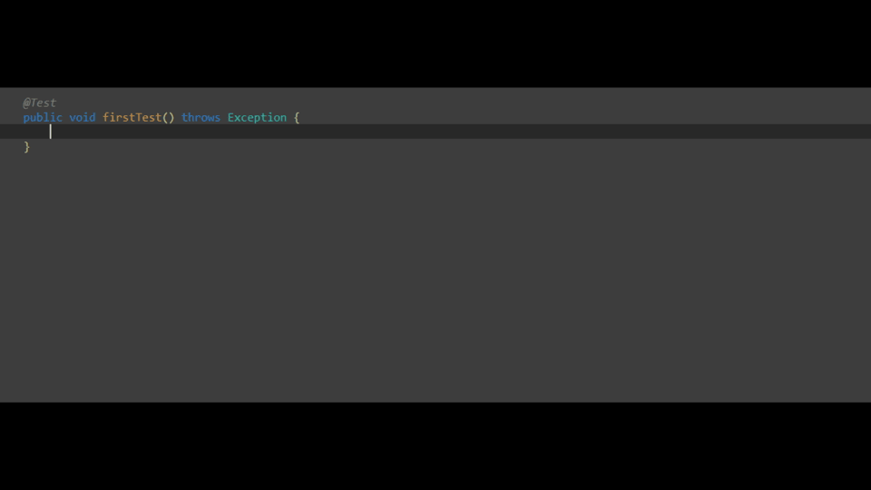

## 1 Why Function API?

Over the years we have seen that some ATS users prefer to use code when writing tests over no-code or graphical solutions. As programmers, we can understand that and we decided to bring ATS to the code world. Therefore we designed a super simple web interface which we call *[Function API](ov-function-api).* The interface can be used from any programming language without the need for external dependencies. In this tutorial, we will showcase how to use the Function API from Java. 

## 2 Why Java?

Java is the undisputed champion when it comes to automated UI testing in 2019 according to data from [Applitools](https://medium.com/@applitools/which-programming-language-is-most-popular-for-ui-test-automation-in-2019-d8787bb6feb6)

That is why we decided to build an integration between ATS and java. This integration allows testers to leverage the power of Java and combine it with the ease of use and Mendix focus of ATS. Thanks to this integration executing an ATS function is a simple as calling a java method.

## 3 Enough talk show me the code

IMPORTANT: Before you start writing tests you need to import the ATS java library. We have made this step painless by packaging all the dependencies in a single fat jar.

### 3.1 Create a driver and connect to ATS

```java
import static org.junit.Assert.*;
import org.junit.After; // ATS is not tied to a testing library, feel free to choose
import org.junit.Before;
import org.junit.Test;
import org.openqa.selenium.chrome.ChromeDriver; // firefox and IE are also supported
import org.openqa.selenium.remote.RemoteWebDriver; 

import ats.ATSRunner; // used to execute ATS functions
import ats.ATSSettings; // mainly used for authentication, can be reused

public class FirstTest {

    private static final ATSSettings ATS_SETTINGS = new ATSSettings("your-projects-id", "your-projects-function-api-key");
    private RemoteWebDriver driver;
    private ATSRunner ats;

    @Before
    public void setUp() throws Exception {
        // start a selenium session on chrome
        driver = new ChromeDriver(); 
        // prepare the ATS runner
        ats = new ATSRunner(ATS_SETTINGS , driver); 
    }

    @After
    public void tearDown() throws Exception {
        driver.quit();
    }

    @Test
    public void firstTest() {
    // TODO: our test code will go in here
    }

}
```

### 3.2 Execute an ATS function

By calling a java method
```java
@Test
public void firstTest() {
    // go to the URL and wait for the Mendix application to load
    ats.Mendix.OpenMendixApplication("https://my-mendix-app.com");
    // login to the mendix app and wait for the home-page to load
    // supports all standard and app store login widgets and even SSO
    ats.Mendix.Login("user", "password", false);
}
```

### 3.3 Assert

* Using ATS 
```java
@Test
public void firstTest() {
    // go to the URL and wait for the mendix application to load
    ats.Mendix.OpenMendixApplication("https:\\my-mendix-app.com");
    // login to the mendix app and wait for the home-page to load 
    // supports all standard and app store login widgets and even SSO
    ats.Mendix.Login("user", "password", false);
    // assert that a widget with name "textBox1" in the first row of the list with name "listView1" has value "foo"
    // supports text box, area, dropdown, radio buttons, reference selectors and many other widget 
    // all of control mode, read only and text mode are supported
    ats.Widget_Assert.AssertValue("listView1 index-0 textBox1", "foo", null, false);
}
```

* Alternatively values can be asserted using `junit.Assert`


```java
@Test
public void firstTest() throws Exception {
    // go to the URL and wait for the mendix application to load
    ats.Mendix.OpenMendixApplication("https:\\my-mendix-app.com");
    // login to the mendix app and wait for the home-page to load 
    // supports all standard and app store login widgets and even SSO
    ats.Mendix.Login("user", "password", false);
    // gets the value of widget with name "textBox1" in the first row of the list with name "listView1"
    // supports text box, area, dropdown, radio buttons, reference selectors and many other widget 
    // all of control mode, read only and text mode are supported
    String actualValue = ats.Widget_Get.GetValue("listView1 index-0 textBox1", null);
    // assert using junit
    assertEquals("foo", actualValue);
}
```

## 4 But wait there is more...

The ATS client works with web elements out of the box and does all the conversion for you. This makes it very easy to combine native selenium functions with ATS functions.

```java
@Test
public void firstTest() throws Exception {
    // find a listview using selenium
    WebElement listview = driver.findElementByClassName("myListViewClass");
    // look for a widget inside the listview that has a certain value and a certain class
    WebElement txt = ats.Widget_Find.FindAssertWidget("txt1", "foo", true,listview,".bar");
    // the result of the ATS function is a selenium web element, so all selenium functions are supported
    txt.sendKeys("Lorem ipsum");
}
```

Last but not least, the ATS java client comes with built-in documentation and auto-complete.



## Amazing, right ?!

### I want to try it!😁

The Function API is in a closed preview phase right now. You can request access by sending an email at `info@mansystems.com` or filing a ticket with [Mendix support](https://support.mendix.com/hc/en-us). 

### I want to try it, but I am using a language different from Java  😢

A client is also available for [Katalon](ov-function-api-katalon). If you are using another tool then try the [REST API](ov-function-api-rest). We are working hard on building clients for other languages.

### I am still not convinced 😒

Why not try it for yourself and see how easy it is. If you have ideas on how we can improve it, send an email at `info@mansystems.com` or file a support ticket with Mendix.
