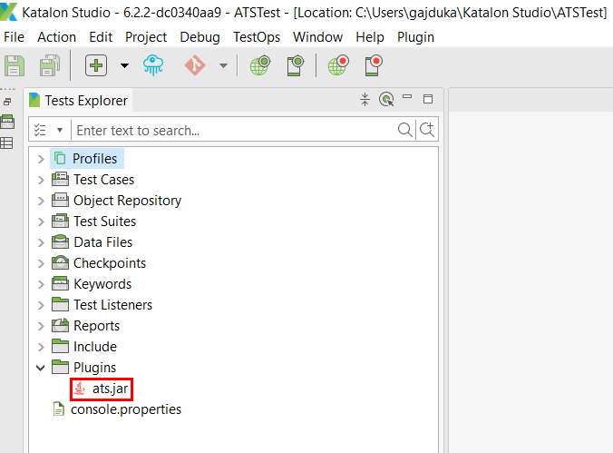
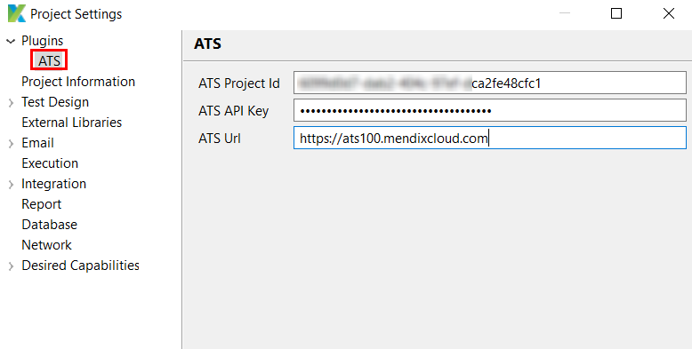
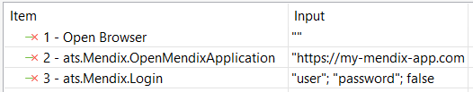
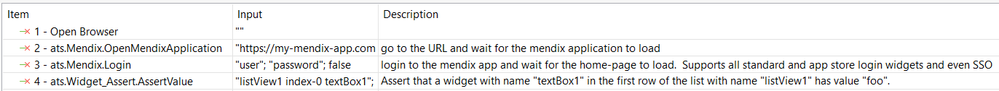
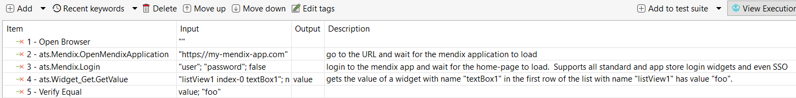

## 1 Why Function API?

Over the years we have seen that some ATS users prefer to use other tools when writing tests. The reasons for this vary, sometimes testers have good experience with a specific tool, or this tool is the norm for all projects. We can understand that and so we decided to open ATS to the world. Therefore we designed a super simple web interface which we call *[Function API](ov-function-api).* The interface can be used from any testing tool as prob. In this tutorial, we will showcase how to use the Function API from Katalon.

## 2 Why Katalon?

Based on our own information Katalon is a really popular graphical testing tool.

That is why we decided to build an integration between ATS and Katalon. This integration allows testers to leverage the power of Katalon and combine it with the ease of use and Mendix focus of ATS. Thanks to this integration executing an ATS function is as simple as calling a custom keyword in Katalon.

## 3 Enough talk show me the code

IMPORTANT: Before you start writing tests you need to import the ATS keywords library. 



### 3.1 Configure ATS Settings



### 3.2 Execute an ATS function



```groovy
WebUI.openBrowser('')

//go to the URL and wait for the Mendix application to load
CustomKeywords.'ats.Mendix.OpenMendixApplication'('[https://my-mendix-app.com](https://my-mendix-app.com/)')

// login to the Mendix app and wait for the home-page to load.  
// Supports all standard and app store login widgets and even SSO
CustomKeywords.'ats.Mendix.Login'('user', 'password', false)
```

### 3.3 Assert

* Using ATS



```groovy
WebUI.openBrowser('')

//go to the URL and wait for the Mendix application to load
CustomKeywords.'ats.Mendix.OpenMendixApplication'('https://my-mendix-app.com')

// login to the Mendix app and wait for the home-page to load.  
// Supports all standard and app store login widgets and even SSO
CustomKeywords.'ats.Mendix.Login'('user', 'password', false)

// Assert that a widget with name "textBox1" in the first row of the list with name "listView1" has value "foo". 
// Supports text box, area, dropdown, radio buttons, reference selectors and many other widgets.
// All of control mode, read-only and text mode are supported.'
CustomKeywords.'ats.Widget_Assert.AssertValue'('listView1 index-0 textBox1', 'foo', null, false)
```

* Alternatively values can be asserted using Cucumber



```groovy
WebUI.openBrowser('')
        
// go to the URL and wait for the mendix application to load
CustomKeywords.'ats.Mendix.OpenMendixApplication'('https://my-mendix-app.com')

// login to the mendix app and wait for the home-page to load.
// Supports all standard and app store login widgets and even SSO'
CustomKeywords.'ats.Mendix.Login'('user', 'password', false)

// gets the value of a widget with name "textBox1" in the first row of the list with name "listView1" has value "foo". 
// Supports text box, area, dropdown, radio buttons, reference selectors and many other widgets.
// All of control mode, read-only and text mode are supported.'
value = CustomKeywords.'ats.Widget_Get.GetValue'('listView1 index-0 textBox1', null)

CucumberKW.verifyEqual(value, 'foo')
```

## That is pretty cool, right ?!

### I want to try it!😁

The Function API is in a closed preview phase right now. You can request access by sending an email at `info@mansystems.com` or filing a ticket with [Mendix support](https://support.mendix.com/hc/en-us). 

### I want to try it, but I am using a language/tool different from Katalon😢

A client is also available for [Java](ov-function-api-java). If you are using another tool then try the [REST API](ov-function-api-rest). We are working hard on building clients for other languages.

### I am still not convinced 😒

Why not try it for yourself and see how easy it is. If you have ideas on how we can improve it, send an email at `info@mansystems.com` or file a support ticket with Mendix.