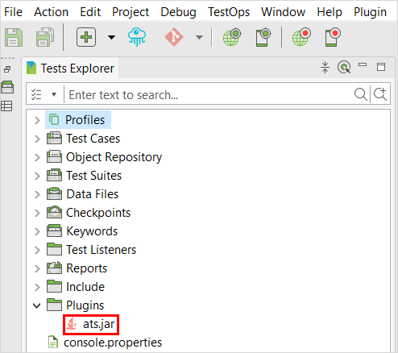
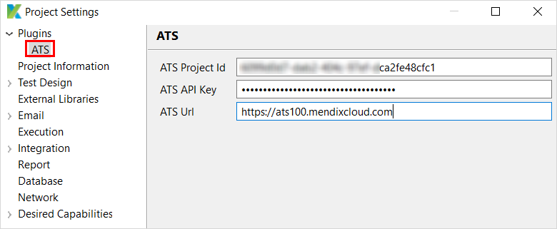
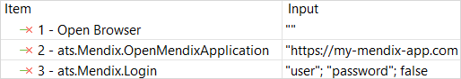
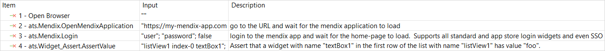
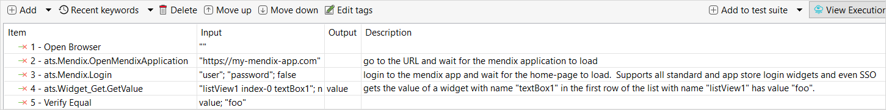

## 1 Introduction

Katalon is a popular graphical testing tool, which is why CLEVR decided to build an integration between ATS and Katalon. This integration allows testers to leverage the power of Katalon and combine it with the ease-of-use and Mendix-focus of ATS. With this integration, executing an ATS function is as simple as calling a custom keyword in Katalon.

{}
Before you start writing tests, you need to import the ATS keywords library via *ats.jar*:<br />


{}

## 2 Configuring the ATS Settings

To configure the ATS settings, you need to enter the **Project ID**, **API key**, and **URL**:



## 3 Executing an ATS Function



```
WebUI.openBrowser('')

//go to the URL and wait for the Mendix application to load
CustomKeywords.'ats.Mendix.OpenMendixApplication'('[https://my-mendix-app.com](https://my-mendix-app.com/)')

// login to the Mendix app and wait for the home-page to load.  
// Supports all standard and app store login widgets and even SSO
CustomKeywords.'ats.Mendix.Login'('user', 'password', false)
```

## 4 Asserting

Assert using ATS:



```
WebUI.openBrowser('')

//go to the URL and wait for the Mendix application to load
CustomKeywords.'ats.Mendix.OpenMendixApplication'('https://my-mendix-app.com')

// login to the Mendix app and wait for the home-page to load.  
// Supports all standard and app store login widgets and even SSO
CustomKeywords.'ats.Mendix.Login'('user', 'password', false)

// Assert that a widget with name "textBox1" in the first row of the list with name "listView1" has value "foo". 
// Supports text box, area, dropdown, radio buttons, reference selectors and many other widgets.
// All of control mode, read-only and text mode are supported.'
CustomKeywords.'ats.Widget_Assert.AssertValue'('listView1 index-0 textBox1', 'foo', null, false)
```

Aternatively, assert values using [Cucumber](https://cucumber.io/):



```
WebUI.openBrowser('')
        
// go to the URL and wait for the mendix application to load
CustomKeywords.'ats.Mendix.OpenMendixApplication'('https://my-mendix-app.com')

// login to the mendix app and wait for the home-page to load.
// Supports all standard and app store login widgets and even SSO'
CustomKeywords.'ats.Mendix.Login'('user', 'password', false)

// gets the value of a widget with name "textBox1" in the first row of the list with name "listView1" has value "foo". 
// Supports text box, area, dropdown, radio buttons, reference selectors and many other widgets.
// All of control mode, read-only and text mode are supported.'
value = CustomKeywords.'ats.Widget_Get.GetValue'('listView1 index-0 textBox1', null)

CucumberKW.verifyEqual(value, 'foo')
```

## 5 Read More

* [Function API](rg-two-function-api)
* [Function API Reference](rg-two-function-api-reference)
* [Function API with REST](ov-function-api-rest)
* [Function API with Java](ov-function-api-java)
