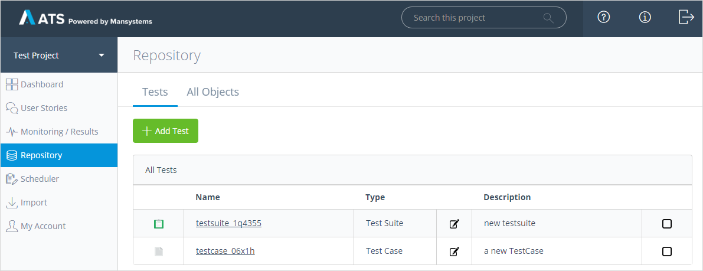
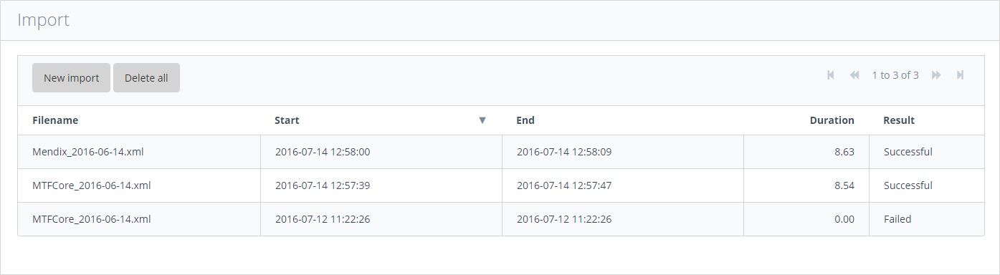
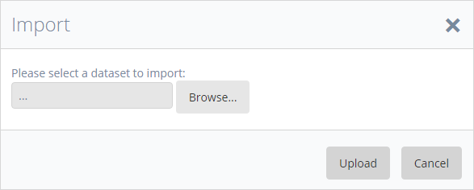
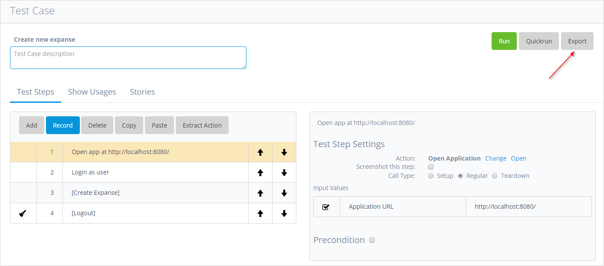
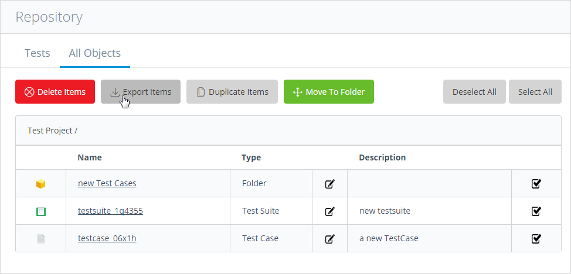
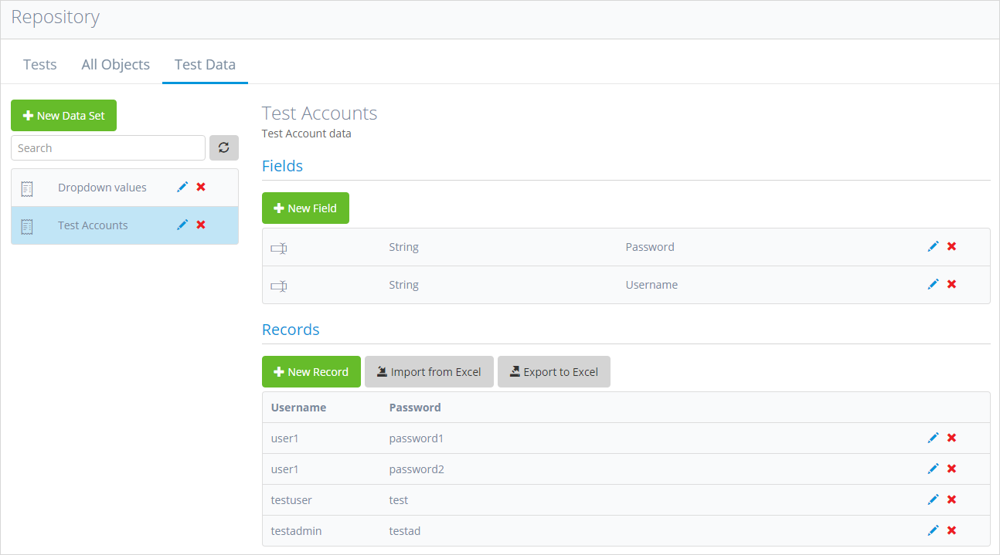

## 1 Repository

The **Repository** is the heart of ATS, since it allows you to create and manage folders, test suites, test cases and actions. The folder in the ATS is equivalent to a directory in your file browser. You can create folders within other folders, and in each folder, you can store test suites, test cases and actions.

## 2 Import/Export

ATS allows you to export data (folders, test suites, test cases and keywords) to an XML file, and import that data into another ATS instance. This makes it possible to move data between different environments without handling database dumps.

### 2.1 Data Import

There are two use cases when importing data: create data and update data. Create data means that you will be importing new data for the first time into your target database. Update data means that you will be importing data that will overwrite existing data, thus updating actions, test cases, test suites or folders.

When importing data, all data conflicts will be resolved by overwriting the existing properties by the imported ones.

To import data in ATS, do the following:

1. Click **Import** to open the data import form.
2. On the data import form, click **New Import** to open the import data dialog box.

3. In the data import dialog box, select the *.xml* file containing your import and press **Upload**.

The system will check the import for data inconsistencies and show error details in a list if any. 

4. Click the **Import** button in the bottom of the screen to complete the import.

Data is imported in ATS.

### 2.2 Data Export

There are different scenarios on how to export data from ATS:

*   Exporting single action
*   Exporting multiple actions
*   Exporting test cases
*   Exporting test suites
*   Exporting folders containing:
    *   Actions
    *   Actions and test cases
    *   Actions, test cases and testsuites
    *   Folders, actions, test cases and test suites

In order to start an export, you can do the following:

* Mark the export items listed in the current list view in the **Repository** and then click **Export** in the top menu
* Export the item you are currently editing by clicking the **Export** button in the top right

To export items from the repository, do the following:

1. Open the **All Objects** tab of the **Repository**.
2. Click the **Export items** button.

Data is exported from the repository.

## 3 Test Data

### 3.1 Creating Datasets

In the **Test Data** tab of the **Repository** you can create datasets by clicking the **New Data Set** button. You can name the dataset and give it a description.

A dataset is defined by one or more fields and records. Fields are the columns of your table, records are the lines in your table containing the field values. Fields can have the data types integer or string. After you have created a dataset you can add fields and records to the set.

**Fields**

A column of the table for specific data, for example, usernames.

**Records**

Line in the data table containing an integer or string value of the data

### 3.2 Importing/Exporting datasets

When creating/editing a dataset you can select the **Create/Update fields from file** option to provide a template Excel file to create or update fields and records of your dataset. The first row of your sheet will be considered the header and will be used to determine the field names. All additional rows will be considered records and will be used to determine the fields data type.

{}

When updating an existing dataset all existing fields and data records will be removed

{}

You can also only import data records into you dataset by clicking the **Import from Excel** button. The first row of your Excel sheet must contain the field names of the dataset into which you want to import the records.

{}

When importing data records all existing records in the dataset will be removed

{}{}

When importing data from from Excel, ATS will try to convert data that doesn't match the expected data type. In case a conversion is not possible (e.g. from a string to an integer) the resulting value will be empty. Always check your data after import to be sure all data was completely imported.

{}

You can simply export a dataset by clicking the **Export to Excel** button.
