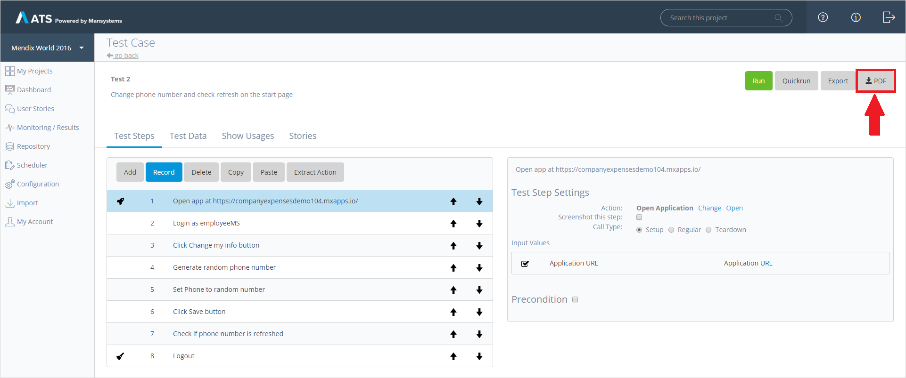
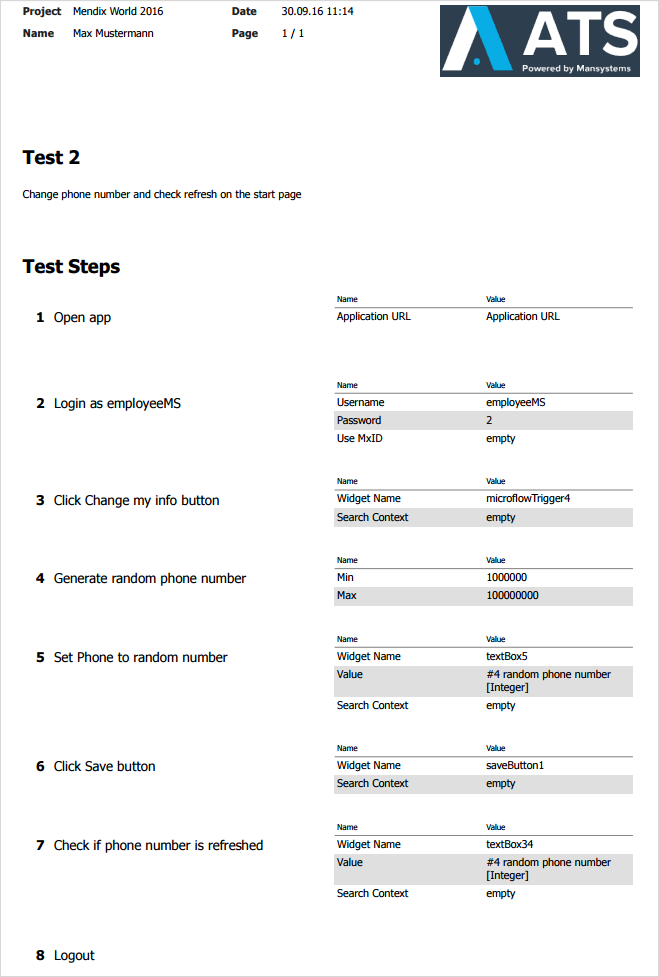

You can export the structure of your test case by pressing **PDF**:

This will generate a detailed test case documentation with all the test steps in order along with their input values.

The generated PDF document will look similar to this:

