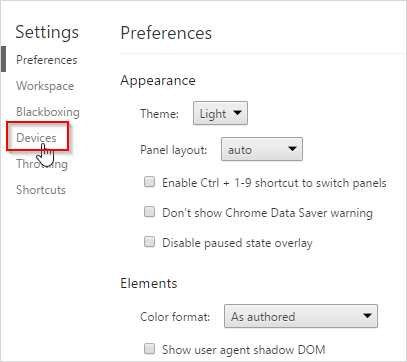
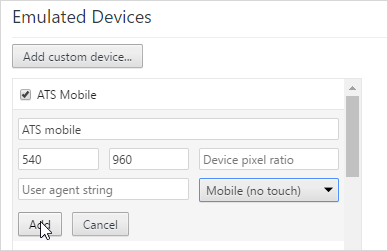
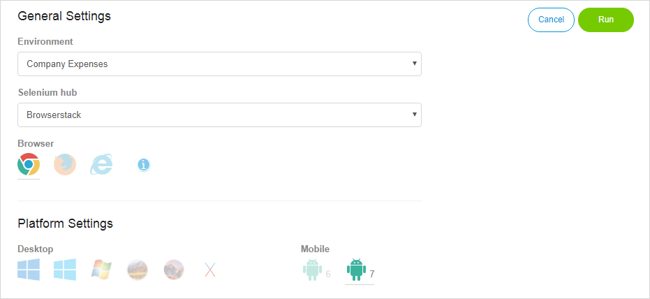
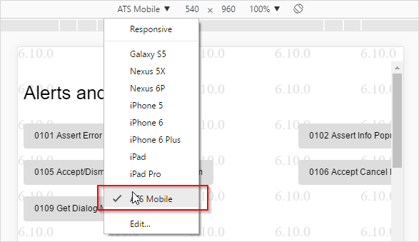

## 1 Introduction

Mobile testing on real devices in ATS is an experimental feature and still in beta.

### 1.1 Compatibility

| Aspect | Supported |
| ------ | --------- |
| Test Browser | Chrome v63 |
| Recorder | Chrome (via a custom mobile device profile) |
| ATS Helper | Chrome (via a custom mobile device profile) |
| Application type | Web applications with mobile view |
| Mobile Operating Systems | Android 6.0 Marshmallow, Android 7.1.1 Nougat, Android 8 Oreo |
| Selenium Providers | Browserstack, Saucelabs |

### 1.2 Supported Devices

In order to provide better support and stricter control guarantees, we limit the mobile devices that can be used with testing. These devices are preselected for each Android version and can not be changed.

| Provider      |  Android 6.0 Marshmallow | Android 7.1.1 Nougat | Android 8 Oreo       |
| ------------- | -------------------------- | ---------------------- | ---------------------- |
| Browserstack  | Google Nexus 6             | Google Pixel           | Google Pixel 2¹        |
| Saucelabs     | Motorola Moto E 2n dGen    | Google Pixel           | LG Nexus 5X²           |

For detailed specifications, refer to [GSMArena.com](https://www.gsmarena.com/).

¹Android 8.0 
²Android 8.1

## 2 Preparations

Some preparations are required before you can start to test on mobile devices.

### 2.1 Creating a Saucelabs (TestObjects) Account

Running a test on a mobile device requires an account with TestObjects (part of Saucelabs). They offer a free account for 1 concurrent test. If you already have an account with Saucelabs, you can go directly to step 3 below.

To create a Saucelabs (TestObjects) account, follow these steps:

1. Go to [TestObjects](https://app.testobject.com/#/signup/).
2. Sign up and confirm via the email you receive from TestObjects.
3. Go to [TestObjects](https://app.testobject.com/#/) and log in with your account.
4. Click **New App**.
5. Click **Mobile Website**.
6. Set some values for **Website URL**, **Website name**, and **Version**, then save. These values are not used by ATS.
7. Set the **Device language** to **English (United States)**.
8. Save the device settings by clicking **Save**.
9. Hover over **AUTOMATED TESTING** and select **APPIUM**
10. Click **Get Started**.
11. Write down the API Key, which you will need later.

### 2.2 Configuring TestObjects in ATS

You'll need to configure your TestObjects as a Selenium endpoint in ATS. To do so, follow these steps:

1. Open ATS and switch to one of your apps.
2. Navigate to the **Settings** by selecting **Show Test Settings** in the profile menu.
3. In the section **Selenium hubs**, click **New**.
4. Under **Custom Capabilities**, click **New**.
5. Set **Key** to **testobject_api_key**, **Type** to **String**, and **Value** to the API key that you wrote down in step 11 from the previous section.
6. Save the capability.
7. Under **Custom Capabilities**, click **New**.
8. Set **Key** to **language**, **Type** to **String**, and **Value** to **en**.
9. Save the capability.
10. Under **Custom Capabilities**, click **New**.
11. Set **Key** to **locale**, **Type** to **String**, and **Value** to **US**.
12. Save the capability.
13. Save the Selenium hub.

### 2.3 Creating a Mobile Device Profile

In order to enable a proper working of the ATS Recorder and ATS Helper, you need to create a custom mobile device profile in Chrome.

Follow these steps to do so:

1. Open Chrome.
2. Press **F12** to open the DevTools.
3. Press **F1** to open the **Settings** dialog box.
4.  Select the **Devices** tab:

    
    
5. Select **Add custom device**.
6. Set the following properties:
    * **Device name** to *ATS mobile*
    * **Width** to *540*
    * **Height** to *960*
    * **Device type** to *Mobile (no touch)*
    * **User agent string** to *Mozilla/5.0 (Linux; Android 7.0; SM-G930V Build/NRD90M) AppleWebKit/537.36 (KHTML,  like Gecko) Chrome/59.0.3071.125 Mobile Safari/537.36*
7.  Select **Add**.

    
    
8. Close the Settings and the DevTools by clicking the **X** button in the top right corner twice.

## 3 Running a Test Case on a Mobile Device

Once you have created a test case for mobile, you will want to run it. This is what you have to do:

1. Open your test case.
2. Click **Run** and then **Edit Run Configuration**.
3. Select a **Selenium provider** that supports mobile testing and select **Chrome** as browser.
4. Under **Platform Settings**, select the mobile platform you wish to test: Android 6 or Android 7.
5. Click **Run**.

## 4 Native Dialogs

Usually when a web application is used on a mobile device, the devices add native dialog boxes in some places to improve usability. These are the places where this occurs:

* In drop-down menux
* In date fields
* In time fields
* In date-time fields

All standard functions also work on a mobile device, including places where native dialogs are used. ATS functions are context-aware, and when run on a mobile device, they will automate native mobile dialogs.

## 5 Using the ATS Recorder and Helper on Mobile Device Views

In order to see the mobile screens of your app in Chrome, you need to enable the mobile device view. In this mode, you will also be able to use the ATS Helper and Recorder.

Follow these steps:

1. Open Chrome.
2. Press **F12** to open the DevTools.
3. In the DevTools, switch to the **Sources** tab. 
4. Press **CTRL+F8** to deactivate breakpoints (breakpoints prevent the proper use of the ATS Recorder and ATS Helper).
5. Press <kbd>CTRL</kbd> + <kbd>SHIFT</kbd> + <kbd>M</kbd> to enable the mobile device toolbar.
6. In the mobile device toolbar, select the new device profile **ATS Mobile**.

    

You can enable and use the ATS Helper and Recorder as usual, as long as the mobile device profile is enabled.

## 6 Known Limitations

* Using touch actions in the mobile device profile is not possible. The ATS Helper and Recorder are not compatible with touch actions.
* The only supported language is English and the country is United States. This should have been set if you followed the instructions in this document.
* Emulators are not supported.
* Seconds cannot be set in (date) time fields. Clearing a date/time value is not supported.
