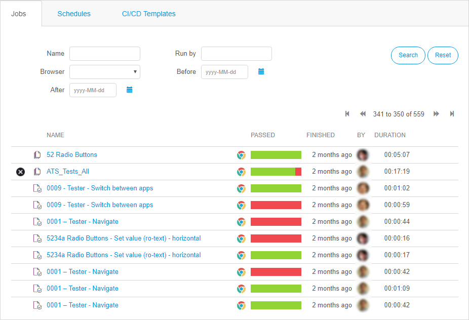
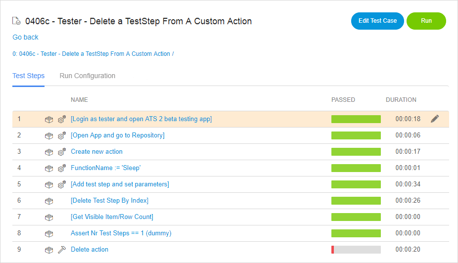
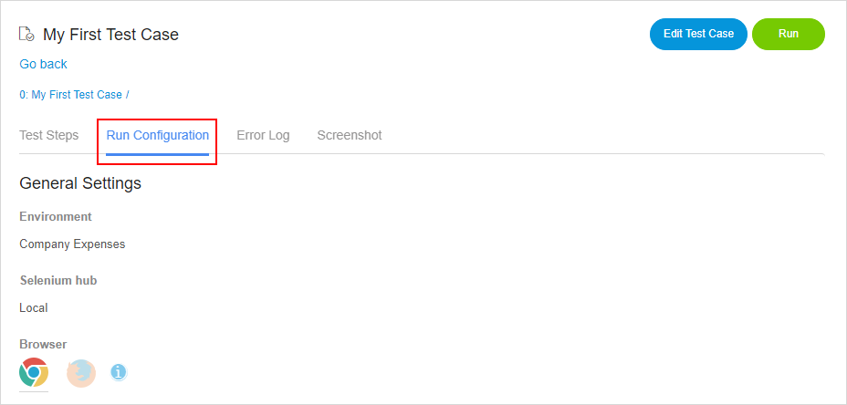
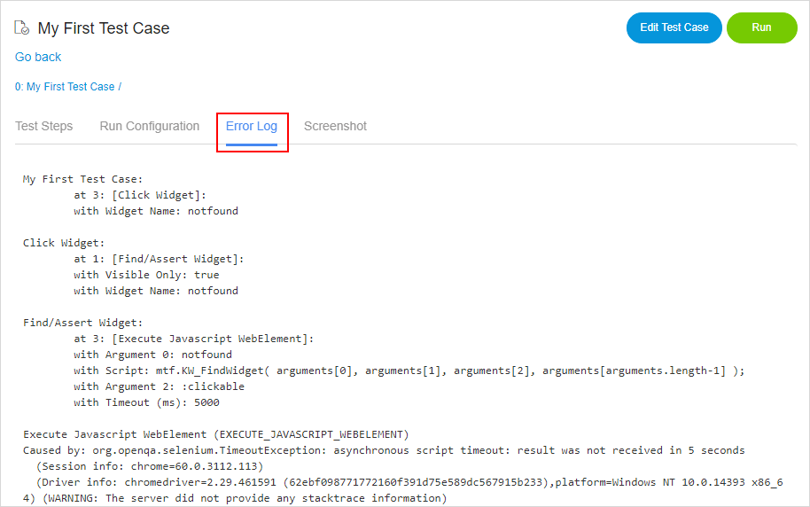
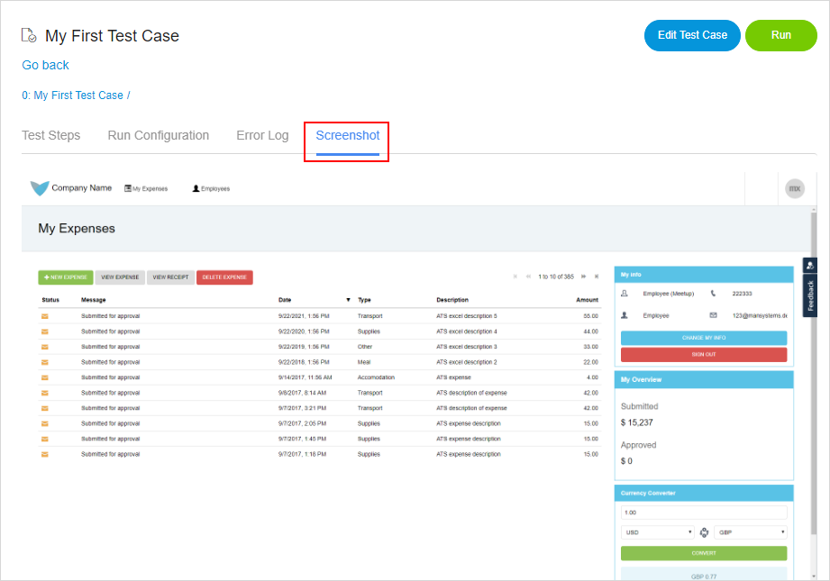

## 1 Introduction

Under **Results**, you find all the running and executed tests from your app. The tests are sorted based on the finishing date.

The first column shows the status of a test. If the test is done, a warning and/or a canceled flag can be shown. The following list explains all the different icons:

*  Queued – the test is waiting for a free running slot on the Selenium hub:

    

*  Running – the test is currently running:

    
    
*  Warning – the test is passed but may require your attention.

    
    
*  Canceled – the test was canceled before it could be completed.

    
    

The second column shows the type of the test. The following list explains all the different icons:

*  Test case:

    

*  Test suite:

     

*  Data-driven instance:

    

The duration column is formatted as followed: `HH:MM:SS`.

You can search the most recent tests via the following:

* Name
* Browser
* After date
* Before date
* Run by

## 2 Result Log

When you click your test case, the **Result log** opens. The result log shows detailed information about the results of a test. It contains the results of all the test steps, the run configuration, and, if a step failed, screenshots of that step. The results are updated every time a step has finished its execution.

If the test was not successful, you can check the error log for more information.

### 2.1 Result Calculation

Test step result:

* If a test step has not met the set precondition => Not Executed
* If there was an error in the execution => Failed
* If the user cancelled the execution => Failed and the canceled flag is set
* Otherwise => Passed

The rules are applied in order, the first one that matches wins.

Test case result:

* If the test case can not be started  => Not Executed
* If the test case fails in a setup step => Not Executed
* If the test case fails in a regular step => Failed
* If the test case fails in a teardown step => Result is kept (passed/failed) and a warning flag is set
* Otherwise => Passed

The rules are applied in order, the first one that matches wins.

### 2.2 Test Steps

Under **Test steps**, you will find the result, start time, and the duration of every step of your test.

Drill down deeper into the log by clicking the name of the test step. You can always go back to a parent step by clicking its name in the breadcrumbs:

The following results can be assigned to a test step:

  Passed – the test has passed

  Failed – the test has failed

  Not Executed – the test was not executed; this happens if a test step has not met the set precondition

  Different Results - some of the containing tests passed, some failed and some where not executed

### 2.3 Actions

On the top-right of the screen, you will find the **Edit** and **Run** buttons:

* **Edit** – opens the corresponding test case/test suite
* **Run** – opens the **Job Configuration** page, where you can edit the run configuration and re-run the test
* **Rerun not passed** – opens the **Job Configuration** page, where you can edit the run configuration and re-run the test. This is only available for not passed test suites and is going to add all not passed test cases to the new job.

### 2.4 Run Configuration

The **Run Configuration** tab shows the configuration with which the test was executed. It shows the name of the environment, the Selenium hub, and the icon of the browser.

### 2.5 Error Log

The **Error Log** shows detailed information about a failed test step.

### 2.5 Screenshots

All the screenshots ATS takes during the test run are available under **Screenshots**. Screenshots are only taken if a test step fails.

### 2.6 Recording

The **Recording** tab plays a video recording of the test case execution. It is only available if the test has been executed on Browserstack. Please note that we do not store these recording, but we only link to the recorded videos from the respective selenium provider.
