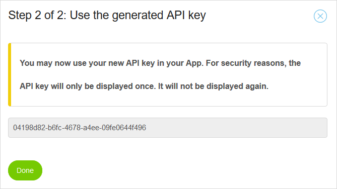

## 1 Introduction

Most Mendix Platform APIs require their users to authenticate themselves; this is done by using API keys.

## 2 Obtaining API Keys

You can obtain a Mendix API key by following the steps below.

1.  Navigate to the [https://home.mendix.com](https://home.mendix.com).
2.  Open your profile. You can do this by clicking on your avatar in the top right corner of the screen and clicking **My Profile**.
3.  Click the **Settings** cog icon, then click **API Keys** in the sidebar menu..
4.  Click **Create new API key** and follow the instructions.

{}
Make a note of the API key as it will only be shown once.
{}

The obtained API key will allow apps that use it to act on behalf of the user. The app will, therefore, have the same privileges as the user who created the API key.

## 3 Using Authentication Headers

Any call to the Mendix Platform APIs should be authenticated using the following request headers:

*   `Mendix-Username`: Login name of the requesting user with the required privileges in the Mendix Platform.
*   `Mendix-ApiKey`: API key of this user.
