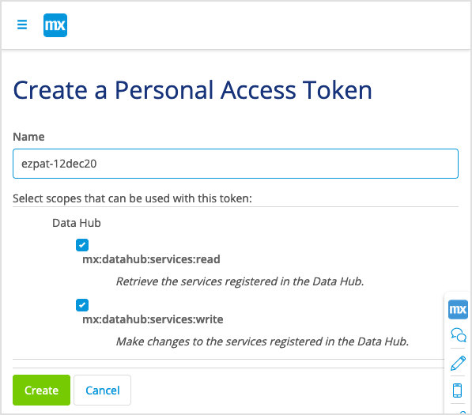
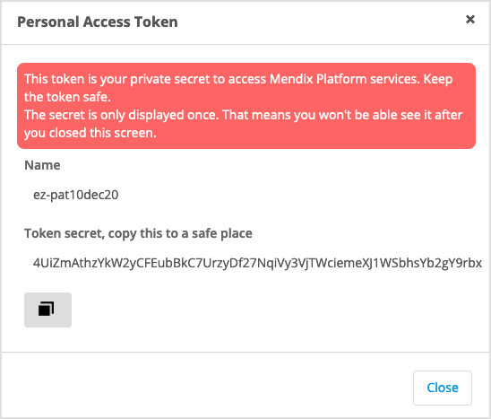
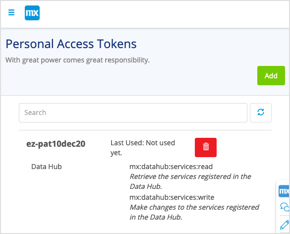

## 1. Introduction

The Data Hub API enables you to explore and discover data sources in Mendix Data Hub and use them to build new apps. You can also set up a registration flow in your deployment pipeline to register new data sources from your applications to the Data Hub Catalog.

{}
To use the Mendix Data Hub a license is required.
{}

The [DataHubAPI](https://platformcore.pages.rnd.mendix.com/datahub-spec/datahub.html#/) ??post the final API link here?? is an Open API (formerly Swagger) specification which contains all the APIs for the operations that are available:

* Registration
* Search
* Consume

To access the API, authorization is required. Mendix users must obtain a Personal Access Token (PAT) as described in [Generating your Personal Access Token](#generatepat).

## 2. Generating your Personal Access Token {#generatepat}

For every request that is made to the Data Hub API ??is it for every request or is this not relevant.??, you must include a PAT which will be exchanged with the relevant API key to enable access. Mendix users (with a registered account) can obtain the necessary PAT using the Mendix **Warden** app by following these steps: 

1. You can access the **Warden** app at: https://warden.mendix.com/

2. When you are prompted, enter your login and password. This will take you to the Warden Home page:

   

3. To create a new personal access token, click **Add** to see the **Create a Personal Access Token** screen. 

4. Enter a **Name** for the token.

5. For the **Select scopes this token grants access to**, for Data Hub, check both the **mx:datahub:services:read** and **mx:datahub:services:write**:

   

6. Click **Create**. The token will be generated and displayed in a pop-up window:

   

7. Copy the **Token secret** to your clipboard by clicking the storage icon below the secret. You will have to include this token in the authorization header for your requests to the Data Hub API.

   {}Make sure that you keep this token in a safe place in case. You will not get another chance to view this token once you **Close** is dialog box.

   {}

8. Click **Close** to return to the **Personal Access Tokens** home screen. Your generated token will be listed:

   

9. You can delete unused tokens by clicking the "bin" icon.

