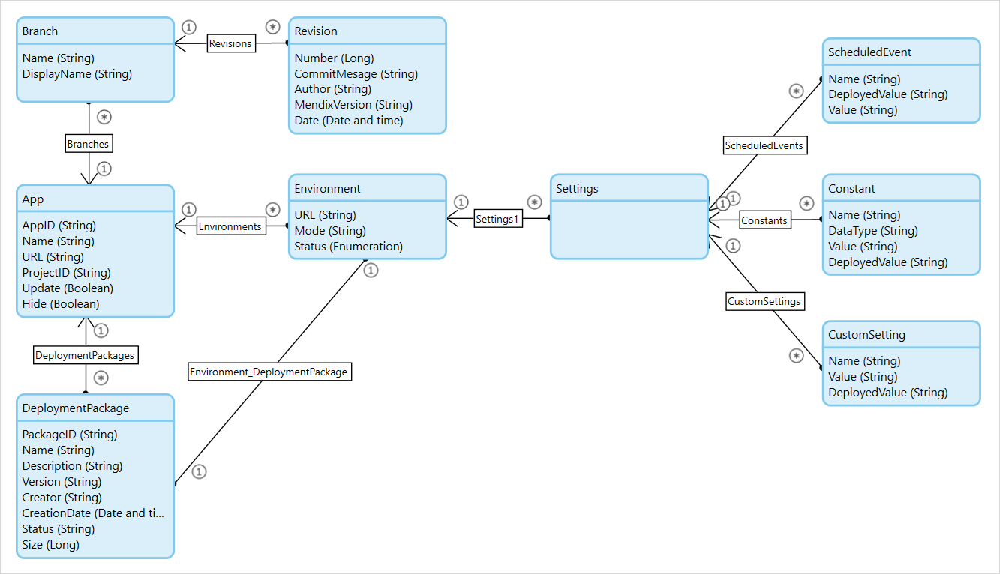

# 1 Introduction

The Deploy API allows you to manage application environments in the Mendix Cloud. You can retrieve the status and start and stop applications, and you can also deploy and configure new model versions to application environments. You will also need the Build API to create and manage deployment packages.

This image provides a domain model representation of the concepts discussed below and how these are related:



# 2 <a name="DeployAPI-Authentication" rel="nofollow"></a> Authentication

The Deploy API requires authentication via API keys that are bound to your Mendix account (for more information, see [Authentication](authentication).

As APIs are designed for automated systems, the Deploy API does not require two-factor authentication, which is normally required to make changes to production environments. This is a potential security risk. Therefore, the Technical Contact of an application needs to explicitly allow API access for team members that want to use the Deploy API. This can be configured from the **Node Security** screen under **Project Settings**. By default, API access is already enabled for test and acceptance environments for all team members. To perform an action via the Deploy API, such as transporting a new deployment package, both the **Transport** and **API Access** permissions need to be enabled.

# 3 <a name="DeployAPI-APIcalls" rel="nofollow"></a> API Calls

Only _Retrieve apps_, _Create Sandbox_ and _Retrieve app_ API calls are supported for sandbox applications. Please note that most api calls with the exception of _Upload Package_ requires the _Content-Type_ header to be set to _application/json_.

## 3.1 <a name="DeployAPI-Retrieveapps" rel="nofollow"></a>Retrieve Apps

### 3.1.1 <a name="DeployAPI-Description" rel="nofollow"></a>Description

Retrieves all apps which the authenticated user has access to as a regular user. These apps can be found via the "Nodes overview" screen in the Mendix Platform.

```bash
HTTP Method: GET
URL: https://deploy.mendix.com/api/1/apps/
```

### 3.1.2 <a name="DeployAPI-Request" rel="nofollow"></a>Request

##### 3.1.2.1 <a name="DeployAPI-Example" rel="nofollow"></a>Example

```bash
GET /api/1/apps/ HTTP/1.1
Host: deploy.mendix.com
Content-Type: application/json
Mendix-Username: richard.ford51@example.com
Mendix-ApiKey: 26587896-1cef-4483-accf-ad304e2673d6
```

### 3.1.3 <a rel="nofollow"></a>Output

List of objects with the following key-value pairs:

*   _AppId_ (String): Sub-domain name of the app.
*   _Name_ (String): Name of the app.
*   _ProjectId_ (String): Developer Portal Project identifier.
*   _Url_ (String): Production or sandbox URL to access your app.

##### 3.1.3.1 <a rel="nofollow"></a>Example

```bash
[{
    "Name": "Calculation App",
    "Url": "https://calc.mendixcloud.com",
    "ProjectId": "fae5de74-69c2-4488-a4de-abf89daac63e",
    "AppId": "calc"
},{
    "Name": "Tic Tac Toc",
    "Url": "https://tictactoc.mendixcloud.com",
    "ProjectId": "f5129445-b638-42f4-8108-5f370c85dc57",
    "AppId": "tictactoc"
}]
```

## 3.2 <a name="DeployAPI-CreateSandbox" rel="nofollow"></a>Create Sandbox

### 3.2.1 <a name="DeployAPI-Description" rel="nofollow"></a>Description

Creates a sandbox application for a requested project id.

```bash
HTTP Method: POST
URL: https://deploy.mendix.com/api/1/apps/
```

### 3.2.2 <a name="DeployAPI-Request" rel="nofollow"></a>Request

##### 3.2.2.1 <a name="DeployAPI-Parameters" rel="nofollow"></a>Parameters

An object with the following key-value pair:

*   _ProjectId_ (String) : The Developer Portal project identifier that should be linked to the new sandbox application. This value can be found under Settings > General, and it is represented as App ID.

##### 3.2.2.2 <a name="DeployAPI-Example" rel="nofollow"></a>Example

```bash
POST /api/1/apps/ HTTP/1.1
Host: deploy.mendix.com
Content-Type: application/json
Mendix-Username: richard.ford51@example.com
Mendix-ApiKey: 26587896-1cef-4483-accf-ad304e2673d6

{
     "ProjectId" :  "f5129445-b638-42f4-8108-5f370c85dc57"
}
```

### 3.2.3 <a rel="nofollow"></a>Output

Response object with the following fields:

*   _AppId_ (String): Sub-domain name of the app.
*   _Name_ (String): Name of the app.
*   _ProjectId_ (String): Developer Portal Project identifier.
*   _Url_ (String): Production or sandbox URL to access your app.

##### 3.2.3.1 <a name="DeployAPI-Errorcodes" rel="nofollow"></a>Error Codes

| HTTP Status | Error code | Description |
| --- | --- | --- |
| 400 | INVALID_PROJECTID | Invalid ProjectId |
| 400 | APPLICATION_ALREADY_EXISTS | Application already exists |

##### 3.2.3.2 <a rel="nofollow"></a>Example

```bash
{
    "Name": "Calculation App",
    "Url": "https://calc.mendixcloud.com",
    "ProjectId": "fae5de74-69c2-4488-a4de-abf89daac63e",
    "AppId": "calc"
}
```

## 3.3 <a name="DeployAPI-Retrieveapp" rel="nofollow"></a>Retrieve App

### 3.3.1 <a rel="nofollow"></a>Description

Retrieves a specific app which the authenticated user has access to as a regular user. These app can be found via the "Nodes overview" screen in the Mendix Platform.

```bash
HTTP Method: GET
URL: https://deploy.mendix.com/api/1/apps/<AppId>
```

### 3.3.2 <a rel="nofollow"></a>Request

##### 3.3.2.1 <a name="DeployAPI-Parameter" rel="nofollow"></a>Parameter

*   _AppId_ (String): Sub-domain name of an app.

##### 3.3.2.2<a rel="nofollow"></a>Example

```bash
GET /api/1/apps/calc/ HTTP/1.1
Host: deploy.mendix.com
Content-Type: application/json
Mendix-Username: richard.ford51@example.com
Mendix-ApiKey: 26587896-1cef-4483-accf-ad304e2673d6
```

### 3.3.3 <a name="DeployAPI-Output" rel="nofollow"></a>Output

Object with the following key-value pairs:

*   _AppId_ (String): Sub-domain name of the app.
*   _Name_ (String): Name of the app.
*   _Url_ (String): Production or sandbox URL to access your app.

##### 3.3.3.1 <a name="DeployAPI-Errorcodes" rel="nofollow"></a>Error codes

| HTTP Status | Error code | Description |
| --- | --- | --- |
| 400 | INVALID_APPID | Invalid AppId |
| 404 | APP_NOT_FOUND | App not found |

##### 3.3.3.2 <a rel="nofollow"></a>Example

```bash
{
    "AppId": "calc",
    "ProjectId": "543857rfds-dfsfsd12c5e24-3224d32eg",
    "Url": "https://calc.mendixcloud.com",
    "Name": "Calculation App"
}
```

## 3.4 <a name="DeployAPI-Retrieveenvironments" rel="nofollow"></a>Retrieve Environments

### 3.4.1 <a rel="nofollow"></a>Description

Retrieves all environments that are connected to a specific app which the authenticated user has access to as a regular user. These environments can be found via the "Nodes overview" screen in the Mendix Platform.

```bash
HTTP Method: GET
URL: https://deploy.mendix.com/api/1/apps/<AppId>/environments/
```

### 3.4.2 <a rel="nofollow"></a>Request

##### 3.4.2.1 <a rel="nofollow"></a>Parameter

*   _AppId_ (String): Subdomain name of an app.

##### 3.4.2.2 <a rel="nofollow"></a>Example

```bash
GET /api/ 1 /apps/calc/environments/ HTTP/ 1.1
Host: deploy.mendix.com

Content-Type: application/json
Mendix-Username: richard.ford51@example.com
Mendix-ApiKey:  26587896-1cef-4483-accf-ad304e2673d6
```

### 3.4.3 <a rel="nofollow"></a>Output

List of objects with the following key-value pairs:

*   _Status_ (String): Status of the environment. Possible values: Empty, Stopped, Running
*   _Url_ (String): URL to access your application.
*   Mode (String): Mode of the environment. Possible values: Test, Acceptance, Production.

##### 3.4.3.1 <a rel="nofollow"></a>Example

```bash
[
    {
        "Status" :  "Stopped" ,
        "Mode" :  "Acceptance",
        "Url" :  "https://calc-accp.mendixcloud.com
    },
    {
        "Status" :  "Stopped" ,
        "Mode" :  "Production",
        "Url" :  "https://calc.mendixcloud.com"
    }
]
```

## 3.5 <a name="DeployAPI-Retrieveenvironment" rel="nofollow"></a>Retrieve Environment

### 3.5.1 <a rel="nofollow"></a>Description

Retrieves a specific environment that is connected to a specific app which the authenticated user has access to as a regular user. These environments can be found via the "Nodes overview" screen in the Mendix Platform.

```bash
HTTP Method: GET
URL: https://deploy.mendix.com/api/1/apps/<AppId>/environments/<Mode>
```

### 3.5.2 <a rel="nofollow"></a>Request

##### 3.5.2.1 <a name="DeployAPI-Parameters" rel="nofollow"></a>Parameters

*   _AppId_ (String): Subdomain name of an app.
*   _Mode_ (String): The mode of the environment of the app. An environment with this mode should exist.

##### 3.5.2.2 <a rel="nofollow"></a>Example

```bash
GET /api/1/apps/calc/environments/Acceptance HTTP/1.1
Host: deploy.mendix.com
Content-Type: application/json
Mendix-Username: richard.ford51@example.com
Mendix-ApiKey: 26587896-1cef-4483-accf-ad304e2673d6
```

### 3.5.3 Output

An object with the following key-value pairs:

*   _Status_ (String): Status of the environment. Possible values: Empty, Stopped, Running
*   _Url_ (String): URL to access your application.
*   _Mode_ (String): Mode of the environment. Possible values: Test, Acceptance, Production.

##### 3.5.3.1 <a rel="nofollow"></a>Error Codes

| HTTP Status | Error code | Description |
| --- | --- | --- |
| 400 | INVALID_PARAMETERS | Not enough parameters given. Please set AppId and Mode parameters. |
| 400 | INVALID_ENVIRONMENT | Could not parse environment mode 'mode'. Valid options are 'Test', 'Acceptance' and 'Production'. |
| 404 | ENVIRONMENT_NOT_FOUND | Environment not found. |

##### 3.5.3.2 <a rel="nofollow"></a>Example

```bash
{
     "Status" :  "Stopped" ,
     "Mode" :  "Acceptance",
     "Url" :  "https://calc-accp.mendixcloud.com"
}
```

## 3.6 <a name="DeployAPI-Startenvironment" rel="nofollow"></a>Start Environment

### 3.6.1 <a rel="nofollow"></a>Description

Starts a specific environment that is connected to a specific app which the authenticated user has access to as a regular user. These environments can be found via the "Nodes overview" screen in the Mendix Platform.

```bash
HTTP Method: POST
URL: https://deploy.mendix.com/api/1/apps/<AppId>/environments/<Mode>/start
```

### 3.6.2 Request

##### 3.6.2.1 <a name="DeployAPI-Payload" rel="nofollow"></a>Payload

An object with the following key-value pair:

*   _AutoSyncDb_ (Boolean) : Define whether the database should be synchronized automatically with the model during the start phase of the app. This is only applicable if your Mendix Cloud version is older than v4.

##### 3.6.2.2 <a rel="nofollow"></a>Example

```bash
POST /api/ 1 /apps/calc/environments/Acceptance/start HTTP/ 1.1
Host: deploy.mendix.com

Content-Type: application/json
Mendix-Username: richard.ford51@example.com
Mendix-ApiKey:  26587896-1cef-4483-accf-ad304e2673d6

{
     "AutoSyncDb" :  true
}
```

### 3.6.3 <a rel="nofollow"></a>Output

An object with the following key-value pairs:

*   _JobId_ (String): The identifier which can be used to track the progress of the start action

##### 3.6.3.1 <a rel="nofollow"></a>Error Codes

| HTTP Status | Error code | Description |
| --- | --- | --- |
| 400 | INVALID_APPID | Invalid AppId |
| 404 | APP_NOT_FOUND | App not found |
| 500 | NO_MDA_HAS_BEEN_DEPLOYED | Cannot start app. There is no MDA deployed. |
| 500 | APP_ALREADY_HAS_A_STARTING_JOB | Cannot start app. There is already a starting job id found. |
| 500 | ALREADY_STARTED | Cannot start app. App is already running. |

##### 3.6.3.2 <a rel="nofollow"></a>Example

```bash
{
     "JobId" :  "02df2e50-0e79-11e4-9191-0800200c9a66" ,
}
```

## 3.7 <a name="DeployAPI-Getstartenvironmentstatus" rel="nofollow"></a>Get Start Environment Status

### 3.7.1 <a rel="nofollow"></a>Description

Retrieve the status of the start environment action.

```bash
HTTP Method: GET
URL: https://deploy.mendix.com/api/1/apps/<AppId>/environments/<Mode>/start/<JobId>
```

### 3.7.2 Request

##### 3.7.2.1 <a rel="nofollow"></a>Example

```bash
GET /api/ 1 /apps/calc/environments/Acceptance/start/02df2e50-0e79-11e4- 9191 -0800200c9a66 HTTP/ 1.1
Host: deploy.mendix.com

Content-Type: application/json
Mendix-Username: richard.ford51@example.com
Mendix-ApiKey:  26587896-1cef-4483-accf-ad304e2673d6
```

### 3.7.3 <a rel="nofollow"></a>Output

An object with the following key-value pair:

*   _Status_ (String): Possible values are Starting and Started

##### 3.7.3.1 <a rel="nofollow"></a>Error Codes

| HTTP Status | Error code | Description |
| --- | --- | --- |
| 400 | INVALID_PARAMETERS | Not enough parameters given. Please set AppId and Mode parameters. |
| 400 | INVALID_ENVIRONMENT | Could not parse environment mode 'mode'. Valid options are 'Test', 'Acceptance' and 'Production'. |
| 404 | ENVIRONMENT_NOT_FOUND | Environment not found |
| 404 | NO_SUCH_STARTJOB | Job not found. |
| 500 | NO_PACKAGE | Cannot start app. There should be a package configured for this environment. |
| 500 | ALREADY_LOCKED | Cannot start app. There is already a lock on this environment. |
| 500 | ALREADY_STARTED | Cannot start app. App is already running. |
| 500 | DB_SYNC_FAILED | Cannot start app. Synchronization of database failed. |
| 500 | INVALID_DB_STRUCTURE | Cannot start app. The database is out-of-sync with the model. Please set AutoSyncDb parameter to true to synchronize the database automatically on startup. |
| 500 | MISSING_CONSTANT | Cannot start app. Missing one or more constant values. |
| 500 | INSECURE_ADMIN_PASSWORD | Cannot start app. There is a user with administrator role with password '1'. This is not allowed. |
| 500 | STARTUP_ACTION_FAILED | Cannot start app. Startup action failed. |
| 500 | START_FAILED | Cannot start app: result (detail status) |

##### 3.7.3.2 <a rel="nofollow"></a>Example

```bash
{
     "Status" :  "Starting" ,
}
```

## 3.8 <a name="DeployAPI-Stopenvironment" rel="nofollow"></a>Stop Environment

### 3.8.1 <a rel="nofollow"></a>Description

Stops a specific environment that is connected to a specific app which the authenticated user has access to as a regular user. These environments can be found via the "Nodes overview" screen in the Mendix Platform.

```bash
HTTP Method: POST
URL: https://deploy.mendix.com/api/1/apps/<AppId>/environments/<Mode>/stop
```

### 3.8.2 Request

##### 3.8.2.1 <a rel="nofollow"></a>Example

```bash
POST /api/ 1 /apps/calc/environments/Acceptance/stop HTTP/ 1.1
Host: deploy.mendix.com

Content-Type: application/json
Mendix-Username: richard.ford51@example.com
Mendix-ApiKey:  26587896-1cef-4483-accf-ad304e2673d6
```

### 3.8.3 <a rel="nofollow"></a>Output

##### 3.8.3.1 <a rel="nofollow"></a>Error Codes

| HTTP Status | Error code | Description |
| --- | --- | --- |
| 400 | INVALID_PARAMETERS | Not enough parameters given. Please set AppId and Mode parameters. |
| 400 | INVALID_ENVIRONMENT | Could not parse environment mode 'mode'. Valid options are 'Test', 'Acceptance' and 'Production'. |
| 404 | ENVIRONMENT_NOT_FOUND | Environment not found |
| 500 | STOP_FAILED | Cannot stop app: reason |

## 3.9 <a name="DeployAPI-Retrieveenvironmentpackage" rel="nofollow"></a>Retrieve Environment Package

### 3.9.1 <a rel="nofollow"></a>Description

Retrieves the deployed package of a specific environment that is connected to a specific app which the authenticated user has access to as a regular user. These environments can be found via the "Nodes overview" screen in the Mendix Platform.

```bash
HTTP Method: GET
URL: https://deploy.mendix.com/api/1/apps/<AppId>/environments/<Mode>/package
```

### 3.9.2 Request

##### 3.9.2.1 <a rel="nofollow"></a>Parameters

*   _AppId_ (String): Sub-domain name of an app.
*   _Mode_ (String): The mode of the environment of the app. An environment with this mode should exist.

##### 3.9.2.2 <a rel="nofollow"></a>Example

```bash
GET /api/ 1 /apps/calc/environments/Acceptance/ package HTTP/ 1.1
Host: deploy.mendix.com

Content-Type: application/json
Mendix-Username: richard.ford51@example.com
Mendix-ApiKey:  26587896-1cef-4483-accf-ad304e2673d6
```

### 3.9.3 <a rel="nofollow"></a>Output

An object with the following key-value pairs:

*   _PackageId_ (String): Unique identification of the package.
*   _Name_ (String): Name of the package.
*   _Description_ (String): Description of the package.
*   _Version_ (String): Package version. This is also the name of the tag on the project teamserver.
*   _Creator_ (String): Uploader or creator of this package.
*   _CreationDate_ (Date): Date that the package became available in the portal. This can be the
    upload date or the date that a build was created in the portal.
*   _Status_ (String): Status of the package. A package is ready to use if the status is 'Succeeded'.
    Possible values: Succeeded, Queued, Building, Uploading and Failed.
*   _Size_ (Long): Size of the package in bytes.

##### 3.9.3.1 <a rel="nofollow"></a>Error Codes

| HTTP Status | Error code | Description |
| --- | --- | --- |
| 400 | INVALID_PARAMETERS | Not enough parameters given. Please set AppId and Mode parameters. |
| 400 | INVALID_ENVIRONMENT | Could not parse environment mode 'mode'. Valid options are 'Test', 'Acceptance' and 'Production'. |
| 404 | PACKAGE_NOT_FOUND | No package found for this environment |

##### 3.9.3.2 <a rel="nofollow"></a>Example

```bash
{
     "Status" :  "Succeeded",
     "CreationDate" :  1404990271835,
     "ExpiryDate": null,
     "Description" :  "Add scientific mode" ,
     "Version" :  "2.5.4.63" ,
     "Size" :  3.0571174621582031,
     "PackageId" :  "b3d14e53-2654-4534-b374-9179a69ef3cf" ,
     "Creator" :  "Richard Ford" ,
     "Name" :  "Main line-2.5.4.63.mda"
}
```

## 3.9.4 <a name="DeployAPI-Uploadpackage" rel="nofollow"></a>Upload Package

### 3.9.4.1 <a rel="nofollow"></a>Description

Uploads a deployment package from the local system to a specific app. This package can then be transported to a specific environment for deployment.

```bash
HTTP Method: POST
URL: https://deploy.mendix.com/api/1/apps/<AppId>/packages/upload
```

### 3.9.5 Request

##### 3.9.5.1 <a rel="nofollow"></a>Parameters

*   _AppId_ (String): Subdomain name of an app.
*   _Name_ (String): Name of the deployment package as query parameter
*   _file_ (File): Deployment package as multipart/form-data

##### 3.9.5.2 <a rel="nofollow"></a>Example

```bash
POST /api/ 1 /apps/calc/packages/upload HTTP/ 1.1
Host: deploy.mendix.com

Mendix-Username: richard.ford51@example.com
Mendix-ApiKey:  26587896-1cef-4483-accf-ad304e2673d6
```

Curl example:
```bash
curl -v -F "file=@/tmp/some.mda" -X POST -H "Mendix-Username: richard.ford51@example.com" -H "Mendix-ApiKey: 26587896-1cef-4483-accf-ad304e2673d6" "https://deploy.mendix.com/api/1/apps/calc/packages/upload" -F 'Name=some.mda'
```

### 3.9.6 <a name="DeployAPI-Ouput" rel="nofollow"></a>Ouput

##### 3.9.6.1 <a rel="nofollow"></a>Error Codes

| HTTP Status | Error code | Description |
| --- | --- | --- |
| 400 | INVALID_APPID | Invalid AppId. |
| 404 | APP_NOT_FOUND | App not found. |
| 500 | UPLOAD_COPY_FAILED | Failed to store the deployment package. |
| 500 | INVALID_PACKAGE | Failed to process the deployment package. |

## 3.10 <a name="DeployAPI-Transportadeploymentpackagetoanenvironment" rel="nofollow"></a>Transporting a Deployment Package to an Environment

### 3.10.1 <a rel="nofollow"></a>Description

Transports a specific deployment package to a specific environment. This action requires the environment to be in the "NotRunning" status. This call is not available for Sandboxes, in which case the Build API can be used to trigger a deployment.

```bash
HTTP Method: POST
URL: https://deploy.mendix.com/api/1/apps/<AppId>/environments/<Mode>/transport
```

### 3.10.2 <a rel="nofollow"></a>Request

##### 3.10.2.1 <a rel="nofollow"></a>Parameters

*   _AppId_ (String): Sub-domain name of an app.
*   _Mode_ (String): Mode of the environment. Possible values: Test, Acceptance, Production.
*   _PackageId_ (String): ID of the deployment package

##### 3.10.2.2 <a rel="nofollow"></a>Example

```bash
POST /api/ 1 /apps/calc/environments/acceptance/transport HTTP/ 1.1
Host: deploy.mendix.com

Content-Type: application/json
Mendix-Username: richard.ford51@example.com
Mendix-ApiKey:  26587896-1cef-4483-accf-ad304e2673d6

{
     'PackageId' :  'b3d14e53-2654-4534-b374-9179a69ef3cf'
}
```

### 3.10.3 <a rel="nofollow"></a>Output

##### 3.10.3.1 <a rel="nofollow"></a>Error Codes

| HTTP Status | Error code | Description |
| --- | --- | --- |
| 400 | INVALID_PARAMETERS | Not enough parameters given. Please set AppId and Mode parameters. |
| 400 | INVALID_ENVIRONMENT | Could not parse environment mode 'mode'. Valid options are 'Test', 'Acceptance' and 'Production'. |
| 400 | INVALID_RUNTIME_VERSION | This Runtime version is not supported on this environment. (For Mendix Cloud v4, using a Mendix version of 6 or newer is required.) |
| 403 | NO_ACCESS | You do not have access |
| 403 | TRANSPORT_NOT_ALLOWED | No access to transport to environment 'mode'. |
| 403 | APP_IS_RUNNING | The 'mode' environment of 'app id' must be stoppped to do transport. |
| 404 | ENVIRONMENT_NOT_FOUND | Environment not found. |
| 404 | PACKAGE_NOT_FOUND | Package not found. |
| 500 | PACKAGE_PARSE_FAILED | Failed to parse deployment package file. |

## 3.11 <a name="DeployAPI-Cleanenvironment" rel="nofollow"></a>Clean environment

### 3.11.1 <a rel="nofollow"></a>Description

Removes all data from a specific environment including files and database records. This action requires the environment to be in "NotRunning" status.

```bash
HTTP Method: POST
URL: https://deploy.mendix.com/api/1/apps/<AppId>/environments/<Mode>/clean
```

### 3.11.2 <a rel="nofollow"></a>Request

##### 3.11.2.1 <a rel="nofollow"></a>Parameters

*   _AppId_ (String): Sub-domain name of an app.
*   _Mode_ (String): Mode of the environment. Possible values: Test, Acceptance, Production.

##### 3.11.2.2 <a rel="nofollow"></a>Example

```bash
POST /api/ 1 /apps/calc/environments/acceptance/clean HTTP/ 1.1
Host: deploy.mendix.com

Content-Type: application/json
Mendix-Username: richard.ford51@example.com
Mendix-ApiKey:  26587896-1cef-4483-accf-ad304e2673d6
```

### 3.11.3 <a rel="nofollow"></a>Output

##### 3.11.3.1 <a rel="nofollow"></a>Example

```bash
[
    {
        "Status": "Stopped",
        "Mode": "Acceptance",
        "Url" : "https://calc-accp.mendixcloud.com"
    }
]
```

##### 3.11.3.2 <a rel="nofollow"></a>Error Codes

| HTTP Status | Error code | Description |
| --- | --- | --- |
| 400 | INVALID_PARAMETERS | Not enough parameters given. Please set AppId and Mode parameters. |
| 400 | INVALID_ENVIRONMENT | Could not parse environment mode 'mode'. Valid options are 'Test', 'Acceptance' and 'Production'. |
| 403 | ENVIRONMENT_NOT_STOPPED | Environment needs to be stopped. |
| 404 | ENVIRONMENT_NOT_FOUND | Environment not found. |
| 500 | ENVIRONMENT_CLEAN_FAILED | Unable to clean the environment. Please contact support. |

## 3.12 <a name="DeployAPI-Retrieveenvironmentsettings" rel="nofollow"></a>Retrieve Environment Settings

### 3.12.1 <a rel="nofollow"></a>Description

Gets current values of custom settings, constants and scheduled events used by the target environment.

```bash
HTTP Method: GET
URL: https://deploy.mendix.com/api/1/apps/<AppId>/environments/<Mode>/settings
```

### 3.12.2 <a rel="nofollow"></a>Request

##### 3.12.2.1 <a rel="nofollow"></a>Parameters

*   _AppId_ (String): Sub-domain name of an app.
*   _Mode_ (String): Mode of the environment. Possible values: Test, Acceptance, Production.

##### 3.12.2.2 <a rel="nofollow"></a>Example

```bash
GET /api/ 1 /apps/calc/environments/acceptance/settings/ HTTP/ 1.1
Host: deploy.mendix.com

Content-Type: application/json
Mendix-Username: richard.ford51@example.com
Mendix-ApiKey:  26587896-1cef-4483-accf-ad304e2673d6
```

### 3.12.3 <a rel="nofollow"></a>Output

##### 3.12.3.1 <a rel="nofollow"></a>Error Codes

| HTTP Status | Error code | Description |
| --- | --- | --- |
| 400 | INVALID_PARAMETERS | Not enough parameters given. Please set AppId and Mode parameters. |
| 400 | INVALID_ENVIRONMENT | Could not parse environment mode 'mode'. Valid options are 'Test', 'Acceptance' and 'Production'. |
| 404 | ENVIRONMENT_NOT_FOUND | Environment not found. |

##### 3.12.3.2 <a rel="nofollow"></a>Example

```bash
{
     "Constants" : [{
         "Name" :  "MyFirstModule.BooleanConstant" ,
         "DataType" :  "_Boolean" ,
         "Value" :  "false" ,
         "DeployedValue" :  "false"
     },{
         "Name" :  "MyFirstModule.DateTime" ,
         "DataType" :  "DateTime" ,
         "Value" :  "2013-12-20T16:02:32" ,
         "DeployedValue" :  "2013-12-20T16:02:32"
     }],
     "CustomSettings" : [],
     "ScheduledEvents" : [{
         "Name" :  "MyFirstModule.Monitor_Scheduled_event" ,
         "DeployedValue" :  "Disabled" ,
         "Value" :  "Disabled"
     }]
}
```

## 3.13 <a name="DeployAPI-Setenvironmentsettings" rel="nofollow"></a>Set Environment Settings

### 3.13.1 <a rel="nofollow"></a>Description

Changes value of existing environment settings like custom settings, constants and scheduled events. These changes are applied after restarting the environment.

```bash
HTTP Method: POST
URL: https://deploy.mendix.com/api/1/apps/<AppId>/environments/<Mode>/settings/
```

### 3.13.2 <a rel="nofollow"></a>Request

##### 3.13.2.1 <a rel="nofollow"></a>Parameters

*   _AppId_ (String): Subdomain name of an app.
*   _Mode_ (String): Mode of the environment. Possible values: Test, Acceptance, Production.
*   _Body_: JSON collection retrieved with GET method at the same URI

##### 3.13.2.2 <a rel="nofollow"></a>Example

```bash
GET /api/ 1 /apps/calc/environments/acceptance/settings/ HTTP/ 1.1
Host: deploy.mendix.com

Content-Type: application/json
Mendix-Username: richard.ford51@example.com
Mendix-ApiKey:  26587896-1cef-4483-accf-ad304e2673d6

{
     "Constants" : [{
         "Name" :  "MyFirstModule.BooleanConstant" ,
         "DataType" :  "_Boolean" ,
         "Value" :  "true" ,
         "DeployedValue" :  "false"
     },{
         "Name" :  "MyFirstModule.DateTime" ,
         "DataType" :  "DateTime" ,
         "Value" :  "2013-12-20T16:02:32" ,
         "DeployedValue" :  "2013-12-20T16:02:32"
     }],
     "CustomSettings" : [],
     "ScheduledEvents" : [{
         "Name" :  "MyFirstModule.Monitor_Scheduled_event" ,
         "DeployedValue" :  "Disabled" ,
         "Value" :  "Enabled"
     }]
}
```

### 3.13.3 <a rel="nofollow"></a>Output

##### 3.13.3.1 <a rel="nofollow"></a>Error Codes

| HTTP Status | Error code | Description |
| --- | --- | --- |
| 400 | INVALID_PARAMETERS | Not enough parameters given. Please set AppId and Mode parameters. |
| 400 | INVALID_ENVIRONMENT | Could not parse environment mode 'mode'. Valid options are 'Test', 'Acceptance' and 'Production'. |
| 400 | CONSTANT_NOT_FOUND | Constant not found: constant name. |
| 400 | CUSTOM_SETTING_NOT_SUPPORTED | Custom setting not supported. |
| 400 | SCHEDULED_EVENT_NOT_FOUND | Scheduled Event not found: scheduled event name. |
| 404 | ENVIRONMENT_NOT_FOUND | Environment not found. |
| 500 | INVALID_SCHEDULED_EVENT_PARAMETER | Scheduled Event parameter should be Enabled or Disabled. |

##### 3.13.3.2 <a rel="nofollow"></a>Example

```bash
{
     "Constants" : [{
         "Name" :  "MyFirstModule.BooleanConstant" ,
         "DataType" :  "_Boolean" ,
         "Value" :  "true" ,
         "DeployedValue" :  "false"
     },{
         "Name" :  "MyFirstModule.DateTime" ,
         "DataType" :  "DateTime" ,
         "Value" :  "2013-12-20T16:02:32" ,
         "DeployedValue" :  "2013-12-20T16:02:32"
     }],
     "CustomSettings" : [],
     "ScheduledEvents" : [{
         "Name" :  "MyFirstModule.Monitor_Scheduled_event" ,
         "DeployedValue" :  "Disabled" ,
         "Value" :  "Enabled"
     }]
}
```

## 3.14 <a name="DeployAPI-ListBackups" rel="nofollow"></a>List Environment Backups

### 3.14.1 <a rel="nofollow"></a>Description

Lists the backups of an environment.

```bash
HTTP Method: GET
curl -H "Mendix-Username: $username" -H "Mendix-ApiKey: $apikey" $baseurl/apps/richardford/environments/Acceptance/snapshots/201703221355 -X GET
URL: https://deploy.mendix.com/api/1/apps/<AppId>/environments/<Mode>/snapshots
```

### 3.14.2 <a rel="nofollow"></a>Request

##### 3.14.2.1 <a rel="nofollow"></a>Parameters

*   _AppId_ (String): Sub-domain name of an app.
*   _Mode_ (String): Mode of the environment. Possible values: Test, Acceptance, Production.

##### 3.14.2.2 <a rel="nofollow"></a>Example

```bash
GET /api/1/apps/calc/environments/acceptance/snapshots HTTP/ 1.1
Host: deploy.mendix.com

Content-Type: application/json
Mendix-Username: richard.ford51@example.com
Mendix-ApiKey:  26587896-1cef-4483-accf-ad304e2673d6

```

### 3.14.3 <a rel="nofollow"></a>Output

##### 3.14.3.1 <a rel="nofollow"></a>Error Codes

| HTTP Status | Error code | Description |
| --- | --- | --- |
| 400 | INVALID_PARAMETERS | Not enough parameters given. Please set AppId and Mode parameters. |
| 400 | INVALID_ENVIRONMENT | Could not parse environment mode 'mode'. Valid options are 'Test', 'Acceptance' and 'Production'. |
| 403 | NO_ACCESS | The user does not have access to the backups of this environment. |
| 404 | ENVIRONMENT_NOT_FOUND | Environment not found. |
| 500 | SNAPSHOT_LISTING_FAILED | An error occurred while listing the backups. Please contact support. |

##### 3.14.3.2 <a rel="nofollow"></a>Example

```bash
[
    {
        "SnapshotID": "c879c6b1-3aa5-4e10-aaab-cb145841862f",
        "Comment": "Manually created snapshot",
        "State": "Completed",
        "ExpiresOn": 1509804470000,
        "CreatedOn": 1501855670000,
        "ModelVersion": "1.0.11.50"
    },
    {
        "SnapshotID": "3e8ed3c6-6cbf-4818-bcaa-078e9c85b3c7",
        "Comment": "Manually created snapshot",
        "State": "Completed",
        "ExpiresOn": 1509804208000,
        "CreatedOn": 1501855408000,
        "ModelVersion": "1.0.11.48"
    }
]
```

## 3.15 <a name="DeployAPI-DownloadBackup" rel="nofollow"></a>Download a Backup for an Environment

### 3.15.1 <a rel="nofollow"></a>Description

Download the backup for an environment. The response contains direct links to the external backup system, you can use these links to download three types of backups.

```bash
HTTP Method: GET
URL: https://deploy.mendix.com/api/1/apps/<AppId>/environments/<Mode>/snapshots/<SnapshotId>
```

### 3.15.2 <a rel="nofollow"></a>Request

##### 3.15.2.1 <a rel="nofollow"></a>Parameters

*   _AppId_ (String): Subdomain name of an app.
*   _Mode_ (String): Mode of the environment. Possible values: Test, Acceptance, Production.
*   _SnapshotId_ (String): Identifier of the backup

##### 3.15.2.2 <a rel="nofollow"></a>Example

```bash
GET /api/1/apps/calc/environments/acceptance/snapshots/201703221355 HTTP/ 1.1
Host: deploy.mendix.com

Content-Type: application/json
Mendix-Username: richard.ford51@example.com
Mendix-ApiKey:  26587896-1cef-4483-accf-ad304e2673d6
```

### 3.15.3 <a rel="nofollow"></a>Output

##### 3.15.3.1 <a rel="nofollow"></a>Error Codes

| HTTP Status | Error code | Description |
| --- | --- | --- |
| 400 | INVALID_PARAMETERS | Not enough parameters given. Please set AppId and Mode parameters. |
| 400 | INVALID_ENVIRONMENT | Could not parse environment mode 'mode'. Valid options are 'Test', 'Acceptance' and 'Production'. |
| 403 | NO_ACCESS | The user does not have access to the backups of this environment. |
| 404 | ENVIRONMENT_NOT_FOUND | Environment not found. |
| 404 | SNAPSHOT_NOT_FOUND | Snapshot not found. |

##### 3.15.3.2 <a rel="nofollow"></a>Example

```bash
{
  "FilesOnly": "https://cloud.home.mendix.com/backups/d4bf9d5d-cf3e-4561-9f7f-31b1c580a3d5",
  "DatabaseOnly": "https://cloud.home.mendix.com/backups/5524ec0b-fdf1-460b-87c2-75bb06ec98ff",
  "DatabaseAndFiles": "https://cloud.home.mendix.com/backups/24783a6c-30c4-49b4-8cb9-13b57cfec4cc"
}
```
