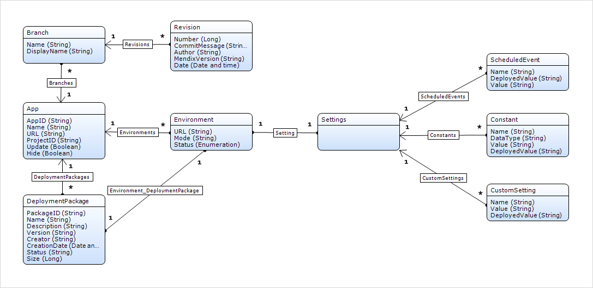

## 1 Introduction

The Deploy API allows you to manage application environments in the Mendix Cloud. You can retrieve the status of, and start and stop, applications. You can also configure new model versions and deploy them to application environments. To create and manage deployment packages you also need the [Build API](build-api). For backup-related actions refer to [Backups API](backups-api).

This image provides a domain model representation of the concepts discussed below and how these are related:



## 2 Authentication{#authentication}

The Deploy API requires authentication via API keys that are bound to your Mendix account (for more information, see [Authentication](authentication)).

As APIs are designed for automated systems, the Deploy API does not require the two-factor authentication which is normally required to make changes to production environments. This is a potential security risk. Therefore, the Technical Contact of an application needs to allow API access explicitly for team members that want to use the Deploy API. This can be configured from the **Node Security** screen under **Project Settings**. By default, API access is already enabled for test and acceptance environments for all team members. To perform an action via the Deploy API, such as transporting a new deployment package, both the **Transport** and **API Access** permissions need to be enabled.

## 3 API Calls

{}
Only _Retrieve apps_, _Create Free App Environment_ and _Retrieve app_ API calls are supported for Free Apps. Please note that most API calls — with the exception of _Upload Package_ — require that the _Content-Type_ header be set to _application/json_.
{}

### 3.1 Retrieve Apps{#list-apps}

#### 3.1.1 Description

Retrieves all licensed apps and Free Apps to which the authenticated user has access as a regular user.

{}
The [Nodes](/developerportal/apps-list/#nodes) screen in the Developer Portal shows all the licensed apps which are returned by this request, but does not show any Free Apps, while the [My Apps](/developerportal/apps-list/#my-apps) screen shows both licensed apps and Free Apps.
{}


```bash
HTTP Method: GET
URL: https://deploy.mendix.com/api/1/apps/
```

#### 3.1.2 Request

**Example Request**

```bash
GET /api/1/apps/ 
Host: deploy.mendix.com
Content-Type: application/json
Mendix-Username: richard.ford51@example.com
Mendix-ApiKey: 26587896-1cef-4483-accf-ad304e2673d6
```

#### 3.1.3 Output

List of objects with the following key-value pairs:

*   _AppId_ (String): Sub-domain name of the app.
*   _Name_ (String): Name of the app.
*   _ProjectId_ (String): Developer Portal Project identifier.
*   _Url_ (String): Production or Free App URL to access your app.

**Example Output**

```json
[{
    "Name": "Calculation App",
    "Url": "https://calc.mendixcloud.com",
    "ProjectId": "fae5de74-69c2-4488-a4de-abf89daac63e",
    "AppId": "calc"
},{
    "Name": "Tic Tac Toc",
    "Url": "https://tictactoc.mendixcloud.com",
    "ProjectId": "f5129445-b638-42f4-8108-5f370c85dc57",
    "AppId": "tictactoc"
}]
```

### 3.2 Create Free App Environment

#### 3.2.1 Description

Creates a Free App for a requested project id.

```bash
HTTP Method: POST
URL: https://deploy.mendix.com/api/1/apps/
```

#### 3.2.2 Request

**Request Parameter**

An object with the following key-value pair:

*   _ProjectId_ (String) : The Developer Portal project identifier that should be linked to the new Free App. This value can be found under **Settings** > **General**, and it is represented as **App ID**.

**Example Request**

```bash
POST /api/1/apps/ 
Host: deploy.mendix.com
Content-Type: application/json
Mendix-Username: richard.ford51@example.com
Mendix-ApiKey: 26587896-1cef-4483-accf-ad304e2673d6

{
     "ProjectId" :  "f5129445-b638-42f4-8108-5f370c85dc57"
}
```

#### 3.2.3 Output

Response object with the following fields:

*   _AppId_ (String): Sub-domain name of the app.
*   _Name_ (String): Name of the app.
*   _ProjectId_ (String): Developer Portal Project identifier.
*   _Url_ (String): Production or Free App URL to access your app.

**Error Codes**

| HTTP Status | Error code | Description |
| --- | --- | --- |
| 400 | INVALID_PROJECTID | Invalid ProjectId |
| 400 | APPLICATION_ALREADY_EXISTS | Application already exists |

**Example Output**

```json
{
    "Name": "Calculation App",
    "Url": "https://calc.mendixcloud.com",
    "ProjectId": "fae5de74-69c2-4488-a4de-abf89daac63e",
    "AppId": "calc"
}
```

### 3.3 Retrieve App

#### 3.3.1 Description

Retrieves a specific app to which the authenticated user has access as a regular user. This app can be found via the "Nodes overview" screen in the Mendix Platform.

```bash
HTTP Method: GET
URL: https://deploy.mendix.com/api/1/apps/<AppId>
```

#### 3.3.2 Request

**Request Parameter**

*   _AppId_ (String): Sub-domain name of an app.

**Example Request**

```bash
GET /api/1/apps/calc/ 
Host: deploy.mendix.com
Content-Type: application/json
Mendix-Username: richard.ford51@example.com
Mendix-ApiKey: 26587896-1cef-4483-accf-ad304e2673d6
```

#### 3.3.3 Output

Object with the following key-value pairs:

*   _AppId_ (String): Sub-domain name of the app.
*   _ProjectId_ (String): Developer Portal Project identifier.
*   _Name_ (String): Name of the app.
*   _Url_ (String): Production or Free App URL to access your app.

**Error Codes**

| HTTP Status | Error code | Description |
| --- | --- | --- |
| 400 | INVALID_APPID | Invalid AppId |
| 404 | APP_NOT_FOUND | App not found |

**Example Output**

```json
{
    "AppId": "calc",
    "ProjectId": "543857rfds-dfsfsd12c5e24-3224d32eg",
    "Url": "https://calc.mendixcloud.com",
    "Name": "Calculation App"
}
```

### 3.4 Retrieve Environments{#list-environments}

#### 3.4.1 Description

Retrieves all environments that are connected to a specific app to which the authenticated user has access as a regular user. These environments can be found via the "Nodes overview" screen in the Mendix Platform.

```bash
HTTP Method: GET
URL: https://deploy.mendix.com/api/1/apps/<AppId>/environments/
```

#### 3.4.2 Request

**Request Parameter**

*   _AppId_ (String): Subdomain name of an app.

**Example Request**

```bash
GET /api/1/apps/calc/environments/ 
Host: deploy.mendix.com

Content-Type: application/json
Mendix-Username: richard.ford51@example.com
Mendix-ApiKey:  26587896-1cef-4483-accf-ad304e2673d6
```

#### 3.4.3 Output

List of objects with the following key-value pairs:

*   _Status_ (String): Status of the environment. Possible values: Empty, Stopped, Running.
*   _EnvironmentId_ (String): Unique identifier of the environment.
*   _Url_ (String): URL to access your application.
*   _Mode_ (String): Mode of the environment. Possible values: Test, Acceptance, Production or the name of a [flexible environment](/developerportal/deploy/mendix-cloud-deploy#flexible-environments).
*   _ModelVersion_ (String): The version number of the package deployed in your environment.
*   _MendixVersion_ (String): The Mendix version number of the package deployed in your environment.
*   _Production_ (Boolean): A flag indicating if this environment is a production environment.

**Example Output**

```json
[
    {
        "Status" :  "Stopped" ,
        "EnvironmentId" :  "cd5fc610-edb0-43c5-a374-0439a6411ace",
        "Mode" :  "Acceptance",
        "Url" :  "https://calc-accp.mendixcloud.com",
        "ModelVersion" :  "1.1.0.253",
        "MendixVersion" :  "6.10.10",
        "Production" :  "false"

    },
    {
        "Status" :  "Stopped" ,
        "EnvironmentId" :  "867c9f56-84ec-438b-b1ae-9f9c50377cba",
        "Mode" :  "Production",
        "Url" :  "https://calc.mendixcloud.com",
        "ModelVersion" :  "175.0.0.3702",
        "MendixVersion" :  "6.10.12",
        "Production" :  "false"
    }
]
```

### 3.5 Retrieve Environment {#retrieve-environment}

#### 3.5.1 Description

Retrieves a specific environment that is connected to a specific app to which the authenticated user has access as a regular user. These environments can be found via the "Nodes overview" screen in the Mendix Platform.

```bash
HTTP Method: GET
URL: https://deploy.mendix.com/api/1/apps/<AppId>/environments/<Mode>
```

#### 3.5.2 Request

**Request Parameters**

*   _AppId_ (String): Subdomain name of an app.
*   _Mode_ (String): The mode of the environment of the app. An environment with this mode should exist.

**Example Request**

```bash
GET /api/1/apps/calc/environments/Acceptance 
Host: deploy.mendix.com
Content-Type: application/json
Mendix-Username: richard.ford51@example.com
Mendix-ApiKey: 26587896-1cef-4483-accf-ad304e2673d6
```

#### 3.5.3 Output

An object with the following key-value pairs:

*   _Status_ (String): Status of the environment. Possible values: Empty, Stopped, Running.
*   _EnvironmentId_ (String): Unique identifier of the environment.
*   _Url_ (String): URL to access your application.
*   _Mode_ (String): Mode of the environment. Possible values: Test, Acceptance, Production or the name of a [flexible environment](/developerportal/deploy/mendix-cloud-deploy#flexible-environments).
*   _ModelVersion_ (String): The version number of the package deployed in your environment.
*   _MendixVersion_ (String): The Mendix version number of the package deployed in your environment.
*   _Production_ (Boolean): A flag indicating if this environment is a production environment.


**Error Codes**

| HTTP Status | Error code | Description |
| --- | --- | --- |
| 400 | INVALID_PARAMETERS | Not enough parameters given. Please set AppId and Mode parameters. |
| 400 | INVALID_ENVIRONMENT | Could not parse environment mode 'mode'. Valid options are Test, Acceptance, Production or the name of a [flexible environment](/developerportal/deploy/mendix-cloud-deploy#flexible-environments). |
| 404 | ENVIRONMENT_NOT_FOUND | Environment not found. |

**Example Output**

```json
{
     "Status" :  "Stopped" ,
     "EnvironmentId" :  "cd5fc610-edb0-43c5-a374-0439a6411ace",
     "Mode" :  "Acceptance",
     "Url" :  "https://calc-accp.mendixcloud.com",
     "ModelVersion" :  "1.1.0.253",
     "MendixVersion" :  "6.10.10",
     "Production" :  "false",
     "RuntimeLayer": "v4.13.2"
}
```

{}
`RunTimeLayer` is available when the app is deployed using buildpack v4.13 and above.
{}

### 3.6 Start Environment {#start-environment}

#### 3.6.1 Description

Starts a specific environment that is connected to a specific app to which the authenticated user has access as a regular user. These environments can be found via the "Nodes overview" screen in the Mendix Platform.

```bash
HTTP Method: POST
URL: https://deploy.mendix.com/api/1/apps/<AppId>/environments/<Mode>/start
```

#### 3.6.2 Request

**Request Parameters**

An object with the following key-value pair:

*   _AutoSyncDb_ (Boolean) : Define whether the database should be synchronized automatically with the model during the start phase of the app. This is only applicable if your Mendix Cloud version is older than v4.

**Example Request**

```bash
POST /api/1/apps/calc/environments/Acceptance/start 
Host: deploy.mendix.com

Content-Type: application/json
Mendix-Username: richard.ford51@example.com
Mendix-ApiKey:  26587896-1cef-4483-accf-ad304e2673d6

{
     "AutoSyncDb" :  true
}
```

#### 3.6.3 Output

An object with the following key-value pairs:

*   _JobId_ (String): The identifier which can be used to track the progress of the start action

**Error Codes**

| HTTP Status | Error code | Description |
| --- | --- | --- |
| 400 | INVALID_APPID | Invalid AppId |
| 404 | APP_NOT_FOUND | App not found |
| 500 | NO_MDA_HAS_BEEN_DEPLOYED | Cannot start app. There is no MDA deployed. |
| 500 | APP_ALREADY_HAS_A_STARTING_JOB | Cannot start app. There is already a starting job id found. |
| 500 | ALREADY_STARTED | Cannot start app. App is already running. |

**Example Output**

```json
{
     "JobId" :  "02df2e50-0e79-11e4-9191-0800200c9a66" ,
}
```

### 3.7 Get Start Environment Status {#get-start-environment-status}

#### 3.7.1 Description

Retrieve the status of the start environment action.

```bash
HTTP Method: GET
URL: https://deploy.mendix.com/api/1/apps/<AppId>/environments/<Mode>/start/<JobId>
```

#### 3.7.2 Request

**Example Request**

```bash
GET /api/1/apps/calc/environments/Acceptance/start/02df2e50-0e79-11e4-9191-0800200c9a66 
Host: deploy.mendix.com

Content-Type: application/json
Mendix-Username: richard.ford51@example.com
Mendix-ApiKey:  26587896-1cef-4483-accf-ad304e2673d6
```

#### 3.7.3 Output

An object with the following key-value pair:

*   _Status_ (String): Possible values are Starting and Started

**Error Codes**

| HTTP Status | Error code | Description |
| --- | --- | --- |
| 400 | INVALID_PARAMETERS | Not enough parameters given. Please set AppId and Mode parameters. |
| 400 | INVALID_ENVIRONMENT | Could not parse environment mode 'mode'. Valid options are Test, Acceptance, Production or the name of a [flexible environment](/developerportal/deploy/mendix-cloud-deploy#flexible-environments). |
| 404 | ENVIRONMENT_NOT_FOUND | Environment not found |
| 404 | NO_SUCH_STARTJOB | Job not found. |
| 500 | NO_PACKAGE | Cannot start app. There should be a package configured for this environment. |
| 500 | ALREADY_LOCKED | Cannot start app. There is already a lock on this environment. |
| 500 | ALREADY_STARTED | Cannot start app. App is already running. |
| 500 | DB_SYNC_FAILED | Cannot start app. Synchronization of database failed. |
| 500 | INVALID_DB_STRUCTURE | Cannot start app. The database is out-of-sync with the model. Please set AutoSyncDb parameter to true to synchronize the database automatically on startup. |
| 500 | MISSING_CONSTANT | Cannot start app. Missing one or more constant values. |
| 500 | INSECURE_ADMIN_PASSWORD | Cannot start app. There is a user with administrator role with password '1'. This is not allowed. |
| 500 | STARTUP_ACTION_FAILED | Cannot start app. Startup action failed. |
| 500 | START_FAILED | Cannot start app: result (detail status) |

**Example Output**

```json
{
     "Status" :  "Starting" ,
}
```

### 3.8 Stop Environment {#stop-environment}

#### 3.8.1 Description

Stops a specific environment that is connected to a specific app to which the authenticated user has access as a regular user. These environments can be found via the "Nodes overview" screen in the Mendix Platform.

```bash
HTTP Method: POST
URL: https://deploy.mendix.com/api/1/apps/<AppId>/environments/<Mode>/stop
```

#### 3.8.2 Request

**Example Request**

```bash
POST /api/1/apps/calc/environments/Acceptance/stop 
Host: deploy.mendix.com

Content-Type: application/json
Mendix-Username: richard.ford51@example.com
Mendix-ApiKey:  26587896-1cef-4483-accf-ad304e2673d6
```

#### 3.8.3 Output

**Error Codes**

| HTTP Status | Error code | Description |
| --- | --- | --- |
| 400 | INVALID_PARAMETERS | Not enough parameters given. Please set AppId and Mode parameters. |
| 400 | INVALID_ENVIRONMENT | Could not parse environment mode 'mode'. Valid options are Test, Acceptance, Production or the name of a [flexible environment](/developerportal/deploy/mendix-cloud-deploy#flexible-environments). |
| 404 | ENVIRONMENT_NOT_FOUND | Environment not found |
| 500 | STOP_FAILED | Cannot stop app: reason |

### 3.9 Retrieve Environment Package {#retrieve-environment-package}

#### 3.9.1 Description

Retrieves the deployed package of a specific environment that is connected to a specific app to which the authenticated user has access as a regular user. These environments can be found via the "Nodes overview" screen in the Mendix Platform.

```bash
HTTP Method: GET
URL: https://deploy.mendix.com/api/1/apps/<AppId>/environments/<Mode>/package
```

#### 3.9.2 Request

**Request Parameters**

*   _AppId_ (String): Sub-domain name of an app.
*   _Mode_ (String): The mode of the environment of the app. An environment with this mode should exist.

**Example Request**

```bash
GET /api/1/apps/calc/environments/Acceptance/package 
Host: deploy.mendix.com

Content-Type: application/json
Mendix-Username: richard.ford51@example.com
Mendix-ApiKey:  26587896-1cef-4483-accf-ad304e2673d6
```

#### 3.9.3 Output

An object with the following key-value pairs:

*   _PackageId_ (String): Unique identification of the package.
*   _Name_ (String): Name of the package.
*   _Description_ (String): Description of the package.
*   _Version_ (String): Package version. This is also the name of the tag on the project teamserver.
*   _Creator_ (String): Uploader or creator of this package.
*   _CreationDate_ (Date): Date that the package became available in the portal. This can be the
    upload date or the date that a build was created in the portal.
*   _Status_ (String): Status of the package. A package is ready to use if the status is 'Succeeded'.
    Possible values: Succeeded, Queued, Building, Uploading and Failed.
*   _Size_ (Long): Size of the package in bytes.

**Error Codes**

| HTTP Status | Error code | Description |
| --- | --- | --- |
| 400 | INVALID_PARAMETERS | Not enough parameters given. Please set AppId and Mode parameters. |
| 400 | INVALID_ENVIRONMENT | Could not parse environment mode 'mode'. Valid options are Test, Acceptance, Production or the name of a [flexible environment](/developerportal/deploy/mendix-cloud-deploy#flexible-environments). |
| 404 | PACKAGE_NOT_FOUND | No package found for this environment |

**Example Output**

```json
{
     "Status" :  "Succeeded",
     "CreationDate" :  1404990271835,
     "ExpiryDate": null,
     "Description" :  "Add scientific mode" ,
     "Version" :  "2.5.4.63" ,
     "Size" :  3.0571174621582031,
     "PackageId" :  "b3d14e53-2654-4534-b374-9179a69ef3cf" ,
     "Creator" :  "Richard Ford" ,
     "Name" :  "Main line-2.5.4.63.mda"
}
```

### 3.10 Upload Package

#### 3.10.1 Description

Uploads a deployment package from the local system to a specific app. This package can then be transported to a specific environment for deployment.

```bash
HTTP Method: POST
URL: https://deploy.mendix.com/api/1/apps/<AppId>/packages/upload
```

#### 3.10.2 Request

**Request Parameters**

*   _AppId_ (String): Subdomain name of an app.
*   _Name_ (String): Name of the deployment package as query parameter
*   _file_ (File): Deployment package as multipart/form-data (see [IETF RFC 7578: Returning Values from Forms: multipart/form-data](https://tools.ietf.org/html/rfc7578))

**Example Request**

<!--Check this is correct -->

```bash
POST /api/1/apps/calc/packages/upload 
Host: deploy.mendix.com

Mendix-Username: richard.ford51@example.com
Mendix-ApiKey:  26587896-1cef-4483-accf-ad304e2673d6
Content-Type: multipart/form-data; boundary=MultipartBoundary

--MultipartBoundary
Content-Disposition: form-data; name="calc_1.0.0.45.mda"

@%USERPROFILE%/Documents/Mendix/calc-main/releases/calc_1.0.0.45.mda
--MultipartBoundary--
```

Curl example:
```bash
curl -v -F "file=@%USERPROFILE%/Documents/Mendix/calc-main/releases/calc_1.0.0.45.mda"  -X POST -H "Mendix-Username: richard.ford51@example.com" -H "Mendix-ApiKey: 26587896-1cef-4483-accf-ad304e2673d6" "https://deploy.mendix.com/api/1/apps/calc/packages/upload"
```

#### 3.10.3 Output

**Error Codes**

| HTTP Status | Error code | Description |
| --- | --- | --- |
| 400 | INVALID_APPID | Invalid AppId. |
| 404 | APP_NOT_FOUND | App not found. |
| 500 | UPLOAD_COPY_FAILED | Failed to store the deployment package. |
| 500 | INVALID_PACKAGE | Failed to process the deployment package. |

### 3.11 Transporting a Deployment Package to an Environment {#transport-deployment-package}

#### 3.11.1 Description

Transports a specific deployment package to a specific environment. This action requires the environment to be in the status *NotRunning*.

This call is not available for Free App. For a Free App, the Build API can be used to trigger a deployment.

```bash
HTTP Method: POST
URL: https://deploy.mendix.com/api/1/apps/<AppId>/environments/<Mode>/transport
```

#### 3.11.2 Request

**Request Parameters**

*   _AppId_ (String): Sub-domain name of an app.
*   _Mode_ (String): Mode of the environment. Possible values: Test, Acceptance, Production or the name of a [flexible environment](/developerportal/deploy/mendix-cloud-deploy#flexible-environments).
*   _PackageId_ (String): ID of the deployment package

**Example Request**

```bash
POST /api/1/apps/calc/environments/acceptance/transport 
Host: deploy.mendix.com

Content-Type: application/json
Mendix-Username: richard.ford51@example.com
Mendix-ApiKey:  26587896-1cef-4483-accf-ad304e2673d6

{
     'PackageId' :  'b3d14e53-2654-4534-b374-9179a69ef3cf'
}
```

#### 3.11.3 Output

**Error Codes**

| HTTP Status | Error code | Description |
| --- | --- | --- |
| 400 | INVALID_PARAMETERS | Not enough parameters given. Please set AppId and Mode parameters. |
| 400 | INVALID_ENVIRONMENT | Could not parse environment mode 'mode'. Valid options are Test, Acceptance, Production or the name of a [flexible environment](/developerportal/deploy/mendix-cloud-deploy#flexible-environments). |
| 400 | INVALID_RUNTIME_VERSION | This Runtime version is not supported on this environment. (For Mendix Cloud v4, using a Mendix version of 6 or newer is required.) |
| 403 | NO_ACCESS | You do not have access |
| 403 | TRANSPORT_NOT_ALLOWED | No access to transport to environment 'mode'. |
| 403 | APP_IS_RUNNING | The 'mode' environment of 'app id' must be stopped to do transport. |
| 404 | ENVIRONMENT_NOT_FOUND | Environment not found. |
| 404 | PACKAGE_NOT_FOUND | Package not found. |
| 500 | PACKAGE_PARSE_FAILED | Failed to parse deployment package file. |

### 3.12 Clean environment

#### 3.12.1 Description

Removes all data from a specific environment: including files and database records. This action requires the environment to be in the status *NotRunning*.

```bash
HTTP Method: POST
URL: https://deploy.mendix.com/api/1/apps/<AppId>/environments/<Mode>/clean
```

#### 3.12.2 Request

**Request Parameters**

*   _AppId_ (String): Sub-domain name of an app.
*   _Mode_ (String): Mode of the environment. Possible values: Test, Acceptance, Production or the name of a [flexible environment](/developerportal/deploy/mendix-cloud-deploy#flexible-environments).

**Example Request**

```bash
POST /api/1/apps/calc/environments/acceptance/clean 
Host: deploy.mendix.com

Content-Type: application/json
Mendix-Username: richard.ford51@example.com
Mendix-ApiKey:  26587896-1cef-4483-accf-ad304e2673d6
```

#### 3.12.3 Output

**Error Codes**

| HTTP Status | Error code | Description |
| --- | --- | --- |
| 400 | INVALID_PARAMETERS | Not enough parameters given. Please set AppId and Mode parameters. |
| 400 | INVALID_ENVIRONMENT | Could not parse environment mode 'mode'. Valid options are Test, Acceptance, Production or the name of a [flexible environment](/developerportal/deploy/mendix-cloud-deploy#flexible-environments). |
| 403 | ENVIRONMENT_NOT_STOPPED | Environment needs to be stopped. |
| 404 | ENVIRONMENT_NOT_FOUND | Environment not found. |
| 500 | ENVIRONMENT_CLEAN_FAILED | Unable to clean the environment. Please contact support. |

**Example Output**

```json
[
    {
        "Status": "Stopped",
        "Mode": "Acceptance",
        "Url" : "https://calc-accp.mendixcloud.com"
    }
]
```

### 3.13 Retrieve Environment Settings

#### 3.13.1 Description

Gets the current values of custom settings, constants, and scheduled events used by the target environment.

```bash
HTTP Method: GET
URL: https://deploy.mendix.com/api/1/apps/<AppId>/environments/<Mode>/settings
```

#### 3.13.2 Request

**Request Parameters**

*   _AppId_ (String): Sub-domain name of an app.
*   _Mode_ (String): Mode of the environment. Possible values: Test, Acceptance, Production or the name of a [flexible environment](/developerportal/deploy/mendix-cloud-deploy#flexible-environments).

**Example Request**

```bash
GET /api/1/apps/calc/environments/acceptance/settings/ 
Host: deploy.mendix.com

Content-Type: application/json
Mendix-Username: richard.ford51@example.com
Mendix-ApiKey:  26587896-1cef-4483-accf-ad304e2673d6
```

#### 3.13.3 Output

**Error Codes**

| HTTP Status | Error code | Description |
| --- | --- | --- |
| 400 | INVALID_PARAMETERS | Not enough parameters given. Please set AppId and Mode parameters. |
| 400 | INVALID_ENVIRONMENT | Could not parse environment mode 'mode'. Valid options are Test, Acceptance, Production or the name of a [flexible environment](/developerportal/deploy/mendix-cloud-deploy#flexible-environments). |
| 404 | ENVIRONMENT_NOT_FOUND | Environment not found. |

**Example Output**

```json
{
     "Constants" : [{
         "Name" :  "MyFirstModule.BooleanConstant" ,
         "DataType" :  "_Boolean" ,
         "Value" :  "false" ,
         "DeployedValue" :  "false"
     },{
         "Name" :  "MyFirstModule.DateTime" ,
         "DataType" :  "DateTime" ,
         "Value" :  "2013-12-20T16:02:32" ,
         "DeployedValue" :  "2013-12-20T16:02:32"
     }],
     "CustomSettings" : [],
     "ScheduledEvents" : [{
         "Name" :  "MyFirstModule.Monitor_Scheduled_event" ,
         "DeployedValue" :  "Disabled" ,
         "Value" :  "Disabled"
     }]
}
```

### 3.14 Set Environment Settings

#### 3.14.1 Description

Changes the values of existing environment settings like custom settings, constants, and scheduled events. These changes are applied after restarting the environment.

```bash
HTTP Method: POST
URL: https://deploy.mendix.com/api/1/apps/<AppId>/environments/<Mode>/settings/
```

#### 3.14.2 Request

**Request Parameters**

*   _AppId_ (String): Subdomain name of an app.
*   _Mode_ (String): Mode of the environment. Possible values: Test, Acceptance, Production or the name of a [flexible environment](/developerportal/deploy/mendix-cloud-deploy#flexible-environments).
*   _Body_: JSON collection retrieved with GET method at the same URI

**Example Request**

```json
POST /api/1/apps/calc/environments/acceptance/settings/ 
Host: deploy.mendix.com

Content-Type: application/json
Mendix-Username: richard.ford51@example.com
Mendix-ApiKey:  26587896-1cef-4483-accf-ad304e2673d6

{
     "Constants" : [{
         "Name" :  "MyFirstModule.BooleanConstant" ,
         "DataType" :  "_Boolean" ,
         "Value" :  "true" ,
         "DeployedValue" :  "false"
     },{
         "Name" :  "MyFirstModule.DateTime" ,
         "DataType" :  "DateTime" ,
         "Value" :  "2013-12-20T16:02:32" ,
         "DeployedValue" :  "2013-12-20T16:02:32"
     }],
     "CustomSettings" : [],
     "ScheduledEvents" : [{
         "Name" :  "MyFirstModule.Monitor_Scheduled_event" ,
         "DeployedValue" :  "Disabled" ,
         "Value" :  "Enabled"
     }]
}
```

#### 3.14.3 Output

**Error Codes**

| HTTP Status | Error code | Description |
| --- | --- | --- |
| 400 | INVALID_PARAMETERS | Not enough parameters given. Please set AppId and Mode parameters. |
| 400 | INVALID_ENVIRONMENT | Could not parse environment mode 'mode'. Valid options are Test, Acceptance, Production or the name of a [flexible environment](/developerportal/deploy/mendix-cloud-deploy#flexible-environments). |
| 400 | CONSTANT_NOT_FOUND | Constant not found: constant name. |
| 400 | CUSTOM_SETTING_NOT_SUPPORTED | Custom setting not supported. |
| 400 | SCHEDULED_EVENT_NOT_FOUND | Scheduled Event not found: scheduled event name. |
| 404 | ENVIRONMENT_NOT_FOUND | Environment not found. |
| 500 | INVALID_SCHEDULED_EVENT_PARAMETER | Scheduled Event parameter should be Enabled or Disabled. |

**Example Output**

```json
{
     "Constants" : [{
         "Name" :  "MyFirstModule.BooleanConstant" ,
         "DataType" :  "_Boolean" ,
         "Value" :  "true" ,
         "DeployedValue" :  "false"
     },{
         "Name" :  "MyFirstModule.DateTime" ,
         "DataType" :  "DateTime" ,
         "Value" :  "2013-12-20T16:02:32" ,
         "DeployedValue" :  "2013-12-20T16:02:32"
     }],
     "CustomSettings" : [],
     "ScheduledEvents" : [{
         "Name" :  "MyFirstModule.Monitor_Scheduled_event" ,
         "DeployedValue" :  "Disabled" ,
         "Value" :  "Enabled"
     }]
}
```

### 3.15 Scaling Environments (Mendix Cloud v4 Only)

#### 3.15.1 Description

Scale memory and instances of an environment. Only those environments that run a package that has Mendix Runtime version 7 or above will make it possible to spread the total memory over multiple instances.

Environments with a deployed runtime package below version 7 can only be scaled horizontally: that is, with one fixed instance but an adjustable amount of memory.

```bash
HTTP Method: POST
URL: https://deploy.mendix.com/api/1/apps/<AppId>/environments/<Mode>/scale
```

#### 3.15.2 Request

**Request Parameters**

*   _AppId_ (String): Subdomain name of an app.
*   _Mode_ (String): Mode of the environment. Possible values: Test, Acceptance, Production or the name of a [flexible environment](/developerportal/deploy/mendix-cloud-deploy#flexible-environments).

**Example Request**

```bash
POST /api/1/apps/calc/environments/acceptance/scale/0c982ca3-621f-40e9-9c6e-96492934170a 
Host: deploy.mendix.com

Content-Type: application/json
Mendix-Username: richard.ford51@example.com
Mendix-ApiKey:  26587896-1cef-4483-accf-ad304e2673d6

{
	Instances: 2,
	MemoryPerInstance: 2048,
}
```

#### 3.15.3 Output

**Error Codes**

| HTTP Status | Error code | Description |
| --- | --- | --- |
| 400 | INVALID_REQUEST | You have allocated more memory than is available under your plan. Please contact support to upgrade your plan. |
| 400 | INVALID_REQUEST | Memory per instance cannot be smaller than 1024MB.|
| 400 | NOT_ALLOWED| Horizontal scaling (to multiple instances) is only available for apps with Mendix version >=7. Please upgrade to activate this functionality. |
| 400 | NOT_ALLOWED| Scaling is only available for paid apps on Mendix Cloud v4. Please contact support to upgrade to the v4 Cloud to access this functionality. |
| 404 | ENVIRONMENT_NOT_FOUND | Environment not found. |

**Example Output**

```json
{
    "Status": "Running",
    "Instances": 2,
    "Mode": "Acceptance",
    "Production": false,
    "MemoryPerInstance": 2048,
    "TotalMemory": 8192,
    "ModelVersion": "1.1.0.253",
    "MendixVersion": "7.5.0",
    "Url": "https://calc.mendixcloud.com"
}
```

### 3.16 Create Environment Tags (Mendix Cloud v4 Only)

#### 3.16.1 Description

Tags are arbitrary strings that are not interpreted by the Developer Portal. Users are able to set tags on environments. Tags serve two purposes:

* Custom tags can be added to metrics (for Datadog)
* Tags can serve as selection criteria for grouping environments into a landscape management dashboard

```bash
HTTP Method: POST
URL: https://deploy.mendix.com/api/1/apps/<AppId>/environments/<Mode>/tags
```

#### 3.16.2 Request

**Request Parameters**

- _AppId_ (String): Subdomain name of an app.
- _Mode_ (String): Mode of the environment. Possible values: Test, Acceptance, Production or the name of a [flexible environment](/developerportal/deploy/mendix-cloud-deploy#flexible-environments).

**Example Request**

```bash
POST /api/1/apps/calc/environments/acceptance/tags
Host: deploy.mendix.com

Content-Type: application/json
Mendix-Username: richard.ford51@example.com
Mendix-ApiKey:  26587896-1cef-4483-accf-ad304e2673d6

{
	"Tag": "europe"
}
```

#### 3.16.3 Output

**Error Codes**

| HTTP Status | Error code | Description                         |
| ----------- | ---------- | ----------------------------------- |
| 404         | NOT_FOUND  | An App or Environment is not found. |

**Example Output**

```json
{
    "Tag": "A"
}
```

### 3.17 Retrieve Environment Tags (Mendix Cloud v4 Only)

#### 3.17.1 Description

Gets current values of environment tags.

```bash
HTTP Method: GET
URL: https://deploy.mendix.com/api/1/apps/<AppId>/environments/<Mode>/tags
```

#### 3.17.2 Request

**Request Parameters**

- _AppId_ (String): Subdomain name of an app.
- _Mode_ (String): Mode of the environment. Possible values: Test, Acceptance, Production or the name of a [flexible environment](/developerportal/deploy/mendix-cloud-deploy#flexible-environments).

**Example Request**

```bash
GET /api/1/apps/calc/environments/acceptance/tags
Host: deploy.mendix.com

Content-Type: application/json
Mendix-Username: richard.ford51@example.com
Mendix-ApiKey:  26587896-1cef-4483-accf-ad304e2673d6

```

#### 3.17.3 Output

**Error Codes**

| HTTP Status | Error code | Description                         |
| ----------- | ---------- | ----------------------------------- |
| 404         | NOT FOUND  | An App or Environment is not found. |

**Example Output**

```json
{
    "Tag": "A"
}
```

### 3.18 Delete Environment Tags (Mendix Cloud v4 Only)

#### 3.18.1 Description

Deletes the current value of environment tags.

```bash
HTTP Method: DELETE
URL: https://deploy.mendix.com/api/1/apps/<AppId>/environments/<Mode>/tags
```

#### 3.18.2 Request

**Request Parameters**

- _AppId_ (String): Subdomain name of an app.
- _Mode_ (String): Mode of the environment. Possible values: Test, Acceptance, Production or the name of a [flexible environment](/developerportal/deploy/mendix-cloud-deploy#flexible-environments).

**Example Request**

```bash
DELETE /api/1/apps/calc/environments/acceptance/tags
Host: deploy.mendix.com

Content-Type: application/json
Mendix-Username: richard.ford51@example.com
Mendix-ApiKey:  26587896-1cef-4483-accf-ad304e2673d6
{
    "Tag": "A"
}
```

#### 3.18.3 Output

**Response Code**

| HTTP Status | Error code | Description                                                  |
| ----------- | ---------- | ------------------------------------------------------------ |
| 204         | No Content | The tag has been removed  or the response is empty or Tag not found |

**Error Code**

| HTTP Status | Error code | Description                         |
| ----------- | ---------- | ----------------------------------- |
| 404         | NOT FOUND  | An App or Environment is not found. |

**Example Output**

```json
[]
```

### 3.19 Download Archived Logs for a Specific Date (Mendix Cloud v4 Only)

#### 3.19.1 Description

Downloads archived logs for a specific date.

```bash
HTTP Method: GET
URL: https://deploy.mendix.com/api/1/apps/<AppId>/environments/<Mode>/logs/<Date>(YYYY-MM-DD)
```

#### 3.19.2 Request

**Request Parameters**

- _AppId_ (String): Subdomain name of an app.
- _Mode_ (String): Mode of the environment. Possible values: Test, Acceptance, Production or the name of a [flexible environment](/developerportal/deploy/mendix-cloud-deploy#flexible-environments).
- _Date_ (String): Date of the desired log (YYYY-MM-DD).

* If *Date* is tomorrow or after, or before the date the app was created, the log will contain the response `[No data found in file and no logging heartbeat detected]`

{}
* Under some circumstances, if *Date* is tomorrow's date the log will be *empty* and the **REST response** will contain `[No data found in file and no logging heartbeat detected]` — the cause of this is being investigated
{}

**Example Request**

```bash
GET /api/1/apps/calc/environments/acceptance/logs/2018-08-10
Host: deploy.mendix.com 

Content-Type: application/json
Mendix-Username: richard.ford51@example.com
Mendix-ApiKey:  26587896-1cef-4483-accf-ad304e2673d6
```

#### 3.19.3 Output

**Error Codes**

| HTTP Status | Error code | Description                         |
| ----------- | ---------- | ----------------------------------- |
| 404         | NOT FOUND  | An App or Environment is not found. |
| 403 | FORBIDDEN | You do not have access |

**Example Output**

```
{
    "Environment": "38471410-861f-47e5-8efc-2f4b16f04005",
    "Date": 1536451200000,
    "DownloadUrl": "https://boobafina.test.mendix.com/v1/logs/38471410-861f-47e5-8efc-2f4b16f04005?endDate=2018-09-09&expire=20180810153345&startDate=2018-08-10&signature=893DC8D3EAB0372FF49DB0E2D6973C701D32B567B67E97A41FD9E53E4D957991F80E3AC83B29452AF205FC306C51EAE8D81BA19F82147E5147B72EE15A8AC11FD3BE0306C3SDADAF478CCC9B98B9CBE70F99C99EDFB4DC77020F44FE540847FBABED34ACE856878F908EB38AC35D03125E7EFC9AE5CC2A67B871FA36C9F48A022BC7905838DE67046B5E57E82C0FBDCDFF67456DD66A2C2B4642B7B34C2829730257818B53113B620057777496EBA6D823EAA58378357A7F6ADA4956B6D86C100D61C8AD3483961A2C5EBEFF35A27BDE230478186F9F4ABC6207684781F"
}
```
