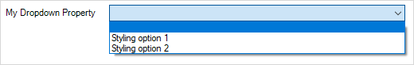

## 1 Introduction

The Mendix Design Properties API allows you to make custom design properties for your Mendix projects.

To use the API, you need to alter the *JSON* files in your application's **theme** folder. This process is described in the [Design Properties Definitions](#design-properties-definitions) section below.

This guide outlines how design properties work and can help you create custom design properties. Many projects can simply use the Atlas UI theme and its included set of design properties to satisfy their styling needs. Atlas UI provides design properties that are built on top of the functionality described in this guide. So while design properties from Atlas UI are used as examples below, design properties themselves are not only for the Atlas UI theme. In fact, if you want to customize your styling more deeply, you will have to create your own custom design properties.

Design properties are a special set of settings shipped together with a Mendix theme module. Design properties are shared among all the Mendix apps which use a specific theme module. 

In Studio Pro, you can see which design properties are available for a widget either in the **Properties** pane or in the widget's settings dialog box under the **Appearance** tab. 

In Studio, you can see design properties in the **Design** section of a widget's properties pane (for more information, see the [Design Section Reference Guide](/studio/page-editor-widgets-design-section)).

## 2 Using Design Properties

While styling Mendix apps, users must often apply the same set of CSS or native styling classes to widgets on different pages again and again. This work is time consuming and vulnerable to human error as you edit text fields in order to apply classes to a widget.

Design properties can make this work easier and safer. By configuring your own custom design properties, a certain styling can be applied to a widget in a few clicks.

{}
Mendix Studio does not have any class editing interface. This means that in Studio, design properties are the only way to alter the visual behavior of a certain element.
{}

## 3 Design Property Types

There are two types of design properties: **Toggle** and **Dropdown**. By default design properties have no effect on widgets. Styling is only applied when a **Toggle** property is turned on for a widget, or when one of the options is selected for a **Dropdown** property.

A **Toggle** design property is a simple property which may be turned on for a widget. When this property is set, configured classes are applied to a widget automatically. For example, a **Toggle** property may be a **Full width** property for Atlas UI button widgets. When this property is set for a button, then the `btn-block` CSS class is applied. No additional classes are applied if property is not set.

A design property of type **Dropdown** defines a set of options with separate classes per option. When one of the options is selected, the respective classes are applied to a widget. For example, a **Dropdown** property may be an Atlas UI **Align self** property. It contains two options: **Left** and **Right**. When one of these options is selected, then either the `pull-left` or `pull-right` CSS class is applied. 

## 4 Design Properties Definitions {#design-properties-definitions}

Design properties are defined as a part of the theme settings inside your app's **theme** folder. Since styling works differently for web and native platforms, each platform's design properties are different and defined in two separate files. Web styling is defined in the *settings.json* file. Native styling is defined in the *settings-native.json* file.

Since both *settings.json* and *settings-native.json* are *JSON* files, their design properties are defined in the *JSON* format as a part of those files.

Here is a simplified example of a theme settings file with design properties:

```js
{
    "pageTemplates": "WebModeler",
    "cssFiles": [ ... ],
    "designProperties": {
        "DivContainer": [
            {
                "name": "My Toggle Property",
                "type": "Toggle",
                "description": "Description of My Toggle Design Property",
                "class": "hereMyClass"
            },
            {
                "name": "My Dropdown Property",
                "type": "Dropdown",
                "description": "Description of My Dropdown Design Property",
                "options": [
                    {
                        "name": "Styling option 1",
                        "class": "stylingClassOne"
                    },
                    {
                        "name": "Styling option 2",
                        "class": "stylingClassTwo"
                    }
                ]
            }
        ],
        "Button": [
            ...
        ]
    }
}
```

### 4.1 Design Property Structure

In the previous section's example, design properties are defined as a *JSON* object under key `designProperties` inside of a theme settings file. That object's structure is as follows:

```js
{
    "DivContainer": [
        {
            ... property one
        },
        {
            ... property two
        }
    ],
    "Button": [
        ...
    ]
}
```

As you can see from the structure above, design properties are defined as a *JSON* object where keys (`DivContainer` and `Button` for example) are widget types and values are *JSON* arrays containing sets of design properties applicable for that widget type. To learn more about this subject, see the [Widget Types](#widget-types) section below. Note that you can add multiple class names in a property.

Every design property from the array is also represented as a *JSON* object. As described earlier there are two types of design properties: **Toggle** and **Dropdown**. Both types share common fields such as `name`, `type`, and `description`. Those names determine how a design property appears to a user in Mendix Studio and Mendix Studio Pro. Below you can look at examples of design properties of both types and check how they look in the Studios.

Here is an example of a **Toggle** design property:

```js
{
    "name": "My Toggle Property",
    "type": "Toggle",
    "description": "Description of My Toggle Design Property",
    "class": "hereMyClass"
}
```

This is how the **Toggle** design property appears:


Here is an example of a **Dropdown** design property:

```js
{
    "name": "My Dropdown Property",
    "type": "Dropdown",
    "description": "Description of My Dropdown Design Property",
    "options": [
        {
            "name": "Styling option 1",
            "class": "stylingClassOne"
        },
        {
            "name": "Styling option 2",
            "class": "stylingClassTwo"
        }
    ]
}
```

This is how the **Dropdown** design property appears:




#### 4.1.1 Common Fields

The examples above show that the fields `name` and `description` define the UI, the name of a form control in Studio Pro, and the description under it. They are arbitrary string values naming and describing a design property. 

Field `type` defines the type of a property and can only take one of the two string values: `Toggle` or `Dropdown`.

{}
Name your design property and its options carefully. Those names cannot be changed easily when there are projects already using them. If you want to rename a design property which is already being used in a project, see the [Renaming Design Properties](#old-names) section below.
{}

#### 4.1.2 Toggle-Specific Fields

When a type of design property is **Toggle** it should contain a `class` field on the top level of its property definition. This field defines an arbitrary class name to be applied if the option is toggled on for a widget. In the example above, the class to be applied is `hereMyClass`.

#### 4.1.3 Dropdown-Specific Fields

When a type of design property is **Dropdown** it should contain an `options` field which is an array of possible options for the design property. Every option must be an object with `name` and `class` fields. In the example above there are two options named **Styling option 1** and **Styling option 2**. They have the `stylingClassOne` and `stylingClassTwo` classes respectively.

## 5 Widget Types{#widget-types}

When defining design properties in your theme settings you must specify which widget your properties apply to, as some design properties may only work with certain widgets.

{}
Having a property that applies a table appearance style like **Stripped**, **Bordered**, or **Lined** only makes sense for widgets that contain tables, for example a data grid widget.
{}

Widget types are types defined in the [Model SDK](https://apidocs.rnd.mendix.com/modelsdk/latest/modules/pages.html) documentation. Every type which is a direct or an indirect subtype of type [`Widget`](https://apidocs.rnd.mendix.com/modelsdk/latest/classes/pages.widget.html) can have design properties attached to it. If a property is defined on a widget, then every subtype of this widget will have that property. For example if a property is defined on a `Widget` type, which is it the highest type in the hierarchy, then every widget will have this design property available.

### 5.1 Widget Types for Pluggable Widgets

When creating design properties for [Pluggable Widgets](pluggable-widgets), their widget type is determined by [widget id](https://docs.mendix.com/apidocs-mxsdk/apidocs/pluggable-widgets#widget-id).

## 6 Renaming Design Properties{#old-names}

Sometimes you must rename design properties or their options which are already in use. As design properties are identified by names internally, renaming one may be a breaking change for projects that are already using those design properties. 

To prevent errors and offer users simple upgrade paths, use an `oldNames` field. This field must be of type array and contain old names, a particular property, or an option that was known and used before. The order of old names in an `oldNames` list does not matter. For instance, if a property was renamed twice, the `oldNames` field should contain both previous names.

Example of a property and options that were renamed:

```js
{
    "name": "My Dropdown Property",
    "oldNames": ["my Dropdown Propery"],
    "type": "Dropdown",
    "description": "Description of My Dropdown Design Property",
    "options": [
        {
            "name": "Styling option one",
            "class": "stylingClassOne"
        },
        {
            "name": "Styling option two",
            "oldNames": ["Stling option 2", "Styling option 2"],
            "class": "stylingClassTwo"
        }
    ]
}
```

The design property above was renamed from **my Dropdown Propery** to **My Dropdown Property**. Also **Styling option two** was renamed twice from the old names **Stling option 2** and **Styling option 2**.

## 7 Read More

* [How to Style Your Mendix App](/howto/mobile/how-to-use-native-styling)
* [Native Styling Reference Guide](/refguide/native-styling-refguide)
* [How to Extend Design Properties to Customize Your Studio Experience](/howto/front-end/extend-design-properties-to-customize)
