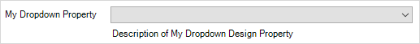

## 1 What this document is about?

This guide explains design properties in details. Mendix ships Atlas UI theme together with extensive set of mostly used design properties. They cover many scenarios and cover majority of use cases.
Use this document if you want to create custom design properties or you are interested in how design properties work.


## 2 Why design properties?

While styling Mendix apps users often face a situation when they have to apply same set of CSS or native styling classes to widgets on different pages again and again. This work is time consuming and it also error prone as the user has to edit text fields in order to apply classes to a widget. For example if during a maintenance the app has to be restyled to make some widgets look differently then certain classes have to be added, removed or replaced manually. Design properties can make this work much easier. With per-configured design properties a certain styling can be applied to a widget in a few mouse clicks.


## 3 What are design properties?

Design properties is a special set of settings shipped together with a Mendix theme module. This way design properties are shared among Mendix apps which use that theme module. The user can see design properties available for a widget in Properties pane or in the settings dialog of the widget under **Appearance** tab. 


## 4 Design property types

There are two types of design properties, **Toggle** and **Dropdown**. By default design properties have no effect on widgets, styling is only applied when a **Toggle** property is toggled on(switched on, set, put to Yes?) for a widget; or when one of the options is selected for a **Dropdown** property is selected.

A design property of type **Toggle** is a simple property which may be set (switched on?) for a widget. When this property is set, then configured classes applied to a widget automatically.

{}
Example of a **Toggle** property may be **Full width** property for button widgets from Atlas UI. When this property is set for a button, then `btn-clock` CSS class is applied. No additional classes applied when property is not set.
{}

A design property of type **Dropdown** defines set of options with separate classes per option. When one of the options is selected, respective classes are applied to a widget.

{}
Example of a **Dropdown** property may be **Align self** property from Atlas UI. It contains two options, **Left** and **Right**. When one of the options is selected then CSS class `pull-left` or `pull-right` is applied respectively. 
{}

## 5 How design properties are defined?

Design properties are defined as a part theme settings inside of `theme` folder in your app. Since styling works differently for web and native platforms design properties for them are also different and defined in two separate files. For web it is `settings.json`. For native it is `settings-native.json`.

Since both `settings.json` and `settings-native.json` are JSON files hence design properties are also defined in JSON format as a part of those files.

A simplified example of a theme settings file with design properties is as follows:
```js
{
    "pageTemplates": "WebModeler",
    "cssFiles": [ ... ],
    "designProperties": {
        "DivContainer": [
            {
                "name": "My Toggle Property",
                "type": "Toggle",
                "description": "Description of My Toggle Design Property",
                "class": "hereMyClass"
            },
            {
                "name": "My Dropdown Property",
                "type": "Dropdown",
                "description": "Description of My Dropdown Design Property",
                "options": [
                    {
                        "name": "Styling option 1",
                        "class": "stylingClassOne"
                    },
                    {
                        "name": "Styling option 2",
                        "class": "stylingClassTwo"
                    }
                ]
            }
        ],
        "Button": [
            ...
        ]
    }
}
```

### 5.1 Structure of design properties

In the example above you can see that design properties are defined as a JSON object under key `designProperties` inside of a theme settings file. Lets take a closer look at the structure of that object:
```js
{
    "DivContainer": [
        {
            ... property one
        },
        {
            ... property two
        }
    ],
    "Button": [
        ...
    ]
}
```

As you can see from the structure above design properties are defined as an JSON object where keys (`DivContainer`, `Button`, etc) are widget types, and values are JSON arrays containing set of design properties applicable for that widget type. See more about [Widget Types](#widget-types). Every design property from the array is also represented as a JSON object. As described earlier there are two types of design properties: **Toggle** and **Dropdown**. Both types share common fields as `name`, `type` and `description`. Those names determine how design property appears to a user in Studio and Studio Pro. Lets look at examples of design properties of both types and check how they look in Studios.

An example of a **Toggle** design property is as follows
```js
{
    "name": "My Toggle Property",
    "type": "Toggle",
    "description": "Description of My Toggle Design Property",
    "class": "hereMyClass"
}
```

And screenshots showing how this design property appears:


An example of a **Dropdown** design property is as follows
```js
{
    "name": "My Dropdown Property",
    "type": "Dropdown",
    "description": "Description of My Dropdown Design Property",
    "options": [
        {
            "name": "Styling option 1",
            "class": "stylingClassOne"
        },
        {
            "name": "Styling option 2",
            "class": "stylingClassTwo"
        }
    ]
}
```

And screenshots showing how this design property appears:



#### 5.1.1 Common fields

As you see from examples above fields `name` and `description` define UI for the user, the name of a form control in Studio Pro and the description under it. Those are arbitrary string values naming and describing a design property. Field `type` on the other hand defines the type of a property and can only take one of the two string values, either `Toggle` or `Dropdown`.

{}
Think of a good name for a design property and names of its options beforehand. Those names are not meant to be changed easily when there are projects already using them. If you want to rename a design property that is already in use in some project see [Renaming design properties](#oldNames) section.
{}


#### 5.1.2 Toggle specific fields

When type of design property is **Toggle** it should contain `class` field on the top level of property definition. This field defines arbitrary class name to be applied if option is toggled on for a widget. In the example above, the class to be applied is `hereMyClass`.


#### 5.1.3 Dropdown specific fields
When type of design property is **Dropdown** it should contain `options` field which is an array of possible options for this design property. Every option must be an object with fields `name` and `class`. In the example above there are two options named **Styling option 1** and **Styling option 2**. They have `stylingClassOne` and `stylingClassTwo` classes respectively.


## 6 Widget types
When defining design properties in the theme settings you must specify widget type to which widget this property applies as some of the design properties may be useful only for some widgets.

{}
Having a property that applies a table appearance style like **Stripped**, **Bordered**, **Lined** only makes sense for widget that actually contain tables, for example data grid widget. And this property doesn’t make sense on other widgets.
{}

Widget types are types defined in the [Model SDK](https://apidocs.mendix.com/modelsdk/latest/modules/pages.html) documentation. Every type which is a direct or an indirect subtype of type [`Widget`](https://apidocs.mendix.com/modelsdk/latest/classes/pages.widget.html) can be used to attach design properties to. If a property is defined on a widget then every subtypes if this widget will have this property. For example if a property is defined on a `Widget` type, which is it the highest type in the hierarchy, then every widget will have this design property available.


### 6.1 Widget types for pluggable widgets

When creating design properties for [pluggable widgets](https://docs.mendix.com/apidocs-mxsdk/apidocs/pluggable-widgets) their widget type is determined by [widget id](https://docs.mendix.com/apidocs-mxsdk/apidocs/pluggable-widgets#widget-id).


## 7 Renaming design properties{#oldNames}

Sometimes it is necessary to rename design properties or their options that are already in use. For example it is needed to better reflect purpose of a property or fix a spelling error. As design properties are identified by name internally this rename may be a breaking change for projects that already using those design properties. To prevent errors and offer users simple upgrade path it is advised to use `oldNames` field. This field must be of type array and contain old names a particular property or an option was known and used before. For instance if a property was renamed two times the `oldNames` should contain both previous names.

Example of property and options that was renamed:
```js
{
    "name": "My Dropdown Property",
    "oldNames": ["my Dropdown Propery"],
    "type": "Dropdown",
    "description": "Description of My Dropdown Design Property",
    "options": [
        {
            "name": "Styling option one",
            "class": "stylingClassOne"
        },
        {
            "name": "Styling option two",
            "oldNames": ["Stling option 2", "Styling option 2"],
            "class": "stylingClassTwo"
        }
    ]
}
```

As you can see the design property itself was renamed from **my Dropdown Propery** to **My Dropdown Property**. Also the second option, now named **Styling option two** was renamed twice, old names are **Stling option 2** and **Styling option 2**.

{}
It doesn't matter in which order old names of a property or an option appear in the `oldNames` list.
{}


TODO: Link this document from https://docs.mendix.com/howto/mobile/how-to-use-native-styling
