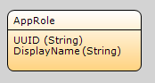

## Introduction

The Permissions API is an [App Service](/refguide6/consumed-app-services) that allows retrieving the [user roles](/refguide6/user-roles) a specific user has in your application. There are several ways in which the roles granted to a user in an application can be changed:

*   The role with which the user was invited through the Launchpad, or the role with which the user was invited through the [Invite API](invite-api).
*   User roles for an individual user can be changed from the Launchpad in the _Manage App Users_ screen, provided the user attempting to change these has sufficient privileges.
*   A user may be granted roles through a group policy for a security group he is a member of. Group policies define a specific set of user roles to be granted to members of the security group to which the policy applies, for a specific environment; they can be configured in the Company Admin. Security group membership can be changed through either the Company Admin or the [User Management API](user-management-api) .

{}

The Permissions API will require the EnvironmentUUID and EnvironmentPassword parameters to authenticate and authorize requests; the values for these should come from constants from the AppCloudServices module with the same name. The Mendix Cloud Portal will automatically set these constants; you do not need to set these yourself. For this reason, the Permissions API will however only function for applications which use the AppCloudServices module and are deployed through the Mendix Cloud Portal.

{}

The service is part of the [AppCloudServices module](https://appstore.home.mendix.com/link/app/934/Mendix/AppCloudServices), which is available from the App Store, and it's included in the default themes when creating a new application. Both of these options include a default implementation of the Permissions API.

## API Calls

### GetRolesForOpenID

#### Description

Retrieves the user roles for a specific user, based on their OpenID; this will return a list of AppRole objects representing the user roles the user has.

{}

Note that a request will return a list of [non-persistable objects](/refguide6/persistability). It's up to the implementer of the Permissions API to use these to create a database representation of the roles the user has in the application.

{}

#### Available in

API Version 1

#### Parameters

| Name | Parameter type | Required | Description |
| --- | --- | --- | --- |
| OpenID | String | Yes | OpenID of the user for which you are retrieving the roles. |
| EnvironmentUUID | String | Yes | UUID of the requesting environment. This should be the value of the AppCloudServices.EnvironmentUUID constant, which the Mendix Cloud Portal will fill in automatically. |
| EnvironmentPassword | String | Yes | Password of the requesting environment. This should be the value of the AppCloudServices.EnvironmentUUID constant, which the Mendix Cloud Portal will fill in automatically. |

#### Return type

List of PermissionsAPI.AppRole objects

##### AppRole

| Attribute | Type | Description |
| --- | --- | --- |
| UUID | String | UUID of the user role. Using, this the corresponding System.UserRole object can be retrieved as this UUID will match the UserRole's ModelGUID attribute. |
| DisplayName | String | Name of the user role |
