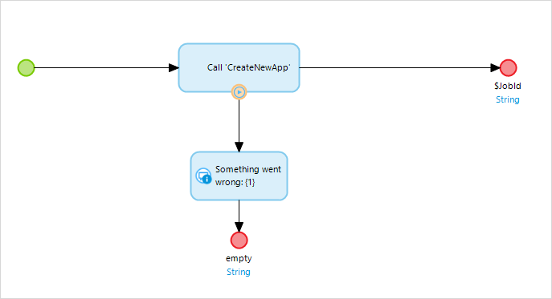
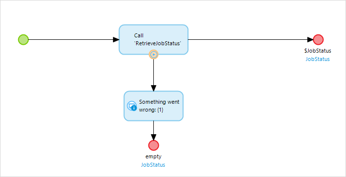
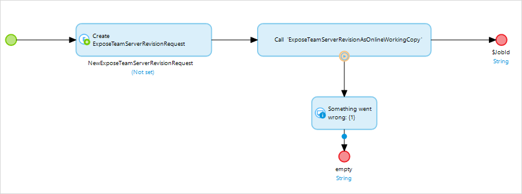
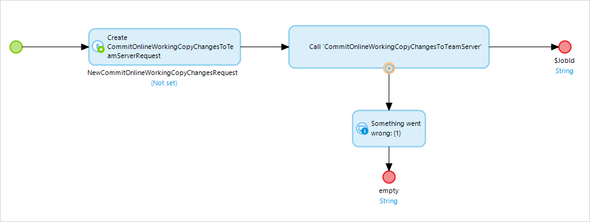

## 1 Introduction

The Projects API allows you to programmatically create a project in your company space and move working copies between the Team Server and the Model Server.

## 2 Error Handling

The following errors might be returned by the service. As this API is implemented as an app service, it will only give a HTTP status code 500 in case an error occurs.

| Status code | Description |
| --- | --- |
| 500 (Internal Server Error) / 560 (Internal Server Error) | An error occurred when invoking the app service. The "faultstring" field will elaborate on the error details.  Please contact Customer Support through [https://support.mendix.com/](https://support.mendix.com/) or [support@mendix.com](mailto:support@mendix.com) if this problem persists. |
| 502 (Bad Gateway) / 503 (Service Unavailable) | The server is currently offline. Please contact Customer Support through [https://support.mendix.com/](https://support.mendix.com/) or [support@mendix.com](mailto:support@mendix.com) if this problem persists. |
| 504 (Gateway timeout) | Your request is being processed but the server aborted the response because the request took too long. Note that the request might have been applied still. Please contact Customer Support through [https://support.mendix.com/](https://support.mendix.com/) or [support@mendix.com](mailto:support@mendix.com) if this happens. |

## 3 Operations

The following operations are available in the Projects API.

### 3.1 CreateNewApp {#createnewapp}

The CreateNewApp operation will create a new app and corresponding project. As parameters it requires a project name, a user name that is linked to a Mendix account, an [API Key](authentication) corresponding to that user account, and a project summary. The project summary may contain a brief description of the project.

#### 3.1.1 Parameters

| Name | Type | Description |
| --- | --- | --- |
| ProjectName | String | Name of the project. May not be blank or contain any of the following characters: `<>:/\|?*` |
| ProjectSummary | String | A brief description of the project. May be set to `empty`. |
| User | String | The <u>email address</u> you use to log into your Mendix account. |
| ApiKey | String | An [API Key](authentication) associated to the user account of _User_. |
| TemplateUUID (can be `empty`) | String | The [UUID](/appstore/general/app-store-overview#additional-info) that identifies the template with which the project will be created. If left empty, a default blank template will be used. |

#### 3.1.2 Output

The CreateNewApp action returns a String which is the ID of the background job that has been scheduled to create your new app.

#### 3.1.3 Usage from Studio Pro

After you have imported the Projects API App Service, an activity called 'CreateNewApp' is available under the 'ProjectsAPI' node in the Action dialog. For more information, see [Consumed App Services](/refguide/consumed-app-services). 

Reference the microflow below:

### 3.2 RetrieveJobStatus

Retrieves the status of a background job that was queued for execution.

#### 3.2.1 Parameters

| Name | Type | Description |
| --- | --- | --- |
| JobId | String | The ID of a background job that was provided to you by one of the ProjectsAPI operations. |

#### 3.2.2 Output

The output of the RetrieveJobStatus operation is a `JobStatus` entity with the following attributes:

The `ProjectsAPI.JobState` enumeration can have the values `Running`, `Completed` or `Failed`.

The `Result` element contains the job result, in case it has completed. For `CreateNewApp` this is the Project ID of the newly created app. For `ExposeTeamServerRevisionAsOnlineWorkingCopy`, this is the working copy ID on the Model Server. For `CommitOnlineWorkingCopyChangesToTeamServer`, it's the new revision number for the corresponding Team Server project.

#### 3.2.3 Usage From Studio Pro

The microflow below references how to use the RetrieveJobStatus call from Studio Pro.

### 3.3 DeleteApp

The DeleteApp operation will remove an application, including all resources that are associated with it, like the Team Server repository, cloud nodes, and all model server working copies. The operation can only be called by someone who has administrative permissions on the project (usually the user that created the project).

#### 3.3.1 Parameters

| Name | Type |	Description |
| --- | --- | --- |
| ProjectID |	String | ID of the project/app, as can be found under the project settings. |
| User | String | The email address you use to log into your Mendix account.|
| ApiKey | String | An API Key associated to the user account of the User.|

#### 3.3.2 Output

The DeleteApp action does not return anything. If a true request completes successfully, the application was removed.

### 3.4 ExposeTeamServerRevisionAsOnlineWorkingCopy

Expose a specific Team Server revision as an Online Working Copy.

#### 3.4.1 Parameters

The ExposeTeamServerRevisionAsOnlineWorkingCopy operation takes a ProjectsAPI.ExposeTeamServerRevisionRequest object as parameter. This object has the following members:

| Name | Type | Description |
| --- | --- | --- |
| Username | String | The email address of your Mendix account. |
| ApiKey | String | An API key of your Mendix account. |
| ProjectId | String | The ID of the project/app that you want to expose. |
| Branch (can be `empty`) | String | Name of the branch to expose. If this value is `empty`, Main Line is exposed. |
| Revision (can be `empty`) | Integer/Long | Revision number to expose. If the value is `empty` or `-1`, the latest (HEAD) revision is exposed. |

#### 3.4.2 Output

The ExposeTeamServerAsWorkingCopy action returns a String which is the Job ID of the background job that was queued for execution. The returned Job ID may be used as input for the RetrieveJobStatus action.

#### 3.4.3 Usage

Reference this microflow:

### 3.5 CommitOnlineWorkingCopyChangesToTeamServer

#### 3.5.1 Parameters

| Name | Type | Description |
| --- | --- | --- |
| Username | String | The email address of your Mendix account. |
| ApiKey | String | An API key of your Mendix account. |
| ProjectId | String | The ID of the project/app that you want to expose. |
| Branch (can be `empty`) | String | Name of the branch to commit the changes to. If this value is `empty`, Main Line is used. |
| Revision   | Integer/Long | Revision number to base the changes on. If the value is `-1`, the latest (HEAD) revision is used. |

#### 3.5.2 Output

The CommitOnlineWorkingCopyChangesToTeamServer action returns a String which is the Job ID of the background job that was queued for execution. The returned Job ID may be used as input for the RetrieveJobStatus action.

#### 3.5.3 Usage from Studio Pro

Reference this microflow:

## 4 Download

Download the Projects API App Service below, so you can import it in your model:

[ProjectsAPI_11.msd](attachments/14778446/ProjectsAPI_11.msd)

In the consumed Projects API App Service settings, you will have to use a constant with the value `https://sprintr.home.mendix.com/ws/ProjectsAPI/11/soap1` as Location.
