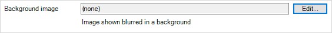
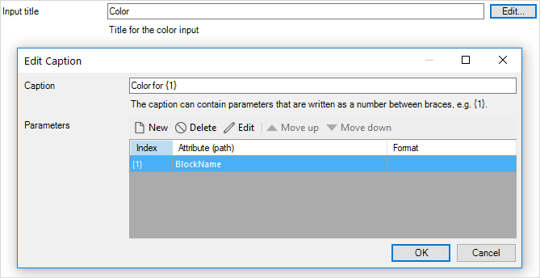
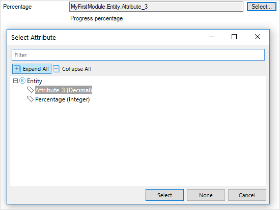

## 1 Introduction

In order to be configurable, pluggable widgets use a [widget properties definition](/apidocs-mxsdk/apidocs/pluggable-widgets.md#properties-definition) which describes the properties available to pluggable widgets.

The common structure of a property definition is as follows:

```xml
<property key="propertyKey" type="propertyType">
	<caption>My Property</caption>
	<description>This is my property</description>
</property>
```

### 1.1 XML Attributes

#### 1.1.1 `key` (required)

This defines the prop key in the client component props which are supplied to the widget client component. Each property must have a unique `key` which can contain letters of all cases, digits, or underscores. However, a `key` attribute cannot *start* with a digit.

#### 1.1.2 `**type**` (required)

This defines a property's type. A `type` must be one of the following: 

* Static Properties
	* [string](#string)
	* [Boolean](#boolean)
	* [integer](#integer)
	* [enumeration](#enumeration)
* Dynamic Properties
	* [expression](#expression)
	* [TextTemplate](#textTemplate)
	* [action](#action)
	* [attribute](#attribute)
	* [object](#object)

### 1.2 XML Elements

`**<caption>**` (required) — This defines the property name visible for the user (not an end-user) while configuring the widget in Studio and Studio Pro.

`**<description>**` (required) — This is a description which explains a property's purpose.

## 2 Static Properties

Static properties are made to pass values configured in Studio or Studio Pro to the widget. They do not depend on any dynamic data. Static properties are passed to the widget client component as simple primitive values.

### 2.1 String{#string}

String is represented as a simple text input in Studio Pro. It is passed as a `string` prop to a client component.

#### 2.1.1 XML Attributes

| Attribute      | Required | Attribute Type | Description                                                  |
| -------------- | -------- | -------------- | ------------------------------------------------------------ |
| `type`         | Yes      | String         | Must be `string`                                             |
| `key`          | Yes      | String         | [+Property types available to Pluggable widgets: key](https://paper.dropbox.com/doc/Property-types-available-to-Pluggable-widgets-key-khDOHBDy9pr5leYZzqQoK#:h2=key) |
| `defaultValue` | No       | String         | Default value for the property.                              |
| `multiline`    | No       | Boolean        | `true` to enable multiline input in the Studio, `false` otherwise. |
| `required`     | No       | Boolean        | Whether the property must be specified by the user. `true` by default |


#### 2.1.2 Studio Pro UI

For the single line property the Studio Pro UI *XML* is as follows:

```xml
<property key="myString" type="string">
	<caption>My string</caption>
	<description>My string setting</description>
</property>
```

In Studio Pro, a single line string widget appears this way:


For the multi-line property the Studio Pro UI *XML* is as follows:

```xml
<property key="myStringMultiline" type="string" multiline="true">
	<caption>My string multiline</caption>
	<description>My string multiline setting</description>
</property>
```

In Studio Pro, a multi-line string property appears this way:


### 2.2 Boolean{#boolean}

Boolean is represented as a toggle in Studio Pro. It is passed as `boolean` prop to a client component.

#### 2.2.1 XML Attributes

| Attribute      | Required | Attribute Type | Description                                                                                                                                                          |
| -------------- | -------- | -------------- | -------------------------------------------------------------------------------------------------------------------------------------------------------------------- |
| `type`         | Yes      | String         | Must be `boolean`                                                                                                                                                    |
| `key`          | Yes      | String         | [+Property types available to Pluggable widgets: key](https://paper.dropbox.com/doc/Property-types-available-to-Pluggable-widgets-key-khDOHBDy9pr5leYZzqQoK#:h2=key) |
| `defaultValue` | Yes      | Boolean        | Default value for the property. `true` or `false`                                                                                                                    |

#### 2.2.2 Studio Pro UI

For the Boolean property, the Studio Pro UI *XML* is as follows:

```xml
<property key="myBoolean" type="boolean" defaultValue="false">
	<caption>My boolean</caption>
	<description>My boolean setting</description>
</property>
```

A Boolean property can appear in Studio Pro like this:


### 2.3 Integer{#integer}

Integer is represented as a number input in Studio Pro. It is passed as a `number` prop to a client component.

#### 2.3.1 XML attributes

| Attribute      | Required | Attribute Type | Description                                                                                                                                                          |
| -------------- | -------- | -------------- | -------------------------------------------------------------------------------------------------------------------------------------------------------------------- |
| `type`         | Yes      | String         | Must be `integer`                                                                                                                                                    |
| `key`          | Yes      | String         | [+Property types available to Pluggable widgets: key](https://paper.dropbox.com/doc/Property-types-available-to-Pluggable-widgets-key-khDOHBDy9pr5leYZzqQoK#:h2=key) |
| `defaultValue` | Yes      | Integer        | Default value for the property.                                                                                                                                      |

#### 2.3.2 Studio Pro UI

For the integer property, the Studio Pro UI *XML* is as follows:

```xml
<property key="myInteger" type="integer" defaultValue="1000">
	<caption>My integer</caption>
	<description>My integer setting</description>
</property>
```

An integer property can appear in Studio Pro like this:


### 2.4 Enumeration{#enumeration}

Enumeration allows a user to select one out of multiple options defined in the *XML*. A key of a selected enumeration that option is passed as `string` prop to a client component [todo: clarify? add comma after enumeration? does key need tics?].

#### 2.4.1 XML Attributes

| Attribute      | Required | Attribute Type | Description                                                                                                                                                          |
| -------------- | -------- | -------------- | -------------------------------------------------------------------------------------------------------------------------------------------------------------------- |
| `type`         | Yes      | String         | Must be `enumeration`                                                                                                                                                |
| `key`          | Yes      | String         | [+Property types available to Pluggable widgets: key](https://paper.dropbox.com/doc/Property-types-available-to-Pluggable-widgets-key-khDOHBDy9pr5leYZzqQoK#:h2=key) |
| `defaultValue` | Yes      | Integer        | Default value for the property.                                                                                                                                      |

#### 2.4.2 XML Elements

`<enumerationValues>` (required) — One `<enumerationValues>` element must be declared with multiple `<enumerationValue>` elements inside in order to define possible enumeration values. A `key` attribute is required for every enumeration value as well as a caption. Enter enumeration values like this:

```xml
`<enumerationValue key="myEnumOption">My enum option caption</enumerationValue>`
```

The `key` of a selected element will be passed to the client component. `key` should not be changed since it is used to identify options used in a project.

#### 2.4.3 Studio Pro UI

For the enumeration value property, the Studio Pro UI *XML* is as follows:

```xml
	<property key="myEnumeration" type="enumeration" defaultValue="red">
	<caption>My enumeration</caption>
	<description>My enumeration setting</description>
	<enumerationValues>
		<enumerationValue key="red">Red</enumerationValue>
		<enumerationValue key="green">Green</enumerationValue>
		<enumerationValue key="blue">Blue</enumerationValue>
	</enumerationValues>
	</property>
```

An enumeration property can appear in Studio Pro like this:


## 3 Components

### 3.1 Icon

Icon allows a user to configure an icon similar to one used by an [action button](/refguide/action-button#icon). It is passed as `DynamicValue<IconValue>` prop to a client component.

#### 3.1.1 XML Attributes

| Attribute  | Required | Attribute Type | Description                                                                                                                                                          |
| ---------- | -------- | -------------- | -------------------------------------------------------------------------------------------------------------------------------------------------------------------- |
| `type`     | Yes      | String         | Must be `icon`                                                                                                                                                       |
| `key`      | Yes      | String         | [+Property types available to Pluggable widgets: key](https://paper.dropbox.com/doc/Property-types-available-to-Pluggable-widgets-key-khDOHBDy9pr5leYZzqQoK#:h2=key) |
| `required` | No       | Boolean        | Whether the proeprty must be specified by the user. `true` by default                                                                                                |
#### 3.1.2 Studio Pro UI

For icon components, the Studio Pro UI *XML* is as follows:

```xml
<property key="cardIcon" type="icon" required="false">
	<caption>Icon</caption>
	<description>Card icon</description>
</property>
```

An icon component will appear in Studio Pro like this:


### 3.2 Image

Image allows a user to configure a static image from an [image collection](https://docs.mendix.com/refguide/image-collection). It is passed as `DynamicValue<ImageValue>` prop to a client component.

#### 3.2.1 XML Attributes

| Attribute  | Required | Attribute Type | Description                                                                                                                                                          |
| ---------- | -------- | -------------- | -------------------------------------------------------------------------------------------------------------------------------------------------------------------- |
| `type`     | Yes      | String         | Must be `image`                                                                                                                                                      |
| `key`      | Yes      | String         | [+Property types available to Pluggable widgets: key](https://paper.dropbox.com/doc/Property-types-available-to-Pluggable-widgets-key-khDOHBDy9pr5leYZzqQoK#:h2=key) |
| `required` | No       | Boolean        | Whether the proeprty must be specified by the user. `true` by default                                                                                                |
#### 3.2.2 Studio Pro UI

For image components, the Studio Pro UI *XML* is as follows:

```xml
<property key="bgImage" type="image" required="false">
	<caption>Background Image</caption>
	<description>Image shown blurred in a background</description>
</property>
```

An image component will appear in Studio Pro like this:



## 4 Dynamic Properties

### 4.1 Expression{#expression}

Expression allows a user to configure an [expression](/refguide/expressions), the result of which  will be passed to the client component as a `DynamicValue<T>` where `T` depends on a return type of the expression.

#### 4.1.1 XML Attributes

| Attribute      | Required | Attribute Type      | Description                                                                                                                                                          |
| -------------- | -------- | ------------------- | -------------------------------------------------------------------------------------------------------------------------------------------------------------------- |
| `type`         | Yes      | String              | Must be `expression`                                                                                                                                                 |
| `key`          | Yes      | String              | [+Property types available to Pluggable widgets: key](https://paper.dropbox.com/doc/Property-types-available-to-Pluggable-widgets-key-khDOHBDy9pr5leYZzqQoK#:h2=key) |
| `defaultValue` | No       | String (Expression) | Default value for the property.                                                                                                                                      |
| `required`     | No       | Boolean             | Whether the proeprty must be specified by the user. `true` by default                                                                                                |

#### 4.1.2 XML Elements

`<returnType>` (required) — An expression property must contain a `<returnType>` element in order to define allowed return types for the expression. The Mendix platform will ensure the that configured expression returns the correct data type.

| Supported Return Types | Corresponding Types Client Components Receive |
| -------------------- | --------------------------------------------- |
| `Boolean`              | `DynamicValue<boolean>`                    |
| `DateTime`           | `DynamicValue<Date>`                         |
| `Decimal`             | `DynamicValue<BigJS>`                       |
| `Integer`              | `DynamicValue<BigJS>`                      |
| `String`               | `DynamicValue<string>`                     |

#### 4.1.3 Studio Pro UI

For an expression property, the Studio Pro UI *XML* is as follows:

```xml
<property key="progressBarColor" type="expression" defaultValue="'red'">
	<caption>Color</caption>
	<description>Progress bar CSS color</description>
	<returnType type="String" />
</property>
```

An expression property could appear in Studio Pro like this:


### 4.4 TextTemplate{#texttemplate}

`TextTemplate` allows a user to configure translatable text template similar to the [text template](/refguide/text#text-template) of a text widget. The interpolated string will be passed to the client component as `DynamicValue<string>`.

#### 4.4.1 XML Attributes

| Attribute   | Required | Attribute Type | Description                                                                                                                                                          |
| ----------- | -------- | -------------- | -------------------------------------------------------------------------------------------------------------------------------------------------------------------- |
| `type`      | Yes      | String         | Must be `textTemplate`                                                                                                                                               |
| `key`       | Yes      | String         | [+Property types available to Pluggable widgets: key](https://paper.dropbox.com/doc/Property-types-available-to-Pluggable-widgets-key-khDOHBDy9pr5leYZzqQoK#:h2=key) |
| `multiline` | No       | Boolean        | `true` to enable multiline input in the Studio, `false` otherwise.                                                                                                   |
| `required`  | No       | Boolean        | Whether the property must be specified by the user. `true` by default                                                                                                |


#### 4.4.2 XML Elements

`<translations>` — Allows to set a default value for text templates for different languages using `<translation>` elements with a `lang` attribute representing [ISO 639](https://en.wikipedia.org/wiki/ISO_639) code of the language. Available languages are listed in the [Languages Tab](/refguide/project-settings#4-languages-tab) in Studio Pro.

For `TextTemplate`, the Studio Pro UI *XML* is as follows:

```xml
<property key="myBlockTitle" type="textTemplate">
	<caption>Input title</caption>
	<description>Title for the color input</description>
	<translations>
		<translation lang="en_US">Color</translation>
		<translation lang="nl_NL">Kleur</translation>
		<translation lang="uk_UA">Колір</translation>
	</translations>
</property>
```

#### 4.4.3 Studio Pro UI

`TextTemplate` could appear in Studio Pro like this:



### 4.5 Action{#action}

The action property allows a user to configure an action to do things like calling nanoflows, saving changes, and opening pages. The client component will receive `ActionValue` representing it, or `undefined` when the **Do nothing** action was selected.

#### 4.5.1 XML Attributes

| Attribute  | Required | Attribute Type | Description                                                                                                                                                          |
| ---------- | -------- | -------------- | -------------------------------------------------------------------------------------------------------------------------------------------------------------------- |
| `type`     | Yes      | String         | Must be `action`                                                                                                                                                     |
| `key`      | Yes      | String         | [+Property types available to Pluggable widgets: key](https://paper.dropbox.com/doc/Property-types-available-to-Pluggable-widgets-key-khDOHBDy9pr5leYZzqQoK#:h2=key) |
| `required` | No       | Boolean        | Whether the property must be specified by the user. `true` by default                                                                                                |
#### 4.5.2 Studio Pro UI

For an action property, the Studio Pro UI *XML* is as follows:

```xml
<property key="buttonAction" type="action">
	<caption>On click</caption>
	<description>Action to be performed when button is clicked</description>
</property>
```

An action property could appear in Studio Pro like this:


### 4.6 Attribute{#attribute}

The attribute property allows a widget to work directly with entities' attributes, both reading and writing attributes. Depending on the widget's purposes, a widget may restrict attribute types it supports (todo: check meaning). The client component will receive `EditableValue<T>` where `T` depends on a `<attributeType>` configured.

#### 4.6.1 XML Attributes

| Attribute  | Required | Attribute Type | Description                                                  |
| ---------- | -------- | -------------- | ------------------------------------------------------------ |
| `type`     | Yes      | String         | Must be `attribute`                                          |
| `key`      | Yes      | String         | [+Property types available to Pluggable widgets: key](https://paper.dropbox.com/doc/Property-types-available-to-Pluggable-widgets-key-khDOHBDy9pr5leYZzqQoK#:h2=key) |
| `onChange` | No       | Property Path  | This path to an Action property that will be executed by Mendix platform when value is changed by the widget. |
| `required` | No       | Boolean        | This decides if the property must be specified by the user (`true` by default). |

#### 4.6.2 XML Elements

`<attributeTypes>` (required) — This element encapsulates `<attributeType>` elements which declare supported attribute types available while configuring the attribute property in the Studios.

`<attributeType>` (required one or more) — this element defines the allowed attribute type in the `name` attribute.

| Supported Attribute Types | Corresponding Types Client Components Receive |
| ------------------------- | --------------------------------------------- |
| `AutoNumber`              | `EditableValue<string>`                       |
| `Binary`                  | `EditableValue<string>`                       |
| `Boolean`                 | `EditableValue<boolean>`                      |
| `DateTime`                | `EditableValue<Date>`                         |
| `Enum`                    | `EditableValue<string>`                       |
| `HashString`              | `EditableValue<string>`                       |
| `Integer`                 | `EditableValue<BigJS>`                        |
| `Long`                    | `EditableValue<BigJS>`                        |
| `String`                  | `EditableValue<string>`                       |
| `Decimal`                 | `EditableValue<BigJS>`                        |

#### 4.6.3 Studio Pro UI

For *XML* elements, the Studio Pro UI *XML* is as follows:

```xml
<property key="percentage" type="attribute" onChange="onPercentageChange">
	<caption>Percentage</caption>
	<description>Progress percentage</description>
	<attributeTypes>
		<attributeType name="Decimal"/>
		<attributeType name="Integer"/>
	</attributeTypes>
</property>
    
<property key="onPercentageChange" type="action">
	<caption>On change</caption>
	<description/>
</property>
```

An *XML* element could appear in Studio Pro like this:



### 4.7 Object{#object}

The object property allows to create an arbitrary list of properties.

#### 4.7.1 XML Attributes

| Attribute | Required | Attribute Type | Description                                                                                                                                                          |
| --------- | -------- | -------------- | -------------------------------------------------------------------------------------------------------------------------------------------------------------------- |
| `type`    | Yes      | String         | Must be `object`                                                                                                                                                     |
| `key`     | Yes      | String         | [+Property types available to Pluggable widgets: key](https://paper.dropbox.com/doc/Property-types-available-to-Pluggable-widgets-key-khDOHBDy9pr5leYZzqQoK#:h2=key) |
| `isList`  | Yes      | Boolean        | Must be `true`                                                                                                                                                       |

#### 4.7.2 XML Elements

`<properties>` (required) — This encapsulates the list or properties to be configured. Properties must be grouped by `<propertyGroup>` elements. Nested object properties are not supported.

For the object property, the Studio Pro UI *XML* is as follows:

```xml
<property key="myObject" type="object" isList="true">
	<caption>My object list</caption>
	<description/>
	<properties>
		<propertyGroup caption="Object list group">
			<property key="myObjectBool" type="boolean" defaultValue="true">
				<caption>My boolean</caption>
					<description>My boolean setting</description>
			</property>
    
			<property key="myObjectAction" type="action">
				<caption>My action</caption>
				<description>My action setting</description>
			</property>
		</propertyGroup>
	</properties>
</property>
```

#### 4.7.3 Studio Pro UI

An object property could appear in Studio Pro like this:


## 5 System Properties

System properties is a way for a pluggable widget to adopt extended widget functionality provided by Mendix platform. System properties should be defined as `<systemProperty>` elements.
(todo: figure out how to format this, make it more clear, as it is linked to in 2 or more tables in this doc)**Required attributes**
`**key**`

Defines the type of a system property. The following values are allowed:
    
* `Label`
* `Name`
* `TabIndex`
* `Visibility`
* `Editability`

### 5.1 Label

Label property allows a pluggable widget to have labeling functionality similar to a [core input widget](/refguide/text-box#label-properties). This allows a user to set a label, a label position, and a label width. If a widget has a label configured, its client component will automatically be wrapped into a correct markup.

```xml
<systemProperty key="Label"/>
```

### 5.2 Name

Every widget have a name by default. This property can be used to control position of the widget name input. If this property is not specified, input will be placed in **Common** tab. A widget’s name is also used for locating it during [automated tests](/howto/integration/selenium-support). For that purpose in web apps, a widget name is automatically appended to a `class` prop a component receives, and in native apps is passed as a separate `name` prop.

```xml
<systemProperty key="Name"/>
```

### 5.3 TabIndex

The TabIndex property allows pluggable widgets to implement the **Tab index** setting similar to  a [core input widget](/refguide/text-box#tab-index). Every selectable or input-like widget should opt for this to provide a consistent developing experience and an accessible app for an end-user. A widget’s tab index, when it is not zero, is passed to a client component in a `tabIndex` prop.

```xml
<systemProperty key="TabIndex"/>
```

### 5.4 Visibility

Every pluggable widget can be [conditionally hidden](/refguide/conditions). This property can be used to control a position of the widget visibility inputs.

```xml
<systemProperty key="Visibility"/>
```

### 5.5 Editability

The editability property allows a pluggable widget to have an editable configuration similar to a [core input widget](/refguide/text-box#editability-properties). When a widget is marked as read-only or conditionally editable with condition being false, all [EditableValues](todo: figure out where this anchor link was supposed to go) its client component receives will have `readOnly` flag.

```xml
<systemProperty key="Editability"/>
```

## 6 Read More

* [Pluggable Widgets API](pluggable-widgets)