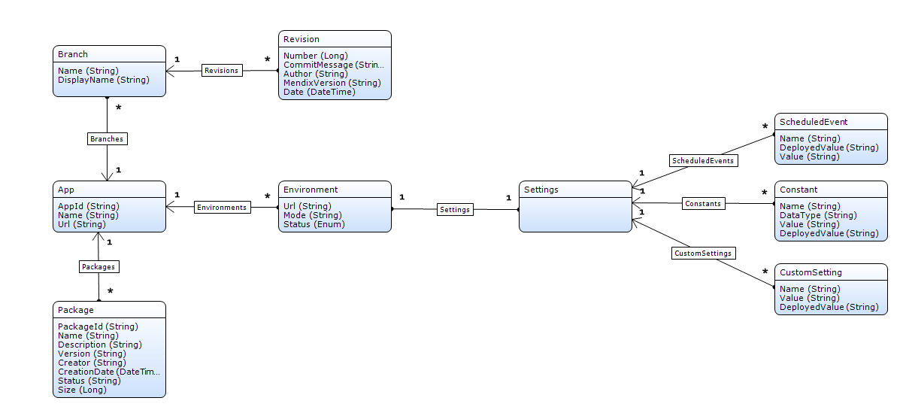

## Introduction

The team server API allows you to retrieve the information (branches, revisions) of application models stored in our team server. You always access an application model via the context of an application (see the Deploy API for more information about retrieving applications and application identifiers).
The image below provides a domain model representation of the concepts discussed below and how these are related:


## Authentication

The Cloud Portal Management API requires its users to authenticate themselves. This can be done by using API keys; for more information about this please refer to [this article](authentication "authentication").

## API calls

### Retrieve branches

<a name="TeamServerAPI-Description" rel="nofollow"></a>Retrieves all branches that belong to the team server project of a specific app which the authenticated user has access to as a regular user.

```java
HTTP Method: GET
 URL: https://deploy.mendix.com/api/1/apps/<AppId>/branches/
```

#### Request

##### Parameter

*   _AppId_ (String) : Subdomain name of an app.

##### Example

```java
GET /api/1/apps/calc/branches/ HTTP/1.1
Host: deploy.mendix.com

Accept: */*
Mendix-Username: richard.ford51@example.com
Mendix-ApiKey: 26587896-1cef-4483-accf-ad304e2673d6
```

#### Output

List of objects with the following key-value pairs:

*   _Name_ (String) : Name of the branch. This is 'trunk' for the main line or a specific branch name.
*   _DisplayName_ (String) : Visible name in the Cloud Portal. For the trunk, this is 'Main line'.
*   _LatestRevisionNumber_ (Long) : Number of the latest revision.
*   _LatestRevisionMendixVersion_ (String) : Version string of the Mendix version of the app project in this revision.

##### Error codes

| HTTP Status | Error code | Description |
| --- | --- | --- |
| 400 | INVALID_APPID | Invalid AppId. |
| 404 | APP_NOT_FOUND | App not found. |

##### Example

```java
[{
     "Name" :  "trunk" ,
     "LatestRevisionNumber" :  9 ,
     "LatestRevisionMendixVersion" :  "5.6.0" ,
     "DisplayName" :  "Main line"
},{
     "Name" :  "statistical functions" ,
     "LatestRevisionNumber" :  13 ,
     "LatestRevisionMendixVersion" :  "5.6.0" ,
     "DisplayName" :  "statistical functions"
}]
```

### Retrieve branch

Retrieves a specific branch that belongs to the team server project of a specific app which the authenticated user has access to as a regular user.

```java
 HTTP Method: GET
 URL: https://deploy.mendix.com/api/1/apps/<AppId>/branches/<Name>
```

#### Request

##### Parameters

*   _AppId_ (String) : Subdomain name of an app.
*   _Name_ (String) : Name of the branch to get or 'trunk' to get the main line. The name of the branch should be [URL-encoded](https://www.w3schools.com/tags/ref_urlencode.asp).

##### Example

```java
GET /api/1/apps/calc/branches/statistical%20functions HTTP/1.1
Host: deploy.mendix.com

Accept: */*
Mendix-Username: richard.ford51@example.com
Mendix-ApiKey: 26587896-1cef-4483-accf-ad304e2673d6
```

#### Output

An object with the following key-value pairs:

*   _Name_ (String) : Name of the branch. This is 'trunk' for the main line or a specific branch name.
*   _DisplayName_ (String) : Visible name in the Cloud Portal. For the trunk, this is 'Main line'.
*   _LatestRevisionNumber_ (Long) : Number of the latest revision.
*   _LatestRevisionMendixVersion_ (String) : Version string of the Mendix version of the app project in the latest revision.

##### Error codes

| HTTP Status | Error code | Description |
| --- | --- | --- |
| 400 | INVALID_APPID | Invalid AppId. |
| 404 | APP_NOT_FOUND | App not found. |
| 404 | BRANCH_NOT_FOUND | There is no branch with name 'branch name'. |

##### Example

```java
{
    "Name": "statistical functions",
    "LatestRevisionNumber": 13,
    "LatestRevisionMendixVersion": "5.6.0",
    "DisplayName": "statistical functions"
}
```

### Retrieve revisions

Retrieves all revisions of a specific branch that belongs to the team server project of a specific app which the authenticated user has access to as a regular user.

```java
HTTP Method: GET
 URL: https://deploy.mendix.com/api/1/apps/<AppId>/branches/<Name>/revisions/
```

#### Request

##### Parameters

*   _AppId_ (String) : Subdomain name of an app.
*   _Name_ (String) : Name of the branch to get or 'trunk' to get the main line.

##### Example

```java
GET /api/1/apps/calc/branches/trunk/revisions/ HTTP/1.1
Host: deploy.mendix.com

Accept: */*
Mendix-Username: richard.ford51@example.com
Mendix-ApiKey: 26587896-1cef-4483-accf-ad304e2673d6
```

#### Output

List of objects with the following key-value pairs:

*   _Number_ (Long) : Number of the revision.
*   _CommitMessage_ (String) : Commit message of the revision.
*   _Date_ (Date) : Date when the revision is created (or the commit is done).
*   _Author_ (String) : Creator of the revision (committer).
*   _MendixVersion_ (String) : Version string of the Mendix version of the app project in this revision.

##### Error codes

| HTTP Status | Error code | Description |
| --- | --- | --- |
| 400 | INVALID_APPID | Invalid AppId. |
| 404 | APP_NOT_FOUND | App not found. |
| 404 | BRANCH_NOT_FOUND | There is no branch with name 'branch name'. |

##### Example

```java
[{
    "MendixVersion": "5.6.0",
    "CommitMessage": "Implement C key",
    "Date": 1394031450618,
    "Number": 8,
    "Author": "richard.ford51@example.com"
},{
    "MendixVersion": "5.6.0",
    "CommitMessage": "Implement ^ key",
    "Date": 1394031460618,
    "Number": 9,
    "Author": "richard.ford51@example.com"
}]
```
