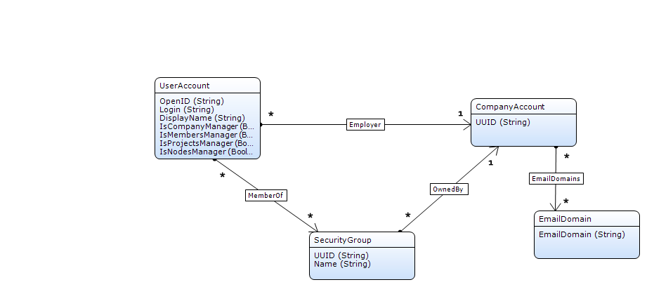

# Contents

# Introduction

The User Management API allows your company's user management systems to integrate with the Mendix platform. Through this API, you can create and manage user accounts in your company. Additionally you can create and manage security groups. In the Mendix platform, you can define group policies for groups which grant access to your company's applications to their members.

# Authentication

The User Management API requires its users with the required permissions to authenticate themselves. This can be done by using API keys; for more information about this please refer to [this article](authentication).

# Error Handling

If an error occurs while performing a REST request, the server will always return a JSON object with error information. For example:

```java
{
    "errorMessage": "Authentication failed. The HTTP headers 'Mendix-Username' and 'Mendix-ApiKey' should contain valid credentials to authenticate for this request.",
    "errorCode": "UNAUTHORIZED"
}

```

The **errorCode** attribute describes the error in a machine-readable form, which may provide additional details on the nature of the error in addition to the HTTP status. The **errorMessage** attribute is the human-readable representation of the error, intended to give the developer further insight in the cause of the error.

The following errors might be returned by the service. In general, 4xx errors indicate that something was wrong with the client's request, and 5xx errors indicate that something went wrong at the server.

| Status code | Description |
| --- | --- |
| 400 (Bad Request) | The requester made an incorrect call. Either the JSON was not well formed or the request arguments were invalid. The "message" field will elaborate on the error. |
| 401 (Unauthorized) | The credentials are not valid or not applicable |
| 403 (Forbidden) | The credentials are valid, but are not authorized to perform this request. |
| 404 (Not Found) | This service or resource does not exist. Please verify the URL you are using. |
| 405 (Method Not allowed) | A service exists for this URL, but not in combination with the used HTTP method. |
| 409 (Conflict) | There was a conflict with respect to the resource; for example, the resource which was attempted to be created already exists. |
| 500 (Internal Server Error) / 560 (Internal Server Error) | The request is valid, but we failed to serve it. Please contact support. |
| 502 (Bad Gateway) / 503 (Service Unavailable) | The server is currently offline. Please contact support if this problem persists. |
| 504 (Gateway timeout) | Your request is being processed but the server aborted the response because the request took too long. Note that the request might have been applied still. Please contact support if this happens. |

## Error codes

On errors (4xx and 5xx responses), the response can contain an errorCode. This is a request-specific code that describes the error in a machine-readable form. The API documentation describes possible error codes per request.

### Authentication and authorization error codes

The following error codes can be returned on authentication and authorization errors.

| Error code | Description |
| --- | --- |
| UNAUTHORIZED
401 | Authentication failed. Credentials provided with the request are either invalid or incomplete. |
| FORBIDDEN
403 | Authentication succeeded, but user is not authorized to execute this request. |

### General error codes

##### Client errors (4xx)

| Error code | Description |
| --- | --- |
| PARAMETER_MISSING
400 | One of the required parameters for the request is missing or does not contain a value. |
| BAD_PARAMETER
400 | One of the parameters included with the request has an illegal value. |
| RESOURCE_NOT_FOUND
404 | The requested resource cannot be found on the server. |
| RESOURCE_ALREADY_EXISTS
409 | The resource cannot be created on the server because it already exists. |

##### Server errors (5xx)

| Error code | Description |
| --- | --- |
| SERVICE_UNAVAILABLE
503 | Service is unavailable. Please try again later. |

# API calls

## Concepts

The following concepts are used within this API.

### User Account

Users that are able to sign in to the Mendix platform with their credentials are identified by their log in name (an email address) or OpenID (an identifier generated by Mendix to uniquely identify a user). Both values are unique within the Mendix platform and cannot change over time. Every user is a member of (exactly) one Company.

### Company (Account)

A group of users that work for the same legal entity. Companies can own email domains (for example "@acme.org"), which means that every new user that signs up with an email address within this domain will become part of the domain owning company. (Additional) email domains for a company can be requested through [Mendix Support](https://support.mendix.com/).

### Security Groups

A group of users within the same company. Automated security policies can be assigned to security groups. These groups typically reflect your organization's structure.

### Company Admin

A user account within a company that has additional permissions. New company admins can be appointed by existing company admins or by the Mendix support department. The following permissions can be assigned to company admins.

| Role | Description |
| --- | --- |
| Company manager | Has all of the privileges below. Can also manage company information, other company admins, security groups, security rules, password policies and launchpad settings. |
| Member manager | Can manage individual users within the company, and modify security group memberships. |
| Project manager | Can see all Mendix projects within the company, and add or remove users to those projects. |
| Node manager | Can see all licensed App nodes that are managed by this company, or which relate to this company in any other way. |

Most API calls described below can only be made by company managers or member managers.

The image below provides a domain model representation of the concepts discussed above and how these are related:



## Get OpenID of User Account

Retrieves a user account's OpenID based on its email address.

```java
 HTTP Method: GET
 URL: https://platform.mendix.com/api/1/users/by-email/<emailAddress>
```

### Can be invoked by

Company Manager, Member Manager

### Request

##### Parameter

*   _emailAddress_ : The email address of the user account you are trying to retrieve. Please note that this address should be URL-encoded.

##### Example:

```java
GET /api/1/users/by-email/johndoe3%40example.com HTTP/1.1
Host: platform.mendix.com
Content-Type: application/json
Mendix-Username:janedoe@example.com
Mendix-ApiKey:87a8a34d-5ee7-43ba-81f0-7b1b17d5ecd7

```

### Output

JSON object with a single key-value pair containing key _openId_ containing the OpenID for the requested user account. HTTP status 200.

##### Example:

```java
{
    "openId": "https://mxid2.mendixcloud.com/mxid2/id?id=bdddd12c-cc93-4600-82e4-88baa5314y79"
}

```

## Get All User accounts in your Company

Retrieves the OpenIDs of all users in your company.

```java
HTTP Method: GET
 URL: https://platform.mendix.com/api/1/users
```

### Can be invoked by

Company Manager, Member Manager

### Request

##### Optional parameters

*   _search_ : Search string to find groups by name. Defaults to empty.
*   _offset_ : Offset within the dataset. Defaults to zero.
*   _limit_ : Maximum amount of objects to be retrieved. Defaults to '-1' for unlimited.

##### Example

```java
GET /api/1/users HTTP/1.1
Host: platform.mendix.com
Content-Type: application/json
Mendix-Username:janedoe@example.com
Mendix-ApiKey:87a8a34d-5ee7-43ba-81f0-7b1b17d5ecd7

```

### Output

A JSON object with two key-value pairs; _count_ indicating the total number of users in the company satisfying the search parameters (Note that depending on the chosen values for _limit_ and _offset_, the number of results in the response may be lower than the _count_.) and _users_ containing an array of objects with a single key-value pair _openId_ containing the OpenID of a user from the company. HTTP Status 200.

```java
{
    "users": [
        {
            "openId": "https://mxid2.mendix.dev/mxid2/id?id=daba46fc-692c-4622-adb4-981fcfb0dec9"
        },
        {
            "openId": "https://mxid2.mendix.dev/mxid2/id?id=c8101ad7-bdfb-48b1-b212-99fa86f8cdb0"
        },
        {
            "openId": "https://mxid2.mendix.dev/mxid2/id?id=f3ecda3f-1cd4-4571-92d9-5c53bd80c542"
        },
        {
            "openId": "https://mxid2.mendix.dev/mxid2/id?id=344a8193-bbe0-4b31-b7ae-de701eccf030"
        },
        {
            "openId": "https://mxid2.mendix.dev/mxid2/id?id=51b54074-a66c-4337-8488-aac89bf47a2d"
        },
        {
            "openId": "https://mxid2.mendix.dev/mxid2/id?id=6043d3ed-517f-43fc-bfb5-1062afe24858"
        }
    ],
    "count": 6
}
```

## Create User Account

Creates a new user account in your company. This is only allowed if the requesting user has permission to do so (member management privileges within the company). It is only possible to create new user accounts for email addresses that match one of the email domains owned by the company of the requester. After this request the user will be able to log in. No confirmations emails are sent if this API is used.

```java
 HTTP Method: POST
 URL: https://platform.mendix.com/api/1/users
```

### Can be invoked by

Company Manager, Member Manager

### Request

##### Payload

A JSON object with the following keys:

*   _displayName_ (String, required) : This name is used for display purposes in the entire Mendix platform.
*   _password_ (String, required) : Should have at least 8 characters, an uppercase, lowercase, non-alphanumeric and numeric character.
*   _emailAddress_ (String, required) : This will be the user's login name, and the address to which communications from the Mendix platform will be sent.
*   _country_ (String, required) : The user's country. See [countries reference](user-management-api).
*   _changePasswordOnFirstLogin_ (Boolean, optional) : If set to true, the user will be forced to change his/her password on first login. Default value: false

##### Example

```java
POST /api/1/users HTTP/1.1
Host: platform.mendix.com
Content-Type: application/json
Mendix-Username: janedoe@example.com
Mendix-ApiKey: 87a8a34d-5ee7-43ba-81f0-7b1b17d5ecd7

{
   "displayName" : "John Doe",
   "password" : "Password1!",
   "emailAddress" : "johndoe3@example.com",
   "country" : "United_States",
   "changePasswordOnFirstLogin" : true
}

```

### Output

A JSON object with a two key-value pairs; _openId_ containing the OpenID for the newly created user and _getUrl_ containing the URL from which the user account can be retrieved. HTTP status 201.

##### Example:

```java
{
    "openId" : "https://mxid2.mendixcloud.com/mxid2/id?id=bdddd12c-cc93-4600-82e4-88baa5314y79",
    "getUrl" : "https://platform.mendix.com/api/1/users/by-email/johndoe3@example.com"
}
```

## Update Active Status of User Account

Activate/deactivate a user account in your company. Deactivating a user means that the user can no longer access the Mendix Platform. However, all data of this user is retained.

```java
 HTTP Method: PUT
 URL: https://platform.mendix.com/api/1/users/<openId>
```

### Can be invoked by

Company Manager, Member Manager

### Request

##### Parameter

*   _openId_ : The OpenID of the user account you are trying to retrieve. Please note that since the OpenID is a URL itself, it should be URL-encoded.

##### Payload

A JSON object with keys:

*   _activeStatus_ (Boolean, optional) : The value to which the active status of the user should be changed. Default value: true

##### Example:

```java
POST /api/1/users/https%3A%2F%2Fmxid2.mendix.dev%2Fmxid2%2Fid%3Fid%3D51b54074-a66c-4337-8488-aac89bf47a2d HTTP/1.1
Host: platform.mendix.com
Content-Type: application/json
Mendix-Username:janedoe@example.com
Mendix-ApiKey:87a8a34d-5ee7-43ba-81f0-7b1b17d5ecd7

{
   "activeStatus": false
}

```

### Output

None when successful, with HTTP status 200.

## Get Security Group by UUID

Retrieves a security group based on its UUID.

```java
HTTP Method: GET
URL: https://platform.mendix.com/api/1/groups/<securityGroupUuid>
```

### Can be invoked by

Company Manager, Member Manager

### Request

##### Parameter

*   _securityGroupUuid_ : The UUID of the security group you want to retrieve.

##### Example

```java
GET /api/1/groups/86a2558b-b63b-4c76-a056-018d9eb8f1b9 HTTP/1.1
Host: platform.mendix.com
Content-Type: application/json
Mendix-Username:janedoe@example.com
Mendix-ApiKey:87a8a34d-5ee7-43ba-81f0-7b1b17d5ecd7

```

### Output

A JSON object with the following key value pairs:

*   _name_ : The name of the security group
*   _description_ : Description of the security group.
*   _uuid_ : UUID of the security group.
*   _memberCount_ : Number of users in the security group.
*   _userGroupLocked_ : This value determines whether the user group can be removed and whether users can be added/removed through the Mendix Platform Portal. True means that the user group cannot be removed and users cannot be added/removed through the Mendix Platform Portal.

If the call is successful, it should return HTTP status 200.

##### Example

```java
{
    "name": "RnD",
    "description": "Research and Development",
    "uuid": "86a2558b-b63b-4c76-a056-018d9eb8f1b9",
    "memberCount": 57,
    "userGroupLocked": true
}
```

## Get Security Group by Name

Retrieves a security group based on its name.

```java
 HTTP Method: GET
 URL: https://platform.mendix.com/api/1/groups/by-name/<securityGroupName>
```

### Can be invoked by

Company Manager, Member Manager

### Request

##### Parameter

*   _securityGroupName_ : The name of the security group you want to retrieve.

##### Example

```java

GET /api/1/groups/RnD HTTP/1.1
Host: platform.mendix.com
Content-Type: application/json
Mendix-Username:janedoe@example.com
Mendix-ApiKey:87a8a34d-5ee7-43ba-81f0-7b1b17d5ecd7

```

### Output:

A JSON object with the following key value pairs:

*   _name_ : The name of the security group
*   _description_ : Description of the security group.
*   _uuid_ : UUID of the security group.
*   _memberCount_ : Number of users in the security group.
*   _userGroupLocked_ : This value determines whether the user group can be removed and whether users can be added/removed through the Mendix Platform Portal. True means that the user group cannot be removed and users cannot be added/removed through the Mendix Platform Portal.

If the call is successful, it should return HTTP status 200.

##### Example

```java
{
    "name": "RnD",
    "description": "Research and Development",
    "uuid": "86a2558b-b63b-4c76-a056-018d9eb8f1b9",
    "memberCount": 57,
    "userGroupLocked": true
}
```

## Get All Security Groups in your Company

Retrieves all security groups which exist in a company.

```java
HTTP Method: GET
URL: https://platform.mendix.com/api/1/groups
```

### Can be invoked by:

Company Manager, Member Manager

### Request

##### Optional parameters

*   _search_ : Search string to find groups by name. Defaults to empty.
*   _offset_ : Offset within the dataset. Defaults to zero.
*   _limit_ : Maximum amount of objects to be retrieved. Defaults to '-1' for unlimited.

##### Example

```java
GET /api/1/groups?limit=2 HTTP/1.1
Host: platform.mendix.com
Content-Type: application/json
Mendix-Username:janedoe@example.com
Mendix-ApiKey:87a8a34d-5ee7-43ba-81f0-7b1b17d5ecd7

```

### Output

JSON object with two key-value pairs; _count_ indicating the total number of security groups in the company satisfying the request (Note that depending on the chosen values for _limit_ and _offset_, the number of results in the response may be lower than the _count_.) and _group_ containing an array of objects with the following key-value pairs:

*   _name_ : The name of the security group
*   _description_ : Description of the security group.
*   _uuid_ : UUID of the security group.
*   _memberCount_ : Number of users in the security group.
*   _userGroupLocked_ : If this is set to true, this security group cannot be changed from the user interface in the Mendix platform.

If the call is successful, it should return HTTP status 200.

##### Example:

```java
{
    "groups": [
        {
            "name": "Test group",
            "description": "This is a test group.",
            "uuid": "86a2558b-b63b-4c76-a056-018d9eb8f1b9",
            "memberCount": 1,
            "userGroupLocked": true
        } ,
        {
            "name": "Another new group",
            "description": "",
            "uuid": "74e34c92-c2a2-461d-84eb-2c5f0b7c700a",
            "memberCount": 0,
            "userGroupLocked": false
        }
    ],
    "count": 6
}

```

## Get All User Accounts of a Security Group

Retrieves all users that are a member of a certain security group.

```java
HTTP Method: GET
URL: https://platform.mendix.com/api/1/groups/<securityGroupUuid>/users
```

### Can be invoked by

Company Manager, Member Manager

### Request

##### Parameter

*   _securityGroupUuid_ : The UUID of the security group of which you want to retrieve the members.

##### Optional parameters

*   _search_ : Search string to filter members by name. Defaults to empty. Not supported yet.
*   _offset_ : Offset within the dataset. Defaults to zero.
*   _limit_ : Maximum amount of objects to be retrieved. Defaults to '-1' for unlimited.

##### Example

```java

GET /api/1/groups/86a2558b-b63b-4c76-a056-018d9eb8f1b9/users?limit=10 HTTP/1.1
Host: platform.mendix.com
Content-Type: application/json
Mendix-Username:janedoe@example.com
Mendix-ApiKey:87a8a34d-5ee7-43ba-81f0-7b1b17d5ecd7

```

### Output

A JSON object with two key-value pairs; _count_ indicating the total number of users in the security group satisfying the search parameters (Note that depending on the chosen values for _limit_ and _offset_, the number of results in the response may be lower than the _count_.) and _users_ containing an array of objects with a single key-value pair _openId_ containing the OpenID of a user from the security group. HTTP Status 200.

##### Example

```java
{
    "users": [
        {
            "openId": "https://mxid2.mendix.dev/mxid2/id?id=6043d3ed-517f-43fc-bfb5-1062afe24858"
        },
        {
            "openId": "https://mxid2.mendix.dev/mxid2/id?id=daba46fc-692c-4622-adb4-981fcfb0dec9"
        }
    ],
    "count": 2
}

```

## Create Security Group

Creates a security group in your company.

```java
 HTTP Method: POST
 URL: https://platform.mendix.com/api/1/groups
```

### Can be invoked by

Company Manager

### Request

##### Payload

A JSON object with the following keys:

*   _name_ (String, required) : The name of the security group.
*   _description_ (String, optional) : A description for the security group.
*   _userGroupLocked_ (Boolean, optional) : This value determines whether the user group can be removed and whether users can be added/removed through the Mendix Platform Portal. True means that the user group cannot be removed and users cannot be added/removed through the Mendix Platform Portal. Default value: false.

##### Example:

```java
POST /api/1/groups HTTP/1.1
Host: platform.mendix.com
Content-Type: application/json
Mendix-Username:janedoe@example.com
Mendix-ApiKey:87a8a34d-5ee7-43ba-81f0-7b1b17d5ecd7

{
   "name": "RnD",
   "description": "Research and Development"
}

```

### Output

JSON object with two key-value pairs; _uuid_ containing the UUID of the security group and _getUrl_ containing the URL at which the group can be retrieved. HTTP status 201.

##### Example

```java
{
    "uuid": "a552a41b-5b30-41000-bab7-ad102eacd653",
    "getUrl" : "https://platform.mendix.com/api/1/groups/a552a41b-5b30-41000-bab7-ad102eacd653"
}
```

## Update Security Group

Updates a security group in your company.

```java
 HTTP Method: PUT
 URL: https://platform.mendix.com/api/1/groups/<securityGroupUuid>
```

### Can be invoked by

Company Manager

### Request

##### Parameter

*   _securityGroupUuid_ : The UUID of the security group you want to update.

##### Payload

A JSON object with the following keys:

*   _name_ (String, optional) : The name of the security group.
*   _description_ (String, optional) : A description for the security group.
*   _userGroupLocked_ (Boolean, optional) : This value determines whether the user group can be removed and whether users can be added/removed through the Mendix Platform Portal. True means that the user group cannot be removed and users cannot be added/removed through the Mendix Platform Portal. Default value: false.

##### Example

```java
PUT /api/1/groups/a552a41b-5b30-41000-bab7-ad102eacd653 HTTP/1.1
Host: platform.mendix.com
Content-Type: application/json
Mendix-Username:janedoe@example.com
Mendix-ApiKey:87a8a34d-5ee7-43ba-81f0-7b1b17d5ecd7

{
   "name": "RnD",
   "description": "Research and Development"
}

```

### Output

None if successful, with HTTP status 200.

## Delete Security Group

Deletes a security group from your company.

```java
 HTTP Method: DELETE
 URL: https://platform.mendix.com/api/1/groups/<securityGroupUuid>
```

### Can be invoked by

Company Manager

### Request

##### Parameter

*   _securityGroupUuid_ : The UUID of the security group you want to delete.

##### Example

```java

DELETE /api/1/groups/a552a41b-5b30-41000-bab7-ad102eacd653 HTTP/1.1
Host: platform.mendix.com
Content-Type: application/json
Mendix-Username:janedoe@example.com
Mendix-ApiKey:87a8a34d-5ee7-43ba-81f0-7b1b17d5ecd7

```

### Output

None if successful, with HTTP status 200.

## Add User Account to Security Group

Adds a user account from your company to the specified security group.

```java
HTTP Method: POST
URL: https://platform.mendix.com/api/1/groups/<securityGroupUuid>/users
```

### Can be invoked by

Company Manager, Member Manager

### Request

##### Parameter

*   _securityGroupUuid_ : The UUID of the security group to which you want to add a user account.

##### Payload

A JSON object with one key:
"openId" (String, required) : The OpenID of the user account that should be added to the group.

##### Example

```java
POST /api/1/groups/a552a41b-5b30-41000-bab7-ad102eacd653/users HTTP/1.1
Host: platform.mendix.com
Content-Type: application/json
Mendix-Username:janedoe@example.com
Mendix-ApiKey:87a8a34d-5ee7-43ba-81f0-7b1b17d5ecd7

{
"openId" : "https://mxid2.mendix.dev/mxid2/id?id=daba46fc-692c-4622-adb4-981fcfb0dec9"
}

```

### Output

None if successful, HTTP status 200.

## Remove User Account from Security Group

Remove the specified user account from the security group.

```java
 HTTP Method: DELETE
 URL: https://platform.mendix.com/api/1/groups/<securityGroupUuid>/users/<openId>
```

### Can be invoked by

Company Manager, Members Manager

### Request

##### Parameters

*   _securityGroupUuid_ : The UUID of the security group from which you want to remove a user account.
*   _openId_ : The OpenID of the user account you want to remove from the security group. Please note that since the OpenID is a URL itself, it should be URL-encoded.

##### Example

```java

DELETE /api/1/groups/a552a41b-5b30-41000-bab7-ad102eacd653/users/https%3A%2F%2Fmxid2.mendix.dev%2Fmxid2%2Fid%3Fid%3Ddaba46fc-692c-4622-adb4-981fcfb0dec9 HTTP/1.1
Host: platform.mendix.com
Content-Type: application/json
Mendix-Username:janedoe@example.com
Mendix-ApiKey:87a8a34d-5ee7-43ba-81f0-7b1b17d5ecd7

```

### Output

None if successful, HTTP status 200.

# Addenda

## Countries reference

Afghanistan
Albania
Algeria
American_Samoa
Andorra
Angola
Anguilla
Antigua_and_Barbuda
Argentina
Armenia
Aruba
Australia
Austria
Azerbaijan
Bahamas
Bahrain
Bangladesh
Barbados
Belarus
Belgium
Belize
Benin
Bermuda
Bhutan
Bolivia
Bosnia_and_Herzegovina
Botswana
Brazil
British_Indian_Ocean_Territory
British_Virgin_Islands
Brunei
Bulgaria
Burkina_Faso
Burma
Burundi
Cambodia
Cameroon
Canada
Cape_Verde
Cayman_Islands
Central_African_Republic
Chad
Chile
China
Christmas_Island
Cocos_Islands
Colombia
Comoros
Cook_Islands
Costa_Rica
Croatia
Cuba
Cyprus
Czech_Republic
Democratic_Republic_of_the_Congo
Denmark
Djibouti

Dominica
Dominican_Republic
Ecuador
Egypt
El_Salvador
Equatorial_Guinea
Eritrea
Estonia
Ethiopia
Falkland_Islands
Faroe_Islands
Fiji
Finland
France
French_Polynesia
Gabon
Gambia
Georgia
Germany
Ghana
Gibraltar
Greece
Greenland
Grenada
Guam
Guatemala
Guinea
Guinea_Bissau
Guyana
Haiti
Holy_See_Vatican_City
Honduras
Hong_Kong
Hungary
Iceland
India
Indonesia
Iran
Iraq
Ireland
Israel
Italy
Ivory_Coast
Jamaica
Japan
Jordan
Kazakhstan
Kenya
Kiribati
Kuwait
Kyrgyzstan
Laos
Latvia
Lebanon
Lesotho
Liberia
Libya

Liechtenstein
Lithuania
Luxembourg
Macau
Macedonia
Madagascar
Malawi
Malaysia
Maldives
Mali
Malta
Marshall_Islands
Mauritania
Mauritius
Mayotte
Mexico
Micronesia
Moldova
Monaco
Mongolia
Montenegro
Montserrat
Morocco
Mozambique
Namibia
Nauru
Nepal
Netherlands
Netherlands_Antilles
New_Caledonia
New_Zealand
Nicaragua
Niger
Nigeria
Niue
North_Korea
Northern_Mariana_Islands
Norway
Oman
Pakistan
Palau
Panama
Papua_New_Guinea
Paraguay
Peru
Philippines
Pitcairn_Islands
Poland
Portugal
Puerto_Rico
Qatar
Republic_of_the_Congo
Romania
Russia
Rwanda
Saint_Helena
Saint_Kitts_and_Nevis

Saint_Lucia
Saint_Pierre_and_Miquelon
Saint_Vincent_and_the_Grenadines
Samoa
San_Marino
Sao_Tome_and_Principe
Saudi_Arabia
Senegal
Serbia
Seychelles
Sierra_Leone
Singapore
Slovakia
Slovenia
Solomon_Islands
Somalia
South_Africa
South_Korea
Spain
Sri_Lanka
Sudan
Suriname
Svalbard
Swaziland
Sweden
Switzerland
Syria
Taiwan
Tajikistan
Tanzania
Thailand
Timor_Leste
Togo
Tokelau
Tonga
Trinidad_and_Tobago
Tunisia
Turkey
Turkmenistan
Turks_and_Caicos_Islands
Tuvalu
Uganda
Ukraine
United_Arab_Emirates
United_Kingdom
United_States
Uruguay
US_Virgin_Islands
Uzbekistan
Vanuatu
Venezuela
Vietnam
Wallis_and_Futuna
Western_Sahara
Yemen
Zambia
Zimbabwe
