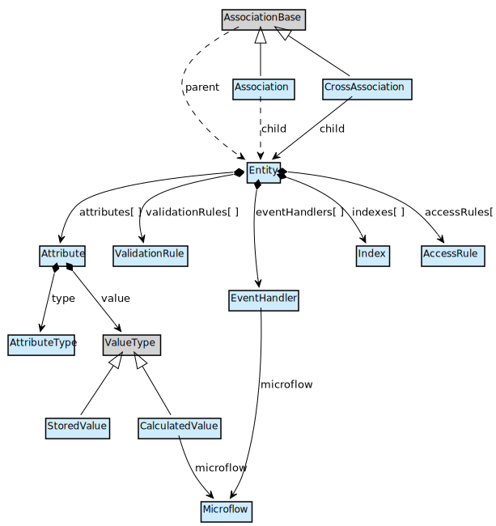
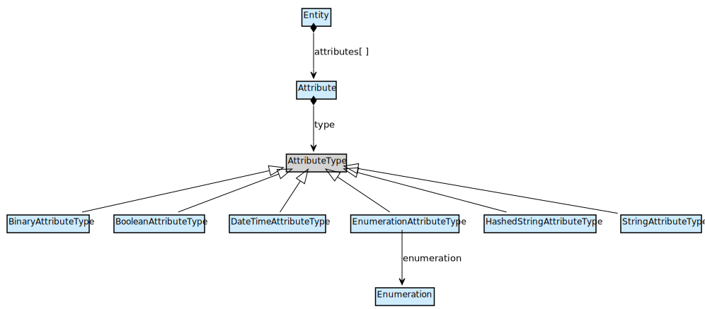
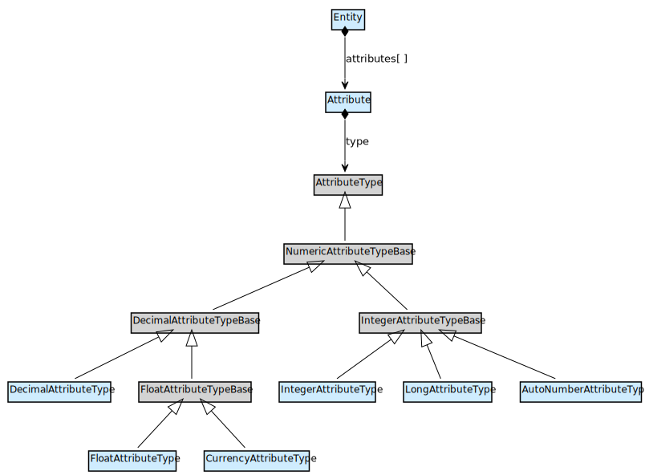
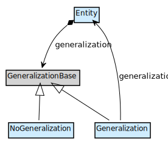
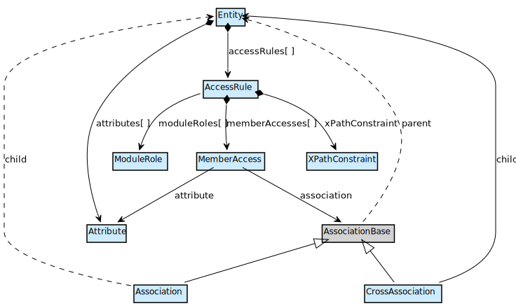
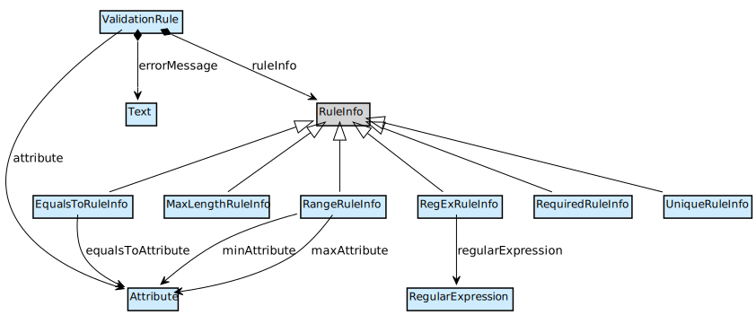
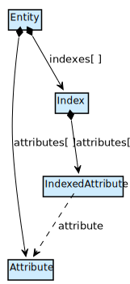

## Overview

The domain model represents the data that is stored in your app. Each module has a domain model, consisting of entities, which have attributes of a certain type and associations with other entities.

Attributes have a `value` which can either be a `StoredValue`, which is a value stored in the database, or a `CalculatedValue`, which is computed from a `Microflow`.

The entities can also relate to each other through generalizations. Finally, you can define access rules, validation rules, event handlers and indexes for entities.

### Graphical overview

Mendix Modeler Reference Guide | Model SDK API docs
-|
[Domain Model](/refguide6/domain-model) | TypeScript module [domainmodels](https://apidocs.mendix.com/modelsdk/latest/modules/domainmodels.html)
[Entities](/refguide6/entities) | [DomainModel](https://apidocs.mendix.com/modelsdk/latest/classes/domainmodels.domainmodel.html)
[Attributes](/refguide6/attributes) | [Entity](https://apidocs.mendix.com/modelsdk/latest/classes/domainmodels.entity.html)
[Associations](/refguide6/associations) | [Association](https://apidocs.mendix.com/modelsdk/latest/classes/domainmodels.association.html)
| [Attribute](https://apidocs.mendix.com/modelsdk/latest/classes/domainmodels.attribute.html)

## Attributes

Entities can have multiple attributes. Each attribute has a specific type.

### Graphical overview - Non-numeric attributes

### Graphical overview - Numeric attributes

Mendix Modeler Reference Guide | Model SDK API docs
-|
[Attributes](/refguide6/attributes) | Property [`attributes`](https://apidocs.mendix.com/modelsdk/latest/classes/domainmodels.entity.html#attributes) of Entity
| [Attribute](https://apidocs.mendix.com/modelsdk/latest/classes/domainmodels.attribute.html)
| [AttributeType](https://apidocs.mendix.com/modelsdk/latest/classes/domainmodels.attributetype.html)

## Generalization relationships

Entities can have a Generalization relationship with another entity. The entity is then called a Specialization. A specialization entity inherits all attributes, validation rules and access rules from its Generalization entity.

An `Entity` instance has a `generalization` property with which to define this relationship. It can either be set to a `NoGeneralization` instance if it is not a specialization of another entity, or it can be set to a `Generalization` instance. A `Generalization` instance has again a `generalization` property which must point to the entity that is the actual generalization.

### Graphical overview

Mendix Modeler Reference Guide | Model SDK API docs
-|
[Entities](/refguide6/entities) (section "Inheritance Properties") | Property [`generalization`](https://apidocs.mendix.com/modelsdk/latest/classes/domainmodels.entity.html#generalization) of Entity
| [GeneralizationBase](https://apidocs.mendix.com/modelsdk/latest/classes/domainmodels.generalizationbase.html)
| [Generalization](https://apidocs.mendix.com/modelsdk/latest/classes/domainmodels.generalization.html)
| [NoGeneralization](https://apidocs.mendix.com/modelsdk/latest/classes/domainmodels.nogeneralization.html)

## Access rules

To secure access to the data in a Mendix app, you can define access rules for entities. An access rule is always defined for a certain module role, defines to which attribute or association members that role has access, and the retrieved data is constrained by an xpath constraint.

### Graphical overview

Mendix Modeler Reference Guide | Model SDK API docs
-|
[Access rules](/refguide6/access-rules) | Property [`accessRules`](https://apidocs.mendix.com/modelsdk/latest/classes/domainmodels.entity.html#accessrules) of Entity
| [AccessRule](https://apidocs.mendix.com/modelsdk/latest/classes/domainmodels.accessrule.html)
| Property [`xpathConstraint`](https://apidocs.mendix.com/modelsdk/latest/classes/domainmodels.accessrule.html#xpathconstraint) of AccessRule
| [ModuleRole](https://apidocs.mendix.com/modelsdk/latest/classes/security.modulerole.html)

## Validation rules

For each attribute of an entity, it is possible to define a validation rule. The validation rule is applied to a single attribute, will show some error message, and it is a certain type of rule, e.g. the attribute needs to be equal to a certain value, or has a maximum length, or needs to be unique.

### Graphical overview

Mendix Modeler Reference Guide | Model SDK API docs
-|
[Validation Rules](/refguide6/validation-rules) | Property [`validationRules`](https://apidocs.mendix.com/modelsdk/latest/classes/domainmodels.entity.html#validationrules) of Entity
| [ValidationRule](https://apidocs.mendix.com/modelsdk/latest/classes/domainmodels.validationrule.html)
| [RuleInfo](https://apidocs.mendix.com/modelsdk/latest/classes/domainmodels.ruleinfo.html)

## Indexes

An entity can have multiple indexes. Each index consists of a set of indexed attributes.

### Graphical overview

Mendix Modeler Reference Guide | Model SDK API docs
-|
[Indexes](/refguide6/indexes) | Property [`indexes`](https://apidocs.mendix.com/modelsdk/latest/classes/domainmodels.entity.html#indexes) of Entity
| [Index](https://apidocs.mendix.com/modelsdk/latest/classes/domainmodels.index.html)
| [IndexedAttribute](https://apidocs.mendix.com/modelsdk/latest/classes/domainmodels.indexedattribute.html)
