## Overview

Microflows have parameters, a return type (the return value is defined in an object, see below), and allowed module roles. Rules are similar to microflows, but have rule parameters, and they do not have some Microflow-specific properties

#### Graphical overview

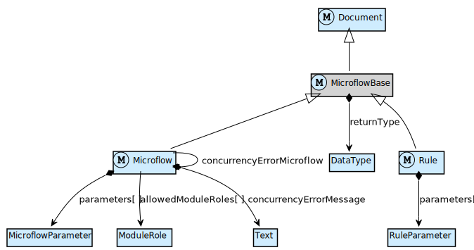

Mendix Modeler Reference Guide | Model SDK API docs
--- | --- |
The [Microflows](/refguide6/microflows) overview page | The [`microflows`](https://apidocs.mendix.com/modelsdk/latest/modules/microflows.html) package
[Microflow](/refguide6/microflow), technical information on properties of a microflow | [Microflow](https://apidocs.mendix.com/modelsdk/latest/classes/microflows.microflow.html)
[Rule](/refguide6/rules) | [Rule](https://apidocs.mendix.com/modelsdk/latest/classes/microflows.rule.html)
[Parameter](/refguide6/parameter) | [MicroflowParameter](https://apidocs.mendix.com/modelsdk/latest/classes/microflows.microflowparameter.html)

### Microflow & Rule structure

Microflows consist of a collection of objects connected by flows. The objects represent activities, such as Object manipulation & retrieval, microflow calls, web service calls, etc. (details follow below).

_For example, a simple microflow could consist of a start event, a single activity, and an end event. The `Microflow would then have three MicroflowObjects in its MicroflowObjectCollection, and would have two SequenceFlows. The first sequence flow would have the start event as its origin and the activity as its destination. The second sequence flow would have the activity as its origin, and the end event as its destination._

#### Graphical overview

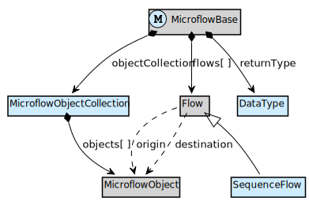

Mendix Modeler Reference Guide | Model SDK API docs
--- | --- |
[Activities](/refguide6/activities) | [MicroflowObjectCollection](https://apidocs.mendix.com/modelsdk/latest/classes/microflows.microflowobjectcollection.html)
[Sequence Flow](/refguide6/sequence-flow) | [SequenceFlow](https://apidocs.mendix.com/modelsdk/latest/classes/microflows.sequenceflow.html)

### Microflow objects

There are several types of objects that can be added to a microflow. One type is `Activity`, which can either be a loop, or an action activity, which will execute a microflow action (see the next section for more details on different types of activities). Other microflow object types include start and end events, splits and merges, annotations and parameters.

#### Graphical overview

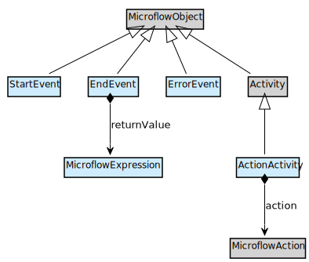

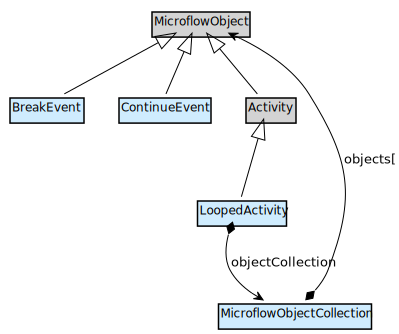

Mendix Modeler Reference Guide | Model SDK API docs
--- | --- |
[Activities](/refguide6/activities) | [MicroflowParameterObject](https://apidocs.mendix.com/modelsdk/latest/classes/microflows.microflowparameterobject.html), [Activity](https://apidocs.mendix.com/modelsdk/latest/classes/microflows.activity.html)
[Start](/refguide6/start-event) and [End](/refguide6/end-event) events | [StartEvent](https://apidocs.mendix.com/modelsdk/latest/classes/microflows.startevent.html), [EndEvent](https://apidocs.mendix.com/modelsdk/latest/classes/microflows.endevent.html)
[Loop](/refguide6/loop)s, with [Break](/refguide6/break-event) and [Continue](/refguide6/continue-event) events | [LoopedActivity](https://apidocs.mendix.com/modelsdk/latest/classes/microflows.loopedactivity.html), [BreakEvent](https://apidocs.mendix.com/modelsdk/latest/classes/microflows.breakevent.html), [ContinueEvent](https://apidocs.mendix.com/modelsdk/latest/classes/microflows.continueevent.html)
[Annotation](/refguide6/annotation) | [Annotation](https://apidocs.mendix.com/modelsdk/latest/classes/microflows.annotation.html)

### Flows

A microflow consists of objects that are connected by flows, specifically, `SequenceFlow`s. A flow has an origin and a destination, with which the order of objects in the microflow is defined.

An exclusive split on an enumeration has a sequence flow for each enumeration value. In the meta model, this is represented by the case value of the sequence flows. Each sequence flow has an enumeration case value with `value` set to the corresponding enumeration case. Boolean splits have two sequence flows, one for each of `true` and `false`, with each a corresponding case value.

Inheritance splits have sequence flows for each specialization of the entity type on which is split. Each sequence flow has an inheritance case value with as value the specialization entity.

Annotation flows are used to connect annotations to other microflow objects.

#### Graphical overview

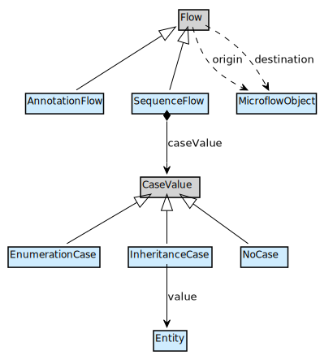

Mendix Modeler Reference Guide | Model SDK API docs
--- | --- |
[Sequence Flow](/refguide6/sequence-flow) | [Flow](https://apidocs.mendix.com/modelsdk/latest/classes/microflows.flow.html)
[Annotation flow](/refguide6/annotation-flow) | [SequenceFlow](https://apidocs.mendix.com/modelsdk/latest/classes/microflows.sequenceflow.html)
|[AnnotationFlow](https://apidocs.mendix.com/modelsdk/latest/classes/microflows.annotationflow.html)
|Properties [`origin`](https://apidocs.mendix.com/modelsdk/latest/classes/microflows.flow.html#origin) and [`destination`](https://apidocs.mendix.com/modelsdk/latest/classes/microflows.flow.html#destination) of Flow
|[CaseValue](https://apidocs.mendix.com/modelsdk/latest/classes/microflows.casevalue.html) and its inheritance hierarchy

### Splits

The control flow in microflows is defined with splits of two types: exclusive splits (for boolean or enumeration splits) and inheritance splits (for control based on specialization entity types). Two paths of control can be merged with an exclusive merge.

An exclusive split conditionally splits on either an expression or a rule. In case of a rule, a call is made, similar to a microflow call, with a rule parameter mapping.

#### Graphical overview

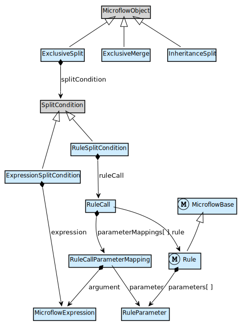

Mendix Modeler Reference Guide | Model SDK API docs
--- | --- |
[Exclusive Split](/refguide6/exclusive-split) |[ExclusiveSplit](https://apidocs.mendix.com/modelsdk/latest/classes/microflows.exclusivesplit.html)
[Inheritance Split](/refguide6/inheritance-split) |[InheritanceSplit](https://apidocs.mendix.com/modelsdk/latest/classes/microflows.inheritancesplit.html)
[Merge](/refguide6/merge) |[ExclusiveMerge](https://apidocs.mendix.com/modelsdk/latest/classes/microflows.exclusivemerge.html)
[Rules](/refguide6/rules) |[ExpressionSplitCondition](https://apidocs.mendix.com/modelsdk/latest/classes/microflows.expressionsplitcondition.html)
|[RuleSplitCondition](https://apidocs.mendix.com/modelsdk/latest/classes/microflows.rulesplitcondition.html)
|[RuleCall](https://apidocs.mendix.com/modelsdk/latest/classes/microflows.rulecall.html)
|[RuleCallParameterMapping](https://apidocs.mendix.com/modelsdk/latest/classes/microflows.rulecallparametermapping.html)

## Microflow activities

### Working with objects

Objects can be manipulated in microflows through several activities. New objects can be created. Existing objects can be retrieved (see the next subsection for details). All objects can be updated or deleted. All changes (including creation and deletion) can be committed or rolled back.

Object attributes can be updated with a change action, both in a create action and in an update action.These actions have a list of items that describe which attribute or association is set, to a certain value.

#### Graphical overview

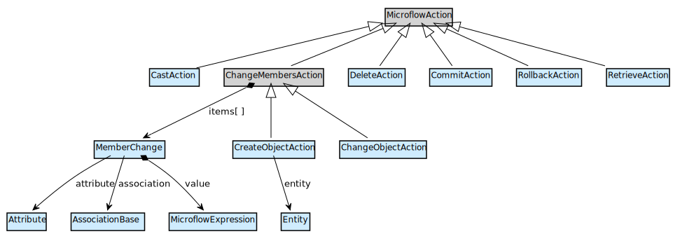

Mendix Modeler Reference Guide | Model SDK API docs
--- | --- |
[Create Object](/refguide6/create-object) |[CreateObjectAction](https://apidocs.mendix.com/modelsdk/latest/classes/microflows.createobjectaction.html) and [ChangeObjectAction](https://apidocs.mendix.com/modelsdk/latest/classes/microflows.changeobjectaction.html) ([ChangeMembersAction](https://apidocs.mendix.com/modelsdk/latest/classes/microflows.changemembersaction.html), [MemberChange](https://apidocs.mendix.com/modelsdk/latest/classes/microflows.memberchange.html))
[Change Object](/refguide6/change-object) | [DeleteAction](https://apidocs.mendix.com/modelsdk/latest/classes/microflows.deleteaction.html)
[Rollback Object](/refguide6/rollback-object) |[CommitAction](https://apidocs.mendix.com/modelsdk/latest/classes/microflows.commitaction.html) and [RollbackAction](https://apidocs.mendix.com/modelsdk/latest/classes/microflows.rollbackaction.html)

### Retrieving Objects

A retrieve action is either an association-based retrieve or a database-based retrieve. An association-based retrieve points to a specific association and retrieves the relevant objects over that association. A database-based retrieve directly accesses the database and provides control over the XPath constraint, sorting of the retrieved objects and the range of objects to retrieve.

#### Graphical overview

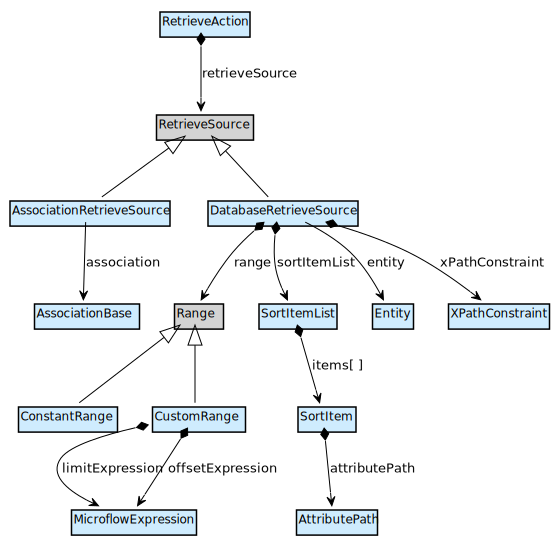

Mendix Modeler Reference Guide | Model SDK API docs
--- | --- |
[Retrieve](/refguide6/retrieve) |[RetrieveSource](https://apidocs.mendix.com/modelsdk/latest/classes/microflows.retrievesource.html)
[XPath](/refguide6/xpath) constraints |[AssocationRetrieveSource](https://apidocs.mendix.com/modelsdk/latest/classes/microflows.associationretrievesource.html)
|[DatabaseRetrieveSource](https://apidocs.mendix.com/modelsdk/latest/classes/microflows.databaseretrievesource.html)
|[Range](https://apidocs.mendix.com/modelsdk/latest/classes/microflows.range.html), [ConstantRange](https://apidocs.mendix.com/modelsdk/latest/classes/microflows.constantrange.html) and [CustomRange](https://apidocs.mendix.com/modelsdk/latest/classes/microflows.customrange.html)
|[SortItemList](https://apidocs.mendix.com/modelsdk/latest/classes/microflows.sortitemlist.html) and [SortItem](https://apidocs.mendix.com/modelsdk/latest/classes/microflows.sortitem.html)

### Microflow Calls

Microflows can call other microflows by defining a mapping of expressions to parameters (of the called microflow).

#### Graphical overview

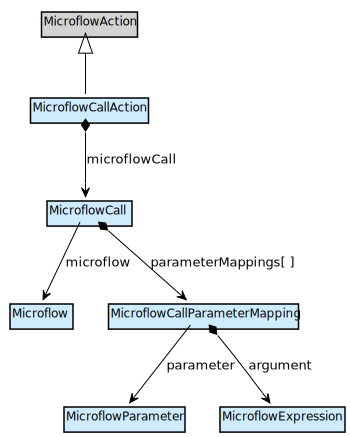

Mendix Modeler Reference Guide | Model SDK API docs
--- | --- |
[Microflow Call](/refguide6/microflow-call) |[MicroflowCallAction](https://apidocs.mendix.com/modelsdk/latest/classes/microflows.microflowcallaction.html)
|[MicroflowCall](https://apidocs.mendix.com/modelsdk/latest/classes/microflows.microflowcall.html)
|[MicroflowCallParameterMapping](https://apidocs.mendix.com/modelsdk/latest/classes/microflows.microflowcallparametermapping.html)

### Web Client activities

Microflows can trigger behavior in the browser: showing and closing pages, showing (popup) messages, providing validation feedback and triggering file downloads.

#### Graphical overview

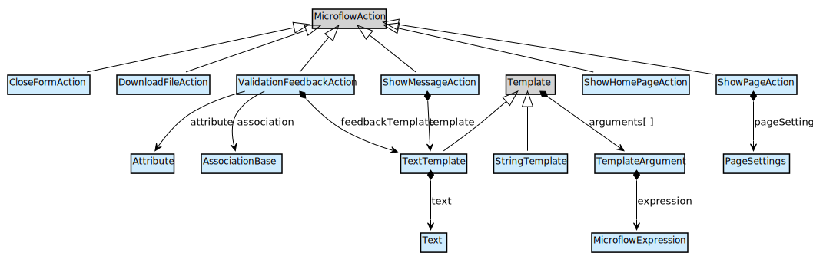

Mendix Modeler Reference Guide | Model SDK API docs
--- | --- |
[Show Page](/refguide6/show-page) and [Show Home Page](/refguide6/show-home-page) |[ShowPageAction](https://apidocs.mendix.com/modelsdk/latest/classes/microflows.showpageaction.html) and [ShowHomePageAction](https://apidocs.mendix.com/modelsdk/latest/classes/microflows.showhomepageaction.html)
[Close Page](/refguide6/close-form) |[CloseFormAction](https://apidocs.mendix.com/modelsdk/latest/classes/microflows.closeformaction.html)
[Show Message](/refguide6/show-message) |[ShowMessageAction](https://apidocs.mendix.com/modelsdk/latest/classes/microflows.showmessageaction.html)
[Validation Feedback](/refguide6/validation-feedback) |[ValidationFeedbackAction](https://apidocs.mendix.com/modelsdk/latest/classes/microflows.validationfeedbackaction.html)
[Download File](/refguide6/download-file) |[DownloadFileAction](https://apidocs.mendix.com/modelsdk/latest/classes/microflows.downloadfileaction.html)

### App service calls

An app service call action points to a specific app service action (which is part of a consumed app service). The action call has a list of parameter mappings of app service action parameters to expressions.

#### Graphical overview

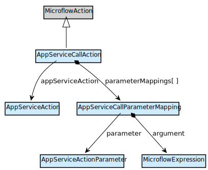

Mendix Modeler Reference Guide | Model SDK API docs
--- | --- |
[Consumed App Services](/refguide6/consumed-app-services) |[AppServiceCallAction](https://apidocs.mendix.com/modelsdk/latest/classes/microflows.appservicecallaction.html)
|[AppServiceAction](https://apidocs.mendix.com/modelsdk/latest/classes/appservices.appserviceaction.html)
|[AppServiceCallParameterMapping](https://apidocs.mendix.com/modelsdk/latest/classes/microflows.appservicecallparametermapping.html)
|[AppServiceActionParameter](https://apidocs.mendix.com/modelsdk/latest/classes/appservices.appserviceactionparameter.html)

### Web service calls

A web service call to an imported web service has an HTTP configuration, and a request and response handling configuration to map the request and response parameters of the third-party web service operation to Mendix app concepts.

#### Graphical overview

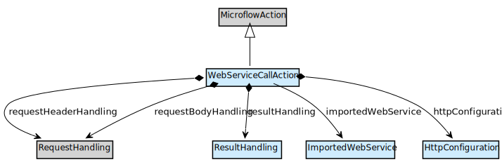

See the following diagrams for details on the HTTP configuration, request handling, and response handling.

Mendix Modeler Reference Guide | Model SDK API docs
--- | --- |
[Call Web Service](/refguide6/call-web-service) |[WebServiceCallAction](https://apidocs.mendix.com/modelsdk/latest/classes/microflows.webservicecallaction.html)
|[HttpConfiguration](https://apidocs.mendix.com/modelsdk/latest/classes/microflows.httpconfiguration.html)
|[RequestHandling](https://apidocs.mendix.com/modelsdk/latest/classes/microflows.requesthandling.html) and [ResultHandling](https://apidocs.mendix.com/modelsdk/latest/classes/microflows.resulthandling.html)

### Web service calls - Request HTTP configuration

An HTTP configuration has an optional custom endpoint location, authentication credentials, and optional HTTP headers.

#### Graphical overview

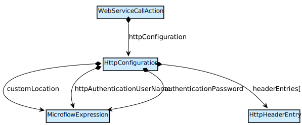

Mendix Modeler Reference Guide | Model SDK API docs
--- | --- |
[Call Web Service](/refguide6/call-web-service) |[HttpConfiguration](https://apidocs.mendix.com/modelsdk/latest/classes/microflows.httpconfiguration.html)
|[HttpHeaderEntry](https://apidocs.mendix.com/modelsdk/latest/classes/microflows.httpheaderentry.html)

### Web service calls - Request handling

A web service operation request needs to be mapped from Mendix app concepts to the specifics of the web service operation. There are four different ways in which request handling can be configured. Each has its own specific configuration options.

1.  Export Mapping - The recommended option whenever you are sending complex XML objects (non-primitives) to a third party.
2.  Simple Parameter Mapping - Use this option when you are just sending primitive values to a third party. The argument can be any MicroflowExpression producing a value compatible with the parameter type. The ElementPath is a string representing the place in the element tree of the parameter in the XML message.
3.  Advanced Parameter Mapping - This is a combination of the above two mappings, starting one level deeper in the XML hierarchy than a regular export mapping. Use a MicroflowExpression for a primitive value and an ExportMapping for a complex one.
4.  Custom mapping - Specify the XML to be sent manually. Powerful yet dangerous.

#### Graphical overview

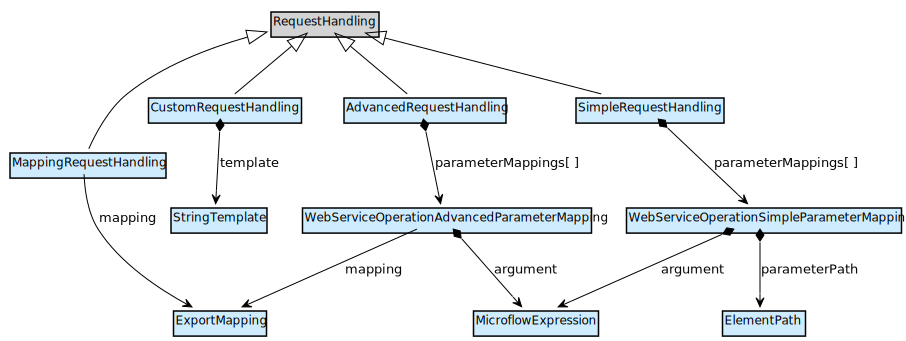

Mendix Modeler Reference Guide | Model SDK API docs
--- | --- |
[Call Web Service](/refguide6/call-web-service) |[RequestHandling](https://apidocs.mendix.com/modelsdk/latest/classes/microflows.requesthandling.html)
|[SimpleRequestHandling](https://apidocs.mendix.com/modelsdk/latest/classes/microflows.simplerequesthandling.html) - [WebServiceOperationSimpleParameterMapping](https://apidocs.mendix.com/modelsdk/latest/classes/microflows.webserviceoperationsimpleparametermapping.html)
|[AdvancedRequestHandling](https://apidocs.mendix.com/modelsdk/latest/classes/microflows.advancedrequesthandling.html) - [WebServiceOperationAdvancedParameterMapping](https://apidocs.mendix.com/modelsdk/latest/classes/microflows.webserviceoperationadvancedparametermapping.html)
|[MappingRequestHandling](https://apidocs.mendix.com/modelsdk/latest/classes/microflows.mappingrequesthandling.html)
|[CustomRequestHandling](https://apidocs.mendix.com/modelsdk/latest/classes/microflows.customrequesthandling.html)

### Web service calls - Response handling

The result of a web service operation needs to be mapped to Mendix app concepts with an import mapping call which uses an import mapping. The range of objects to map can also be controlled.

#### Graphical overview

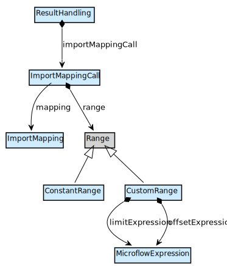

Mendix Modeler Reference Guide | Model SDK API docs
--- | --- |
[Call Web Service](/refguide6/call-web-service) |[ResultHandling](https://apidocs.mendix.com/modelsdk/latest/classes/microflows.resulthandling.html)
|[ImportMappingCall](https://apidocs.mendix.com/modelsdk/latest/classes/microflows.importmappingcall.html)
|[ImportMapping](https://apidocs.mendix.com/modelsdk/latest/classes/importmappings.importmapping.html)
|[Range](https://apidocs.mendix.com/modelsdk/latest/classes/microflows.range.html)

### Variables

Microflow variables can be created and changed with specific actions. A create variable action also has a data type to indicate the type of the newly created variable.

#### Graphical overview

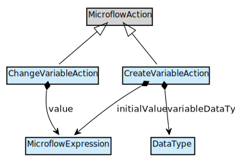

Mendix Modeler Reference Guide | Model SDK API docs
--- | --- |
[Create Variable](/refguide6/create-variable) |[CreateVariableAction](https://apidocs.mendix.com/modelsdk/latest/classes/microflows.createvariableaction.html)
[Change Variable](/refguide6/change-variable) |[ChangeVariableAction](https://apidocs.mendix.com/modelsdk/latest/classes/microflows.changevariableaction.html)

### Lists

Lists can be created, changed and deleted with specific actions. List aggregation actions have a specific function (e.g. sum or average). List operations can also be executed, see the following sections for details.

#### Graphical overview

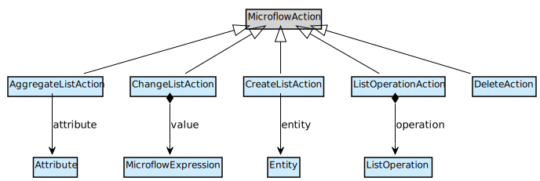

Mendix Modeler Reference Guide | Model SDK API docs
--- | --- |
[Create List](/refguide6/create-list) |[CreateListAction](https://apidocs.mendix.com/modelsdk/latest/classes/microflows.createlistaction.html)
[Change List](/refguide6/change-list) |[ChangeListAction](https://apidocs.mendix.com/modelsdk/latest/classes/microflows.changelistaction.html)
[Aggregate List](/refguide6/aggregate-list) |[DeleteAction](https://apidocs.mendix.com/modelsdk/latest/classes/microflows.deleteaction.html)
[List Operation](/refguide6/list-operation) |[AggregateListAction](https://apidocs.mendix.com/modelsdk/latest/classes/microflows.aggregatelistaction.html)
|[ListOperationAction](https://apidocs.mendix.com/modelsdk/latest/classes/microflows.listoperationaction.html) and [ListOperation](https://apidocs.mendix.com/modelsdk/latest/classes/microflows.listoperation.html)

### Lists - Operations

Lists can be manipulated with different types of operations. Lists can be sorted, with a list of sorting items. Head and tail provide the first and remainder of a list, respectively. Find and filter respectively pick one and all elements of a list that adhere to some condition.

#### Graphical overview

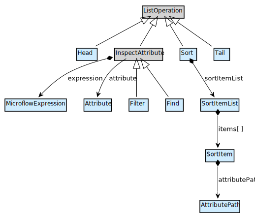

Mendix Modeler Reference Guide | Model SDK API docs
--- | --- |
[List Operation](/refguide6/list-operation) |[ListOperation](https://apidocs.mendix.com/modelsdk/latest/classes/microflows.listoperation.html)
|[Head](https://apidocs.mendix.com/modelsdk/latest/classes/microflows.head.html) and [Tail](https://apidocs.mendix.com/modelsdk/latest/classes/microflows.tail.html)
|[Sort](https://apidocs.mendix.com/modelsdk/latest/classes/microflows.sort.html), [SortItemList](https://apidocs.mendix.com/modelsdk/latest/classes/microflows.sortitemlist.html) and [SortItem](https://apidocs.mendix.com/modelsdk/latest/classes/microflows.sortitem.html)
|[Filter](https://apidocs.mendix.com/modelsdk/latest/classes/microflows.filter.html) and [Find](https://apidocs.mendix.com/modelsdk/latest/classes/microflows.find.html)

### Lists - Binary operations

Lists can be manipulated with several binary operations, which take two lists as input.

#### Graphical overview

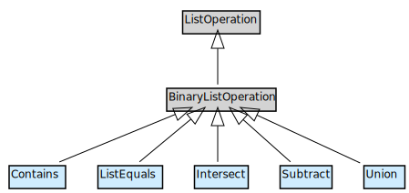

Mendix Modeler Reference Guide | Model SDK API docs
--- | --- |
[List Operation](/refguide6/list-operation) |[BinaryListOperation](https://apidocs.mendix.com/modelsdk/latest/classes/microflows.binarylistoperation.html)
|[Contains](https://apidocs.mendix.com/modelsdk/latest/classes/microflows.contains.html)
|[Intersect](https://apidocs.mendix.com/modelsdk/latest/classes/microflows.intersect.html)
|[ListEquals](https://apidocs.mendix.com/modelsdk/latest/classes/microflows.listequals.html)
|[Subtract](https://apidocs.mendix.com/modelsdk/latest/classes/microflows.subtract.html)
|[Union](https://apidocs.mendix.com/modelsdk/latest/classes/microflows.union.html)

### Java action calls

Java action calls point to a specific Java action and have a parameter mapping with an expression for every parameter of the Java action.

#### Graphical overview

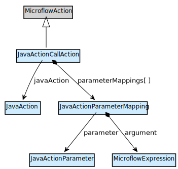

Mendix Modeler Reference Guide | Model SDK API docs
--- | --- |
[Java Action Call](/refguide6/java-action-call) |[JavaAction](https://apidocs.mendix.com/modelsdk/latest/classes/javaactions.javaaction.html)
|[JavaActionParameter](https://apidocs.mendix.com/modelsdk/latest/classes/javaactions.javaactionparameter.html)
|[JavaActionCallAction](https://apidocs.mendix.com/modelsdk/latest/classes/microflows.javaactioncallaction.html)
|[JavaActionParameterMapping](https://apidocs.mendix.com/modelsdk/latest/classes/microflows.javaactionparametermapping.html)

### Logging

Logging actions target a single log node on a specific log level. The log message is parameterized.

#### Graphical overview

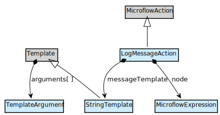

Mendix Modeler Reference Guide | Model SDK API docs
--- | --- |
[Log Message](/refguide6/log-message) |[LogMessageAction](https://apidocs.mendix.com/modelsdk/latest/classes/microflows.logmessageaction.html)
|[LogLevel](https://apidocs.mendix.com/modelsdk/latest/classes/microflows.loglevel.html)
|[StringTemplate](https://apidocs.mendix.com/modelsdk/latest/classes/microflows.stringtemplate.html)
|[TemplateArgument](https://apidocs.mendix.com/modelsdk/latest/classes/microflows.templateargument.html)

### Importing & Exporting XML

XML import actions use an XML-to-domain mapping similar to web service response mappings.

XML export actions use a domain-to-XML mapping similar to web service request mappings.

#### Graphical overview

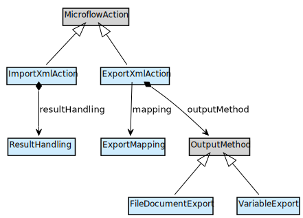

Model SDK API docs

*   [ImportXmlAction](https://apidocs.mendix.com/modelsdk/latest/classes/microflows.importxmlaction.html)
*   [ResultHandling](https://apidocs.mendix.com/modelsdk/latest/classes/microflows.resulthandling.html)
*   [ExportXmlAction](https://apidocs.mendix.com/modelsdk/latest/classes/microflows.exportxmlaction.html)
*   [ExportMapping](https://apidocs.mendix.com/modelsdk/latest/classes/exportmappings.exportmapping.html)
*   [FileDocumentExport](https://apidocs.mendix.com/modelsdk/latest/classes/microflows.filedocumentexport.html)
*   [VariableExport](https://apidocs.mendix.com/modelsdk/latest/classes/microflows.variableexport.html)

### Document generation

Documents are generated from a document template. Such a template has parameters, which are mapped with a parameter mapping at each call site.

#### Graphical overview

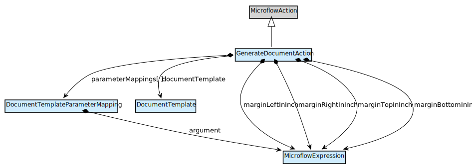

Mendix Modeler Reference Guide | Model SDK API docs
--- | --- |
[Generate Document](/refguide6/generate-document) |[GenerateDocumentAction](https://apidocs.mendix.com/modelsdk/latest/classes/microflows.generatedocumentaction.html)
|[DocumentTemplate](https://apidocs.mendix.com/modelsdk/latest/classes/documenttemplates.documenttemplate.html)
|[DocumentTemplateParameterMapping](https://apidocs.mendix.com/modelsdk/latest/classes/microflows.documenttemplateparametermapping.html)
