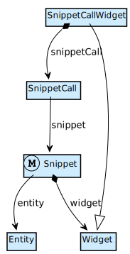
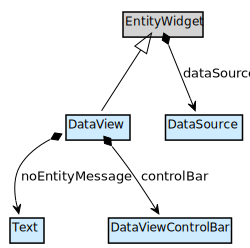

This page contains detailed explanations on how pages, layouts, and page content is structured. You can use this as reference when you are creating scripts for the SDK, for creating or analyzing models.

## Overview

Pages are defined based on Layouts (see below). Pages, Layouts and Snippets inherit from FormBase, through which a list of top level widgets on the page can be defined. To secure access to pages, you can define allowed module roles for each page.

Mendix Modeler Reference Guide | Model SDK API docs
--- | --- |
[Pages overview](/refguide6/pages) | [Page](https://apidocs.mendix.com/modelsdk/latest/classes/pages.page.html)
[Page](/refguide6/page) | [FormBase](https://apidocs.mendix.com/modelsdk/latest/classes/pages.formbase.html)
 | [LayoutCall](https://apidocs.mendix.com/modelsdk/latest/classes/pages.layoutcall.html)

## Layouts

A Page can have a LayoutCall to render a Layout. As a Layout has zero or more LayoutParameters, the amount of LayoutCallArguments the LayoutCall needs is equal to the amount of LayoutParameters.

A Layout can contain one or more Widgets or Placeholders. For each Placeholder, the Layout will have a LayoutParameter. A LayoutCall that targets that Layout will have a LayoutCallArgument for each LayoutParameter/Placeholder pair.

Modeler Reference Guide | Model SDK API docs
--- | --- |
[Layout](/refguide6/layout) | [Page](https://apidocs.mendix.com/modelsdk/latest/classes/pages.page.html)
| [Layout](https://apidocs.mendix.com/modelsdk/latest/classes/pages.layout.html)
| [LayoutParameter](https://apidocs.mendix.com/modelsdk/latest/classes/pages.layoutparameter.html)
| [Placeholder](https://apidocs.mendix.com/modelsdk/latest/classes/pages.placeholder.html)
| [LayoutCall](https://apidocs.mendix.com/modelsdk/latest/classes/pages.layoutcall.html)
| [LayoutCallArgument](https://apidocs.mendix.com/modelsdk/latest/classes/pages.layoutcallargument.html)

## Snippets

Snippets are reusable interface parts that allow you to create a more maintainable interface. If you use a snippet in multiple pages, you only have to make a change once, and the result will be visible everywhere. For example, you can create a snippet with some navigation links, and include that on several pages. If you make a change in the snippet, all the pages will benefit.

Similar to Layout and Page, a Snippet inherits from FormBase. You can add any widget to it, and it can be connected to an Entity in order for its contents to be populated. A Page can contain multiple Snippets, but only one Layout.

For a Page to include a Snippet, it needs to use the SnippetCallWidget which, in turn, calls the Snippet.

Modeler Reference Guide | Model SDK API docs
--- | --- |
[Snippet](/refguide6/snippet) | [Snippet](https://apidocs.mendix.com/modelsdk/latest/classes/pages.snippet.html)
| [SnippetCall](https://apidocs.mendix.com/modelsdk/latest/classes/pages.snippetcall.html)
| [SnippetCallWidget](https://apidocs.mendix.com/modelsdk/latest/classes/pages.snippetcallwidget.html)

## Data Widgets

Data widgets display data that they retrieve from a Data Source (see below). Typically, data widgets offer an aggregate view of multiple entities or a view of a single entity.

### ListView

A ListView is a widget that can contain other widgets or list of objects. The Client Action is the action that is performed when a list view entry is 'clicked'. This can either be opening a page or calling a microflow. If the entity that is connected to the list view has specializations, you can optionally specify templates for each specialization. This is what the ListViewTemplate can be used for.

Conditional visibility settings can determine whether or not the list view is visible, based on either an attribute value and/or module roles.

### Data view

The data view is a central component in Mendix applications. The data view typically contains input widgets, like text boxes with labels. In more complex screens, a data view can contain tab controls per topic, and data views and data grids for related objects.

If a `noEntityMessage` is specified, a data view that receives no source data will show this message instead of its content. Otherwise, the data view will show its static content and disabled input widgets. This property is a translatable text. See [Translatable Texts](/refguide6/translatable-texts).

The control bar of the data view can have the following buttons: save, cancel, close, and microflow. A typical data view has a save and a cancel button. If it is not editable, a close button is sufficient. Microflow buttons trigger custom microflows that have been defined in the model.

Modeler Reference Guide | Model SDK API docs
--- | --- |
[List View](/refguide6/list-view) | [ListView](https://apidocs.mendix.com/modelsdk/latest/classes/pages.listview.html)
[Data view](/refguide6/data-view) | [ListViewTemplate](https://apidocs.mendix.com/modelsdk/latest/classes/pages.listviewtemplate.html)
[Data view control bar](/refguide6/data-view-control-bar) | [DataView](https://apidocs.mendix.com/modelsdk/latest/classes/pages.dataview.html)
| [DataViewControlBar](https://apidocs.mendix.com/modelsdk/latest/classes/pages.dataviewcontrolbar.html)
| [ConditionalVisibilitySettings](https://apidocs.mendix.com/modelsdk/latest/classes/pages.conditionalvisibilitysettings.html)

## Data Sources

Most simple input widgets derive their content from their context. A text box will, for instance, only allow input for attributes of the target entity. The exceptions are widgets that require an entire object or a list of objects to function. The contents for these widgets can be supplied by four distinct methods:

*   [Directly from the database](/refguide6/database-source)
*   [By association to an object already in the context](/refguide6/association-source)
*   [By microflow](/refguide6/microflow-source)
*   [By an object chosen from a grid or list view displayed in the same page (called 'listening')](/refguide6/listen-to-grid-source)

All Data Sources, except the last two (MicroflowSource and ListenTargetSource), need an EntityPath to know which entity they are connected to. An EntityPath takes a form like `MyFirstModule.Example_Account/Administration.Account.` In this example we are dealing with an association between the entity Example in the module MyFirstModule and the entity Account in the module Administration.

There are basically two ways to retrieve entities from the database:

1.  By using a `ListViewDatabaseSource` or `GridDatabaseSource` (depending on the type of widget) and, if required, adding individual `DatabaseConstraint`s to it, or
2.  By specifying an XPath query yourself.

An `ImageViewerSource` only works with the ImageViewer widget and is restricted to (specializations of) the `System.Image` entity.

Modeler Reference Guide | Model SDK API docs
--- | --- |
[Data Sources](/refguide6/data-sources) | [DataSource](https://apidocs.mendix.com/modelsdk/latest/classes/pages.datasource.html)
[Listen to Grid Source](/refguide6/listen-to-grid-source) | [DatabaseConstraint](https://apidocs.mendix.com/modelsdk/latest/classes/pages.databaseconstraint.html)
[XPath](/refguide6/xpath) | [SortableEntityPathSource](https://apidocs.mendix.com/modelsdk/latest/classes/pages.sortableentitypathsource.html)

## Grids

Grids share a Control Bar that allows you to manipulate the objects displayed, by means of buttons. Furthermore, grids have to be connected to a Data Source.  A grid has properties, like the number of columns, number of rows, selectionMode, and selectFirst. These can be used to control the behavior of the Template Grid widget.

### TemplateGrid

A TemplateGrid is a widget that can contain other widgets, or display a grid of objects.

### Data grid

The data grid shows a list of objects in a grid. For example, a data grid can show all the orders a customer has placed. Using controls provided by the data grid you can browse, search, and edit those objects.

### Reference set selector

The reference set selector allows you to set an association of type _reference set_ by selecting objects. For example, if customers can belong to several groups, a reference set selector can be used to select the groups the customer belongs to. This requires that there is an association from customer to a group of type _reference set_ in the domain model.

Modeler Reference Guide | Model SDK API Docs
--- | --- |
[Template grid](/refguide6/template-grid) | [TemplateGrid](https://apidocs.mendix.com/modelsdk/latest/classes/pages.templategrid.html)
[Data grid](/refguide6/data-grid) | [DataGrid](https://apidocs.mendix.com/modelsdk/latest/classes/pages.datagrid.html)
[Reference set selector](/refguide6/reference-set-selector) | [ReferenceSetSelector](https://apidocs.mendix.com/modelsdk/latest/classes/pages.referencesetselector.html)
[Control Bar](/refguide6/control-bar) | [GridControlBar](https://apidocs.mendix.com/modelsdk/latest/classes/pages.gridcontrolbar.html)

## Buttons

Button widgets perform an action when clicked. They can be rendered as a button or a hyperlink (RenderType). The ButtonStyle enumeration determines the visual cues for Warning, Success, and other styles that can be applied to the Button. A Button may refer to an Icon. Icons can either be ImageIcons (containing a bitmap image) or GlyphIcons (containing a UTF-8 code referring to a glyph from the [Bootstrap Halflings collection](http://getbootstrap.com#glyphicons)). The tooltip property determines the text you will see in the tooltip that appears when you hover over the button. The tooltip text is translatable. It can also be templated with the help of a ClientTemplate, in which case the text content of the button will be parameterizable (dynamic).

Modeler Reference Guide | Model SDK API Docs
--- | --- |
[Button Widgets](/refguide6/button-widgets) | [Button](https://apidocs.mendix.com/modelsdk/latest/classes/pages.button.html)
[Action Button](/refguide6/action-button) | [ButtonStyle](https://apidocs.mendix.com/modelsdk/latest/classes/pages.buttonstyle.html)
[Translatable Texts](/refguide6/translatable-texts) | [RenderType](https://apidocs.mendix.com/modelsdk/latest/classes/pages.rendertype.html)
| [Icon](https://apidocs.mendix.com/modelsdk/latest/classes/pages.icon.html)
| [Text](https://apidocs.mendix.com/modelsdk/latest/classes/texts.text.html)
| [ClientTemplate](https://apidocs.mendix.com/modelsdk/latest/classes/pages.clienttemplate.html)

## Containers

DivContainers, Split Panes, Group Boxes, LayoutGridColumns, ScrollContainerRegions, and TabPages are widgets whose basic function is to contain other widgets. With the exception of SplitPanes, which refer to a VerticalFlow widget that, in turn, contains a list of other widgets. Split Panes (**deprecated** in favor of ScrollContainer) each refer to a firstWidget and secondWidget to fill their contents. ScrollContainers have regions (left, right, top, bottom, center) that each refer to contained widgets. TabContainers contain an array of TabPages, and one of those must be the default visible page.

Modeler Reference Guide | Model SDK API docs
--- | --- |
[Tab page](/refguide6/tab-page) | [TabPage](https://apidocs.mendix.com/modelsdk/latest/classes/pages.tabpage.html)
[Layout grid](/refguide6/layout-grid) | [LayoutGrid](https://apidocs.mendix.com/modelsdk/latest/classes/pages.layoutgrid.html)
[Container](/refguide6/container) | [DivContainer](https://apidocs.mendix.com/modelsdk/latest/classes/pages.divcontainer.html)
[Vertical Split Pane](/refguide6/vertical-split-pane) | [SplitPane](https://apidocs.mendix.com/modelsdk/latest/classes/pages.splitpane.html)
[Scroll Container](/refguide6/scroll-container) | [ScrollContainer](https://apidocs.mendix.com/modelsdk/latest/classes/pages.scrollcontainer.html)

## Association widgets

The _reference selector_ is an input widget that can be used to display and edit associations. The _reference set selector_ allows you to set an association of type reference set by selecting objects. When the value of an association widget changes, a microflow can be triggered. The way in which this happens is determined by the MicroflowSettings. An Association is, by nature, associated to an entity. Where this entity is retrieved from can be determined using a SelectorSource. There are two types of selector sources: one using an XPath query, and one that triggers a Microflow.

Modeler Reference Guide | Model SDK API docs
--- | --- |
[Associations](/refguide6/associations) | [InputReferenceSelector](https://apidocs.mendix.com/modelsdk/latest/classes/pages.inputreferencesetselector.html)
[Input Widgets](/refguide6/input-widgets) | [ReferenceSetSelector](https://apidocs.mendix.com/modelsdk/latest/classes/pages.referencesetselector.html)
[Reference selector](/refguide6/reference-selector) | [PageSettings](https://apidocs.mendix.com/modelsdk/latest/classes/pages.pagesettings.html)
[Reference set selector](/refguide6/reference-set-selector) | [MicroflowSettings](https://apidocs.mendix.com/modelsdk/latest/classes/pages.microflowsettings.html)
[Starting Microflows](/refguide6/starting-microflows) |
[Opening Pages](/refguide6/opening-pages) |

## Related Content

*   Blog: [Designing Flexible User Interfaces with Layouts](https://www.mendix.com/blog/designing-flexible-user-interfaces-layouts/)
*   Blog: [Creating Maintainable Interfaces with Snippets](https://www.mendix.com/blog/creating-maintainable-interfaces-with-snippets/)
*   Blog: [Introducing Support for Glyphicons in Mendix](https://www.mendix.com/blog/introducing-support-for-glyphicons-in-mendix/)
