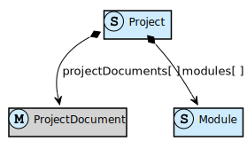
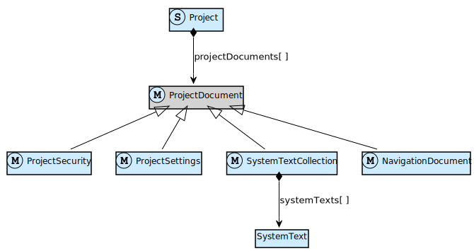
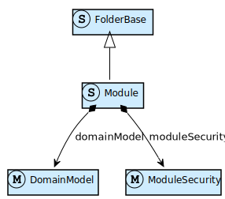
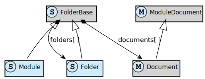

## Overview

A Mendix app model starts with a project. A project contains several top-level or project documents such as settings and security, and it contains the modules that make up a Mendix app.

### Graphical overview

Studio Pro Guide | Model SDK API docs
-|-
[Project](/refguide/project) |TypeScript module [projects](https://apidocs.mendix.com/modelsdk/latest/modules/projects.html)
[Modules](/refguide/modules) |[Project](https://apidocs.mendix.com/modelsdk/latest/classes/projects.project.html)
|[Module](https://apidocs.mendix.com/modelsdk/latest/classes/projects.module.html)
|[ProjectDocument](https://apidocs.mendix.com/modelsdk/latest/classes/projects.projectdocument.html)

### Project documents

Project-level documents describe project security, project settings, app navigation (for the different modes of navigation) and translations of the texts in your app.

#### Graphical overview

Studio Pro Guide | Model SDK API docs
-|-
[Project Settings](/refguide/project-settings) |[ProjectDocument](https://apidocs.mendix.com/modelsdk/latest/classes/projects.projectdocument.html) and its inheritance hierarchy
[Project Security](/refguide/project-security) |
[Navigation](/refguide/navigation) |
[System Texts](/refguide/system-texts) |

## Modules

### Overview

A module consists of a domain model, model security settings and zero or more documents (e.g. microflows, pages).

#### Graphical overview

Studio Pro Guide | Model SDK API docs
-|-
[Domain Model](/refguide/domain-model) | Property [`domainModel`](https://apidocs.mendix.com/modelsdk/latest/classes/projects.module.html#domainmodel) of Project
[Module Security](/refguide/module-security) | Property [`moduleSecurity`](https://apidocs.mendix.com/modelsdk/latest/classes/projects.module.html#modulesecurity) of Project

### Documents

Modules consist of documents, e.g. microflows, pages or published or consumed services. These documents can be organized with folders.

In this sense, Module and Folder behave in the exact same way, and thus inherit from FolderBase: they both contain documents and folders.

#### Graphical overview

Studio Pro Guide | Model SDK API docs
-|-
[Modules](/refguide/modules) |Property [`modules`](https://apidocs.mendix.com/modelsdk/latest/classes/projects.project.html#modules) of Project
|[Module](https://apidocs.mendix.com/modelsdk/latest/classes/projects.module.html)
|[FolderBase](https://apidocs.mendix.com/modelsdk/latest/classes/projects.folderbase.html)
|[Folder](https://apidocs.mendix.com/modelsdk/latest/classes/projects.folder.html)
|[ModuleDocument](https://apidocs.mendix.com/modelsdk/latest/classes/projects.moduledocument.html)
|[Document](https://apidocs.mendix.com/modelsdk/latest/classes/projects.document.html)
