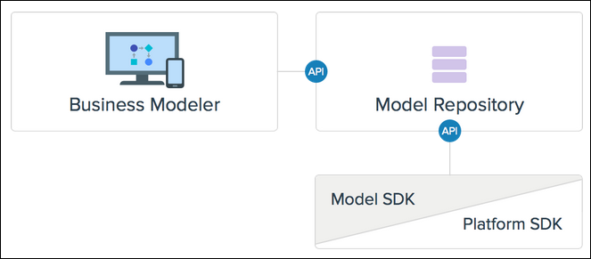

## 1 Introduction

The Mendix Platform SDK is a TypeScript- & JavaScript-based  SDK that, through the Model SDK, provides access to the inner-workings of every Mendix app. 

With the Platform SDK and Model SDK, you can do the following:

* "Read" from your app model (for example, analyze the quality of your app model, or generate a high-level diagram to document your app)
* "Write" to your app model (for example, create a new entity in your domain model, add an activity to an existing microflow, even generate  a whole new Mendix app based on a legacy code base)

 

Basically, the Platform SDK and Model SDK allow you to automate any tedious or error-prone task. If you imagine it, there's probably a way to do it via these SDKs.

## 2 Getting Started

### 2.1 Quick Setup

1. `npm init --yes`
2. `npm install -g typescript`
3. `npm install mendixmodelsdk mendixplatformsdk when @types/when --save`
4. `tsc --init`

### 2.2 Detailed Resources

For detailed information on getting started with the Platform SDK and Model SDK, see [How to Set Up Your Development Environment](setting-up-your-development-environment).

## 3 Use Cases

### 3.1 Importing Legacy Code

Move your legacy applications into a cloud-based, modern technology.  The Platform SDK empowers you to build legacy software transformation tools that target the Mendix Platform. 

For more information, see [Use Case Examples](use-case-examples#importing).

### 3.2 Analyzing Your Apps

If you are looking to improve your existing app models, it can be hard  to figure out where the complexity is. Mendix models are completely open and accessible, making it possible to automate model quality analysis.

For more information, see [Use Case Examples](use-case-examples#analyzing).

### 3.3 Exporting Your Apps

The SDK allows you to export your app model and take it anywhere. So  take any page, microflow, or other model element and transform it into code, documentation, or scaffolding for a testing tool. 

For more information, see [Use Case Examples](use-case-examples#exporting).

### 3.4 Modifying Your Apps

Updating your existing Mendix app models can sometimes be tedious to do by hand. Write a script to execute all the boring changes automatically. Focus on the creative and fun parts of your app! 

For more information, see [Use Case Examples](use-case-examples#modifying).

## 4 Openness

The Mendix Model SDK provides you with a whole new way of interacting with your app. Through this API, you get full access to all the aspects of your app model, enabling you to both read from and write to it. We have opened up our metamodel, which is a detailed description of how all Mendix app models are structured.

To explore the inner-workings of Mendix apps, see the [Mendix Platform SDK Reference Documentation](https://docs.mendix.com/apidocs-mxsdk/mxsdk/reference-documentation). 