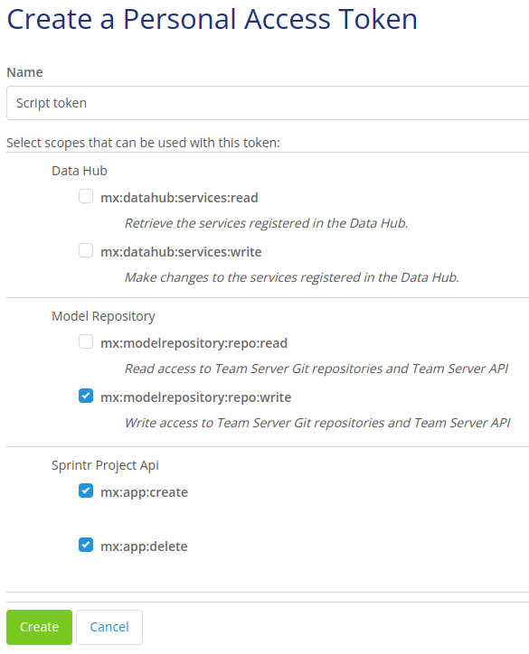

# Setup your Personal Access Token
Before running your first script, you need to set up your personal access token by creating a new token with the required scope and saving it to your computer as an environment variable.

## 1. Create a Personal Access Token
You can manage your Mendix personal access tokens via [warden](https://warden.mendix.com/). Press "add", then enter the token name and choose at least the following scopes:
* Model Server: `mx:modelrepository:write`
* Sprintr Project Api: `mx:app:create` and `mx:app:delete`
* Team Server Git: `mx:modelrepository:write`

## 2. Save the Personal Access Token as an environment variable
We do not recommend hard-coding your credentials (i.e. Personal Access Token) into your script. Instead, you can save it as an environment variable with the name of a variable called MENDIX_TOKEN. And the Mendix Platform SDK will read it automatically.

Here are some useful links for setting the environment variable in different operating systems:
* [Create and Modify Environment Variables on Windows](https://docs.oracle.com/en/database/oracle/machine-learning/oml4r/1.5.1/oread/creating-and-modifying-environment-variables-on-windows.html#GUID-DD6F9982-60D5-48F6-8270-A27EC53807D0)
* [Setting up Environment Variables in MacOS](https://medium.com/@himanshuagarwal1395/setting-up-environment-variables-in-macos-sierra-f5978369b255)
* [How to Set Environment Variables in Linux](https://www.serverlab.ca/tutorials/linux/administration-linux/how-to-set-environment-variables-in-linux/)
