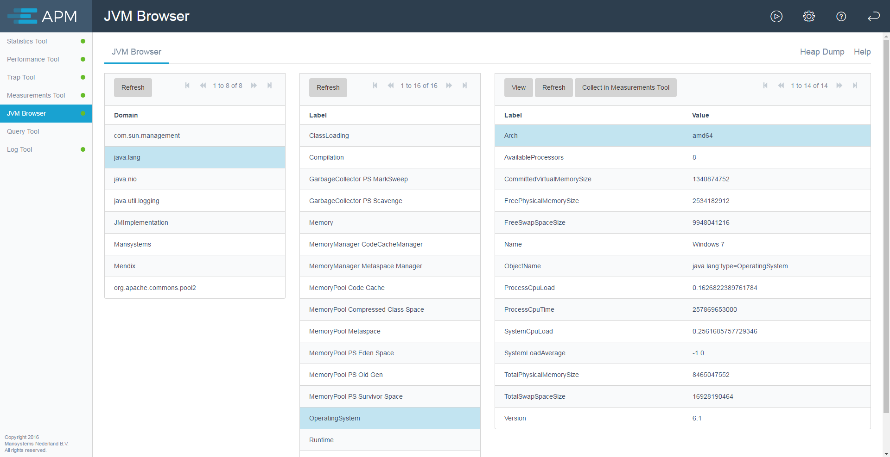
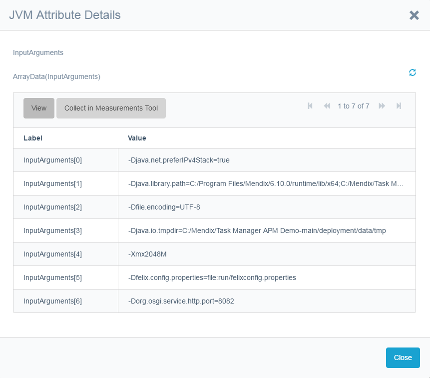

A JVM Browser shows information similar to JConsole or JVisualVM tools provided with the Java JDK. Using the **Refresh** button refreshes an individual item.

                

Double-clicking an items drills down shows its details.

You can start collecting statistics on individual items using the **Collect** button. These statistics can be viewed in the Measurements Tool.

## Additional JMX Exposed Statistics

The runtime statistics of the tools, measurements that expose to JMX as well as Mendix statistics are made available through JMX (when JMX is running).

The APM module has Java Actions to publish your own JMX data (for example, the result of a business rule).
