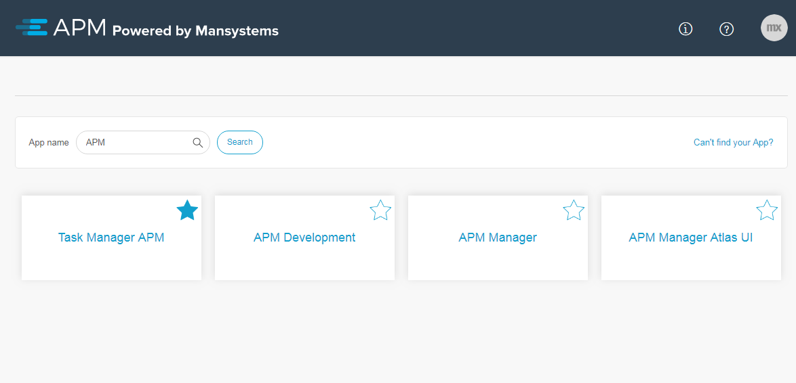
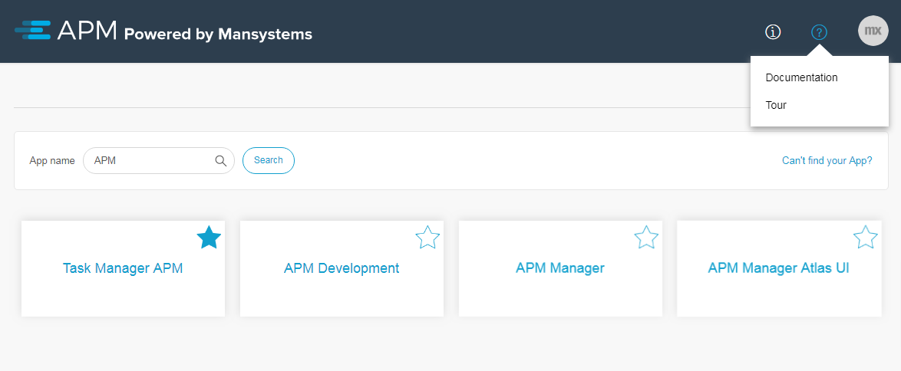
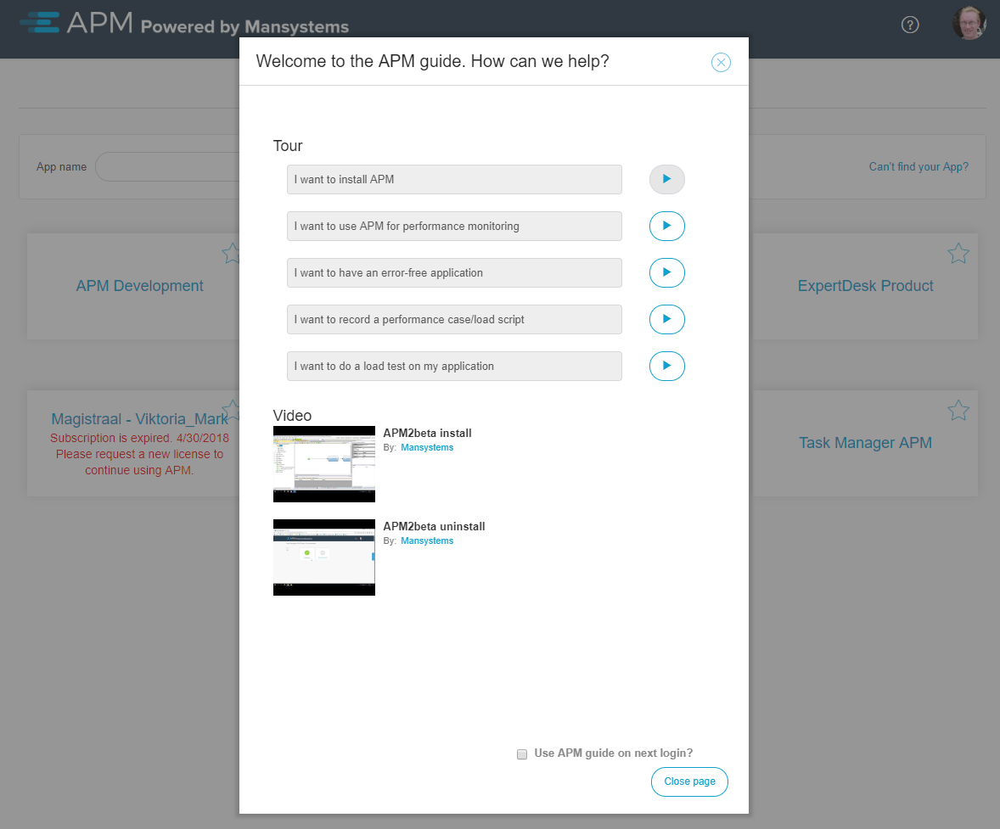
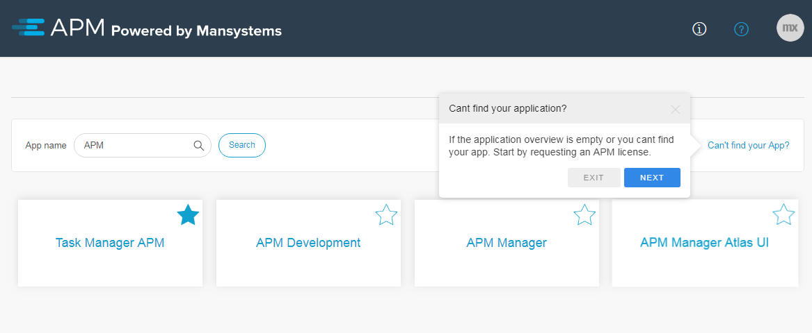
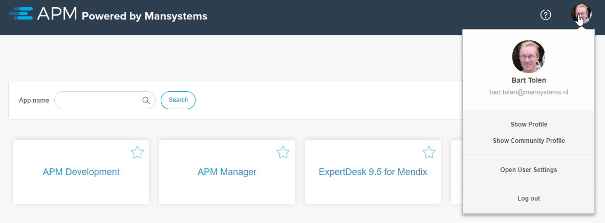
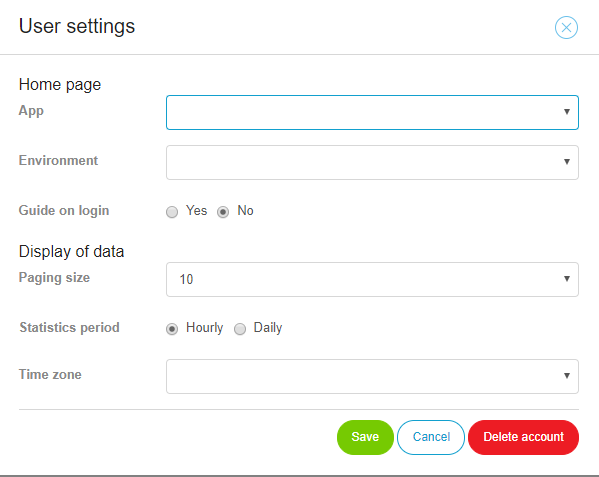

## 1 Apps Overview

The homepage of APM displays the list of licensed applications from the Mendix Developer Portal in alphabetical order.

It is possible to search on an app's name or select one from the overview directly.

Selecting an app in the overview displays the overview of the [environments](environments) for that app.

In order to find a specific application faster, it is possible to mark it as a favorite by clicking the star icon on the application tile. Favorite applications are shown first in the overview.

In case an application is not visible in this overview, click **Can’t find your App?** in the upper-right corner.

## 2 Tour Guides and Videos

APM has several tour guides and videos to help navigate through APM to perform certain tasks. These can be accessed by clicking the documentation icon next to your profile image and selecting the **Tour** option.

{}
By default, APM displays the tour guides and videos upon login for new users.
{}

When starting a tour, a tool tip will appear throughout the APM application with instructions to follow.

## 3 Profile menu and user settings

In the profile menu you see links to your Mendix profile and also the user settings for APM.

In the user settings you can configure the home page to be:
* All your apps if both drop downs are empty
* A specific app on the environments overview if an app is selected and the environments drop down is empty
* A specific environment of a specific app

* **Guide on login** determines if on login the tour guide dialog is opened. The checkbox on the bottom of this dialog unchecks this setting.
* **Paging size** determines the chunk size in statistics and performance grids.
* **Statistics period** determines if the statistics by default open with hourly or daily.
* **Time zone** determines your time zone for proper representation of date/time information

The **Delete account** button deletes your account including modeler environments belonging to your account. After the delete you will navigate to the Mendix portal home page. Apps are not deleted at this time.

## 4 Cleanups

The APM manager runs automatic cleanups. This will remove monitoring data automatically after a certain period of time. APM manager uses 3 periods of time:
* Short, being 4 hours, for temporary data like CPU on the dashboard
* Medium, being 1 week, for working data like performance recordings and logs
* Long, being 1 year, for historic data like statistics

Data can be preserved using the push-pin button. This prevents automatic cleanup.

Environments are automatically deleted if they are not used for a year.

