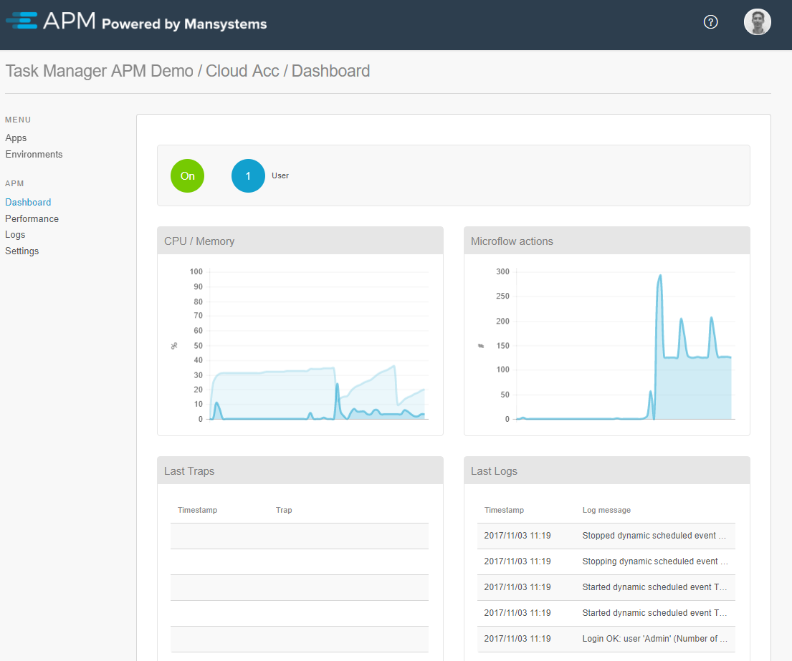

The dashboard of an environment shows real-time information regarding the following

* The number of users and runtimes
* Long-running actions (when applicable, via a clickable indicator; for more information, see [Long-Running Actions](long-running-actions))
* CPU/memory percentage
* The number of actions per second
* Recent logs and traps

 
