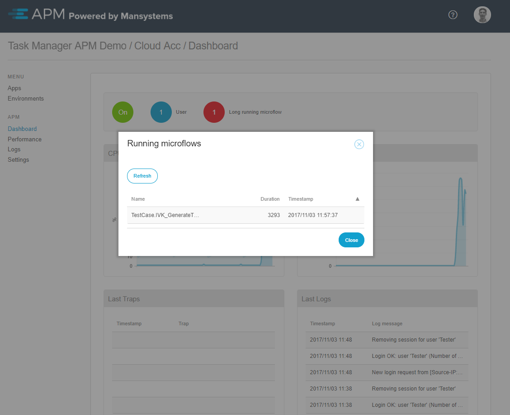

After clicking the **Long running microflow** indicator, a pop-up window with long-running microflows will be displayed.

 

If the long running action finishes before the dialog is shown the dialog will show an empty grid.