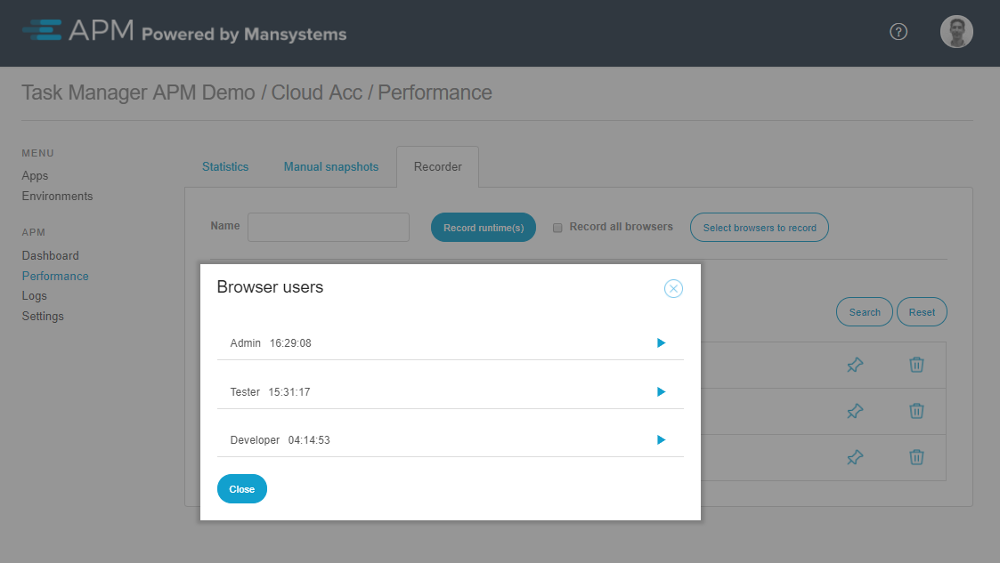
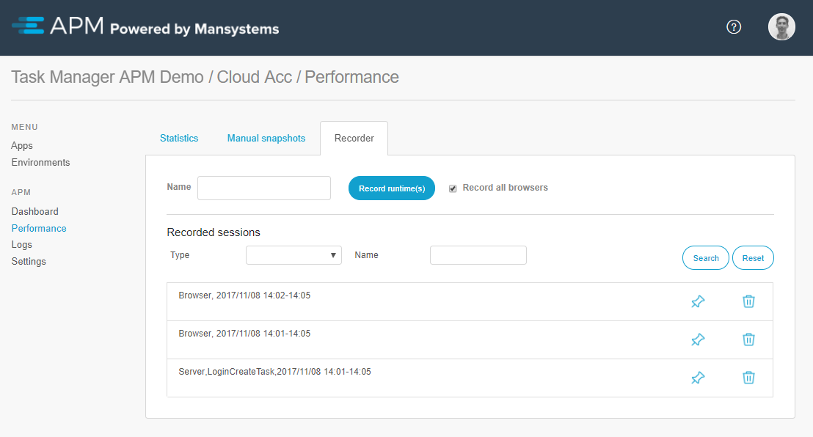

## 1 Introduction

The Performance Recorder enables recording each individual action within a Mendix application. There are two recording options. Recording the runtime records server actions (microflows and client API), and recording the browser(s) records the user's connection to the application.

Recording the runtime is useful for investigating a slow microflow or pinpointing a time-consuming action. Recording the browser shows the performance from the user's perspective as well as subsequent actions the browser performs as a result of the server responses.

## 2 Recording a New Session

A new recording session is started by clicking **Record runtime(s)**. You can provide a session name (optional) and check the boxes for the user browsers to be recorded.

It is possible to record an individual user's browser without recording the runtime by clearing the **Record all browsers** box and then clicking **Select browsers to record**. A pop-up window will show a list of the users logged in on the current day. You can select here the users whose browsers you want to record.

## 3 Recorded Results

The results of a recording are found in the **Recorded sessions** overview. This tab displays the recordings of the runtime(s) seperate from the browser recordings. 

When you click a recording of the **Browser** type, the [browser recording results](browser-recorder-results) opens. When you click a recording of the **Server** type, the [server recording results](runtime-recorder-results) opens.

{}

A browser session is per browser window. If a user uses multiple browser instances to connect with the application, this results in a recorded session for each instance.

{}

### 4 Pinned Recording Sessions

Recordings are automatically cleaned after a week. If desired, it is possible to pin down a recorded session to prevent automatic removal (for example, when you wish to compare the difference in performance after a deployment, but a deployment is not scheduled within a week). 
