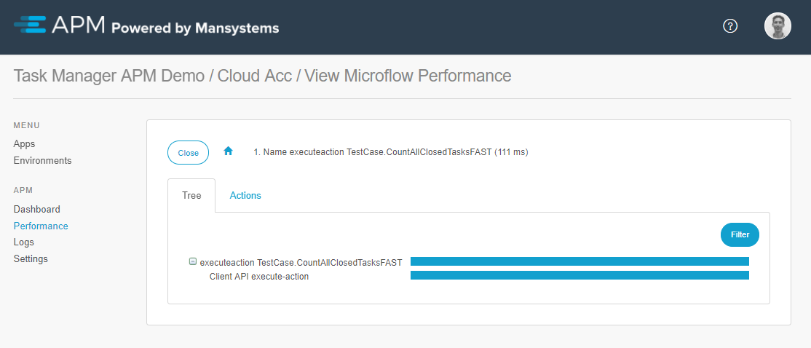
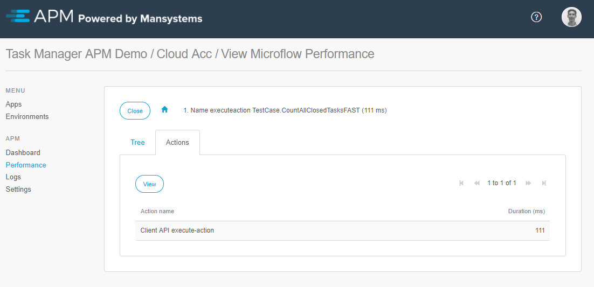

When you open a runtime recording from the [recorded sessions overview](recorder), the details of this runtime recording will be shown. The results are sorted by duration. All the recorded actions are clickable and will show detailed information. By drilling down to an exact location, you can pinpoint where the time is spent.

The tree view provides an overview of the durations of microflows and actions.

The **Actions** tab will display actions within the action.

