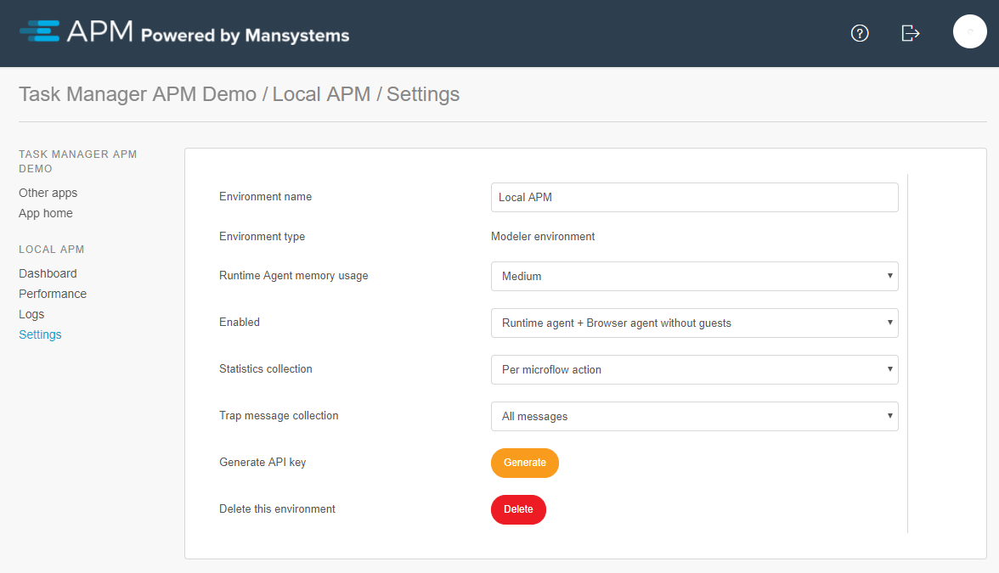
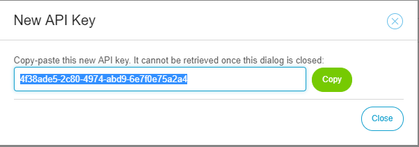

The settings displayed in this screenshot are available for an environment:

By default, the best options are already selected for the most common situations. The following settings can be changed:

* **Environment Name**
* **Environment Type** – Modeler, test, acceptance, and production environments are available. Modelers are private to the creator of the environment. To use test, acceptance, or production, you need to be a cloud operator in Mendix.
* **Runtime agent memory usage** – This determines several technical settings, such as maximum trap duration, maximum number of trap records, maximum number of messages or performance nodes recorded in the agent that still need to be sent to the manager. This setting is a protection against too much memory use. In the Modeler, you can safely set this to **Large** to record/trap more. Setting this to me **Medium** is advised.
* **Enabled** – You can configure if browser agent guest users, browser agents, or runtimes are allowed to connect to this environment. This is a security setting.
* **Statistics collection** - Per microflow and per microflow action are available. Per microflow action will generate statistics for actions in a microflow, while per microflow does not.
* **Trap message collection** - This can be set to All messages and Without database nodes. Changing this to without database nodes will stop sending logs from database nodes to APM. These nodes include:
  * DataStorage_QueryPlan
  * DataStorage_QueryHandling
  * ConnectionBus_Update
  * ConnectionBus_Security
  * ConnectionBus_Retrieve
  * ConnectionBus_Mapping
  * ConnectionBus_Queries
  * ConnectionBus_Synchronize
  * ConnectionBus_Validation
  * QueryParser
* **Generate API key**
* **Delete this environment** – Clicking this button will delete the environment from the APM manager.

When you generate an API key for a runtime/Modeler environment, you see this key only once, so copy-paste and use it immediately. For more information about the installation, see the [APM 2 Installation Manual](../../installation-guide/ig-2/installation-2).

Click **Copy** to copy the API key to the clipboard.
