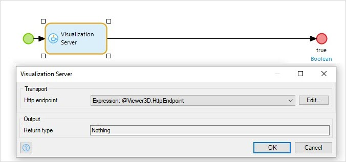
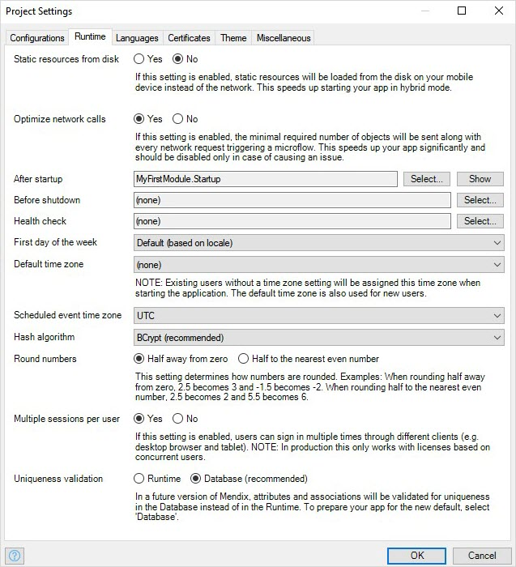
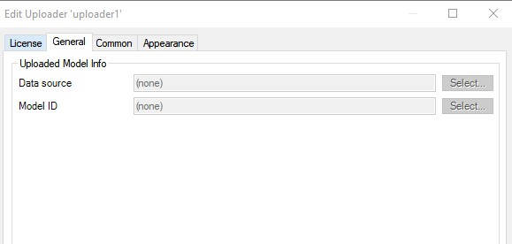
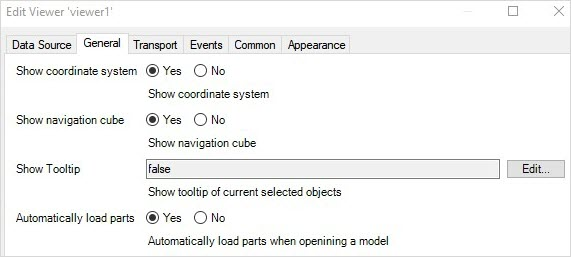
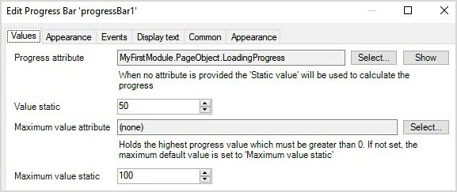
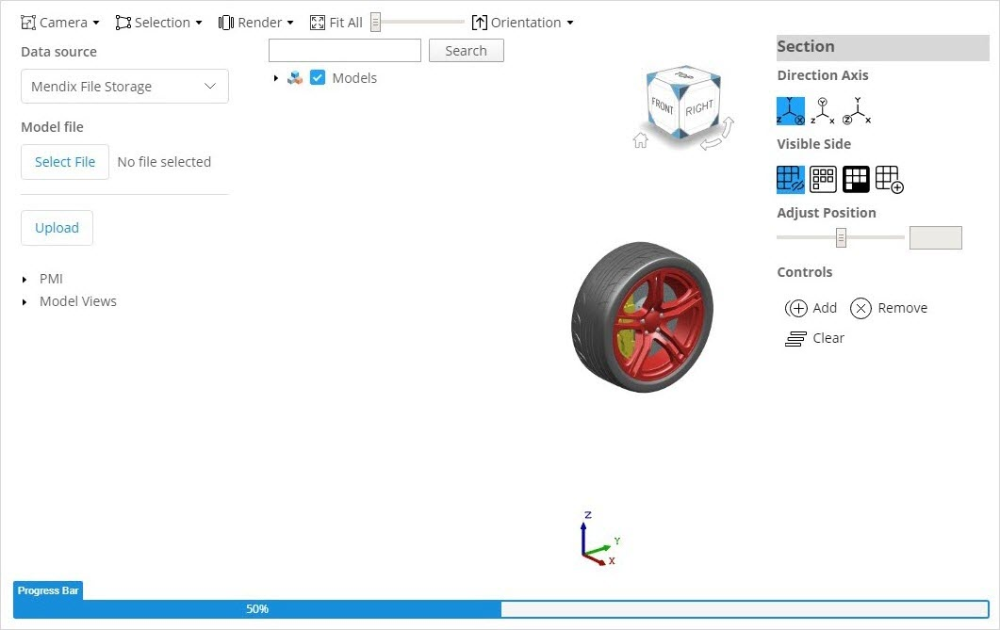
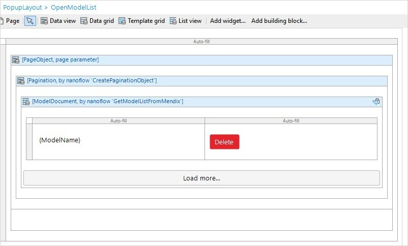
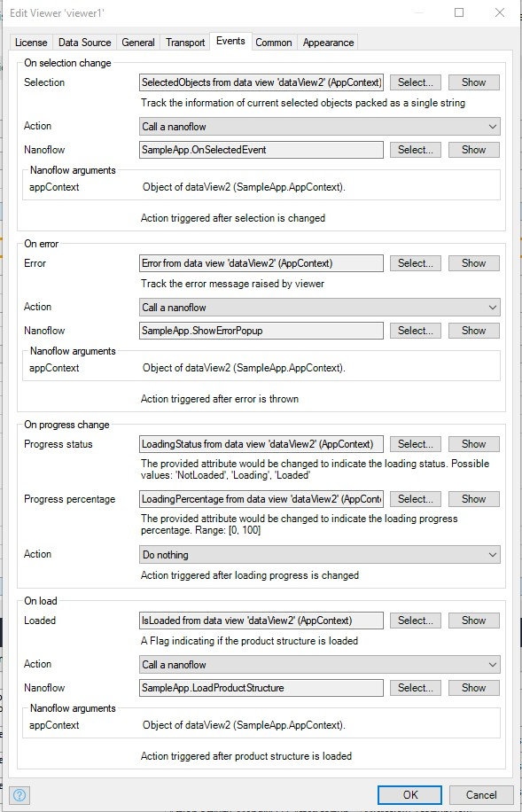

## 1 Introduction

The 3D Viewer app service lets you upload, visualize, and operate on 3D JT files in your web applications, using Mendix File Storage to store models. The app service contains Java actions, JavaScript actions, domain models, nanoflows, microflows, and a set of 3D widgets that enable you build apps to work with 3D models via the JT format. The app service includes whole functionalities and integrations that can be very helpful when you are building your own 3D applications. All you need to do is drag and drop items and configure them.

{}[Add link to component]{}

This app service does the heavy-lifting for you so you do not have to build a 3D-rendering engine from scratch.

Here is an overview of what the 3DViewer contains:

| Category                                   | Name                                                                                                                                                                                                                                                                                      |
| ------------------------------------------ | ----------------------------------------------------------------------------------------------------------------------------------------------------------------------------------------------------------------------------------------------------------------------------------------- |
| [Predefined Entity](#51-predefined-entity) | ModelDocument, Pagination, Markup, MxChildDocument, MxModelDocument                                                                                                                                                                                                                       |
| [Constants](#52-constants)                 | HttpEndpoint, ModelSourceType                                                                                                                                                                                                                                                             |
| [Nanoflow](#54-nanoflow)                   | GetModelListFromMendix, GetMarkupsFromMendix                                                                                                                                                                                                                                              |
| [Microflow](#53-microflow)                 | DeleteModelFromMendix, DownloadMarkup                                                                                                                                                                                                                                                     |
| [Java Action](#54-java-action)             | VisServerAction                                                                                                                                                                                                                                                                           |
| [Widgets](#55-widgets)                     | Container3D, Markup builder, PMI tree, PS Tree,  PS Tree Table, Section view, Toolbar item camera mode,Toolbar item camera orientation, Toolbar item explode slider, Toolbar item fit all, Toolbar item render mode, Toolbar item selection mode, Toolbar item snapshot, Uploader, Viewer |

### 1.1 Typical Use Cases

You can use this app service when you want to upload, store, and visualize 3D JT models in your Mendix application. You can perform some basic operations, such us navigating the model product structure tree and the **Product Manufacturing Information** (PMI) tree, and creating section views and 2D markups.

### 1.2 Features

This app service enables you to do the following:

* Display a 3D model (the JT format is currently supported)
* Use quick intuitive controls to navigate product structure
* Zoom, rotate, fit all, and pan
* Turn parts on and off
* Display PMI
* Select and clear selection of parts
* Display model views
* Upload and load models from Mendix file storage
* Display part/assembly properties
* Create 3D cross-sections
* Examine your model from preset viewing angles
* Create 2D markup on model and save snapshot
  
### 1.3 Limitations {#limitations}

The 3D Viewer app service includes a few 3D widgets. These are the limitations on how these widgets should be placed:

* The **Container3D** widget acts as a context-sharing container for other 3D widgets. Therefore, every other 3D widget (except **Uploader** widget)needs to be put inside the Container3D widget. If 3D widgets are placed outside of the Container3D widget, you will see error in [Design mode](/refguide/page#design-mode).
* One **Container3D** widget can only contain one **Viewer** widget. If multiple Viewer widgets are placed inside a Container3D widget, you will see error message in [Design mode](/refguide/page#design-mode).
* **Viewer**widget is used to display a 3D model, all other 3D widgets (except **Uploader** widget and **Container3D** widget) needs a **Viewer** widget present on the page to interact with.

Currently, only JT models with version 9 and above are supported.

## 2 Installation

Follow the instructions in [How to Use App Store Content in Studio Pro](../general/app-store-content) to import the app service into your app.

After importing, you need to map the **Administrator** and **User** [module roles](/refguide/module-security#module-role) of the installed modules to the applicable [user roles](/refguide/user-roles) in your app.

## 3 Initializing the 3D Viewer App Service on App Startup

To automatically start this app service, create a **Startup** microflow, add the **Viewer3D/USE_ME/VisServerAction** Java action to the microflow, make sure the java action parameter **Http endpoint** is set to `Expression:@Viewer3D.HttpEndpoint`,  then set the return type of this microflow as **Boolean** with a **Value** of **true**.

You need to set this microflow as the after-startup step via **Project Settings** > **Runtime** > [After startup](/refguide/project-settings#after-startup):

## 4 3DViewer content

### 4.1 Predefined Entity

**ModelDocument** entity is an entity that incorporates all information of a model. You can choose to inherit from this entity, set an association to the entity or copy this entity to your module.

| Attribute    | Description                                                                                                                   |
| ------------ | ----------------------------------------------------------------------------------------------------------------------------- |
| ModelId      | A unique string to identify a model.                                                                                          |
| ModelName    | The file name.                                                                                                                |
| Source       | Indicates where the model is stored. 3D Viewer can visualize a model from the **Mendix** source or the **Teamcenter** source. |
| Author       | Indicates the author of the model.                                                                                            |
| CreationDate | When the model was uploaded and stored in Mendix file storage.                                                                |
| FileSize     | The size of the model.                                                                                                        |
| FileType     | The 3D model format. Currently only the JT format is supported.                                                               |
| ErrorReason  | Indicates why an error occurs when loading a model.                                                                           |

The **Pagination** entity serves as an input parameter of the **GetModelListFromMendix** nanoflow. It allows you to paginate the model list returned by the nanoflow. If the values of the **Pagination** attributes are not specifically set, **GetModelListFromMendix** will return a full list of the models.

| Attribute | Intended use                                          |
| --------- | ----------------------------------------------------- |
| Count     | Indicates which page number to fetch.                 |
| PageSize  | Indicates the item size of one page.                  |
| OffSet    | Indicates the offset from the first item of the page. |

The **Markup** entity is a **System.Image** type of entity, it denotes a Markup image.

Other two entities, **MxModelDocument** and **MxChildDocument** are internal entities, in most cases, you may not need them. 

### 4.2 Constants

The **HttpEndpoint** constant with the value **visualization** is used to restrict value of parameter **HttpEndpoint** of the **Viewer3D/USE_ME/VisServerAction** Java action.

The **ModelSourceType** constant with the value **Mendix** is used to signify the model source, you can use this constant to restrict the value of parameter **Data source** in Uploader widget, the parameter **Model source type** in Viewer widget, or the value of Attribute **Source** in ModelDocument entity.

### 4.3 Microflow

The **DeleteModelFromMendix** microflow takes a **ModelDocument** object as an input parameter and deletes the corresponding model stored in the Mendix file storage.

The **DownloadMarkup** microflow takes a **Markup** object as input parameter and download the image to local.

### 4.4 Nanoflow

The **GetModelListFromMendix** nanoflow takes a **Pagination** object as an input parameter to fetch the model list from Mendix file storage and returns a list of **ModelDocuments** as a result. Each ModelDocument represents a model that is stored in the Mendix file storage.

The **GetMarkupsFromMendix** nanoflow takes a **ModelDocument** object as an input parameter to fetch the markup images associated with this model and returns a list of **Markup** object as a result. Each Markup represents an image that is stored in the Mendix file storage.

### 4.5 Java Action

The **VisServerAction** Java action is used to set up a visualization server infrastructure, which is critical for realizing all the functions that 3D Viewer provides. It is exposed as microflow actions. For 3DViewer to work, it is important to set the app's after-startup microflow to call the VisServerAction. Make sure parameter **Http endpoint** of this java action is set to `Expression:@Viewer3D.HttpEndpoint`. 

### 4.6 Widgets

#### 4.6.1 Core Widgets

These are the  core widgets that are required to enable visualizing a 3D JT model:

| Widget      | Description                                                                                                                                   |
| ----------- | --------------------------------------------------------------------------------------------------------------------------------------------- |
| Container3D | A special container widget designed to put other 3D widgets in. This provides a shared context for 3D widgets to communicate with each other. |
| Uploader    | Enables you to select a JT model from your local machine and upload it to the Mendix file storage.                                            |
| Viewer      | Provides a viewing window of your 3D model.                                                                                                   |

The core widgets can be used in the following ways:

* **Container3D** – place this widget in any location of a page
* **Uploader** – place this widget in any location of a page  
	* On the **General** tab, **Model ID**, and **Data source** attributes can be used to retrieve the uploading model's upload status, **Model ID**, and **Model source type**:

	

* **Viewer** – place this widget inside a **Container3D** widget; for this widget to visualize a model correctly, following properties need to be set correctly:
	* On the **Data Source** tab, you must configure correct **Model ID** and **Model source type**. Example valid **Model ID** value are:  value of attribute **ModelId**  of a ModelDocument object, value of attribute **Model ID**  set by Uploader widget property. Valid **Model Source Type** are: `Mendix` or `Teamcenter`, you can also use the constant **Viewer3D/USER_ME/ModelSourceType**.  
	* On the **Transport** tab,  make sure the **HttpEndpoint** is set to `@Viewer3D.HttpEndpoint` or `visualization`. 
	* On the **Appearance** tab, make sure the widget has a fixed height (for example, set Style to `height:600px`, or make sure height of its parent is fixed), otherwise this viewer will expand indefinitely.

	In addition, the Viewer widget provides customization options for changing its behavior (configuring these properties is optional)
	* On the **General** tab:  
	 **Show coordinate system** determines if a coordinate system will appear at the bottom-left of the viewer  
	 **Show navigation cube** determines if a navigation cube will appear at the top-tight corner of the viewer  
	 **Show tooltip** determines if a tooltip will pop up when you click on the model part; this accepts a Boolean value of **false** or  **true**  
	 **Automatically load parts** determines if the model part will be loaded into Viewer automatically; if set to **Yes**, the model will be automatically loaded as long as the Viewer receives the **Model ID** and **Model source type** values; if set to **No**, the model will only be loaded into the Viewer when triggered from the PS Tree part toggling, in this use case, you will need to add PS tree widget so you can trigger part loading by clicking on the PS tree.  

    * On the **Event** tab:  
     **On selection change** - by binding a String type attribute to the **Selection** property, you can use this attribute as an input parameter to add action to trigger when selection changes on the viewer.  
	 **On error**- by binding a String type attribute to the **Error** property, you can obtain the error message raised by viewer and add custom actions to trigger when error arises.  
	 **On progress change** - by binding a String type  attribute to **Progress status** property, you can obtain the current model loading status.  By binding a Decimal type attribute to **Progress percentage** property, you can obtain the current model loading percentage. You can also add custom actions triggered by this change.  
	 **On load** - by binding a Boolean type attribute to the **Loaded** property, you will be able to know if the product structure is loaded. You can also add custom actions triggered by this change.  

	 3DViewer also exposes some APIs on viewer for you to invoke and implement custom logic that suits your need. For how to use the APIs and other details, please contact [Mendix Support](https://support.mendix.com/hc/en-us) and raise a ticket against 3DViewer development team.

#### 4.6.2 Panel Widgets

These are the widgets that have an operation panel that contains an interactive item for the end-user to operate on:

| Widget         | Description                                                                                                                                                            |
| -------------- | ---------------------------------------------------------------------------------------------------------------------------------------------------------------------- |
| PS tree        | Provides a hierarchical tree view of the items that form a model. By toggling the tree node, the end-user can control which model parts will be loaded into Viewer.    |
| PS tree Table  | A configurable tree table to display product structure of a model and other model attributes of your choice.                                                           |
| PMI tree       | Provides a hierarchical tree display of a model's product manufacturing information, model views, and design groups.                                                   |
| Section view   | Enables creating a section cut on the model and provides a section view from various angles.                                                                           |
| Markup builder | Enables creating 2D markup on a model and saving the annotated screenshot. Snapshots that contain 2D markup will be saved along with the model in Mendix file storage. |

Each panel widget should be placed in a **Container3D** widget. A **Viewer** widget with the right data source should also be in the same **Container3D** widget.

The panel widgets can be used in the following ways:

* **PS Tree** – On the **General** tab, the following options are available:
	* **Expand all** determines if the model's product structure tree should be fully expanded at the initial load
	* Use **Show search** to toggle a search bar that enables the end-user to enter a part name and search for the part in the PS Tree
	* **Show lead structure** determines if the sub-part data should be displayed in the PS Tree
* **PS Tree Table** – compared to the **PS Tree** widget, this widget adds an additional configurable property **Column**, you can expand the table by adding columns and specifying the property to be displayed in this column. Example predefined properties are: Volume, Mass, Units, HasPMI, Density. If you want to display other properties other than the predefined properties in the list, you can also add other property by specifying valid property defined in the model.

* **PMI tree** - On the **General** tab, the property **Expand all tree nodes** determines if all tree nodes are expanded by default. When set to `yes`, you will see a PMI tree fully expanded by default on this widget load; When set to `no`, PMI tree will not fully expand by default. 
* **Section view** - Place it inside of a Container3D widget, a Viewer widget should be present in the same Container3D widget so you can add section plane on the model. No specific configuration is needed. With this widget, you can add, delete and clear sections planes to the model on your desired direction axis and clipping mode. 
* **Markup builder** - 
	* On **General** tab, by setting property **Enable** to true or false, you can switch on and off the markup mode, when set to `true`, model will be locked to a 2D dimension and won't react to mouse rotate , when set to `false`, model will be unlocked and return to rotatable state;  another property is **Markup color**, it allows you to set color of markup annotation. Valid values are [CSS Legal color value](https://www.w3schools.com/CSSref/css_colors_legal.asp), for example, RGB value, predefined color names, hexadecimal color values.  
	* On **Event** tab,  by binding a boolean type attribute to **Save** property, you will be able to obtain save status of the markup image after user click the Save button on the markup builder's panel, and add custom actions, such as show pop up message, to it. When the attribute values changes to `true`, it means the markup image associated with model is successfully saved in Mendix file storage; when the attribute value is `false`, it means the save is not successful.

#### 4.6.3 Toolbar widgets

These widgets do not require additional configuration. Simply place them in a **Container3D** widget with the accompanying **Viewer** widget.

| Widget                           | Description                                                                                                                                                                                               |
| -------------------------------- | --------------------------------------------------------------------------------------------------------------------------------------------------------------------------------------------------------- |
| Tool bar item camera mode        | Provides the ability to control the appearance of surface objects displayed in the view. The option determines whether surface objects are represented on the display by facet geometry or edge geometry. |
| Tool bar item camera orientation | Enables viewing the model from different camera orientations.                                                                                                                                             |
| Tool bar item explode slider     | Enables creating an exploded view of your assembly.                                                                                                                                                       |
| Tool bar item fit all            | Enables fitting all the model parts in the viewer.                                                                                                                                                        |
| Tool bar item render mode        | Enables toggling between different model render modes.                                                                                                                                                    |
| Tool bar item selection mode     | Provides the ability to select a model part, edge, face, and body.                                                                                                                                        |
| Tool bar item snapshot           | Provides the ability to take a snapshot of the current Viewer and save the snapshot to the local machine.                                                                                                 |

## 6 Using 3D Viewer

3D Viewer mainly provides a set of widgets to visualize JT models and a set of nanoflows and Java Actions to bring in the data.

Given that you start from a blank app template in Mendix Studio Pro, you can follow the instructions below to visualize your local JT model quickly.

### 6.1 Uploading & Viewing a 3D JT Model in Your Browser

For the **Viewer** widget to visualize a JT model, two data source attributes should be set: **Model ID** and **Model source type**. To enable uploading 3D JT models and visualizing them directly on the page, a set of these attributes should be returned by the **Uploader** widget and set to that of the **Viewer** widget.

Follow these steps to configure this visualization:

1. Place a **Container3D** widget on a page.
2. Put the **Uploader** widget and **Viewer** widget into the **Container3D** widget and give them a layout.
3. Set a fixed height of the **Viewer** widget (toggle to **Design mode** to see the preview).
4. Create an entity called **UploadedModel** in your app module's domain model.
5. Wrap the **Uploader** and **Viewer** widgets inside a new [data view](/refguide/data-view).
6. Create a nanoflow, call it *CreatedUploadedModel*, and set this as data source of the data view.
7.  Create two attributes for the **UploadedModel** entity. Set them to receive the value returned from the **Uploader**'s **Data source** and **UploadModelId**:

	

8.  Set the data source attributes of the **Viewer** widget by setting **Model ID** to **UploadedModelID** and **Model Source Type** to **Mendix**:

	

9.  Set **Automatically load parts** to **Yes**, which enables loading the model automatically upon successful upload:

	

10. Run your app project locally. You can now upload a JT file and view it directly in the browser:

	

### 6.2 Displaying Model Loading Progress with Progress Bar Widget

When the end-user is uploading or loading a model, they may want to know the uploading and loading progress.

Uploading progress in the **Uploader** widget can be obtained via the **Progress percentage** property:

Loading progress in the **Viewer** widget can be obtained via the **Progress status** and **Progress percentage** attributes. 

Follow these steps to display the model loading progress:

1. Create an entity called *PageObject*, add decimal type attribute called *LoadingProgress* with a default value of `= 0` (as the **Progress bar** widget expects a decimal value).
2. Create a nanoflow called *createPageObject* that returns a **PageObject** object.  
3. Wrap **Container3D** with a data view and set the **Data source** of the data view to the **createPageObject** nanoflow.
4.  Set the value of the **LoadingProgress** attribute by setting the **Progress percentage** property:

	

5.  Add the **Progress Bar** to the page and set **PageObjectLoadingProgress** as the **Progress Attribute**:

	  

6. Run your app locally. You can see the real-time model loading progress:

	

To display the upload loading progress, the steps are similar.

### 6.3 Utilizing More 3D Functionality

You can add more 3D widgets to the page to enable more 3D functionalities and arrange the layout of them as to your need. For example:

This is the example in design mode:

### 6.4 Managing Uploaded Models

In the previous use case, you can only visualize the model you upload.

Usually you will also need to manage the models that are uploaded and stored in the data storage. 3D Viewer provides the **GetModelListFromMendix** nanoflow and **DeleteModelFromMendix** microflow to help you build model data management functionality into your app.

#### 6.4.1 Building a Model List

The Mendix native [list view](/refguide/list-view) can be used to display the model list by following these steps:

1. Use the **View3D/USER_ME/GetModelListFromMendix** nanoflow or copy it to your app module. A list of **ModelDocument** objects will be returned after calling the nanoflow.
2. Add a [pop-up page](/refguide/page-properties#pop-up) to display the model list via a button click or another event of your choice.
3. Place a list view in the page and set the **GetModelListFromMendix** nanoflow as the **Data source**.
4. As **GetModelListFromMendix** requires a **Pagination** parameter input, wrap the list view with a data view. Then, create a nanoflow called *CreatePaginationObject* nanoflow and set that nanoflow as the list view's **Data source**.
5.  Fill in the list item with the information you are interested in:

	

#### 6.4.2 Opening a Model from the Model List

Once you have the model list, you may want to click to select a model from the list and view the model. As the **Viewer** widget expects **ModelId** and **Model Source Type** to visualize a model, such information of the selected model needs to be passed to the **Viewer** widget. Since each list item is a **ModelDocument** object and this object contains various pieces of information about the selected model (including **ModelId** and **Model Source Type**), you need to pass this object to the **Viewer** widget.

Follow these steps for configuration:

1.  Define the **On click** action for the list view so as to pass the selected model to the **Viewer** widget that is present in another page (so the selected model can be loaded into the viewer). An example approach is to create an entity that is associated with the **ModelDocument** entity defined in the **Viewer3D** module's domain model. Make the object a shared object between the page the **Viewer** is in and the model list page. In this example, you are creating a **PageObject** with this home page: 

	

	This is the model pop-up page:  

	

2.  Set the **On click** action of the model list item, then change the **ModelDocument** object with which the **PageObject** is associated to return the value so that home page can be refreshed on a **PageObject** change:

	

3. Run your app locally. You will get a simple model list where you can select which model to open and visualize it with the home-page viewer:

	

#### 6.4.3 Deleting a Model

There might be some models that you do not want in the database, so you can delete these too. The 3D Viewer app service provides the **DeleteModelFromMendix** microflow to achieve this.

Follow these steps to delete a model from the database:

1. Use the **Viewer3D/USE_M3/DeleteModelFromMendix** microflow directly or copy it to one of your app modules.
2.  **DeleteModelFromMendix** expects a ModelDocument (which represents a model stored in Mendix file storage) as an input parameter. After successful execution, the model will be deleted from Mendix file storage. In the previous steps a model list was built, each list item of which is a ModelDocument. For a model list item, add a **Delete** button:

	

3.  Create a nanoflow called *DeleteModel* and set **ModelDocument** as the input parameter. Then, call the **Viewer3D/USE_M3/DeleteModelFromMendix** microflow and commit the **ModelDocument**:

	

4. Set the **On click** event of the **Delete** button to the **DeleteModel** nanoflow.
5. Run your app locally. You should be able to delete a model by clicking **Delete**.

Now you are able to get a list of models, select a list item to open a model, and delete the model.

### 6.5 Handling Viewer Events

Multiple events can be picked up by the **Viewer** widget and can be used to build your customized event handling logic.

There are three main types of events that can be picked up on the **Viewer** widget:

* **On Selection Change** – by selecting one attribute to set **SelectionSet**, you can get information on the selected part
* **OnError** – by selecting one attribute to set the **On error** event, you can pick up an error exposed by the **Viewer**
* **On Progress Change** – by selecting one attribute for the **setProgress** value, you can get the current loading status and the loading percentage of the model, product structure tree, and PMI tree

## 7 Loading & Visualizing a Model from Teamcenter

JT models from other data sources can also be visualized. Specifically, if you would like to load and visualize models from Teamcenter, you can use a combination of this 3D Viewer app service with the [3D Viewer for Teamcenter](3d-viewer-for-teamcenter) module to achieve this.

## 8 Read More

* [3D Viewer for Teamcenter](3d-viewer-for-teamcenter)
