## 1 Introduction

The [3D Viewer](https://marketplace.mendix.com/link/component/118345) app service lets you upload, visualize, and operate on 3D JT files in your web applications, using Mendix file storage to store models. The app service contains out-of-the-box Java actions, JavaScript actions, domain models, nanoflows, microflows, and a set of 3D widgets that enable you to build apps to work with 3D models via the JT format. Also included are whole functionalities and integrations that can be very helpful when building your own 3D applications. All you need to do is drag and drop items and configure them.

This app service does the heavy-lifting for you so you do not have to build a 3D-rendering engine from scratch.

Here is an overview of what the 3DViewer contains:

| Item | Name |
| ---  | --- |
| [Predefined entities](#predefined-entities) | ModelDocument, Pagination, Markup, MxChildDocument, MxModelDocument |
| [Constants](#constants) | HttpEndpoint, LicenseToken, ModelSourceType |
| [Microflow](#microflow) | DeleteModelFromMendix, DownloadMarkup |
| [Nanoflow](#nanoflow) | CreateModelDocumentFromFileDocument, GetMarkupsFromMendix, GetModelListFromMendix |
| [Java action](#java-action) | VisServerAction |
| [Widgets](#widgets) | Container3D, Markup builder, Measurement, PMI tree, PS tree, PS tree table, Section view, Toolbar item camera mode, Toolbar item camera orientation, Toolbar item explode slider, Toolbar item fit all, Toolbar item render mode, Toolbar item selection mode, Toolbar item snapshot, Uploader, Viewer |

In most cases, you will only need what is contained in the **Viewer3D/USE_ME** folder. The content in the **Internal** folder is for internal use only and you will not need it.

### 1.1 Typical Use Cases

You can use this app service when you want to upload, store, and visualize 3D JT models in your Mendix application. You can perform some basic operations, such us navigating the model product structure tree and the Product Manufacturing Information(PMI) tree, creating section views, 2D markups and much more.

### 1.2 Features

This app service enables doing the following:

* Upload to and load models from Mendix file storage or your own file storage (both monolithic JT and shattered JT formats are  supported)
* Display a 3D model
* Zoom, rotate, fit all, pan
* Use quick intuitive controls to navigate product structure
* Turn parts on and off
* Select and clear selection of parts
* Examine your model from preset viewing angles
* Display PMI
* Display model views
* Display part/assembly properties
* Display exploded view
* Create 3D cross-sections
* Create 2D markup on model 
* Take snapshot of a model 
* Perform 3D measurement on distance, angle, area, radius, and length

### 1.3 Limitations

The 3D Viewer app service includes a few 3D widgets. These are some limitations on how these widgets should be placed in a page in Mendix Studio Pro:

*  The **Container3D** widget acts as a context-sharing container for other 3D widgets, so 3D widgets can talk to each other and perform corresponding actions via this context. Therefore, every other 3D widget (except the **Uploader** widget) needs to be put inside the Container3D widget. If 3D widgets are placed outside of the Container3D widget, these widgets will not work as expected. In that case, you will be nofitied and see errors when you switch to Design mode. 

	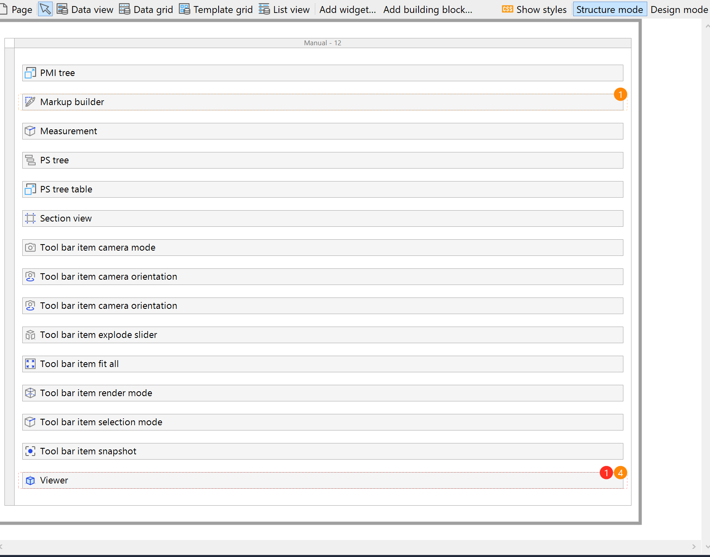
	
*  One **Container3D** widget can only contain one **Viewer** widget. If multiple Viewer widgets are placed inside a Container3D widget, you will see error message in Design mode. 
* The **Viewer** widget is used to display a 3D model. All other 3D widgets (except the **Uploader** and **Container3D** widgets) need a Viewer widget present on the page to interact with.
* Currently, only JT models with version 9 and above are supported.
*  Before uploading a shattered JT *.zip* file,  make sure you are using UTF-8 encode to zip the JT files. For example, if you are using 7Zip, make sure you enter *cu* in **Parameters**.

	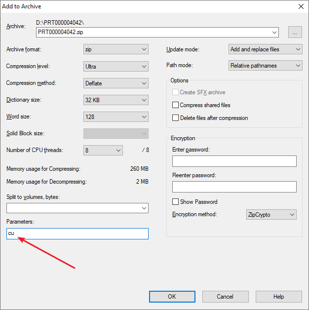

### 1.4 Prerequisites

This app service can only be used with Studio Pro 8 versions starting with [8.15.1](../../releasenotes/studio-pro/8.15#8151).

## 2 Installation

First, download the *3DViewer.mpk* file for the [3D Viewer](https://marketplace.mendix.com/link/component/118345) from the Marketplace. When you want to add the app service to your app in Mendix Studio Pro, follow these steps:

1. Right-click the project in the **Project Explorer**, click **Import module package**, and select the *3DViewer.mpk*. 
2.  In the **Import Module** dialog box, **Add as a new module** is the default option when the module is being downloaded for the first time, which means that new entities will be created in your project. Note that the name will be displayed as "Viewer3D" instead of "3DViewer" in Project Explorer due to naming conventions:

	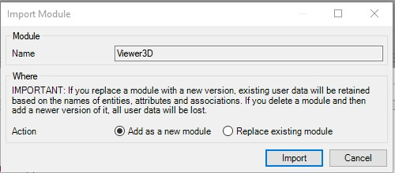
	
	{}If you have made any edits or customization to a module that you have already downloaded, be aware of the **Replace existing module** option. This will override all of your changes with the standard App Store content, which will result in the creation of new entities and attributes, the deletion of renamed entities and attributes, and the deletion of their respective tables and columns represented in the database. Therefore, unless you understand the implications of your changes and you will not update your content in the future, making edits to the downloaded modules is not recommended.{}

3. Click **Import** on the **Import Module** dialog box, and a pop-up stating that “The app was successfully imported into the project” will appear. Click **OK**.
4. Open the **Project Explorer** to view the Viewer3D module. You can see a collection of ready to use items under the Viewer3D folder. Besides, if you go to Toolbox window, you will also notice a  collection of 3D widgets are added to Toolbox widget list, under the **Add-on widget** category. 
5. After importing, you need to map the **Administrator** and **User** module roles of the installed modules to the applicable user roles in your app.

Now you have succesfully added the 3D Viewer resources to your app.

## 3 Initializing 3D Viewer on App Startup

To use the 3DViewer features, your app needs to be bound to the 3D Viewer service. This is achieved by executing a microflow when the app starts. The 3D Viewer contains a Java action called **VisServerAction**, which can start the 3D Viewer service for you. Call this Java action from your app's after-startup microflow, and this will automatically start the 3D Viewer when the app starts (running after startup usually means you want to run a specific tool all the time.).

If you app does not have an after-startup microflow set,  follow these steps:

1. Create a **Startup** microflow and add the **Viewer3D/USE_ME/VisServerAction** Java action to it.
2. Make sure the java action parameter **Http endpoint** is set to `Expression:@Viewer3D.HttpEndpoint`.
3. Set the return type of the microflow to **Boolean** with a **Value** of **true**.
4.  Set this microflow as the **After startup** step via **Project Settings** > **Runtime** > [After startup](/refguide8/project-settings#after-startup).

If your project already has a microflow set to execute after startup, you need to extend it with the **Viewer3D/USE_ME/VisServerAction** Java action and configure it as described in the above steps. 

## 4 3DViewer Content

### 4.1 Predefined Entities {#predefined-entities}

The **ModelDocument** entity is a conceptual entity that incorporates all the information of a model. You can choose to inherit from this entity, set an association to the entity, or copy this entity to your module.

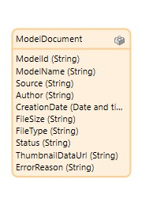

| Attribute | Description |
| --- | --- |
| **ModelId** | A unique string to identify the model. |
| **ModelName** | The name of the model. |
| **Source** | Indicates where the model is from. Currently it has two values: **Mendix** and **Teamcenter**. When the source is **Mendix**, it indicates the model is from Mendix file storage. When the source is **Teamcenter**, it indicates the model is from a Teamcenter instance. |
| **Author** | The author of the model. |
| **CreationDate** | For models stored in Mendix file storage, the **CreationDate** corresponds to the time the JT model is first uploaded to the file storage. For models stored in Teamcenter, the **CreationDate** indicates the creation date of this model revision. |
| **FileSize** | The size of the model in bytes. |
| **FileType** | The 3D model format. Currently only the JT format is supported. |
| **Status** | Used specifically for models uploaded and stored in Mendix file storage. The **Status** has three values: **Complete** (indicates the uploading of a model to Mendix file storage is complete), **InProgress** (indicates the uploading is in progress), and **Error** (indicates the uploading failed). |
| **ErrorReason**  | The reason for the model upload error.|

The **Pagination** entity serves as an input parameter of the **GetModelListFromMendix** nanoflow. This allows you to paginate the model list returned by the nanoflow. If the values of the **Pagination** attributes are not specifically set, **GetModelListFromMendix** will return a full list of the models.

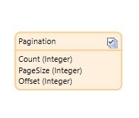

| Attribute | Intended Use |
| --- | --- |
| Count | Indicates which page number to fetch. |
| PageSize | The item size of one page. |
| OffSet | The offset from the first item of the page. |

The **Markup** entity is a **System.Image** type of entity and denotes a markup image.

The **MxModelDocument** and **MxChildDocument** entities are internal entities, and in most cases, you will not need them. 

### 4.2 Constants {#constants}

The **HttpEndpoint** constant with the default value **visualization** is used to restrict the value of the **HttpEndpoint** parameter used in the **Viewer3D/USE_ME/VisServerAction** Java action.

The **ModelSourceType** constant with the value **Mendix** is used to signify the model source. You can use this constant to restrict the value of the **Data source** parameter in the **Uploader** widget, the **Model source type** parameter in the **Viewer** widget, or the value of the **Source** attribute in the **ModelDocument** entity.

The **LicenseToken** constant is used to provide a valid 3DViewer license token for the app that uses 3DViewer to be successfully deployed to [Mendix Licensed Cloud Node](/developerportal/deploy/mendix-cloud-deploy) or your ownrenvironment. As 3DViewer is a commercial product and subject to a subscription fee, to be able to use the 3DViewer functionalities in a deployed app, you will need a valid license token, and you need to set the value of the **LicenseToken** constant to that license token in the deployment environment setting.

However, if you only plan to try how 3DViewer works  (meaning, build and run an app that uses 3DViewer locally in Studio Pro or deploy to a Mendix Free App environment), you do not need to subscribe to get a license token. Therefore, you do not need to set a value for the **LicenseToken** constant, just leave it empty.

For details on how to get a license token, see the [Obtaining a LicenseToken to Deploy Your App](#obtain) section below.

### 4.3 Microflow {#microflow}

The **DeleteModelFromMendix** microflow takes a **ModelDocument** object as an input parameter and deletes the corresponding model stored in the Mendix file storage.

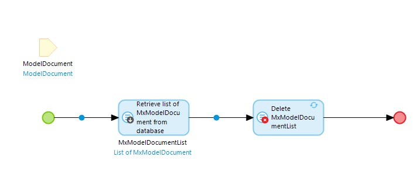

The **DownloadMarkup** microflow takes a **Markup** object as input parameter and downloads the image to a local directory.

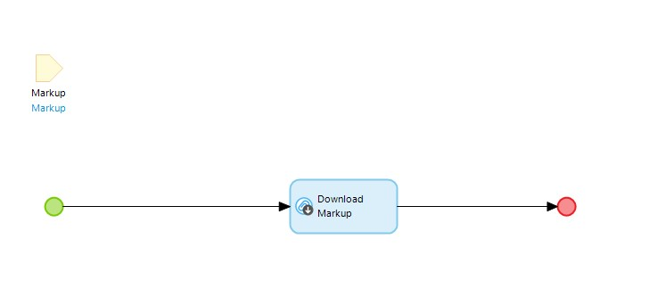

### 4.4 Nanoflow {#nanoflow}

The **CreateModelDocumentFromFileDocument** nanoflow takes a **FileDocument** object as an input parameter to create a **ModelDocument** object to represent a user JT model file stored as the entity of **System.FileDocument** or its specialization. As the Viewer widget is prebuilt to take a **ModelDocument** object as the data source, this nanoflow allows you to get and visualize a JT model from your existing file storage.

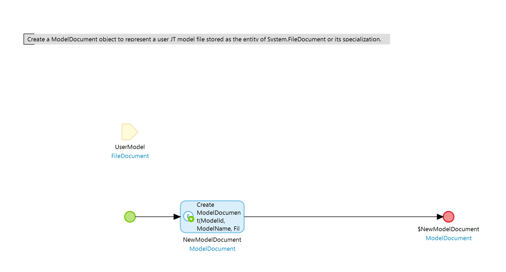

The **GetModelListFromMendix** nanoflow takes a **Pagination** object as an input parameter to fetch the model list from Mendix file storage and returns a list of **ModelDocuments** as a result. Each ModelDocument represents a model that is stored in the Mendix file storage.

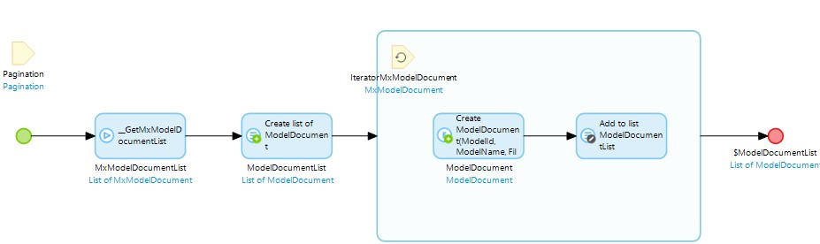

The **GetMarkupsFromMendix** nanoflow takes a **ModelDocument** object as an input parameter to fetch the markup images associated with this model and returns a list of **Markup** object as a result. Each markup represents an image that is stored in the Mendix file storage.

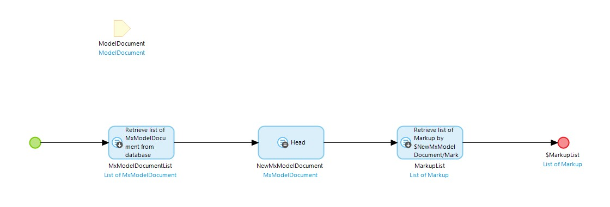

### 4.5 Java Action {#java-action}

The **VisServerAction** Java action is used to set up a visualization server infrastructure, which is critical for realizing all the functions that 3D Viewer provides. It is exposed as microflow actions. 

For 3D Viewer to work, you must set the app's after-startup microflow to call the **VisServerAction** Java action. Make sure the **Http endpoint** parameter of this java action is set to `Expression:@Viewer3D.HttpEndpoint`. 

### 4.6 Widgets {#widgets}

#### 4.6.1 Core Widgets

The core widgets required to enable visualizing a 3D JT model are described below.

#### 4.6.1.1 Container3D {#container3d}

This is a container widget designed to put other 3D widgets in (except Uploader widget, Uploader widget doesn't need to be placed within Container3D widget). It provides a shared context for 3D widgets to communicate with each other.

You can place this widget in any location of a page.

#### 4.6.1.2 Uploader {#uploader}

This widget enables selecting a JT model from your local machine and uploading it to the Mendix file storage.

You can place this widget in any location of a page. 

On the **General** tab of the properties, the **Model ID**, and **Data source** attributes can be used to retrieve the uploading model's **Model ID** and **Model source type** values.

#### 4.6.1.3 Viewer {#viewer}

This widget provides a viewing window of your 3D model.

Place this widget inside a [Container3D](#container3d) widget.

For this widget to visualize a model correctly, set the following properties:

* On the **Data Source** tab, configure the correct **Model ID** and **Model source type** properties:
	* Example valid **Model ID** values – the value of the ModelId attribute of a ModelDocument object, or the value of a Model ID attribute set by the Uploader widget property
	* Valid **Model Source Type** values – **Mendix** or **Teamcenter**; you can also use the **Viewer3D/USER_ME/ModelSourceType** constant
* On the **Transport** tab, make sure the **HttpEndpoint** is set to **@Viewer3D.HttpEndpoint** or **visualization**
* On the **Appearance** tab, make sure the widget has a fixed height (for example, set **Style** to **height:600px**, or make sure height of its parent is fixed); otherwise, the viewer will expand indefinitely
* On the **General** tab, there are some optional customization options for changing the widget's behavior:
	* **Show coordinate system**  – determines if a coordinate system will appear at the bottom-left corner of the viewer 
	* **Show navigation cube**  – determines if a navigation cube will appear at the top-right corner of the viewer
	* **Show tooltip** determines if a tooltip will appear when when the end-user clicks a model part; this accepts a Boolean value
	* **Automatically load parts** – determines if the model part will be loaded into the Viewer automatically; if set to **Yes**, the model will be automatically loaded as long as the Viewer receives the **Model ID** and **Model source type** values; if set to **No**, the model will only be loaded into the Viewer when triggered from the PS Tree part toggling (for this use case, add the [PS Tree](#ps-tree) widget so you can trigger the part loading by clicking the PS Tree)
* On the **Events** tab, there are some optional customization options for changing the widget's behavior:
	* **On selection change** – by binding a String attribute to the **Selection** property, you can use this attribute as an input parameter to add an action to trigger when the selection changes on the Viewer 
	* **On error** – by binding a String attribute to the **Error** property, you can obtain the error message raised by the Viewer and add custom actions to trigger when an error arises
	* **On progress change** – by binding a String  attribute to the **Progress status** property, you can obtain the current model loading status; by binding a Decimal attribute to the **Progress percentage** property, you can obtain the current model loading percentage; you can also add custom actions triggered by this change
	* **On load** – by binding a Boolean attribute to the **Loaded** property, you can obtain information about if the product structure is loaded; you can also add custom actions triggered by this change

3D Viewer also exposes some APIs on the Viewer for you to invoke and implement custom logic that suits your needs. To receive information on how to use the Viewer APIs and other details, contact [Mendix Support](https://support.mendix.com/hc/en-us) and raise a ticket for 3DViewer development team.

#### 4.6.2 Panel Widgets {#panel-widgets}

These widgets have an operation panel that contains an interactive item for the end-user to operate on.

Each panel widget should be placed in a [Container3D](#container3d) widget. A Viewer widget with the right data source should also be in the same Container3D widget.

##### 4.6.2.1 PS Tree {#ps-tree}

This widget presents a hierarchical tree view of the items that form a model. By toggling the tree node, the end-user can control which model parts are loaded into the Viewer.

On the **General** tab, the following options are available:

* **Expand all** – determines if the model's product structure tree should be fully expanded at the initial load
* **Show search** – use to toggle a search bar that enables the end-user to enter a part name and search for the part in the widget
* **Show leaf structure** – determines if the sub-part data should be displayed in the widget

##### 4.6.2.2 PS Tree Table

This widget presents a configurable tree table to display the product structure of a model and other model attributes of your choice.

Compared to the [PS Tree](#ps-tree) widget, this widget adds an additional configurable property called **Column**. You can expand the table by adding columns and specifying the property to be displayed in this column. Examples of predefined properties are **Volume**, **Mass**, **Units**, **HasPMI**, and **Density**. If you want to display other properties other than the predefined properties in the list, you can also add them by specifying valid properties defined in the model.

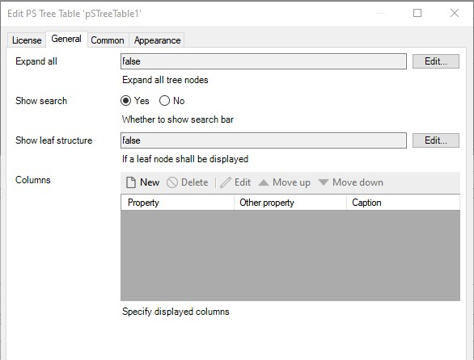

##### 4.6.2.3 PMI Tree {#pmi-tree}

This widget presents a hierarchical tree display of a model's product manufacturing information, model views, and design groups.

On the **General** tab, the **Expand all tree nodes** property determines if all tree nodes are expanded by default. When set to **Yes**, the end-user sees a PMI tree fully expanded by default on the widget load. When set to **No**, the PMI tree will not fully expand by default. 

Also on the **General** tab,  the **Auto load** property determines if all PMI information should be automatically loaded into viewer once the PMI structure tree is loaded.

##### 4.6.2.4 Section View {#section-view}

This widget enables creating a section cut on the model and provides a section view from various angles.

Place this widget inside of a [Container3D](#container3d) widget. A [Viewer](#viewer) widget should be present in the same Container3D widget so that you can add a section plane on the model. 

No specific configuration is needed. With this widget, you can add, delete, and clear section planes to the model on your desired direction axis and clipping mode. For details on how this widget behaves in an app, see the [Create 3D Section](#create-3d-section) section below.

##### 4.6.2.5 Markup Builder {#markup-builder}

This widget enables creating a 2D markup on a model and saving the annotated screenshot. Snapshots that contain 2D markup will be saved along with the model in Mendix file storage.

On **General** tab, by setting the **Enable** property you can switch the markup mode on or off. When set to **True**, model will be locked to a 2D dimension and will not react to mouse rotatation. When set to **False**, the model will be unlocked and return to rotatable state.

Also on the **General** tab is the **markup color** property, which allows you to set the color of markup annotations. The valid values are [CSS legal color values](https://www.w3schools.com/CSSref/css_colors_legal.asp) (for example, RGB values, predefined color names, and exadecimal color values).

On **Event** tab, by binding a Boolean attribute to the **Save** property, the save status of the markup image can be obtained after the end-user clicks **Save** on the Markup builder's panel. You can also add custom actions, such as showing a pop-up message, to this. When the attribute value changes to **True**, it means the markup image associated with the model is successfully saved in Mendix file storage. When the attribute value is **False**, this means the save is not successful. By setting the **Action** property, you can trigger an action based on the value of the **Save** status. 

##### 4.6.2.6 Measurement {#measurement}

This widget enables performing measurements on 3D models, including measuring distance, angle, line length, radius, and area.

Place this widget inside of a [Container3D](#container3d) widget. A [Viewer](#viewer) widget should be present in the same Container3D widget so that you can use the options provided in the widget to perform measurements on the model. 

No specific configuration is needed. With this widget, you can measure the distance, length, radius, area, and angle of a part or between parts . For details on how to perform measurements on a 3D model, see the [Perform 3D Measurements](#perform-measurements) section below.

#### 4.6.3 Toolbar Widgets

These widgets do not require additional configuration. Simply place them within a [Container3D](#container3d) widget with the accompanying [Viewer](#viewer) widget.

| Widget | Description |
| --- | --- |
| Tool Bar Item Camera Mode | Provides the ability to control the appearance of surface objects displayed in the view. The option determines whether surface objects are represented on the display by facet geometry or edge geometry. |
| Tool Bar Item Camera Orientation | Enables viewing the model from different camera orientations. |
| Tool Bar Item Explode Slider | Enables creating an exploded view of your assembly. |
| Tool Bar Item Fit All | Enables fitting all the model parts in the Viewer. |
| Tool Bar Item Render Mode | Enables toggling between different model render modes. |
| Tool Bar Item Selection Mode | Provides the ability to select a model part, edge, face, and body. |
| Tool Bar Item Snapshot | Provides the ability to take a snapshot of the current Viewer and save the snapshot to a local machine. |

## 5 Using 3D Viewer

3D Viewer provides a set of widgets to visualize JT models and a set of nanoflows and Java Actions to bring in the data.

When you start from a blank app template in Mendix Studio Pro, you can follow the steps below to visualize your local JT model quickly.

### 5.1 Uploading & Viewing a 3D JT Model in Your Browser

For the [Viewer](#viewer) widget to visualize a JT model, two data source attributes should be set: **Model ID** and **Model source type**. To enable uploading 3D JT models and visualizing them directly on the page, a set of these attributes should be returned by the [Uploader](#uploader) widget and set to that of the Viewer widget.

Follow these steps to configure this visualization:

1. Place a [Container3D](#container3d) widget on the page.
2. Put the Uploader and Viewer widgets into the Container3D widget and give them a layout.
3. Set a fixed height of the Viewer widget (toggle to **Design mode** to see the preview).
4. Create an entity and call it *UploadedModel* in your app module's domain model.
5. Wrap the Uploader and Viewer widgets inside a new data view widget.
6. Create a nanoflow, call it *CreatedUploadedModel*, and set this as the data source of the data view.
7.  Create two attributes for the UploadedModel entity. Set them to receive the value returned from the Uploader's **Data source** and **UploadModelId**:

	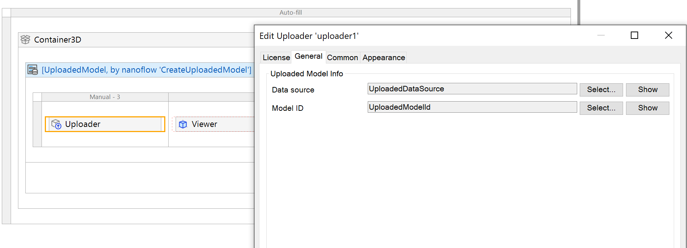

8.  On the **Data Source** tab, set the data source attributes of the Viewer widget by setting **Model ID** to **UploadedModelID** and **Model source type** to **Mendix**:

	

9.  On the **General** tab, set **Automatically load parts** to **Yes**, which enables loading the model automatically upon successful upload.
10. Run your app locally. You can now upload a JT file and view it directly in the browser:

	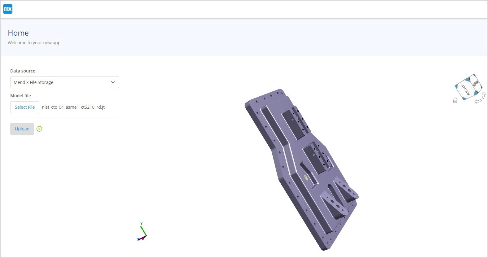

### 5.2 Displaying Model Loading Progress with Progress Bar Widget {#displaying-model-loading}

When the end-user is uploading or loading a model, they may want to know the uploading and loading progress. The uploading progress in the Uploader widget can seen in the uploader panel :

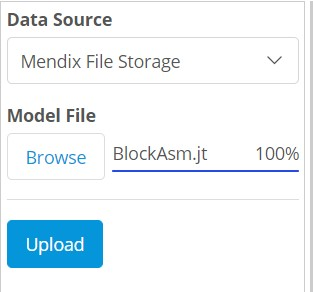

Loading progress in the Viewer widget can be obtained via the **Progress status** and **Progress percentage** attributes in the **Events** tab.

Follow these steps to display the model loading progress:

1. Create an entity called *PageObject*, add a decimal attribute called *LoadingProgress* with a default value of `= 0` (as the [Progress Bar](../widgets/progress-bar) widget expects a decimal value).
2. Create a nanoflow called *createPageObject* that returns a **PageObject** object.  
3. Wrap the [Container3D](#container3d) widget with a data view and set the **Data source** of the data view to the **createPageObject** nanoflow.
4.  Set the value of the **LoadingProgress** attribute by setting the **Progress percentage** property:

	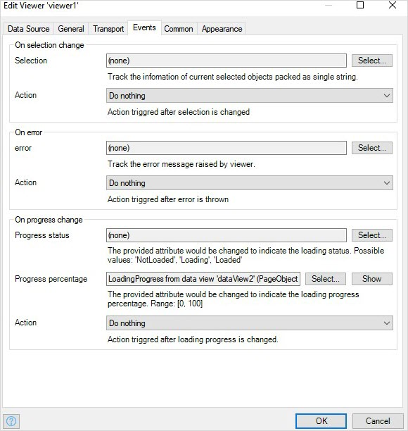

5.  Add the Progress Bar widget to the page and set **PageObject.LoadingProgress** as the **Progress Attribute** on the **Values** tab.
6. Run your app locally. You can see the real-time model loading progress:

	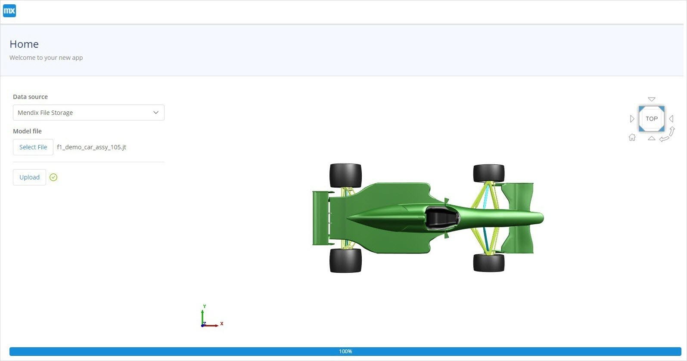

### 5.3 Utilizing More 3D Functionality

You can add more 3D widgets to the page to enable more 3D functionalities and arrange the layout of them as needed. For example:

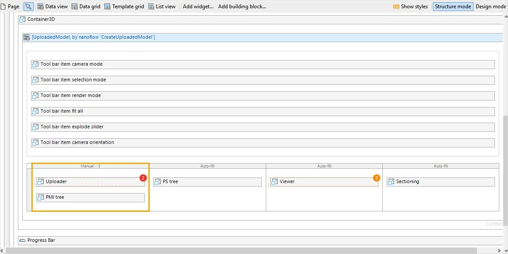

### 5.4 Managing Uploaded Models

In previous use case, you can only visualize the model you upload.

Usually, you will also need to manage the models that are uploaded and stored in the data storage. 3D Viewer provides the **GetModelListFromMendix** nanoflow and **DeleteModelFromMendix** microflow to help you build model data management functionality into your app.

#### 5.4.1 Building a Model List

The Mendix native [list view](/refguide8/list-view) can be used to display the model list by following these steps:

1. Use the **View3D/USE_ME/GetModelListFromMendix** nanoflow or copy it to your app module. A list of **ModelDocument** objects will be returned after calling the nanoflow.
2. Add a [pop-up page](../../refguide8/page-properties#pop-up) to display the model list via a button click or another event of your choice.
3. Place a list view in the page and set the **GetModelListFromMendix** nanoflow as the **Data source**.
4. As **GetModelListFromMendix** requires a **Pagination** parameter input, wrap the list view with a data view. Then, create a nanoflow called *CreatePaginationObject* nanoflow and set that nanoflow as the list view's **Data source**.
5.  Fill in the list item with the information you are interested in:

	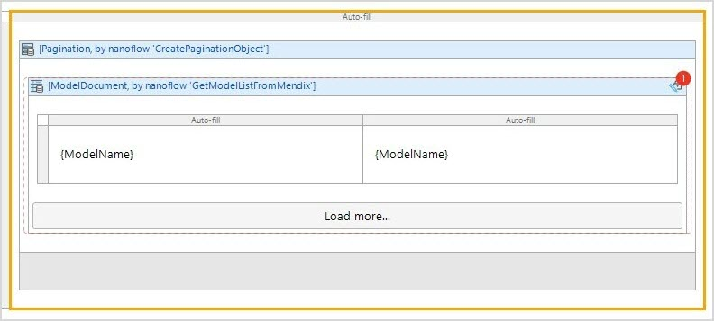

#### 5.4.2 Opening a Model from the Model List

Once you have the model list, you may want to click to select a model from the list and view the model. As the **Viewer** widget expects **ModelId** and **Model Source Type** to visualize a model, such information of the selected model needs to be passed to the [Viewer](#viewer) widget. Since each list item is a **ModelDocument** object and this object contains various pieces of information about the selected model (including ModelId and Model Source Type), you need to pass this object to the Viewer widget.

Follow these steps for configuration:

1.  Define the **On click** action for the list view to pass the selected model to the Viewer widget that is present in another page (so the selected model can be loaded into the viewer). An example approach is to create an entity that is associated with the **ModelDocument** entity defined in the **Viewer3D** module's domain model. Make the object a shared object between the page the Viewer is in and the model list page. In this example, you are creating a **PageObject** with this home page: 

	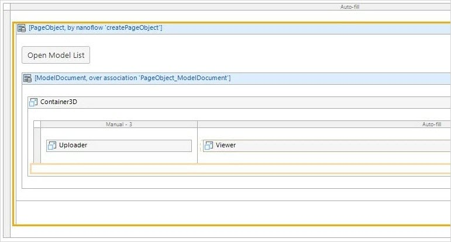

	This is the model pop-up page:

	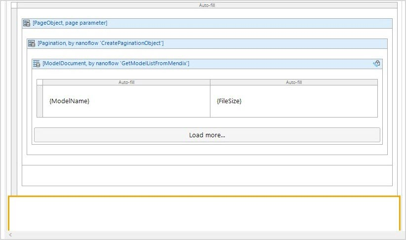

2.  Set the **On click** action of the model list item, then change the **ModelDocument** object with which the **PageObject** is associated to return the value so that home page can be refreshed on a PageObject change:

	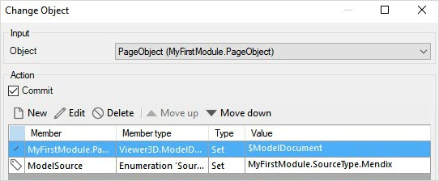

3. Run your app locally. You will get a simple model list where you can select which model to open and visualize it with the home-page viewer:

	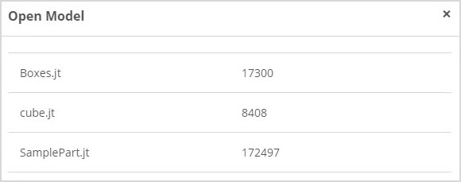

#### 5.4.3 Deleting a Model

There might be some models that you do not want in the database, so you can delete these, too. The 3D Viewer app service provides the **DeleteModelFromMendix** microflow to achieve this.

Follow these steps to delete a model from the database:

1. Use the **Viewer3D/USE_ME/DeleteModelFromMendix** microflow directly or copy it to one of your app modules.
2.  DeleteModelFromMendix expects a **ModelDocument** (which represents a model stored in Mendix file storage) as an input parameter. After successful execution, the model will be deleted from Mendix file storage. In the previous steps, a model list was built, each list item of which is a ModelDocument. For a model list item, add a [Delete button](/refguide8/button-widgets).
3.  Create a nanoflow called *DeleteModel* and set **ModelDocument** as the input parameter. Then, call the **DeleteModelFromMendix** microflow and commit the **ModelDocument**:

	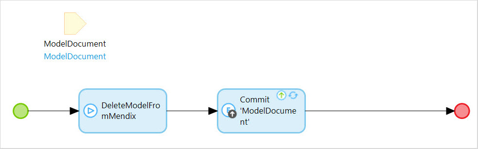

4. Set the **On click** event of the **Delete** button to the **DeleteModel** nanoflow.
5. Run your app locally. You should be able to delete a model by clicking **Delete**.

Now you are able to get a list of models, select a list item to open a model, and delete the model.

### 5.5 Handling Viewer Events

Multiple events can be picked up by the [Viewer](#viewer) widget and can be used to build your customized event handling logic.

There are four main types of events that can be picked up on the Viewer widget, which are described in the sections below.

#### 5.5.1 On Selection Change {#on-selection-change}

By selecting one attribute to set **Selection**, you can get information on the selected part (for this you might need to work with Viewer APIs; if you have inquiries on how to use the Viewer APIs, please contact [Mendix Support](https://support.mendix.com/hc/en-us)).

**Selection** takes a String attribute. You can define an attribute and bind that attribute to Selection property. In an running app, when user select on a model part, the selection event will be triggered, and the selected part info will be populated to this Selection attribute. You can easily get this selected object information (psid and viewer)and use it in the actions. 
	
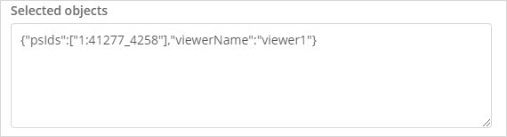

Like other Mendix events, you can select from a list of actions upon a model part selection for **Action**. One possible use case is utilize get APIs exposed by Viewer, for example, get Boundingbox by psid, set material by psid, in a javascriptaction, include it in a nanoflow, and set the Action to call this nanoflow.

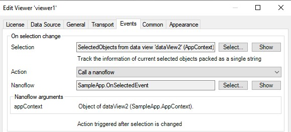  

#### 5.5.2 On Error {#on-error}

By selecting one attribute to set the **Error** event, you can pick up an error exposed by the Viewer.

**Error** takes a String attribute. You can define an attribute and bind that attribute to this property. In an running app, when there's problem visualizing a model, the error event will be triggered, and the error information will be populated to this Error attribute. You can easily obtain this error message raised by viewer and add custom actions to trigger when error arises.

Like other Mendix events, you can select from a list of actions upon a Viewer error for **Action**. One possible use case is show a error pop up page to let user know the error details.

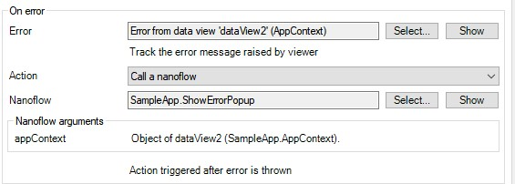 

#### 5.5.3 On Progress Change {#on-progress-change}

By selecting one attribute for the **Progress status** value, you can get the current loading status and the loading percentage of the model, product structure tree, and [PMI tree](#pmi-tree).

**Progress status** takes a String attribute. You can define an attribute and bind that attribute to this propoerty. In an running app, upon loading a model, product structure tree, PMI tree, and PMI shape, the load progress status information will be populated to this attribute. You can easily get this model loading status information (`Notloaded`, `Loading`, `Loaded`)and use it in the actions.

**Progress percentage** takes a Decimal attribute. You can define an attribute and bind that attribute to this propoerty. In an running app, upon loading a model, product structure tree, PMI tree, and PMI shape, the load progress percentage information will be populated to this attribute.You can easily get this loading percentage and use it in the actions.

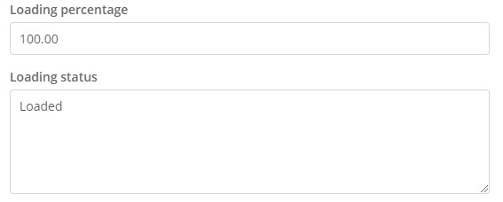 

Like other Mendix events, you can select from a list of actions upon progress change for **Action**. One possible use case is use a progress bar widget to display captured model loading percentage to user. 

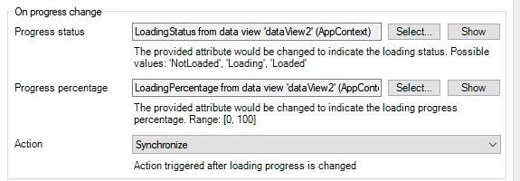

For more information, see [Displaying Model Loading Progress with Progress Bar Widget](#displaying-model-loading). 

#### 5.5.4 On Load {#on-load}

By selecting one attribute for the **Loaded** value, you can get the current loading status of the product structure tree.

**OnLoad** takes a Boolean type attribute. You can define an attribute and bind that attribute to this propoerty. In an running app, when you open a model, product structure tree will need to be loaded first, the product structure tree load event will be triggered, and the product structure load information will be populated to this attribute. You can get the current loading status of product structure tree and use it in the actions.

Like other Mendix events, you can select from a list of actions upon the product structure tree loaded status for **Action**. One possible use case is show a pop up page to let user know if product structure is successfuly loaded.

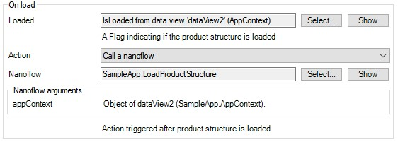

## 6 Others

### 6.1 Create 3D Section {#create-3d-section}

When a model is loaded in the viewer, the [Section View](#section-view) widget enables the following:

* Inspecting the interior structure of a model by adding standard section planes
* Deleting a section plane
* Clearing all section planes
* Clipping away parts
* Positioning a plane

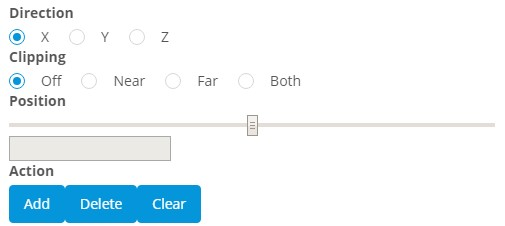

The sections below present operations within the Section View widget.

#### 6.1.1 Action

* **Add** – Use this to add a section plane. First, select the axis along which you would like to section the model, then click **Add**. You will see a section plane of the desired axis added to the scene. The default position of the newly added section plane is in the middle of the bounding box of the direction selected.
* **Delete** – Use this to delete a selected section plane. Click the edge of the section plane to select it (when selected, the section plane edges are highlighted in yellow color). Then, click **Delete**.
* **Clear** –  Use this to clear all the section planes added to the scene.

#### 6.1.2 Direction

* **X Direction** –  sets the X axis of the default coordinate system as the reference.
* **Y Direction** –  sets the Y axis of the default coordinate system as the reference
* **Z Direction** – sets the Z axis of the default coordinate system as the reference

For example, if you select **Y Direction**, then the cross section is created on the ZX plane.

#### 6.1.3 Clipping

When a section plane is selected (and highlighted in yellow), you can choose which part of the model you would like to clip away by selecting a clipping option:

* **Off** –  do not clip
* **Both** – clip both sides, showing the 2D intersecting curve on the section plane
* **Near** – clip away the positive side (toward the **Direction**)
* **Far** –  clip away the negative side (away from the **Direction**)

#### 6.1.4 Position

You can move the position sliders to adjust the position of the section plane along its axis. You can also type in an exact position to place the section plane at an exact position.

You can add multiple section planes to cut the model in different directions. After the section, you can save a snapshot of a section view. You can also add markup annotations on the section view and save them for later review.

### 6.2 Perform 3D Measurements {#perform-measurements}

When a model is loaded into the viewer, the [Measurement](#measurement) widget provides a set of tools to measure different geometrical entities:

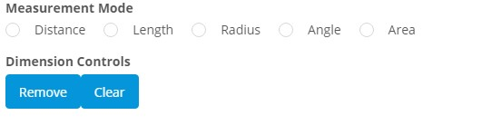

The sections below describe these tools.

#### 6.2.1 Measurement Mode

* **Distance** – measure the distance between two part features
* **Length** – measure the length of a line
* **Radius** – measure the radius of a circular edge or surface
* **Angle** – measure the angle between two edges or surfaces
* **Area** – measure the area of a surface

#### 6.2.2 Action

* **Delete** – select one measurement result, then click **Delete** and the selected measurement result will be removed from the scene
* **Clear** – clear all the measurement results in the scene

## 7 Obtaining a LicenseToken to Deploy Your App {#obtain}

3D Viewer is a premium Mendix product that is subject to a purchase and subscription fee. To successfully deploy an app that uses 3D Viewer, you need to provide a valid **LicenseToken** as an environment variable in the deployment setting; otherwise, the 3D Viewer widget features may not work in your app.

### 7.1 Deciding If You Need to Subcribe to Get a LicenseToken

When you just need to run your app with 3D Viewer locally or deploy as a Mendix Free App for testing and trial purposes, you do not need a LicenseToken. You can leave the value of the **Viewer3D.LicenseToken** constant empty when running your app.

When you want to deploy your app to a licensed Mendix Cloud node or an on-premises environment, you need to subcribe to 3D Viewer in order to get a LicenseToken. 

### 7.2  Subscribing to Get a LicenseToken

On the [3D Viewer](https://marketplace.mendix.com/link/component/118345) page, click **Subscribe** to go to the subscription order page and follow these steps:

1. Fill in technical contact information (first name, last name, email address), the subcription amount, billing account information, and other required information. 
2. Upon successful order creation, if you are the app's [Technical Contact](/developerportal/collaborate/app-roles#technical-contact), you will receive an order confirmation email. 
3. Click the link in the email to the Marketplace [Subcriptions](/appstore/general/app-store-overview#subscriptions) page and log in there.
4. In the list of your organization's subcriptions, click the **3D Viewer** subscription link to open the subcription details page.
5. Click **Create Binding Keys** , give the key a meaningful name (which should include the name of the app where you are using 3D Viewer), then click **Create Keys**.
6. When the **LicenseToken** key is generated, copy and save it for later use in your app.

### 7.4 Configuring a LicenseToken for App Deployment

#### 7.4.1 Configuring the LicenseToken in Studio Pro

In Mendix Studio Pro, go to [Project Settings](/refguide8/project-settings) and follow these steps:

1. In the **Configurations** tab, click **Edit**. 
2. In the **Constants** tab of the dialog box, create a new constant with the predefined constant **Viewer3D.LicenseToken**.
3. Fill in the **Value** with your obtained LicenseToken.
4.  Click **OK** to confirm the settings.

	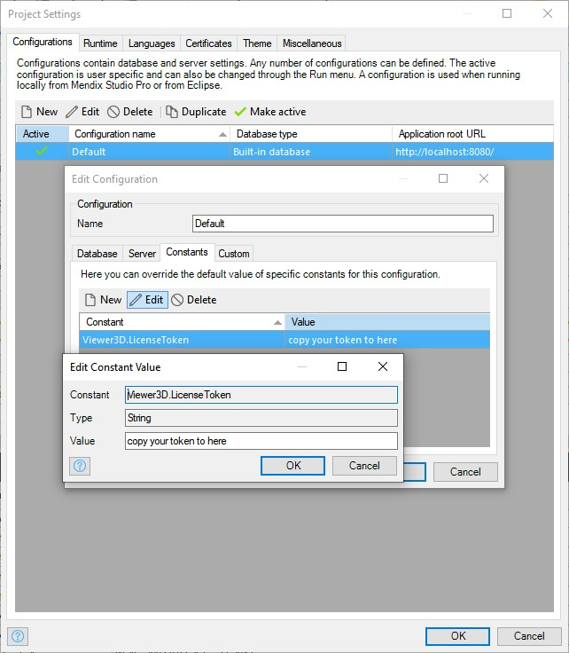

5. When you finish building the app, click **Run** to deploy your app to the cloud.

#### 7.4.2 Configuring the LicenseToken in Developer Portal

Alternatively, you can add or update LicenseToken as a constant in the [Developer Portal](/developerportal/deploy/environments-details).

Before you deploy your app, configure the app **Constants** in the deployment package

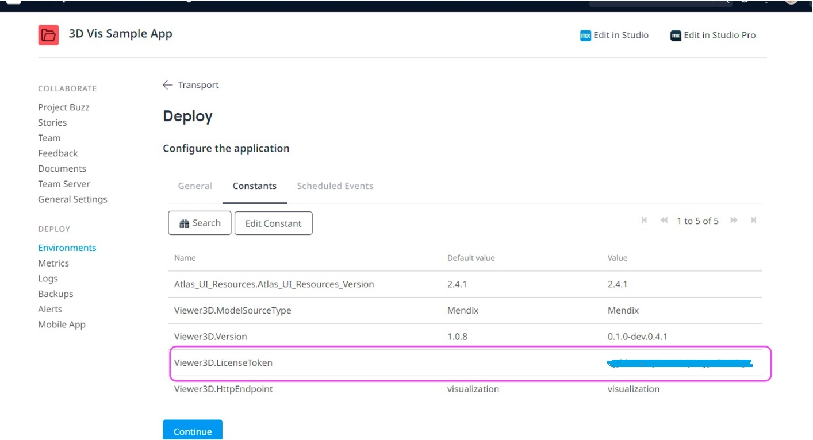

If you have already deployed your app, change the existing **LicenseToken** constant value on the **Model Options** tab and restart the app:

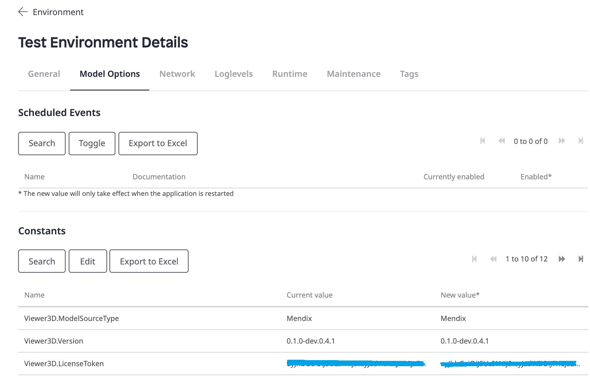
