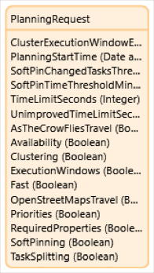

## 1 Introduction

{}[Add the link to the marketplace page after the component is released]{}

Powered by AI, the [Automated Task & Resource Planner]() app service is capable of solving complex planning cases and automatically creating the most efficient planning based on the available resources. The planner matches “tasks” with “resources” taking a wide range of constraints into account. 

The app service has a module containing a plug-and-play integration with the Automated Task & Resource Planner API.

To see how the app service can be used and implemented in a Mendix project, download the example app.

{}[Add the link to the example app]{}

### 1.1 Typical Use Cases

You can use this app service when you want to automatically schedule tasks in your Mendix application.

### 1.2 Features

●	Scheduling tasks
●	Priority tickets
●	Travel time
●	Required skills / properties
●	Time windows
●	Overtime
●	Rosters

### 1.3 Prerequisites

●	You have an automated task and resource planner account
{}[how to set up the account?]{}

### 1.4 Dependencies
* Community Commons Function Library
* Encryption

### 1.5 Demo App
For a demo app that has been deployed with this widget, see [here]().

{}[Provide a link to a maintained demo app where the component is used if available]{}

## 2 Installation

To configure this module, follow these steps:

1. Follow the instructions in [How to Use Marketplace Content in Studio Pro](/appstore/general/app-store-content) to import these two components into your applications into your application:
     * [Community Commons Function Library](https://marketplace.mendix.com/link/component/170) 
     * [Encryption](https://marketplace.mendix.com/link/component/1011) module
     
2. [Configure](/appstore/modules/encryption) the Encryption module.

3. Add the `Settings_Snippet` and `Log_Snippet` to a custom page in a different module. {}[Where can you find these?]{}

4. After the deployment, go to the **Settings** page and enter the **Automated planning endpoint**, **username**, and **password**.

     {}[how to get to the **Settings** page?]{}

## 3 Configuration

## 4 Usage

### 4.1 Build the request

You can build the request using the entities from the module. You can find examples on how to build the request in the example app from the Marketplace. Below you can find a description of all the entities and attributes.

#### 4.1.1 `PlanningSetting`

This is the settings for this planning. Create the object and associate it to the `PlanningRequest`. This object is required for the `PlanningRequest`.

| **Attribute**                           | **Description**                                              |
| --------------------------------------- | ------------------------------------------------------------ |
| `ClusterExecutionWindowExclusionPeriod` | Any task where the last service dialog box ends in this period after the `planningStart` is excluded from clustering and is treated as an outlier. This setting is only supported with the CLUSTERED planning type. If not set or equal to ` P0D`, no service windows are treated in a special way. This uses the [ISO-8601 standard](https://en.wikipedia.org/wiki/ISO_8601#Durations) for durations. Only Years(Y),Months(M),Weeks(W) and Days(D) are supported. |
| `PlanningStartTime`                     | The time from when we start planning.                        |
| `SoftPinChangedTicketsThreshold`        | Maximum number of allowed changed soft pinned tasks.         |
| `SoftPinTimeThreshold`                  | Maximum duration that a soft pinned tasks start or end time can change before the task is considered changed. The default value is `PT0S`, meaning all  changes are considered a change and new tasks are usually added to the end of  the work queue. This uses the [ISO-8601 standard](https://en.wikipedia.org/wiki/ISO_8601#Durations) for durations. |
| `TimeLimit`                             | Maximum time that the planner will be allowed to take to solve the planning. If left empty, a configured default will be used. This uses the [ISO-8601 standard](https://en.wikipedia.org/wiki/ISO_8601#Durations) for durations. |
| `UnimprovedTimeLimit`                   | Finish if the planner does not find a new better solution within this time. If left empty, a configured default will be used. This uses the [ISO-8601 standard](https://en.wikipedia.org/wiki/ISO_8601#Durations) for durations. |
| `AsTheCrowFliesTravel`                  | Use haversine distance for finding the travel time.          |
| `Availability`                          | Enable availability windows. Availability windows are times when a resource is available to work. It represents the workday, but also holidays, weekends and sick days should be taken into account for this. |
| `Clustering`                            | If the solver type `Fast`is still not fast enough, and locations tend to be clustered  geographically, for example, in cities and towns, clustering is also an option. Clustering drastically reduces the total number of locations that need to be  solved per planning, which in turn makes the total runtime a lot smaller. |
| `ExecutionWindows`                      | Enable execution windows. Execution windows are times when a task may be picked up, outside these windows it will not be possible to work, for example because the location is closed. |
| `Fast`                                  | Use solver type `Fast`. `Fast` contains a very limited subset of rules. It only deals with Travel Durations and Work Durations, and is not able to deal with anything that  requires exact time, such as dependencies, pinning tickets, multi-mechanic  tickets. This approach is much faster than full, because in addition to not  having to check for dependencies and linked tickets, a change in the  beginning of the chain does not affect all the tickets that come after. |
| `OpenStreetMapsTravel`                  | Enable Graphhopper (OpenStreetMaps) service for finding the travel time |
| `Priorities`                            | Enable use of Priorities. Some tasks may need to be assigned as early as possible, regardless of the travel  time. The planner allows setting Medium and High priorities for this purpose. |
| `RequiredProperties`                    | Enable use of required properties. Some tasks might have requirements  as to what resource can pick them up. Requirements can be certifications,  having a key, or even types of resources. For example, a leak might require a  certified plumber, and a dig site might require an excavator. |
| `SoftPinning`                           | Enable soft pinning. A Human  planner is always able to override the planning suggested by the Field  Service Planner application. The human planner can pin tasks to a  pre-specified mechanic, a pre-specified time, or a combination of both. There  are multiple types of pins, a 'hard' pin will always be respected by the  planner. With a 'soft' pin the application will try to respect the pin if it  can, but makes no guarantees, for example if a higher priority task comes in. |
| `TaskSplitting`                         | Enable task splitting. In some cases tasks can span multiple days.  The planner will automatically split these into multiple appointments. It is  also possible to specify a minimum appointment duration, so the planner will  not make the task start 5 minutes before the end of the day. In the same  manner it is also possible to prevent the planner from splitting up a task  altogether. |

#### 4.1.2 Task

A task is a unit of work. Tasks will be assigned to resources and TimeSlots. A task can be the delivery of an order, a work order ticket, a reservation, etc. Tasks are associated to the PlanningRequest and at least one task is required to make a request. 

| **Attribute**                    | **Description**                                              |
| -------------------------------- | ------------------------------------------------------------ |
| `_id`                            | The task id.                                                 |
| `GroupID`                        | The group Id. For Multi-Resource Tickets. All partial tasks in the  same Multi-Resource task must have the same groupId. |
| `Importance`                     | Indicates how important this  task is compared to others. If the planning has to choose a task to drop  because there isn't enough time to pick up all tasks, more important ones are  preferred over less important ones. Use priority or execution windows if the  planner should plan certain tasks before others. Default: 1 |
| `MinimumTimeSlotDurationMinutes` | The minimum duration of a time slot in minutes. Defaults to  workDurationMinutes if not set. |
| `PinnedResource`                 | The resource id for the pinned  resource. Must only be set if resourcePinType is SOFT or HARD. |
| `PreAssignedResource`            | The id resource that this task is assigned to. If empty, the task  will start unassigned. |
| `PreAssignedWorkStart`           | The pre-planned timeSlots. May  be set on assigned tasks if pinnedTimeSlots is false, but is not required.  Setting it may improve performance on re-calculations. Must not be set on  unassigned tasks. |
| `PreferredStartWindowWeight`     | The weight of the preferredStartWindows compared to minutes of travel  time. For example: if the preferredStartWindowWeight is 30, the planner will  allow up to 30 minutes of extra travel time across all resources, to make the  preferredStartWindows. |
| `Priority`                       | Indicates how quickly this task  needs to be picked up. MEDIUM and HIGH priority tasks are planned as soon as  possible, possibly at the cost of total travel time. HIGH priority tasks are  planned before MEDIUM priority tasks if possible. LOW priority tasks are  planned as cheaply as possible. The optimizer will minimize total travel and  work time, even if it means that tasks will be done later. ExecutionWindows  are always considered. A LOW priority task may be assigned earlier than a  high priority task if its execution window ends earlier. Use 'importance' if  the planner must decide which task should be picked up if there is not enough  time to pick it all up. |
| `Reference`                      | Reference which can be used by the client to map error messages to  client side entities. Not used by the planner other than validations. |
| `ResourcePinType`                | The pin type. If set to HARD,  the planner will never change this resource assignment. If set to SOFT, the  planner will only change the assignment if other tasks would be dropped. |
| `TimeSlotPinType`                | The pin type. If set to HARD, the planner will never change this time  slot assignment. If set to SOFT, the planner will only change the assignment  if other tasks would be dropped. |
| `WorkDurationMinutes`            | The expected work duration in  minutes. Must be set if timeSlotPinType is NONE. |

 

#### 4.1.3 Resource

A resource in a planning request. This can be a mechanic, a tennis court, a delivery driver, etc. At least one resource is required to make a request.

| **Attribute**        | **Description**                                              |
| -------------------- | ------------------------------------------------------------ |
| `_id`                | The resource id.                                             |
| `MaxOvertimeMinutes` | The maximum number of minutes of overtime that the resource can make.  Overtime is only used to finish a task. New tasks are not started within this  time. |
| `Reference`          | Reference which can be used by  the client to map error messages to client side entities. Not used by the  planner other than validations. |

#### 4.1.4 Property

Properties are used to restrict the tasks a resource can pick up. A resource needs to have the required properties to pick up a task. Properties are required if the RequiredProperties setting is set to true. 

| **Attribute** | **Description**                                              |
| ------------- | ------------------------------------------------------------ |
| `Value`       | String that needs  to match for the RequiredProperty and the ResourceProperty.  RequiredProperty:  The set properties on the resource that are required to fix a task.  ResourceProperty:  The properties that the resource possesses to pick up tasks. |

#### 4.1.5 Location

A location with id and coordinates. This can be

●   *TaskLocation*: location of the task 

●   *CurrentLocation*: Current location of the resource

●   *DefaultLocation*: Default location of the resource (where the resource starts and ends the day)

Locations are optional, but if used they need to be added to all the tasks and resources.

| **Attribute** | **Description**                                              |
| ------------- | ------------------------------------------------------------ |
| `Latitude`    | The latitude of the location                                 |
| `Longitude`   | The longitude of the location                                |
| `Reference`   | Reference which can be used by  the client to map error messages to client side entities. Not used by the  planner other than validations. |

#### 4.1.6 TimeSlot

A time interval. Is used for:

●   *PinnedTimeslots*: Must only be set if resourcePinType is SOFT or HARD.

●   *PreferredStartWindow*: A list of preferred windows when the task should start. No guarantee can be given that the task will be picked up within any of these windows. The importance of keeping to these windows is set by preferredStartWindowWeight

●   *ExecutionWindow*: A list of windows when the task can be picked up. This usually relates to when a location is accessible. Service windows must be given if pinnedTimeSlots is false.

●   *Availability*: A list of times where the resource is available

| **Attribute** | **Description**                                              |
| ------------- | ------------------------------------------------------------ |
| `Start`       | The start of the interval                                    |
| `End`         | The end of the interval                                      |
| Reference`    | Reference which can be used by  the client to map error messages to client side entities. Not used by the  planner other than validations. |

#### 4.1.7 Dependency

A list of task ids that must finish before starting the current task.

| **Attribute** | **Description**                                              |
| ------------- | ------------------------------------------------------------ |
| `TaskID`      | TaskID of the task that must  finish before the current task |

### 4.2 Response

If the response went well you can retrieve the TaskResponse and map the results to your own entities.

#### 4.2.1 PlanningResponse

The solution to the planning request. 

| **Attribute**  | **Description**                                              |
| -------------- | ------------------------------------------------------------ |
| `_id`          | The id of the planning response                              |
| `CreationTime` | Time when the planning was created                           |
| `Error`        | An error message if an exception  occurred during execution. |
| `Status`       | Execution status.                                            |
| `Username`     | Username of the user that  created the planning              |

#### 4.2.2 TaskResponse

A Task in a planning response

| **Attribute**        | **Description**                                            |
| -------------------- | ---------------------------------------------------------- |
| `_id`                | The task id                                                |
| `AssignedResourceID` | The id of the resource that this task has been assigned to |

#### 4.2.3 TimeSlotResponse

| **Attribute**   | **Description**                                              |
| --------------- | ------------------------------------------------------------ |
| `_id`           |                                                              |
| `TravelStart`   | When the resource starts travelling                          |
| `TravelBackEnd` | When the resource finishes traveling to the default location. Will be `null` if this is not the last task of the day. |
| `WorkStart`     | When the resource will start  working                        |
| `WorkEnd`       | When the resource will finish working                        |

#### 4.2.4 Warning

`Warning` contains a list of warnings for this task. The possible values are described in the table:

| Possible Value | **Description**                                              |
| ----- | ------------------------------------------------------------ |
|    `MISSING_REQUIRED_PROPERTIES`    | |
|`NO_TIME_SLOTS_PLANNED`  | |
|`NO_VALID_TIME_FOUND`  | |
|`OUTSIDE_EXECUTION_WINDOW`  | |
|  `OVERLAP`  | |
|`RESOURCE_MISMATCH`  | |
|`RESOURCE_NOT_AVAILABLE`  | |
|`SOFT_PINNED_RESOURCES_CHANGED`  | |
|`SOFT_PINNED_TIME_SLOTS_CHANGED` | |

#### 4.2.5 ValidationError

Error information

| **Attribute**  | **Description**                |
| -------------- | ------------------------------ |
| `ErrorCode`    | A machine readable error code. |
| `ErrorMessage` | A human readable error code.   |

#### 4.2.6 ErrorReference

Points to the object which caused the validation error. This can either be the source of the error or the target.

| **Attribute** | **Description**                                              |
| ------------- | ------------------------------------------------------------ |
| `EntityType`  | The entity type of the object that is referred to.           |
| `Reference`   | The `reference` string that was on the object that is referred to. |
| `SemanticID`  | The ID known to the planner. For tasks, this is the task ID. For availability, this is a time window. |

For examples on how to use the module, see the demo.

Various API requests, request parameters, possible responses include the potential error scenarios. This should be from a technical perspective (what is needed for the request) as well as from a functional perspective (when and why to execute which requests and how to interpret the results)

## 5 Troubleshooting

Troubleshooting issues is easiest done by investigating the logs that are stored in the application. You can access the logs by connecting SolutionLog_Overview to your navigation. The log will show you the request and response from the service and any errors that have occurred.

## 6 Read More

[Swagger documentation](https://saas-acceptance.timeseries.com/swagger-ui/?urls.primaryName=field-service-planner)
