## 1 Introduction

{}[Add the link to the marketplace page after the component is released]{}

Powered by AI, the [Automated Task & Resource Planner]() app service can solve complex planning cases and automatically create the most efficient planning based on available resources. The planner matches tasks with resources, taking a wide range of constraints into account. 

The app service has a module containing a plug-and-play integration with the [Automated Task & Resource Planner API](#read-more). It contains the following entities and microflows:

| Item                      | Name                                                         |
| ------------------------- | ------------------------------------------------------------ |
| [Entities](#entities)     | PlanningRequest, Task, Resource, Property, Location, TimeSlot, Dependency, PlanningResponse, TaskResponse, TimeSlotResponse, Warning, ValidationError, ErrorReference |
| [Microflows](#microflows) | CalculatePlanning, StartPlanning_Asynchronous, RetrievePlanning_Asynchronous, CancelPlanning, CheckPlanning |

### 1.1 Typical Use Cases

You can use this app service when you want to automatically schedule tasks in your Mendix application.

### 1.2 Features

*	Scheduling tasks
*	Priority tasks
*	Travel time
*	Required skills/properties
*	Time windows
*	Overtime
*	Rosters

### 1.3 Prerequisites

*	You have an Automated Task & Resource Planner account
{}[how to set up the account?]{}

### 1.4 Dependencies
* Community Commons Function Library
* Encryption

### 1.5 Demo App
You can find examples on how to build the request in the demo apps from the Marketplace. The demo apps show you how the app service can be used and implemented in a Mendix project for different industries:

* Delivery Planning: Coffee Hardware delivers various office coffee machines to different customers within the Netherlands. They use the Automated Task & Resource Planner to generate the most efficient daily routes for their drivers to deliver the orders to the customer. The planning is shown in different ways: the route per driver and a calendar overview.
* Call Scheduling: Customers of Sky Bank have filled out an online contact form with a callback request. They indicate that their questions are about opening accounts, stocks, mortgages, or money transfers. They can also indicate their preferred language. The Automated Task & Resource Planner is used to schedule the calls as efficiently as possible based on availability of the call center agents and preferences of customers. The planner takes into account that the agents work either a morning or afternoon shift and that calls concerning mortgages and stocks are expected to last 60 minutes and calls regarding the other two subjects 30 minutes.
* Matching Planning: Simply Smashing has several tennis courts available for club members to enjoy a game of tennis. The Automated Task & Resource Planner takes the available time slots of 60 minutes, requested tennis court types, opening times and the priority levels of matches into account when creating the schedule. When a “human” planner would like to manually plan a match, the request can be selected and the available time slots and tennis court that meet the requirements are shown in green. It is possible to manually book a time slot or a specific court, so the planner makes sure these appointments are also taken into account.
* Maintenance and Repair: Ofixed has a workforce of skilled mechanics to meet the maintenance and repair needs of their customers. The Automated Task & Resource Planner matches the mechanics with the right skills to complete the customers' service requests and schedule the appointments. To do so, the planner is taking a wide range of constraints into account, such as deadlines, customers' preferred time windows, roster of the mechanics, overtime, dependencies between work orders, preceding service requests, office opening hours and priorities. Service requests that span over multiple days will be automatically split into multiple appointments. A "human" planner is able to manually plan or change existing appointments and secure (pin) mechanics or time.

{}[Provide a link to a maintained demo app where the component is used if available]{}

## 2 Installation

To install this module, follow these steps:

1. Follow the instructions in [How to Use Marketplace Content in Studio Pro](/appstore/general/app-store-content) to import the following two components into your application:
     * [Community Commons Function Library](https://marketplace.mendix.com/link/component/170) 
     * [Encryption](https://marketplace.mendix.com/link/component/1011)
2. Configure [Encryption](/appstore/modules/encryption#configuration).
3. Go to the Marketplace and download the *AutomatedPlanningCore.mpk* file for the [Automated Task & Resource Planner](https://marketplace.mendix.com/link/component/118393).
4.  To add the Automated Task & Resource Planner to your app in Mendix Studio Pro, follow these steps:
    1.  In the **App Explorer**, right-click the app, click **Import module package**, and then select **mpk* file.

        

    2. In the **Import Module** dialog box, **Add as a new module** is the default option when the module is being downloaded for the first time, which means that new entities will be created in your app.

       {}If you have made any edits or customization to a module that you have already downloaded, be aware of the **Replace existing module** option. This will override all of your changes with the standard App Store content, which will result in the creation of new entities and attributes, the deletion of renamed entities and attributes, and the deletion of their respective tables and columns represented in the database. Therefore, unless you understand the implications of your changes and you will not update your content in the future, making edits to the downloaded modules is not recommended.{}

   3.  In the **Import Module** dialog box, click **Import**. 
   4.  Wait until a pop-up window states that the module was successfully imported. Click **OK**.
   5.  Open the **App Explorer** to view the **AutomatedPlanningCore** module.
5. Add `Settings_Snippet` and `Log_Snippet` from the **\_USEME** folder to your page.
6. After the deployment, go to the **Settings** page and enter the **Automated planning endpoint** as well as the **username** and **password** of your user account.

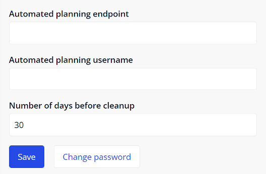

{}[how to get to the **Settings** page? {}

## 3 Configuration

### 3.1 Entities {#entities}

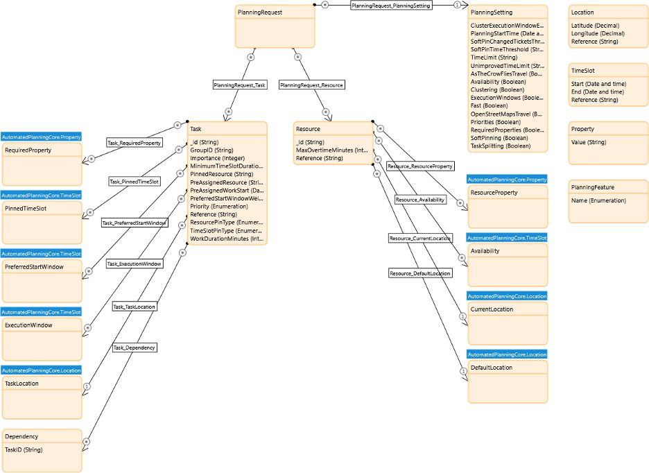

#### 3.1.1 Request

You can build the request using the entities from the module. The description of these entities is below.

`PlanningRequest` is the settings for this planning. An object is required for this entity. Create the object and associate the object to `PlanningRequest`.

| Attribute | Type | Description |
| --------- |--------|--------|
| `ClusterExecutionWindowExclusionDays` | Integer | The time in days since planning starts in which tasks will be clustered separately. All tasks for which the last service window ends inside this period, will be clustered with other tasks with the same service window. This attribute only affects the `ClUSTERED` planning type.  If the value is `0`, no service windows are treated in a special way. |
| `PlanningStartTime`   | Date and time | The time from when you start planning. |
| `SoftPinChangedTasksThreshold ` | Integer | The maximum number of allowed changed soft pinned tasks. |
| `SoftPinTimeThresholdMinutes	` | Integer | The maximum duration in minutes that a soft pinned task's start or end time can change before the task is considered changed. If the value is `0`, all changes are considered a change and new tasks are usually added to the end of the work queue. |
| `TimeLimitSeconds` | Integer | The maximum total time in seconds that the planner is allowed to improve the planning.  If the value is empty, a configured default is used. |
| `UnimprovedTimeLimitSeconds` | Integer | The maximum time in seconds that the planner can spend without improving the planning. If the planning does not improve for the specified amount of time, the planner will finish early.  If the value is empty, a configured default is used. |
| `AsTheCrowFliesTravel` | Boolean | Enables using haversine distance to find travel time. |
| `Availability` | Boolean | Enables availability windows. Availability windows are periods of time when a resource is available to work. It represents workdays, but holidays, weekends, and sick days should also be taken into account for this. |
| `Clustering`   | Boolean | This is an option if the solver type `Fast` is still not fast enough, and locations tend to be clustered geographically, for example, in cities and towns. `Clustering` greatly reduces the total number of locations that need to be solved per planning, which in turn makes the total runtime a lot smaller. |
| `ExecutionWindows`  | Boolean | Enables execution windows. Execution windows are periods of time when a task can be picked up. It is impossible to work outside these windows for some reasons, for example, because the location is closed. |
| `Fast`  | Boolean | When the value is `true`, the solver type is `Fast`. `Fast` contains a very limited subset of rules. It only deals with travel duration and work duration, and does not deal with anything that requires exact time, such as dependencies, pinning tasks, and multi-mechanic tasks. With the approach, the application does not need to check for dependencies or linked tasks, and a change in the beginning of the chain does not affect all the tasks that come after. In this way, the approach is much faster than `Full`. |
| `OpenStreetMapsTravel` | Boolean | Enables Graphhopper (OpenStreetMaps) service to find the travel time. |
| `Priorities` | Boolean | Enables using `Priorities`. Some tasks may need to be assigned as early as possible, regardless of the travel time. The planner allows setting `Medium` and `High` priorities for this purpose. |
| `RequiredProperties`  | Boolean | This enables using required properties. Some tasks might have requirements. Requirements can be certifications, having a key, or even types of resources. For example, a leak can require a certified plumber, and a dig site can require an excavator. |
| `SoftPinning` | Boolean | Enables soft pinning. A human planner is always able to override the planning suggested by the field service planner application. The human planner can pin tasks to a pre-specified mechanic, a pre-specified time, or a combination of both. There are different types of pins, "hard" pins are always followed by the planner, while "soft" pins are followed by the application as much as possible, but if the situation requires a change, for example, if a higher priority task comes in, then the application changes the plan. |
| `TaskSplitting` | Boolean | Enables splitting a task. In some cases, tasks can span multiple days.  When the value is `true`, the planner automatically splits these into multiple appointments. It is also possible to specify a minimum appointment duration, so the planner does not make the task start shortly before the end of the day.  When the value is `false`, the planner cannot split up a task. |

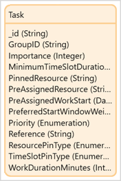

`Task` is a unit of work. A task can be the delivery of an order, a work order, a reservation, etc. Tasks are assigned to the `Resources` and `TimeSlots`. Tasks are associated to `PlanningRequest`, and at least one `Task` is required to make a request. 

| Attribute | Type | Description |
| --------- |--------|--------|
| `_id`  | String | The task ID. |
| `GroupID`| String | The group ID for multi-resource tasks. All partial tasks in the same multi-resource task must have the same `GroupID`. |
| `Importance` |Integer| This shows how important this task is compared to others. If the planning has to choose a task to drop because there is not enough time to pick up all tasks, more important tasks are preferred over less important ones. Use `Priority` or `ExecutionWindows` if the planner should plan certain tasks before others.  The default value is `1`. |
| `MinimumTimeSlotDurationMinutes` | Integer | This is used for task splitting. If a task is split into multiple `timeSlot`, this value indicates the minimum duration that each time slot must be, in minutes. The value can be, for example, `60`. If the value is not set, the default value is to `workDurationMinutes`. If the value is equal to `workDurationMinutes`, the planner will not split the task.  |
| `PinnedResource` | String | The resource ID for the pinned resource.  Set this value only if `resourcePinType` is `SOFT` or `HARD`. |
| `PreAssignedResource` | String | The ID of the resource to which this task is assigned. If the value is empty, the task starts without being unassigned to a resource. |
| `PreAssignedWorkStart` | Date and time | The pre-planned time slots. You can set this to assigned tasks if `pinnedTimeSlots` is `false`, but it is not required. Setting it may improve performance on re-calculations. You should not set it on unassigned tasks. |
| `PreferredStartWindowWeight` | Interger | The weight of ` preferredStartWindows` compared to minutes of travel time. For example, if  `preferredStartWindowWeight` is `30`,  then the planner allows up to 30 minutes of extra travel time across all resources, to make `preferredStartWindows`. |
| `Priority` | Enumeration | Shows how quickly this task needs to be picked up. `Medium` and `High` priority tasks are planned as soon as possible, possibly at the cost of total travel time. `High` priority tasks are planned before `Medium` priority tasks if possible. `Low` priority tasks are planned as cheaply as possible. The optimizer minimizes total travel and work time, even if this means that tasks will be done later. `ExecutionWindows` is always considered. A `Low` priority task may be assigned earlier than a high priority task if its execution window ends earlier. Use `Importance` if the planner must decide which task should be picked up if there is not enough time to pick them all up. |
| `Reference` | String | Reference which can be used by the client to map error messages to  client-side entities. This is not used by the planner other than validations. |
| `ResourcePinType` | Enumeration | The pin type.  If the value is set to `HARD`,  the planner will never change this resource assignment.  If the value is to `SOFT`, the  planner will only change the assignment if other tasks would be dropped. |
| `TimeSlotPinType` | Enumeration | The pin type. If the value is set to `HARD`, the planner will never change this time  slot assignment.  If the value is to `SOFT`,  the planner will only change the assignment  if other tasks would be dropped. |
| `WorkDurationMinutes` | Integer | The expected work duration in  minutes.  The value must be set if `TimeSlotPinType` is `NON`. |

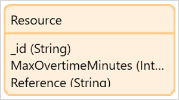

`Resource` is the resource in a planning request. This can be a mechanic, a tennis court, a delivery driver, etc. At least one `Resource` is required to make a request.

| Attribute | Type | Description |
| --------- |--------|--------|
| `_id`   | String | The resource ID. |
| `MaxOvertimeMinutes` | Integer | The maximum overtime in minutes that the resource can make. Overtime is only used to finish a task. New tasks are not started within this time. |
| `Reference`  | String | The reference which can be used by the client to map error messages to client-side entities. This is not used by the planner other than validations. |

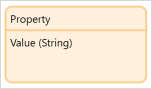

`Property` is used to restrict the tasks that a resource can pick up. A resource needs to have the required properties to pick up a task. `Property` is required if the `RequiredProperties` setting is set to `true`. 

| Attribute | Type | Description |
| --------- |--------|--------|
| `Value`   | String | String that needs to match for the `RequiredProperty` and the `ResourceProperty`. <ul><li>`RequiredProperty`: the set properties on the resource that are required to fix a task.</li> <li>`ResourceProperty`: the properties that the resource possesses to pick up tasks.</li></ul> |

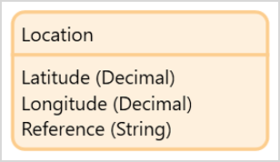

`Location` is a location with ID and coordinates. A location can be the following:

●   TaskLocation: location of the task

●   CurrentLocation: Current location of the resource

●   DefaultLocation: Default location of the resource (where the resource starts and ends the day)

Locations are optional, but if used, they need to be added to all the tasks and resources.

| Attribute | Type | Description |
| --------- |--------|--------|
| `Latitude` | Decimal | The latitude of the location.|
| `Longitude`  | Decimal | The longitude of the location.|
| `Reference`  | String | Reference which can be used by the client to map error messages to client-side entities. This is not used by the planner other than validations. |

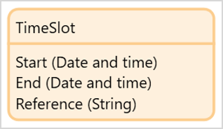

`TimeSlot` is a time interval. It is used for the following:

* `PinnedTimeslots`: the value must only be set if `resourcePinType` is `SOFT` or `HARD`
* `PreferredStartWindow`: a list of preferred windows when the task should start
  * It is not guaranteed that the task will be picked up within any of these windows
  * The importance of keeping to these windows is set by `preferredStartWindowWeight`

* `ExecutionWindow`: a list of windows when the task can be picked up
  * This usually relates to when a location is accessible
  * Service windows must be given if `pinnedTimeSlots` is `false`.

* `Availability`: a list of periods of time where the resource is available

| Attribute | Type | Description |
| --------- |--------|--------|
| `Start` | Date and time | The start of the interval. |
| `End`   | Date and time | The end of the interval. |
| `Reference`  | String | Reference which can be used by the client to map error messages to client-side entities. It is not used by the planner other than validations. |

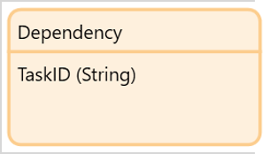

`Dependency` is a list of task IDs that must finish before starting the current task.

| Attribute | Type | Description |
| --------- |--------|--------|
| `TaskID` | String | The ID of the task that must finish before the current task. |

#### 3.1.2 Response

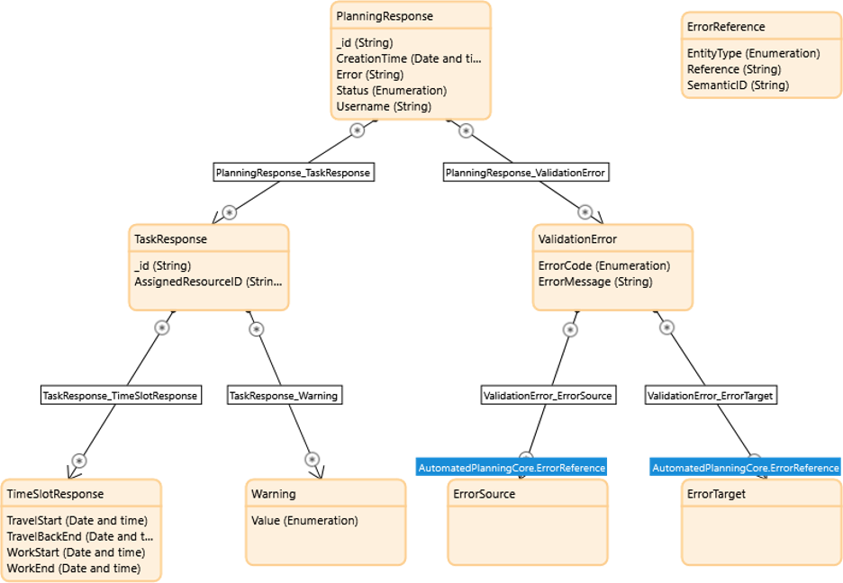

If the response goes well, you can retrieve the `TaskResponse` and map the results to your own entities.

`PlanningResponse` is the solution to the planning request. 

| Attribute | Type | Description |
| --------- |--------|--------|
| `_id`   | String | The ID of the planning response.|
| `CreationTime` | Date and time | The time when the planning was created. |
| `Error` | String | An error message if an exception occurs during execution. |
| `Status` | Enumeration | Execution status. The value can be the following: `Canceled`, `Error`, `Finished`, `Received`, `Running`. |
| `Username`  | String | Username of the user who created the planning. |

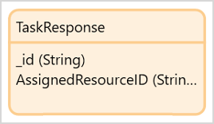

`TaskResponse` is a task in a planning response.

| Attribute | Type | Description |
| --------- |--------|--------|
| `_id`   | String | The task ID.  |
| `AssignedResourceID` | String | The ID of the resource to which this task has been assigned. |

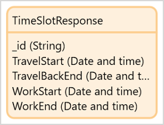

`TimeSlotResponse` is a time slot for a task in the planning response.

| Attribute | Type | Description |
| --------- |--------|--------|
| `_id`  | String | The ID of the the time slot response.  |
| `TravelStart`   | Date and time | The time when the resource starts travelling. |
| `TravelBackEnd` | Date and time | The time when the resource finishes traveling to the default location.  The value is `null` if this is not the last task of the day. |
| `WorkStart`     | Date and time | The time when the resource starts working. |
| `WorkEnd`       | Date and time | The time when the resource finishes working. |

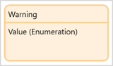

`Warning` contains a list of warnings for this task. The possible values are described in the table:

| Attribute | Type | Description |
| --------- |--------|--------|
| `Value`   | Enumeration | The value can be the following: <ul><li>  `MISSING_REQUIRED_PROPERTIES` </li> <li>`NO_TIME_SLOTS_PLANNED`</li><li>`NO_VALID_TIME_FOUND`</li><li>`OUTSIDE_EXECUTION_WINDOW`</li><li> `OVERLAP`</li><li> `RESOURCE_MISMATCH`</li><li> `RESOURCE_NOT_AVAILABLE`</li><li> `SOFT_PINNED_RESOURCES_CHANGED`</li><li> `SOFT_PINNED_TIME_SLOTS_CHANGED`</li> </ul> |

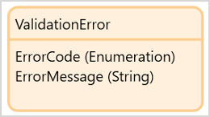

`ValidationError` contains error information.

| Attribute | Type | Description |
| ------------- |------------|--------|
| `ErrorCode`    | Enumeration | A machine readable error code. |
| `ErrorMessage` | String | A human readable error code. |

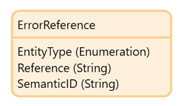

`ErrorReference` points to the object which caused the validation error. This can either be the source of the error or the target.

| Attribute | Type | Description |
| ------------- |------------|--------|
| `EntityType`  | Enumeration |  The entity type of the object that is referred to. The value can be the following: `AVAILABILITY`, `DEPENDENCY`, `EXECUTION_WINDOW`, `PREFERED_START_WINDOW`, `RESOURCE`, `TASK`, `TIME_SLOT`.  |
| `Reference`   | String |  The `reference` string that was on the object that is referred to. |
| `SemanticID`  | String |  The ID known to the planner. For tasks, this is the task ID. For availability, this is a time window. |

### 3.2 Microflows {#microflows}

| Microflow                       | Description                                                  | Input             | Output             |
| ------------------------------- | ------------------------------------------------------------ | ----------------- | ------------------ |
| `CalculatePlanning`             | Used to start the planning and wait for the planning result. This uses a default progress bar. | `PlanningRequest` | `PlanningResponse` |
| `StartPlanning_Asynchronous`    | Used to start the planning and not wait for the planning result. This can be useful if you want to create a custom progress message. | `PlanningRequest` | `Solution`         |
| `RetrievePlanning_Asynchronous` | Used to retrieve the result of the planning, in combination with `StartPlanning_Asynchronous`. | `Solution`        | `PlanningResponse` |
| `CancelPlanning`                | Used to cancel a running planning.                           | `Solution`        |                    |
| `CheckPlanning`                 | Used to validate the planning without actually starting it.  | `PlanningRequest` | `PlanningResponse` |

## 4 Troubleshooting

When there are problems, the easiest way to troubleshoot is to check the logs that are stored in the application. You can access the logs by connecting `SolutionLog_Overview` to your navigation. The log shows you the request and response from the service and any errors that have occurred.

## 5 Read More {#read-more}

[Automated Task & Resource Planner API](https://saas-acceptance.timeseries.com/swagger-ui/?urls.primaryName=field-service-planner)
