## 1 Introduction

The [Chatbot](https://marketplace.mendix.com/link/component/118408) app service enables you to build a chat app with human-like conversations with users via text messages, which is fully managed artificial intelligence (AI) service with advanced natural language models to design, build, test, and deploy conversational interfaces.

Here is an overview of what Chatbot contains:

| Item                                        | Name                             |
| ------------------------------------------- | -------------------------------- |
| [Predefined entities](#predefined-entities) | BotContext, BotConfig, LanguageConfig, Slot Argument, TestBotContext |
| [Constants](#constants)                     | LicenseToken, TokenEndpoint      |
| [Microflows](#microflows)                   | GetSlotArgument, StartService |
| [Widgets](#widgets)                         | Chatbot, InputElement         |
| [Pages](#pages)                             | ChatbotConsole                |
| [Enumerations](#enumerations)               | BotStatus, BuiltinIntent, BuiltinSlotType,LanguageStatus, Locale, SlotConstraint, SlotValueResolutionStrategy    |

In most cases, you will only need what is contained in the **Chatbot** > **USE_ME** folder. The content in the **Chatbot** > **Internal** folder is for internal use only and you will not need it.

### 1.1 Typical Use Cases

You can use this app service to build a chat app with human-like conversations with users via text messages. You can also customize these chatbot intent actions in your Mendix app.

### 1.2 Features

This app service enables doing the following:

* Create chatbot with human-like conversations with users via text messages in UI.
* Support customize chatbot intent actions.
* Easily add AI that understands intent, and automates actions across many languages.
* Design and deploy omnichannel conversational AI in drag and drop.

### 1.3 Prerequisites

This app service can only be used with Studio Pro 9 versions starting with [9.12.0](/releasenotes/studio-pro/9.12.0).

## 2 Installation

### 2.1 Obtaining a License Token {#obtain-license-token}

Chatbot is a premium Mendix product that is subject to a purchase and subscription fee. To successfully use this app service in your app, first you need to start a subscription or a trial to get a license token.

#### 2.1.1 Starting a Trial

A trial gives everyone in your company one-month access to the app service. The trial has a limitation with [data usage](#check-usage) up to 300 minutes. To start a trial, perform the following steps:

1. Go to the [Chatbot](https://marketplace.mendix.com/link/component/118408) page in the marketplace.
2. Click **Try for Free** to open the **Start Your Free Trial** page. Here you can see the **Trial Details** for the app service.
3. Select the check box to agree to the **Terms & Conditions**.
4. Click **Enable Trial**. A page opens and confirms that the your request has been received.
5. Wait until your request is processed. It can take more than at least 15 minutes for the system to process your request. After your request is processed, you will receive an email that says the app service is ready to be used. 
6. Click the link in the email to go to the Marketplace [Subscriptions](https://docs.mendix.com/appstore/general/app-store-overview#subscriptions) page and log in there. The **Subscriptions** page gives an overview of all the subscriptions of your organization.
7. Click **Chatbot** to open the [service management dashboard](https://docs.mendix.com/appstore/general/app-store-overview#service-management-dashboard).
8. Follow the instructions in the [Creating Binding Keys](/appstore/general/app-store-overview#creating-binding-keys) section in the *Marketplace Overview* to create a license token.

#### 2.1.2 Subscribing to the App Service

1. Go to the [Chatbot](https://marketplace.mendix.com/link/component/118408) page in the marketplace.
2. Click **Subscribe** to start a subscription.
3. Select your subscription plan.
4. Fill in [Technical Contact](https://docs.mendix.com/developerportal/collaborate/app-roles#technical-contact) information (**First Name**, **Last Name**, **Email Address**), billing account information, payments and other required information and then place the order. A page opens and confirms that the your request has been received.
5. Wait until your request is processed. It can take more than 15 minutes for the system to process your request. After your request is processed, the Technical Contact will receive an email that says the app service is ready to be used. 
6. Click the link in the email to go to the Marketplace [Subscriptions](https://docs.mendix.com/appstore/general/app-store-overview#subscriptions) page and log in there. The **Subscriptions** page gives an overview of all the subscriptions of your organization.
7. Click **Chatbot** to open the [service management dashboard](https://docs.mendix.com/appstore/general/app-store-overview#service-management-dashboard).
8. Follow the instructions in the [Creating Binding Keys](/appstore/general/app-store-overview#creating-binding-keys) section in the *Marketplace Overview* to create a license token.

### 2.2 Downloading the Component from the Marketplace

1. Go to the [Chatbot](https://marketplace.mendix.com/link/component/118408) page in the marketplace.
2. **Download** the *Chatbot.mpk* file.
3.  To add the Chatbot app service to your app in Mendix Studio Pro, follow these steps:

    1.  In the **App Explorer**, right-click the app.
    2.  Click **Import module package** and then select *Chatbot.mpk*.

        In the **Import Module** dialog box, **Add as a new module** is the default option when the module is being downloaded for the first time, which means that new entities will be created in your app.

        

        {}If you have made any edits or customization to a module that you have already downloaded, be aware of the **Replace existing module** option. This will override all of your changes with the standard Marketplace content, which will result in the creation of new entities and attributes, the deletion of renamed entities and attributes, and the deletion of their respective tables and columns represented in the database. Therefore, unless you understand the implications of your changes and you will not update your content in the future, making edits to the downloaded modules is not recommended.{}

   3.  In the **Import Module** dialog box, click **Import**. 
   4.  Wait until a pop-up box states that the module was successfully imported. Click **OK**.
   5.  Open the **App Explorer**  to view the **Chatbot** module. You can also find the app service in the **Cognitive AI widgets** category in the **Toolbox**.
4. Map the **Administrator** and **User** module roles of the installed modules to the applicable user roles in your app.

You have successfully added the Chatbot resources to your app.

## 3 Configuration

### 3.1 Predefined Entities {#predefined-entities}

#### 3.1.1 BotContext

The **BotContext** is Context entity which captures all input and output info for Chatbot widget, the context is uniquely identified via its Name attribute.

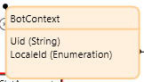

| Attribute        | Data Type | Description|
| ---------------- | ---- | -----------|
| `Uid`   | String | The Unique identifier of the bot context.     |
| `LocaleId` | Enumeration | The enumeration to gets or sets the bot locale. |

#### 3.1.2 BotConfig

The **BotConfig** is the read only entity that shows the context of a bot which performs automated tasks such as ordering a pizza, booking a hotel, ordering flowers, and so on.

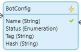

| Attribute        | Data Type | Description|
| ---------------- | ---- | -----------|
| `Name`   | String | The name of the bot.   |
| `Status` | Enumeration | The status of the bot. |
| `Tag`    | String | The underlying cloud identifier, internal use only.   |
| `Hash`   | String | The hash string to identify if bot config has modified.     |

#### 3.1.3 LanguageConfig

The **LanguageConfig** is the read only entity that shows the language config of bot.

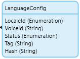

| Attribute        | Data Type | Description|
| ---------------- | ---- | -----------|
| `LocaleId`   | Enumeration | The identifier of the language and locale where this intent is used. All of the bots, slot types, and slots used by the intent must have the same locale.     |
| `VoiceId` | String | The UUID of the voice object. |
| `Status` | Enumeration | The status of the bot. |
| `Tag`    | String | The underlying cloud identifier, internal use only.   |
| `Hash`   | String | The hash string to identify if bot config has modified.     |

#### 3.1.4 SlotArgument

The **SlotArgument** is the entity that captures the user input value of slots for current fullfilled intent.

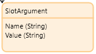

| Attribute        | Data Type | Description|
| ---------------- | ---- | -----------|
| `Name`   | String | The name of the slot.     |
| `Value` | String | The value of slot. |

#### 3.1.5 TestBotContext

The **TestBotContext** is the entity that shows config of the test bot context.

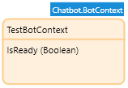

| Attribute        | Data Type | Description|
| ---------------- | ---- | -----------|
| `IsReady`   | Boolean | The ready status of the test bot.     |

#### 3.1.6 ClientConfig

The **ClientConfig** is the entity that shows the user data configurations.

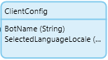

| Attribute        | Data Type | Description|
| ---------------- | ---- | -----------|
| `BotName`   | String | The name of the bot.     |
| `SelectedLanguageLocale` | Enumeration | The selected language locale of target bot. |

### 3.2 Constants {#constants}

#### 3.2.1 LicenseToken

The **LicenseToken** constant provides a valid license token for an app that uses this app service. As Chatbot is a commercial product, no matter your app is deployed in the [Mendix Cloud](/developerportal/deploy/mendix-cloud-deploy), your own environment, or locally in Studio Pro, you need to have a valid license token and configure it correctly. For details on how to get and configure a license token, see the [Obtaining a License Token](#obtain-license-token) section and [Configuring the License Token](#configure-license-token) section.

#### 3.2.2 TokenEndpoint

The **TokenEndpoint** constant provides a valid endpoint of security token service for the back-end authentication of the app service. The constant comes with a default value which points to the deployed security token service. The security token service issues security tokens that authenticate user's identity. 

### 3.3 Microflows{#microflows}

#### 3.3.1 StartService

The **StartService** microflow is a Java action which starts the Chatbot service. It is used to set up a cognitive chatbot back-end server infrastructure, which is critical for realizing all the features that Chatbot provides.

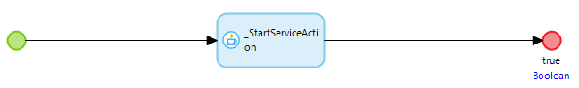

#### 3.3.2 GetSlotArgument {#getslotargument}

The **GetSlotArgument** microflow takes **botContext** object and **slotName** as input parameters to extract slot argument from provided **botContext**.

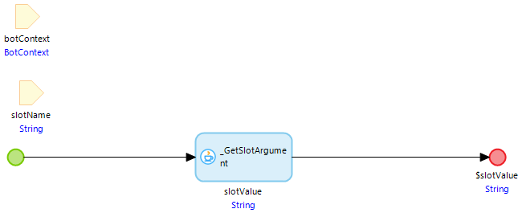

### 3.4 Java actions {#java-actions}

#### 3.4.1 CreateBotContext {#createbotcontext}

The **CreateBotContext** Java action takes entityType and botName as input parameters, it creates bot and its associated context given the bot name and bot description, you could pass microflow to initialize the context. 

### 3.5 Enumerations {#enumerations}

#### 3.5.1 BotStatus

The **BotStatus** is an enumeration that incorporates all the status of your bot.

| Caption | Name |
| --- | --- |
| Creating | Creating |
| Initializing | Initializing |
| Available | Available |
| Failed | Failed |

#### 3.5.2 BuiltinIntent

The **BuiltinIntent** is an enumeration that incorporates all kinds of built-in intent.

| Caption | Name |
| --- | --- |
| CancelIntent | Cancel |
| FallbackIntent | Fallback |
| HelpIntent | Help |
| PauseIntent | Pause |
| RepeatIntent | Repeat |
| ResumeIntent | Resume |
| StartOverIntent | StartOver |
| StopIntent | Stop |

#### 3.5.3 BuiltinSlotType

The **BuiltinSlotType** is an enumeration that incorporates all kinds of built-in slot type.

| Caption | Name |
| --- | --- |
| AlphaNumeric | AlphaNumeric |
| City | City |
| Country | Country |
| Date | Date |
| Duration | Duration |
| EmailAddress | EmailAddress |
| FirstName | FirstName |
| LastName | LastName |
| Number | Number |
| Percentage | Percentage |
| PhoneNumber | PhoneNumber |
| State | State |
| StreetName | StreetName |
| Time | Time |

#### 3.5.4 LanguageStatus

The **LanguageStatus** is an enumeration that incorporates all the language status of your bot.

| Caption | Name |
| --- | --- |
| Creating | Creating |
| Initializing | Initializing |
| Available | Available |
| Failed | Failed |

#### 3.5.5 Locale

The **Locale** is an enumeration that incorporates all the language options of your bot.

| Caption              | Name  |
| --------------------- | ----- |
| German(German)                | de_DE    |
| English(Australia)            | en_AU    |
| English(British)              | en_GB    |
| English(US)                   | en_US    |
| Spanish(Latin America)        | es_419   |
| Spanish(Spain)                | es_ES    |
| Spanish(US)                   | es_US    |
| French(Canada)                | fr_CA    |
| French(France)                | fr_FR    |
| Italian(Italy)                | it_IT    |
| Japanese(Japan)               | ja_JP    |

#### 3.5.6 SlotConstraint

The **SlotConstraint** is an enumeration that incorporates all the informations of your slot constraint.

| Caption | Name |
| --- | --- |
| Required | Required |
| Optional | Optional |

#### 3.5.7 SlotValueResolutionStrategy

The **SlotValueResolutionStrategy** is an enumeration that incorporates all the options of your slot value resolution.

| Caption | Name |
| --- | --- |
| OriginalValue | OriginalValue |
| TopResolution | TopResolution |

#### 3.5.8 AddLanguageMethod

The **AddLanguageMethod** is an enumeration that incorporates all the options to add language method

| Caption | Name |
| --- | --- |
| Add a language from scratch | FromScratch |
| Start with an example | FromExample |

### 3.5 Widgets {#widgets}

#### 3.5.1 Chatbot {#chatbot}

The core widget required is the **Chatbot** widget. You can make the following settings for the **Chatbot** widget:

* **Context** tab
  * **Intents** – Intent is chatbot jargon for the motive of a given chatbot user. It’s the intention behind each message that the chatbot receives. Intent is all about what the user wants to get out of the interaction. For example, a user says, ‘I need new shoes.’
     * **Intent actions** – The action lists of user intent.
         * **Dialog action** – Action is executed at every turn of the conversations. You can use this function to initialize values or validate user input.
         * **Fulfillment action** – The action is invoked after slot elicitation and confirmation. Use this action to fullfill your intent.
         * **Name** – the name of intent.
         * **Failure** – The action is invoked in case of intent failure
     * **Fallback** – The action is invoked when the built-in Fallbackintent is fulfilled.
  * **Bot Context** – The bot context is the current position of the bot defines its possibilities and options. The context changes every time the bot moves along the story and opens newly possible interactions as well as closes the previous ones.
     * **Bot Context Uid** – The Unique identifier for bot context.
     * **Locale** – The active locale constant of the bot.
     * **Chatbot Mode** – The working mode for chatbot, which works either on Text or Audio. 
  * **Options** – The setting options for chatbot conversational UI/UX.
     * **Use toggle button** – Use a toggle button to show or hide chat panel.
     * **Show inspection panel** – A flags to toggle the display of inspection panel.
* **Events** tab
  * **On error** – by binding a string attribute to the **Error** property, you can obtain the error message raised by the back-end service and set a custom action that is executed when an error occurs
     * **Error** – sets a string attribute as the error message
     * **Action** – sets which action is executed when an error occurs
  * **On ready** – by binding a string attribute to the **Is ready** property, you can set this property to verify if the current bot is ready for conversing.
     * **Is ready** – A flag indicating if the current bot is ready for conversing.
     * **Action** – Action triggered when bot is ready

<!-- #### 3.5.2 InputElement {#inputelement}

The core widget required is the **InputElement** widget. You can make the following settings for the **InputElement** widget:

* **General** tab
	* **Source**  – the value of the **Audio** attribute of a **speechSynthesizer** object
	* **Controls**  – determines if it offers controls to allow the end user to control audio playback, including volume, seeking, and pause/resume playback; this accepts a Boolean value -->

### 3.6 Configuring the LicenseToken {#configure-license-token}

#### 3.6.1 For an App Run Locally or Deployed as a Mendix Free App

If you run your app locally or deploy it as a Mendix Free App, configure the license token in Studio Pro. Perform the following steps:

1. In the App Explorer, go to **Settings** to open the [App Settings](/refguide/project-settings) dialog box.
2. On the **Configurations** tab, click **Edit** to open the **Edit Configuration** dialog box.
3. On the **Constants** tab, create a new constant with the predefined constant **Chatbot.LicenseToken**.
4. Fill in the **Value** with the license token that you [obtained](#obtain-license-token).
5.  Click **OK** to save the settings.

    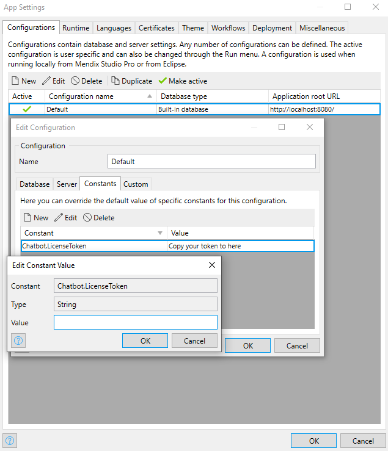

6. When you finish building the app, click **Run Locally** to run your app locally or click **Run** to deploy it as a Mendix Free App. Then you can see the app service in your app.

#### 3.6.2 For an App Deployed in the Mendix Cloud

If you deploy your app in the Mendix Cloud, configure the license token in the [Developer Portal](/developerportal/deploy/environments-details).

Before you deploy your app, configure the app **Constants** in the deployment package.

If you have already deployed your app, change the existing **LicenseToken** constant value on the **Model Options** tab and restart the app.

#### 3.6.3 For an App Deployed in Your Own Environment

If you deploy your app in your own environment, you need to configure the license token in your own environment. For more information, see [Deployment](/developerportal/deploy/index).

## 4 Usage

### 4.1 Initializing Chatbot When App Starts

It can be useful to run the Chatbot service automatically when your app starts. The app service contains a Java action – the **StartService** microflow, which can start the Chatbot service for you. You can use the [After startup](/refguide/project-settings#after-startup) setting in your app to call the **StartService** microflow.

1. In the App Explorer, go to **Settings**. The [App Settings](/refguide/project-settings) dialog box opens.
2. Go to the **Runtime** tab. 
3. Select the **StartService** microflow from the **Chatbot** > **USE_ME** folder.
4. Set **After startup** to the microflow that calls the **StartService** microflow.

### 4.2 Configure Chatbot design time in Your Browser {#configure-chatbot-design-time}

You can use provided **ChatbotConsole** page in module to design bot context. To let the **ChatbotConsole** page works, you need to take few steps as following.

1. Download DropDown Container widget from Marketplace as Chatbot module dependency.
2. Go to the **Marketplace** in your app project on Mendix Studio Pro. Search for the **Dropdown Container** widget and download the latest version.
3. Import the Dropdown Container widget and Update all the widgets in Chatbot console page if necessary.
4. Go to Navigation page in your app project, Add ChatbotConsole page as new item in your navigation profiles.
5. Make sure that you have [configured the license token](#configure-license-token).
6. Run your app locally. Navigate to chatbot console page and you will be guided into next phase.

### 4.3 Design Chatbot context in Your Browser {#design-chatbot-context}

1. Go to the chatbot console page in your browser as Administrator.
2. Start design your own chatbot by clicking **Create bot** button in Chatbot console page.
3. Configure bot settings with bot name and description.
4. Add languages with a preset bot template **OrderFlowers**.
5. Add **Language details** and **Voice**.
6. Run Test. Navigate to bot conversation page. See if the whole bot workflow works.

### 4.4 Adding Intent Actions to Your Defined Chatbot

1. In your app module's domain model, create an entity and name it *BotContext*, with the following attributes:
   * `OrderFlowerIntent` (String)
   * `Error` (String)
2. Create a microflow as follows:
    1. Name the microflow *CreateBotContext*.
    2. Add a Java action call activity to the microflow, select Java action **CreateBotContext** from Chatbot module.
    3. Double-click the Java action call activity, set **BotContext** from Chatbot as Entity type in Bot Context.
    4. Set Bot name as **MendixSampleBot** from the bot designed in Chatbot console page.
    5. Add a Change object activity to the microflow.
    6. Set input object as botContext from Java action all activity.
    7. Set member **OrderFlowerIntent** as **OrderFlowers**, and set member **LocaleId** as **Chatbot.Locale.en_US**.
    8. Right-click the Java action call activity and select **Set $botContext as return value** in the pop-up menu.
4. Create new Blank page named Chatbot
5. Drag drop a **Data View** widget in the page, set data source as microflow, chose the microflow as CreateBotContext created in step 2.
6. Drag drop a **Chatbot** widget and start config the bot configuration
7. In context tab, you need to add **Intent actions** and config **Bot Context**
8. Add new intent actions item and edit the microflow and the name of intent.
9. Create a microflow as follows:
    1. Name the microflow *OrderFlower*.
    2. Add a Parameter and select **BotContext** as data type of output
    3. Add a Microflow call activity, select Microflow **GetSlotArgument** from Chatbot module.
    4. Edit the parameter botContext as $botContext, and slotName as FlowerType.
    5. Add a Microflow call activity, select Microflow **GetSlotArgument** from Chatbot module.
    6. Edit the parameter botContext as $botContext, and slotName as PickupTime.
    7. Add a Microflow call activity, select Microflow **GetSlotArgument** from Chatbot module.
    8. Edit the parameter botContext as $botContext, and slotName as PickupDate.
    9. Add a log message to print all the informations.
10. Edit the name of intent as **OrderFlowerIntent**, which created in chatbot console page. Click OK to save the intent actions item.
11. In Bot Context Uid, select **Uid** from the object created by data view.
12. In Locale, select **LocaleId** from the object created by data view. Click OK to save the widget configuration.
13. Run your app locally. Navigate to bot conversation page and you can start your conversation with chatbot.

### 4.5 Handling Chatbot Events

Multiple events can be picked up by the [Chatbot](#chatbot) widget and can be used to build your customized event handling logic.

There are two main types of events that can be picked up by the **Chatbot** widget, which are described in the sections below.

#### 4.5.1 On Error {#on-error}

By binding an attribute to the **Error** event, the app can pick up an error raised by the back-end service.

**Error** takes a string attribute. You can define an attribute and bind this attribute to **Error**. In a running app, when chatbot transcription fails, an error event will be triggered, and the error information will be populated to this **Error** attribute. The app can obtain this error message and trigger a custom action. You can select the custom **Action** from a list of actions.

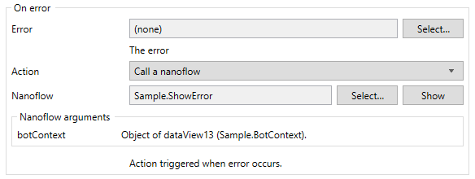 

For example, you can set up the **Action** to make the app show a pop-up window to show error details to users.

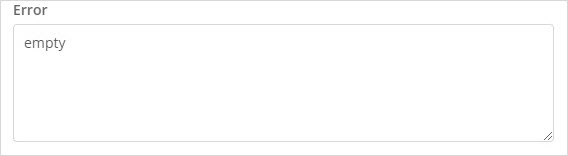

#### 4.5.2 On Ready {#on-ready}

By binding an attribute to the **Is ready** event, the app will trigger an action event when bot is ready.

**Is ready** takes a string attribute. You can define an attribute and bind this attribute to **Is ready**. In an app, when chatbot is runnning, A flags to indicating if the current bot is ready for conversing. The app can trigger an action when bot is ready. You can select the custom **Action** from a list of actions.

### 4.6 Checking Statistics on the Usage Dashboard {#check-usage}

The **Usage** dashboard shows the real-time statistics about the usage of an app service. Perform the following steps to check the real-time statistics:

1. Log into the Marketplace.
2. Go to **My Marketplace** and click [Subscriptions](/appstore/general/app-store-overview#subscriptions) on the left navigation menu. The **Subscriptions** page gives an overview of all the subscriptions of your organization.
3. Click **Chatbot** to open the [service management dashboard](/appstore/general/app-store-overview#service-management-dashboard). On the **Overview** tab, the **Usage** dashboard shows the real-time statistics.
