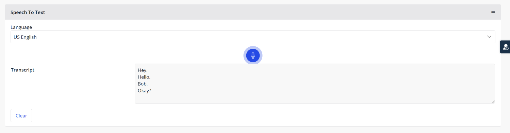
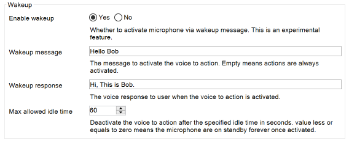
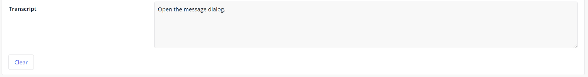

## 1 Introduction

With the [Cogniso Speech To Text](https://marketplace.mendix.com/link/component/118590) app service, you can easily convert voice and audio into written text in your web applications and then trigger customized actions. This app service can be very helpful when building your own voice-to-text applications. It enables you to build an app to transcribe voice and audio to text with state-of-the-art speech recognition, without building a voice-to-text app from scratch. All you need to do is drag and drop items and configure them.

The app service contains out-of-the-box Java actions, JavaScript actions, domain models, nanoflows, microflows, and a set of widgets. Here is an overview of what CognisoSpeechToText contains:

* [Predefined entities](#predefined-entities)
	* MediaDocument 
* [Constants](#constants)
	* LicenseToken
	* TokenEndpoint
* [Microflows](#microflows) 
	* BatchTranscription
	* StartService
* [Nanoflows](#nanoflows) 
* [Java action](#java-action) 
* [Widgets](#widgets) 
	* Microphone

In most cases, you only need what is contained in the **SpeechToText** > **USE_ME** folder. The content in the **SpeechToText** > **Internal** folder is for internal use only and you do not need it.

### 1.1 Typical Use Cases

You can use this app service to easily convert voice into written text in your mendix apps and trigger a custom action. You can perform some basic operations, such us enabling wakeup messages, using different language options, customizing voice-to-text conversion, setting up voice-to-action feedback and much more.

### 1.2 Features

This app service enables doing the following:

* Customize voice-to-text actions
* Use batching mode to implement the speech conversion as a back-end service
* Customize wakeup messages
* Enable voice-to-action feedback
* Support different language options
* Translate non-English transcripts into English

### 1.3 Prerequisites

This app service can only be used with Studio Pro 9 versions starting with [9.4](/releasenotes/studio-pro/9.4).

## 2 Installation

1. Go to the [Cogniso Speech to Text](https://marketplace.mendix.com/link/component/118590) component page in the Marketplace and download the *CognisoSpeechToText.mpk* file.

2.  To add the Cogniso Speech to Text app service to your app in Mendix Studio Pro, follow these steps:

    1. In the **App Explorer**, right-click the app.
    2.  Click **Import module package** and then select *CognisoSpeechToText.mpk*. 

        

        In the **Import Module** dialog box, **Add as a new module** is the default option when the module is being downloaded for the first time, which means that new entities will be created in your app.

        {}If you have made any edits or customization to a module that you have already downloaded, be aware of the **Replace existing module** option. This will override all of your changes with the standard Marketplace content, which will result in the creation of new entities and attributes, the deletion of renamed entities and attributes, and the deletion of their respective tables and columns represented in the database. Therefore, unless you understand the implications of your changes and you will not update your content in the future, making edits to the downloaded modules is not recommended.{}

    3. In the **Import Module** dialog box, click **Import**. 
    4. Wait until a pop-up box states that the module was successfully imported. Click **OK**.
    5. Open the **App Explorer**  to view the **CognisoSpeechToText** module. You can also find the app service in the **Cognitive AI widgets** category in the **Toolbox**.
3. Map the **Administrator** and **User** module roles of the installed modules to the applicable user roles in your app.

You have successfully added the Cogniso Speech To Text resources to your app.

## 3 Initializing Cogniso Speech To Text When App Starts

It is good to run the Cogniso Speech to Text service automatically when your app starts. The app service contains a Java action –  the **StartService** microflow, which can start the Cogniso Speech To Text service for you. You can use the [After startup](/refguide/project-settings#after-startup) setting to call the **StartService** microflow.

1.  If you app does not have an after-startup microflow, perform the following steps:
   1. Create a microphone in your module.
   2. Add the **StartService** microflow from the **SpeechToText** > **USE_ME** > **StartService** folder to the new microflow that you created.
   3.  Set the return type of the microflow to **Boolean** with **true** as the **Return value**.

       

2. If you app has an after-startup microflow, perform the following:
   1. Add the **StartService** microflow from the **SpeechToText** > **USE_ME** > **StartService** folder to the existing after-startup microflow.
   2. Set the return type of the new microflow to **Boolean** with **true** as the **Return value**.
3. In the App Explorer, go to **Settings**. The [App Settings](/refguide/project-settings) dialog box opens.
4. Go to the **Runtime** tab. Set **After startup** to the microflow that calls the **StartService** microflow.

## 4 Configuration

### 4.1 Predefined Entities {#predefined-entities}

The **MediaDocument** entity is a conceptual entity that inherits from the **System.FileDocument** entity and incorporates all the information of media document. You can choose to inherit from this entity, set an association to the entity, or copy this entity to your module.

| Attribute        | Data Type | Description|
| ---------------- | ---- | -----------|
| `Transcript`   | String | The base64-encoded audio data string.     |
| `LanguageCode` | String | The language code of this media document. |

### 4.2 Constants {#constants}

#### 4.2.1 Lincese Token

The **LicenseToken** constant offers a valid CognisoSpeechToText license token to the app that uses CognisoSpeechToText to be successfully deployed to [Mendix Licensed Cloud Node](/developerportal/deploy/mendix-cloud-deploy) or your own environment. As CognisoSpeechToText is a commercial product, to use the CognisoSpeechToText fucntionality in a deployed app, you need a long term valid license token, and you need to set the value of the **LicenseToken** constant to that license token in the deployment environment setting.

However, if you only plan to try how CognisoSpeechToText works, that is to say, you will only build and run an app that uses CognisoSpeechToText locally in Studio Pro or deploy to a Mendix Free App environment, then you need to subscribe a trial version, and set the value of the **LicenseToken** constant to that license token in the project environment setting.

For details on how to get a license token, see the [Obtaining a LicenseToken for Your App](#obtain) section below.

#### 4.2.2 TokenEndpoint

The **TokenEndpoint** constant provides a valid endpoint of security token service for the back-end authentication of the cognitive speech-to-text service. The constant comes with a default value which points to the production environment of the deployed security token service. The security token service issues security tokens that authenticate user's identity. 

### 4.3 Microflows{#microflows}

#### 4.3.1 BatchTranscript

The **BatchTranscription** microflow takes a **MediaDocument** object as an input parameter and converts the based64-encoded audio string into text.

#### 4.3.2 StartService

The **StartService** microflow is used to set up a cognitive speech-to-text back-end server infrastructure, which is critical for realizing all the functions that Cogniso Speech To Text provides. It is exposed as microflow actions.

### 4.4 Widgets {#widgets}

#### 4.4.1 Core Widgets

The only core widget required to convert voice to text or convert voice to actions is the **Microphone** widget.

##### 4.4.1.1 Microphone {#microphone}

This **Microphone** widget provides custom settings for voice-to-text and voice-to-action conversions.

To make the widget perform conversions correctly, set the following properties:

*   **General** tab
  * **Enable language selection** – when set to **Yes**, custom language settings are enabled
    * **language**  – determines which language to use for speech conversion (default language: US-English, data type: String)
  * **Enable wakeup** – when set to **Yes**, the following custom settings for waking up the **Microphone** widget are enabled:
    * **wakeupMessage**  – a string which contains no more than two words to activate voice-to-action conversion (if this is empty, the actions are always activated)
    * **wakeupResponse** – a string to give to users as a voice response when voice-to-action conversion is activated
    * **Max allowed idle time** – the number of seconds after which voice-to-action conversion becomes deactivated (if this is less or equals to zero, the microphone is always on standby once activated)
    * **Enable wakeup** – determines whether to activate the **Microphone** widget via a wakeup message (this is an experimental feature)
* **Events** tab
  * **On transcript** – by binding a string attribute to the **transcript** property, you can use this attribute as a voice input parameter sent to the back-end service to trigger an action
    * **transcript**  – sets a string attribute as a voice input parameter
    * **Action** – sets which action is executed  when a transcript is received
  * **On error** – by binding a string attribute to the **Error** property, you can obtain the error message raised by back-end service and set custom actions that are trigged when an error occurs
    * **Error** – sets a string attribute as the error message
    * **Action** – sets which action is executed when an error occurs
* **Voice to Action** tab
  *  **Enable action** –  when set to **Yes**, the following custom settings for actions are enabled:

    * **Actions** – a list of actions to take when a transcript matches an utterance
      * **Utterance** – a string template following natural language syntax or a valid JavaScript regular expression.
      * **Action** – the action triggered when the received transcript matches an utterance
      * **Feedback** – the voice feedback provided to users when an action is triggered

    * **Arguments** – the captured arguments in a transcript as a comma-separated list (this requires you to specify parameterized action text in above table.{}[which table?]{}

    * **Fallback message** – the message to notify users when no action is matched

    * **Translate** – determines whether to translate non-English transcripts and utterances into English for syntax analysis (enable this when you want to use non-English languages)

## 5 Using Cogniso Speech To Text

You can use Cogniso Speech To Text to convert voice to text and then trigger a customizable action.

When you start from a blank app template in Mendix Studio Pro, follow the steps below to set up customizable actions quickly.

### 5.1 Converting Voice into Text in Your Browser

To let the [Microphone](#microphone) widget perform voice-to-text actions, set these data source attributes: **transcript**, **Actions** and **Arguments**. To match voice-to-text actions, pass captured arguments to triggered actions, configure a set of action items in the **Microphone** widget.

Follow these steps to configure the voice-to-text conversion:

1. In your app module's domain model, create an entity and name it *Microphone*, with the following attributes:

   | Attribute       | Data Type |
   | --------------- | --------- |
   | `NewTranscript` | String    |
   | `AllTranscript` | String    |
   | `Arguments`     | String    |
   | `Error`         | String    |

2. Create a nanoflow as follows:
   1. Name the nanoflow *CreateMicrophoneObject*.
   2. Add a create object activity to the nanoflow.
   3. Double-click the create object activity to open the **Create Object** dialog box and **Select** the **Microphone** entity as the **Entity**.
   4. Right-click the create object activity and select **Set $NewMicriphone as return value** in the pop-up menu.

      

3. From the **Toolbox**, add a Data View widget to your page.
4. Inside the Data View widget, add a [Microphone](#microphone) widget.
5.  Set the CreateMicrophoneObject nanoflow as the data source of the Data View widget:
   1. Double-click the Data View widget to open the **Edit Data View** dialog box.
   2. For **Data Source**, select **Nanoflow** as the **Type**.
   3. Click **Select** and select the CreateMicrophoneObject nanoflow for **Nanoflow**.
6.  Double-click the **Microphone** widget to open the **Edit Microphone** dialog box, and change the following settings:
    1. Go to the **Events** tab.
    2. For **transcript**, click **Select** and select the **NewTranscript** attribute.
    3. Go to the **Voice to Action** tab.
    4. For **Arguments**, click **Select** and select the **Arguments** attribute.
    
7. Run your app locally. You can perform voice-to-text actions directly in the browser.

### 5.2 Customizing Wakeup Message {#experimental}

Configure wakeup message to wake up the back-end service automatically with two key attributes **Wakeup message** and **Wakeup response**.

{}The configuration of wakeup messages is an experimental feature.{}

Follow these steps to configure this wakeup message:

1. Double-click the **Microphone** widget to open the **Edit Microphone** dialog box.
2. On the **General** tab, select **Yes** for **Enable wakeup** to enable activating the back-end service via wakeup messages.
3. Set up a **Wakeup message** with no more than two words.
4. Set up a **Wakeup response** which is used as a voice response to users when the back-end service is activated.

5. Click **OK** to save the changes and close the dialog box.

You have made the basic settings for the **Microphone** widget.

### 5.3 Customizing Voice to Action Conversions {#actions}

You can build a customized, automated conversation scenario by setting up **Utterance**, **Actions** and **Voice Feedback**.

You can use **New**, **Delete**, and **Edit** to create a new action, delete an existing action, and edit an existing action.

#### 5.3.1 Utterance

**Utterance** can be a string template following natural language syntax or a valid JavaScript regular expression. It is self-defined rules used for matching the transcripts on speech conversion. Some internal trie filters are implemented to extract the key point of short sentences. 

For instance, you can set **Utterance** as `{rotate|move} the model {0:deg} degree around {1:x|y|z} direction`. Then if you say `rotate model 35 degree around x direction`, the **Microphone** widget will match the transcript to this utterance and trigger an action that you set.

#### 5.3.2 Actions

You can select an **Action** from a list of actions. This action is triggered when a received transcript matches an utterance.

#### 5.3.3 Voice Feedback

**Voice feedback** can be a string template following natural language syntax, which is provided to users after an action is triggered.

For instance, you can set **Voice feedback** as `model is rotated {0} degree around {1} direction`, with `{0}` and `{1}` being the parameters passed through **Arguments** in the **Microphone** widget.

### 5.4 Handling Microphone Events

Multiple events can be picked up by the [Microphone](#microphone) widget and can be used to build your customized event handling logic.

There are two main types of events that can be picked up by the **Microphone** widget, which are described in the sections below.

#### 5.4.1 On Transcript {#on-transcript}

By binding an attribute to the **transcript** event, you can pick up the result of speech conversion by the **Microphone** widget.

**transcript** takes a string attribute. You can define an attribute and bind that attribute to **transcript**. This attribute stores the result of text converted from voice, which matches an utterance in the **Microphone** widget to trigger an action. 

You can select an **Action** from a list of actions. For example, the app can show the whole content of the voice-to-text conversion history.

 

#### 5.4.2 On Error {#on-error}

By binding an attribute to the **Error** event, you can pick up an error raised by the back-end service.

**Error** takes a string attribute. You can define an attribute and bind that attribute to **Error**. In a running app, when there is a problem with converting voice into text, the error event is triggered, and the error information is populated to this **Error** attribute. You can easily obtain this error message raised by the back-end service and set custom actions that are triggered when error arises.

You can select an **Action** from a list of actions upon an error, for example, the app can show a pop-up window to provide error details to users.

 

## 6 Others

### 6.1 Batching Mode of Speech Conversion

Sometimes you need to implement the speech conversion as a back-end service rather than a user interface operation. Then batching transcription is your best option to convert any mendix **mediaDocument** object into written text.

## 7 Obtaining a LicenseToken to Deploy Your App {#obtain}

Cogniso Speech To Text is a premium Mendix product that is subject to a purchase and subscription fee. To successfully use this product in an app, you need to provide a valid **LicenseToken** as an environment variable in the deployment setting; otherwise, the Cognitive AI service features may not work in your app.

### 7.1 Obtaining a LicenseToken with Trial version

When you need to run your app with Cogniso Speech To Text locally or deploy as a Mendix Free App for testing and trial purposes, you need a trial version of LicenseToken.

To receive information on how to get the license token for [Cogniso Speech To Text](https://marketplace.mendix.com/link/component/118590) trial version, contact [Mendix Support](https://support.mendix.com/hc/en-us) and raise a ticket for Cognitive AI development team.

### 7.2 Configuring a LicenseToken for App Deployment

#### 7.2.1 Configuring the LicenseToken in Studio Pro

1. In Mendix Studio Pro, go to [App Settings](/refguide/project-settings).

1. In the **Configurations** tab, click **Edit**.

2. On the **Constants** tab of the dialog box, create a new constant with the predefined constant **SpeechToText.LicenseToken**.

3. Fill in the **Value** with your obtained LicenseToken.

4. Click **OK** to confirm the settings.

   

5. When you finish building the app, click **Run** to deploy your app to the cloud.

#### 7.2.2 Configuring the LicenseToken in Developer Portal

Alternatively, you can add or update LicenseToken as a constant in the [Developer Portal](/developerportal/deploy/environments-details).

Before you deploy your app, configure the app **Constants** in the deployment package.

If you have already deployed your app, change the existing **LicenseToken** constant value on the **Model Options** tab and restart the app:

