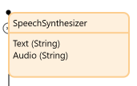
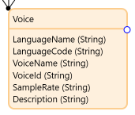
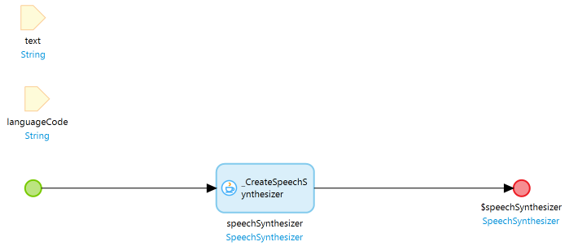
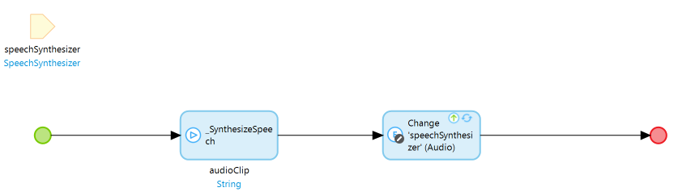
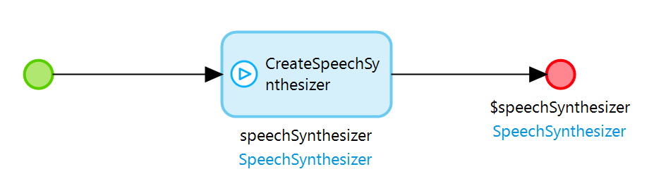
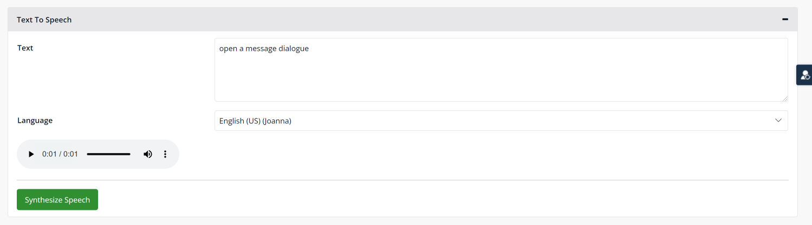
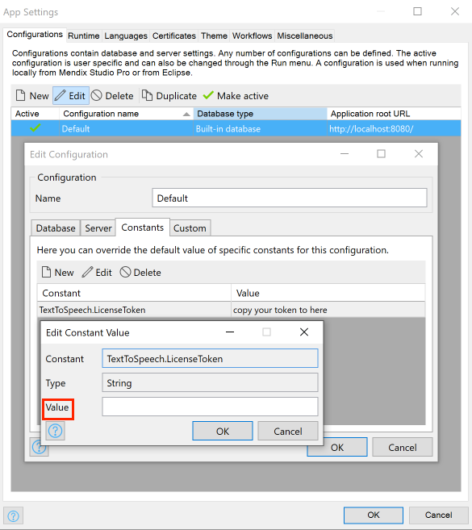
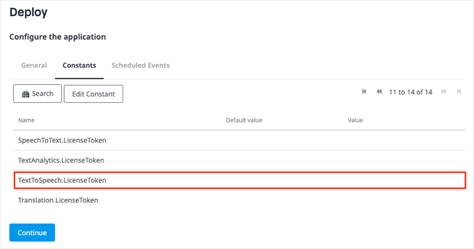
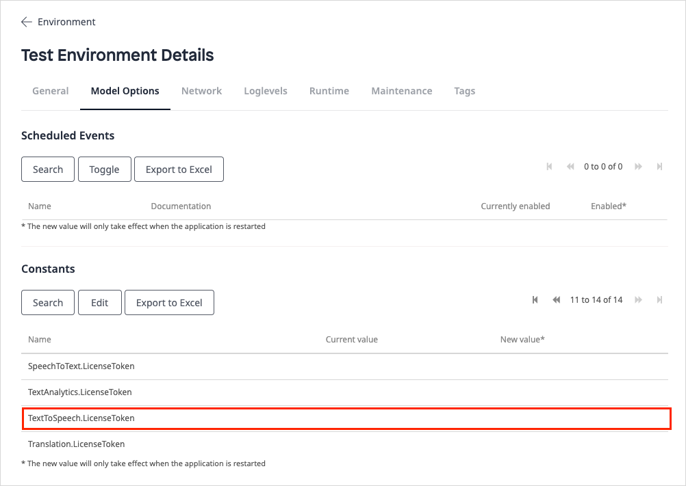

## 1 Introduction

The [Cogniso Text To Speech](https://marketplace.mendix.com/link/component/118409) app service enables you to easily convert written text into human voice in your web applications. With this app service, you can build an app to work with the state-of-the-art of text to voice conversion, without building your own text-to-voice app from the scratch. All you need to do is drag and drop items and configure them.

Here is an overview of what the CognisoTextToSpeech contains:

* [Predefined entities](#predefined-entities) 
	* SpeechSynthesizer
	* Voice
* [Constants](#constants)
	* LicenseToken
	* TokenEndpoint
* [Microflows](#microflows)
	* CreateSpeechSynthesizer
* [Nanoflows](#nanoflows)
	* SynthesizeSpeech
* [Widgets](#widgets)
	* AudioPlayer

In most cases, you will only need what is contained in the **TextToSpeech** > **USE_ME** folder. The content in the **TextToSpeech** > **Internal** folder is for internal use only and you will not need it.

### 1.1 Typical Use Cases

You can use this app service to easily convert written text into voice in your mendix apps. You can perform some basic operations, such us synthesizing speech from given text with different language options, and playing synthesized audio with the **AudioPlayer** widget.

### 1.2 Features

This app service enables doing the following:

* Convert text to voice
* Support different language options
* Play synthesized audio with the **AudioPlayer** widget

### 1.3 Prerequisites

This app service can only be used with Studio Pro 9 versions starting with [9.4.0](/releasenotes/studio-pro/9.4).

## 2 Installation

1. Go to the [Cogniso Text To Speech](https://marketplace.mendix.com/link/component/118593) component page in the Marketplace and download the *CognisoTextToSpeech.mpk* file.
2.  To add the Cogniso Text To Speech app service to your app in Mendix Studio Pro, follow these steps:
    1.  In the **App Explorer**, right-click the app.
    2.  Click **Import module package** and then select *CognisoTextToSpeech.mpk* file.

        In the **Import Module** dialog box, **Add as a new module** is the default option when the module is being downloaded for the first time, which means that new entities will be created in your project.

        

        {}If you have made any edits or customization to a module that you have already downloaded, be aware of the **Replace existing module** option. This will override all of your changes with the standard Marketplace content, which will result in the creation of new entities and attributes, the deletion of renamed entities and attributes, and the deletion of their respective tables and columns represented in the database. Therefore, unless you understand the implications of your changes and you will not update your content in the future, making edits to the downloaded modules is not recommended.{}

   3. In the **Import Module** dialog box, click **Import**. 
   4. Wait until a pop-up box states that the module was successfully imported. Click **OK**.
   5. Open the **App Explorer**  to view the **CognisoTextToSpeech** module. You can also find the app service in the **Cognitive AI widgets** category in the **Toolbox**.
3. After importing, you need to map the **Administrator** and **User** module roles of the installed modules to the applicable user roles in your app.

You have successfully added the Cogniso Text To Speech resources to your app.

## 3 Configuration

### 3.1 Predefined Entities {#predefined-entities}

The **SpeechSynthesizer** entity is a conceptual entity that incorporates all the information of the synthesized media document. It contains the text and synthesized audio string. You can choose to inherit from this entity, set an association to the entity, or copy this entity to your module.

| Attribute |Data Type | Description|
| --- | --- |---|
| `Text` | String |The text string need to be converted. |
| `Audio` | String |The base64-encoded audio data string. |

The **Voice** entity is an entity referenced from **SpeechSynthesizer** that incorporates all the information of the supported voice object.

| Attribute |Data Type | Description|
| --- | --- |---|
| `LanguageName` | String |The language name of the voice object. |
| `LanguageCode` | String |The language code of the voice object. |
| `VoiceName` | String |The name of the voice object. |
| `VoiceId` | String |The UUID of the voice object. |
| `SampleRate` | String |The sample rate of voice. |
| `Description` | String |The text string of the voice description. |

There is a many-to-many association between SpeechSynthesizer and Voice entities.

### 3.2 Constants {#constants}

#### 3.2.1 License Token

The **LicenseToken** constant is used to provide a valid CognisoTextToSpeech license token for the app that uses CognisoTextToSpeech to be successfully deployed to [Mendix Licensed Cloud Node](/developerportal/deploy/mendix-cloud-deploy) or your own environment. As CognisoTextToSpeech is a commercial product, to use the CognisoTextToSpeech functionalities in a deployed app, you need a long term valid license token, and you need to set the value of the **LicenseToken** constant to that license token in the deployment environment setting.

However, if you only plan to try how CognisoTextToSpeech works, that is to say, you will only build and run an app that uses CognisoTextToSpeech locally in Studio Pro or deploy to a Mendix Free App environment, you need to subscribe a trial version, and set the value of the **LicenseToken** constant to that license token in the project environment setting.

For details on how to get a license token, see the [Obtaining a LicenseToken for Your App](#obtain) section below.

#### 3.2.2 TokenEndpoint

The **TokenEndpoint** constant is used to provide a valid endpoint of security token service for the back-end authentication of the cognitive text-to-speech service. The constant comes with a default value which points to the production environment of the deployed security token service. The security token service issues security tokens that authenticate user's identity. 

### 3.3 Microflows {#microflows}

The **CreateSpeechSynthesizer** microflow takes **text** and **languageCode** from a voice object as input parameters, and returns a **speechSynthesizer** object that contains the based64-encoded audio string and text string.

### 3.4 Nanoflows {#nanoflows}

The **SynthesizeSpeech** nanoflow takes a **speechSynthesizer** object as an input parameter, syntheizes audio string from the input parameter, and updates the **speechSynthesizer** audio string parameter.

### 3.5 Widgets {#widgets}

#### 3.5.1 AudioPlayer {#audioplayer}

The core widget required is the **AudioPlayer** widget. You can make the following settings for the **AudioPlayer** widget:

* **General** tab
	* **Source**  – the value of the **Audio** attribute of a **speechSynthesizer** object
	* **Controls**  – determines if it offers controls to allow the end user to control audio playback, including volume, seeking, and pause/resume playback; this accepts a Boolean value

## 4 Using Cogniso Text To Speech

When you start from a blank app template in Mendix Studio Pro, follow the steps below to set up the text-to-voice conversion quickly.

### 4.1 Converting Text into Voice in Your Browser

Follow these steps to configure the text-to-voice conversion:

1.  Create a nanoflow as follows:
    1.  Name the nanoflow *CreateSpeechSynthesizer*.
    2.  Add the **CreateSpeechSynthesizer** microflow from the **TextToSpeech** > **USE_ME** folder to the nanoflow.
    3.  Double-click the **CreateSpeechSynthesizer** microflow in the nanoflow, change the settings as shown in the screenshot below, and click **OK**.
       
        
      
    4.  Right-click the **CreateSpeechSynthesizer** microflow and select **Set $speechSynthesizer as return value** in the pop-up menu.
    
        
   
2. From the **Toolbox**, add a **Data view** widget to your page.

3. Set the **CreateSpeechSynthsizer** nanoflow as the data source of the **Data view** widget as follows:
   1.  Double-click the **Data viewer** widget to open the **Edit Data View** dialog box.
   2.  For **Data source**, select **Nanoflow**.
   3.  **Select** the **CreateSpeechSynthsizer** nanoflow for **Nanoflow**.
   4.  Click **OK** to save the settings.
   
4. Inside the **Data view** widget, add an [AudioPlayer](#audioplayer) widget.

5. From the **Toolbox**, add a **Text area** widget to your page.

6. Change the settings of the **Text area** widget as follows:
   1. Double-click the **Text area** widget to open the **Edit Text Area** dialog box.
   2. For **Data source**, Select the **Text** attribute from **Data view**.
   3. For **Label caption**, enter *Text*.
   4. Click **OK** to save the settings.
   
7. From the **Toolbox**, add a **Reference selector** widget to your page.

8. Change the settings of the **Reference selector** widget as follows:
   1. Double-click the **Reference selector** widget to open the **Edit Reference Selector** dialog box.
   2. For **Data source**, select the **Description** attribute of the **Voice** entity from **SpeechSynthesizer_Voice**.
   3. For **Label caption**, enter *Language*.
   4. Click **OK** to save the settings.
   
9. From the **Toolbox**, add a **Button** widget to your page.

10. Change the settings of the **Button** widget as follows:

    1. Double-click the button to open the **Action Button** dialog box.
    2. For Caption, enter *Synthesize Speech*.
    3. In the **Event** section, set **On click** to **Call a nanoflow**.
    4. For **Nanoflow**, **Select** the **SynthesizeSpeech** nanoflow from the **USE_ME** folder.
    5. Click **OK** to save the settings.  

11. Double-click the **Audio Player** widget to open the **Audio Player** dialog box.

12. On the **General** tab, set **Source** to **$currentObject/Audio** to bind the base64-encoded audio data string, and set **Controls** to **true**.

    

13. Run your app locally. You can convert text to voice directly in the browser:

    

## 5 Obtaining a LicenseToken to Deploy Your App {#obtain}

Cogniso Text To Speech is a premium Mendix product that is subject to a purchase and subscription fee. To successfully use this product in an app, you need to provide a valid **LicenseToken** as an environment variable in the deployment setting; otherwise, the Cognitive AI service features may not work in your app.

### 5.1 Obtaining a LicenseToken with trial version

When you just need to run your app with Cogniso Text To Speech locally or deploy as a Mendix Free App for testing and trial purposes, you will need a trial version of LicenseToken.

### 5.2  Obtaining a LicenseToken

To receive information on how to get the license token for [Cogniso Text To Speech](https://marketplace.mendix.com/link/component/118409) trial version, contact [Mendix Support](https://support.mendix.com/hc/en-us) and raise a ticket for Cognitive AI development team.

### 5.3 Configuring a LicenseToken for App Deployment

#### 5.3.1 Configuring the LicenseToken in Studio Pro

1. In the App Explorer, go to **Settings** to open the [App Settings](/refguide/project-settings) dialog box.
2. On the **Configurations** tab, click **Edit** to open the **Edit Configuration** dialog box.
3. On the **Constants** tab, create a new constant with the predefined constant **TextToSpeech.LicenseToken**.
4. Fill in the **Value** with your obtained LicenseToken.
5.  Click **OK** to save the settings.

	  

6. When you finish building the app, click **Run** to deploy your app to the cloud.

#### 5.3.2 Configuring the LicenseToken in Developer Portal

Alternatively, you can add or update LicenseToken as a constant in the [Developer Portal](/developerportal/deploy/environments-details).

Before you deploy your app, configure the app **Constants** in the deployment package

If you have already deployed your app, change the existing **LicenseToken** constant value on the **Model Options** tab and restart the app:

