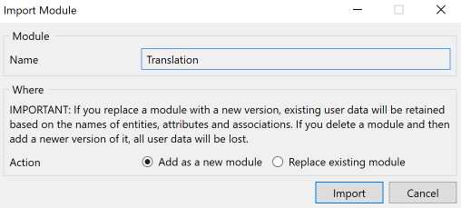
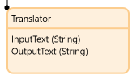
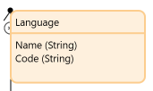
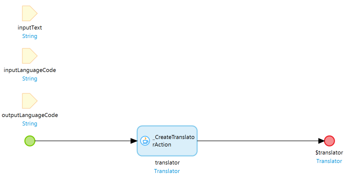
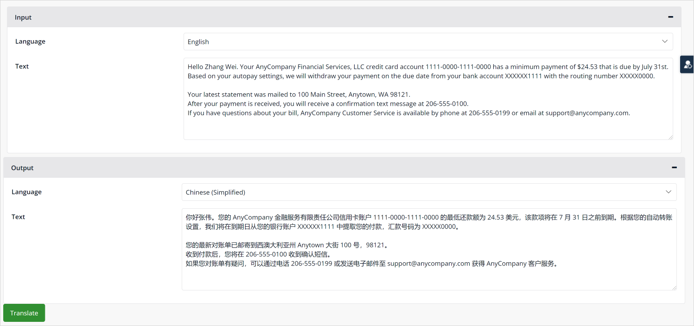
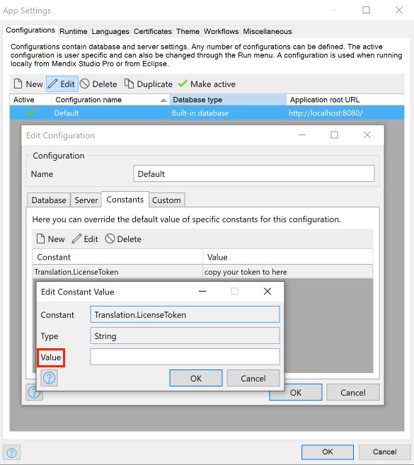
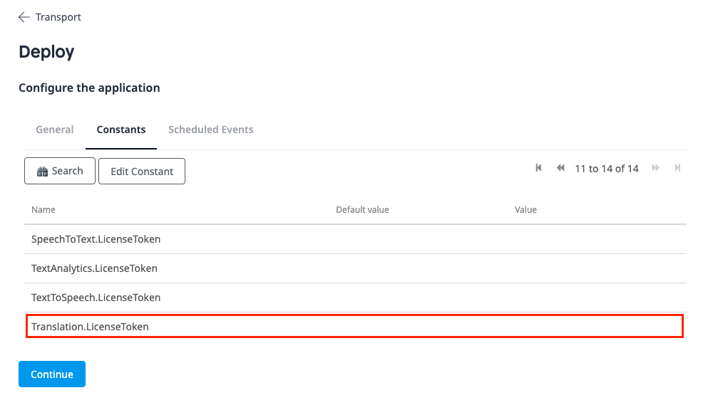
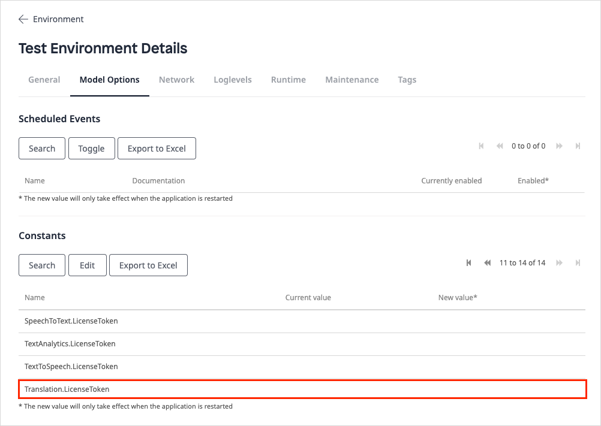

## 1 Introduction

The [Cogniso Translation](https://marketplace.mendix.com/link/component/118592) app service on mendix cloud that enables you to easily convert voice and audio into written text in your web applications. The app service contains out-of-the-box Java actions, JavaScript actions, domain models, nanoflows, microflows that enable you to build apps to work with state-of-the-art multi-language text translation. All you need to do is drag and drop items and configure them.

This app service does the heavy-lifting for you so you do not have to build a text translation application from scratch.

Here is an overview of what the CognisoTranslation contains:

| Item | Name |
| ---  | --- |
| [Predefined entities](#predefined-entities) | Language, Translator |
| [Constants](#constants) | LicenseToken, TokenEndpoint |
| [Microflow](#microflow) | CreateTranslator |
| [Nanoflow](#nanoflow) | TranslateText |
| [Java action](#java-action) |  |
| [Widgets](#widgets) |  |

In most cases, you will only need what is contained in the **Translation/USE_ME** folder. The content in the **Internal** folder is for internal use only and you will not need it.

### 1.1 Typical Use Cases

You can use this app service on mendix cloud that enables you to easily perform text translation with multi-language support in your mendix applications.

### 1.2 Features

This app service enables doing the following:

* Customize text tranlation
* Switch different language options

### 1.3 Limitations

The Cogniso Translation app service.

### 1.4 Prerequisites

This app service can only be used with Studio Pro 9 versions starting with [9.4.0](../../releasenotes/studio-pro/9.4).

## 2 Installation

1. Go to the [Cogniso Translation](https://marketplace.mendix.com/link/component/118592) component page in the Marketplace and download the *CognisoTranslation.mpk* file.

2. To add the Cogniso Translation app service to your app in Mendix Studio Pro, follow these steps:

   1. In the **App Explorer**, right-click the app.
   2. Click **Import module package** and then select the *CognisoTranslation.mpk*. 

      In the **Import Module** dialog box, **Add as a new module** is the default option when the module is being downloaded for the first time, which means that new entities will be created in your project.

      

      {}If you have made any edits or customization to a module that you have already downloaded, be aware of the **Replace existing module** option. This will override all of your changes with the standard Marketplace content, which will result in the creation of new entities and attributes, the deletion of renamed entities and attributes, and the deletion of their respective tables and columns represented in the database. Therefore, unless you understand the implications of your changes and you will not update your content in the future, making edits to the downloaded modules is not recommended.{}

   3. In the **Import Module** dialog box, click **Import**. 
   4. Wait until a pop-up box states that the module was successfully imported. Click **OK**.
   5. Open the **App Explorer**  to view the **CognisoTranslation** module. You can also find the app service in the **Cognitive AI widgets** category in the **Toolbox**.
3.  Map the **Administrator** and **User** module roles of the installed modules to the applicable user roles in your app.

You have succesfully added the Cogniso Speech To Text resources to your app.

## 3 Configuration

### 3.1 Predefined Entities {#predefined-entities}

The **Translator** entity is a conceptual entity that incorporates all the information of translator object. It contains both input and output text string. You can choose to inherit from this entity, set an association to the entity, or copy this entity to your module. 

| Attribute | Description |
| --- | --- |
| **InputText** | The input text string. |
| **OutputText** | The output text string. |

The **Language** entity is an entity referenced from **Translator** that incorporates all the information of supported language object.

| Attribute | Description |
| --- | --- |
| **Name** | The language name Equivalent to Locale Name. |
| **Code** | The language code that assigns letters or numbers as identifiers or classifiers for languages. |

### 3.2 Constants {#constants}

The **LicenseToken** constant is used to provide a valid CognisoTranslation license token for the app that uses CognisoTranslation to be successfully deployed to [Mendix Licensed Cloud Node](/developerportal/deploy/mendix-cloud-deploy) or your own environment. As CognisoTranslation is a commercial product, to be able to use the CognisoTranslation functionalities in a deployed app, you will need a long term valid license token, and you need to set the value of the **LicenseToken** constant to that license token in the deployment environment setting.

However, if you only plan to try how CognisoTranslation works  (meaning, build and run an app that uses CognisoTranslation locally in Studio Pro or deploy to a Mendix Free App environment), you need to subscribe a trialed version, and set the value of the **LicenseToken** constant to that license token in the project environment setting.

For details on how to get a license token, see the [Obtaining a LicenseToken for Your App](#obtain) section below.

The **TokenEndpoint** constant is used to provide a valid endpoint of security token service for cognitive text to speech service backend authentication. The constant comes with default value which point to the production environment of deployed security token service. The security token service issue security tokens that authenticate user's identity. 

### 3.3 Microflow {#microflow}

The **CreateTranslator** microflow takes **inputText**, **inputLanguageCode** and **outputLanguageCode** object as an input parameters and create translator action in backend service.

### 3.4 Nanoflow {#nanoflow}

The **TranslatorText** microflow takes **translator** object as an input parameter and perform text translation actions in backend service. Eventually update output text string of tranlator object.

### 3.5 Java Action {#java-action}

## 4 Using Cogniso Translation

Cogniso Translation provides microphone widget to perform text translation with customizable actions.

When you start from a blank app template in Mendix Studio Pro, you can follow the steps below to setup customizable voice to text actions quickly.

### 4.1 Performing text translation in Your Browser

From the **CreateTranslator** microflow and **TranslateText** nanoflow to perform text translation.

Follow these steps to configure this text translation actions:
1. Place a new data view on the page.
2. Create a nanoflow, call it *CreateTranslator*, and set this as the data source of the data view.
3. Place a textArea, set inputText of data view object as the data source, while place a reference selector, set language name from association in the input group box.
4. Place another textArea, set inputText of data view object as the data source, while place a reference selector, set language name from association in the output group box.
5. Warp two group boxes into the data view created in previous step.
6. Place a button, call it *Translate*, and set nanoflow **TranslateText** as the action of events.
7. Run your app locally. You can now perform text translation directly in the browser:

## 5 Obtaining a LicenseToken to Deploy Your App {#obtain}

Cogniso Translation is a premium Mendix product that is subject to a purchase and subscription fee. To successfully use this product in an app, you need to provide a valid **LicenseToken** as an environment variable in the deployment setting; otherwise, the Cognitive AI service features may not work in your app.

### 5.1 Obtaining a LicenseToken with trial version

When you just need to run your app with Cogniso Translation locally or deploy as a Mendix Free App for testing and trial purposes, you will need a trial version of LicenseToken.

To receive information on how to get the license token for [Cogniso Translation](https://marketplace.mendix.com/link/component/118592) trial version, contact [Mendix Support](https://support.mendix.com/hc/en-us) and raise a ticket for Cognitive AI development team.

### 5.2 Configuring a LicenseToken for App Deployment

#### 5.2.1 Configuring the LicenseToken in Studio Pro

In Mendix Studio Pro, go to [Project Settings](/refguide8/project-settings) and follow these steps:

1. In the **Configurations** tab, click **Edit**. 
2. In the **Constants** tab of the dialog box, create a new constant with the predefined constant **Translation.LicenseToken**.
3. Fill in the **Value** with your obtained LicenseToken.
4.  Click **OK** to confirm the settings.

	

5. When you finish building the app, click **Run** to deploy your app to the cloud.

#### 5.2.2 Configuring the LicenseToken in Developer Portal

Alternatively, you can add or update LicenseToken as a constant in the [Developer Portal](/developerportal/deploy/environments-details).

Before you deploy your app, configure the app **Constants** in the deployment package

If you have already deployed your app, change the existing **LicenseToken** constant value on the **Model Options** tab and restart the app:

