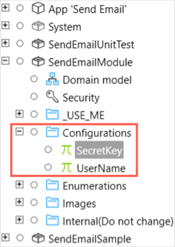
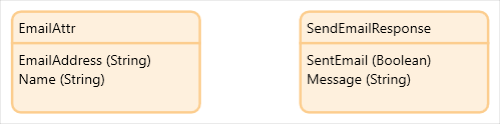
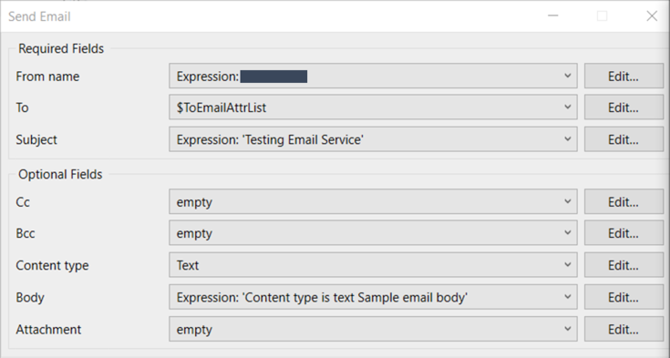
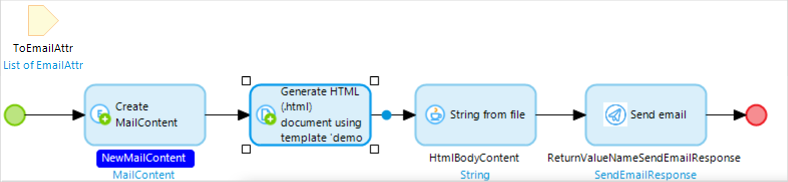
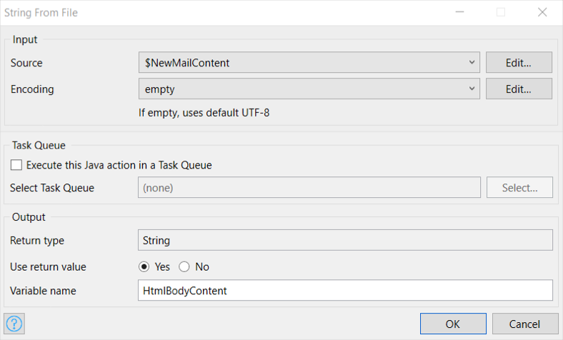
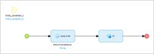
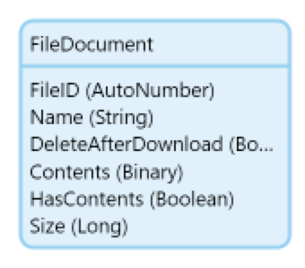

## 1 Introduction

The [Email Service](https://marketplace.mendix.com/link/component/118393) app service enables including an email component in your Mendix application. Just add the minimum required configuration and you are good to go.

The app service works with [Mendix SSO](/appstore/modules/mendix-sso), so no additional authentication changes are required.

### 1.1 Typical Use Cases

* The app service supports sending HTML and plain text messages
* You can add recipients in the "To", "CC", and "BCC" lists to send emails to multiple recipients
* You can send emails with or without attachments

### 1.2 Features

This app service enables doing the following:

* Send HTML and plain text messages to multiple recipients
* Send attachment(s) with a message
* Supports setting up a custom Mail From domain to improve your deliverability

### 1.3 Limitations

* The total number of recipients in the "To", "CC", and "BCC" lists cannot exceed 50
* The cumulative size of the attachment(s) cannot exceed 10 MB
* Certain files, for example, executables, scripts, and macros, are not supported as attachments. For an exhaustive list of unsupported file types, see [Unsupported File Types for Attachments](#unsupported-file-types)

### 1.4 Prerequisites

This app service can only be used with Studio Pro 9 versions starting with [9.4](/releasenotes/studio-pro/9.4).

## 2 Installation

1. Go to the Marketplace and download the *SendEmailModule.mpk* file for the [Email Service](https://marketplace.mendix.com/link/component/118393).

2.  To add the Email Service to your app in Mendix Studio Pro, follow these steps:

    1.  In the **App Explorer**, right-click the app, click **Import module package**, and then select *SendEmailModule.mpk*. 

        

        In the **Import Module** dialog box, **Add as a new module** is the default option when the module is being downloaded for the first time, which means that new entities will be created in your app.

        {}If you have made any edits or customization to a module that you have already downloaded, be aware of the **Replace existing module** option. This will override all of your changes with the standard App Store content, which will result in the creation of new entities and attributes, the deletion of renamed entities and attributes, and the deletion of their respective tables and columns represented in the database. Therefore, unless you understand the implications of your changes and you will not update your content in the future, making edits to the downloaded modules is not recommended.{}

    2. In the **Import Module** dialog box, click **Import**. 

    3. Wait until a pop-up window states that the module was successfully imported. Click **OK**.

    4. Open the **App Explorer** to view the **SendEmailModule** module.

Once imported, the app service is visible in the **App Explorer** and in the **Communication Services** category in the **Toolbox**.

## 3 Configuration

Email Service is a premium Mendix product that is subject to a purchase and subscription fee. To successfully deploy an app that uses Email Service, you need to get a valid combination of **userName** and **secretKey** and configure them as environment variables in the deployment setting.

### 3.1  Subscribing to Get SecretKey and UserName {#key-generation}

1. On the [Email Service](https://marketplace.mendix.com/link/component/118393) page, click **Subscribe** to order a subscription.

2. Fill in the **Number of End Users**, [Technical Contact](/developerportal/collaborate/app-roles#technical-contact) information (**First Name**, **Last Name**, **Email Address**), billing account information, and other required information, and then place the order. The Technical Contact receives an order confirmation email.

3. Click the link in the order confirmation email to go to the Marketplace [Subscriptions](/appstore/general/app-store-overview#subscriptions) page and log in there. The **Subscriptions** page gives an overview of all the subscriptions of your organization.

4. Click **Email Service** to open the [service management dashboard](/appstore/general/app-store-overview#4-8-1-service-management-dashboard)..

5. Click **Create Binding Keys**.

6. Enter a meaningful name for the binding keys. Make sure that the name includes the name of the app which uses Email Service.

7.  Click **Create Keys** to generate the **SecretKey** and **UserName**. 

    The system generates **SecretKey** and **UserName** and also returns **MailFromDomain**, **SPFRecordValue**, and **MXRecordValue**. For more details on SPF and MX configuration, see the section [SPF and MX Records](#spf-and-mx-records).

    

8. **Copy** the **SecretKey** and **UserName**. You will use them later for app deployment.

9. After the order is created successfully, the Technical Contact also receives an email to confirm the email address. Follow the instructions in the email to confirm the email address. Once this email address is confirmed, this email address is used as the sender's email address when the app sends an email.

### 3.2 Configuring userName and secretKey for App Deployment

1.  In the **App Explorer**, go to **SendEmailModule** > **Configurations**. You can see **SecretKey** and **UserName** are defined as constants. 

    

2. Double-click **SecretKey** and enter the **SecretKey** that you got.

3. Click **OK** to save the settings.

4. Double-click **UserName** and enter the **UserName** that you got.

5. Click **OK** to save the settings.

6. After you finish building the app, click **Run** to deploy your app to the cloud.

## 4 Usage

### 4.1 Sending Messages to Recipients 

You can use the Email Service in a microflow to send HTML or plain text messages. The Email Service comes bundled with predefined entities **EmailAttr** and **SendEmailResponse**.

You can create a list using the **EmailAttr** entity to specify the **To**, **CC**, **BCC** recipients. For more information, see [Working with Lists in a Microflow](/howto/logic-business-rules/working-with-lists-in-a-microflow).

{}Every email address to whom this message is sent is counted as utilization towards the allocated app service quota. If the email addresses are incorrect, the email will bounce back.{}

This representative microflow contains an entity with the required attributes, an action to send an email that internally calls the Java action, and a placeholder to capture the return code of the sending email action.

To configure the **Send email** activity, double-click the activity and specify the following settings in the **Send Email** dialog box with expression syntax:

* **Required Fields**
  * **From name** – Defines the sender of the email
  * **To**  – Defines the recipients of the email
  * **Subject**  – Defines the subject of the email
*  **Optional Fields**

   {}For all **Optional Fields**, you must either define a value or select **empty** for the field. Otherwise, you will get an "missing value" error.{}

  * **Cc** – Defines the recipients on the CC list of the email
  * **Bcc** – Defines the recipients on the BCC list of the email
  * **Content type** – Defines whether the email is a **Text** or **HTML** message
  *  **Body** – Defines the body of the email

   {}If you want to send an HTML message, you can generate HTML content, and add the generated HTML string in the **Body** field. For more information, see [Generating HTML Body Content](#generate-html-body).{}
  
  * **Attachment** – Defines the attachment to the email

After the **Send Email** activity is configured, once the microflow that uses this activity is triggered, the app asynchronously sends out the message to the recipients.

#### 4.1.1 Generating HTML Body Content {#generate-html-body}

The following microflow shows a possible way to generate HTML content using a template. The template contains fixed text with some placeholders for variables.

The second step creates an HTML file from the template contents after possible variable substitution.

The third step generates a string from this HTML file using the **String from file** action.

 In the last step, you can add the variable for the generated HTML content into the **Body** field of the **Send email** activity.

### 4.2 Sending Message with Attachment(s) to Recipients

This is a representative microflow that sends emails with file attachments. The file attachments should have the file types that are [supported](#unsupported-file-types).
	

	
The **Attachment** attribute accepts a list of **FileDocumentObject**. You can either use **System.FileDocument** or use [File Dropper](https://marketplace.mendix.com/link/component/111497) to create a list of **FileDocumentObject** that will be sent as attachments with the email.

{}The size of the attached file(s) multiplied by the total number of recipients in the "To", "CC", and "BCC" lists is counted against the Data transfer utilization.{}

#### 4.2.1 Unsupported File Types for Attachments {#unsupported-file-types}

The following file types are not supported as attachments:

*.ade*, *.adp*, *.app*, *.asp*, *.bas*, *.bat*, *.cer*, *.chm*, *.cmd*, *.com*, *.cpl*, *.crt*, *.csh*, *.der*, *.exe*, *.fxp*, *.gadget*, *.hlp*, *.hta*, *.inf*, *.ins*, *.isp*, *.its*, *.js*, *.jse*, *.ksh*, *.lib*, *.lnk*, *.mad*, *.maf*, *.mag*, *.mam*, *.maq*, *.mar*, *.mas*, *.mat*, *.mau*, *.mav*, *.maw*, *.mda*, *.mdb*, *.mde*, *.mdt*, *.mdw*, *.mdz*, *.msc*, *.msh*, *.msh1*, *.msh2*, *.mshxml*, *.msh1xml*, *.msh2xml*, *.msi*, *.msp*, *.mst*, *.ops*, *.pcd*, *.pif*, *.plg*, *.prf*, *.prg*, *.reg*, *.scf*, *.scr*, *.sct*, *.shb*, *.shs*, *.sys*, *.ps1*, *.ps1xml*, *.ps2* *.ps2xml*, *.psc1*, *.psc2*, *.tmp*, *.url*, *.vb*, *.vbe*, *.vbs*, *.vps*, *.vsmacros*, *.vss*, *.vst*, *.vsw*, *.vxd*, *.ws*, *.wsc*, *.wsf*, *.wsh*, .xnk

### 4.3 Checking Statistics Using the Usage Dashboard

The **Usage** dashboard shows the real-time statistics about the usage of an app service. For the Email Service, perform the following steps to check the number of emails sent and data transfer usage:

1. Log into the Marketplace.

2. Go to **My Marketplace** and click [Subscriptions](/appstore/general/app-store-overview#subscriptions) on the left navigation menu. The **Subscriptions** page gives an overview of all the subscriptions of your organization.

3. Click **Email Service** to open the [service management dashboard](/appstore/general/app-store-overview#4-8-1-service-management-dashboard). On the **Overview** tab, the **Usage** dashboard shows the following statistics:
   * **Current Month** – Shows statistics for current month usage
   * **Last Month** – Shows usage statistics for last month
   * **Till date** – Shows usage statistics from the start of the subscription date to today

## 5 Increasing the Deliverability of Your Emails

You can make your emails comply with [Domain-based Message Authentication, Reporting and Conformance (DMARC)](https://dmarc.org/) to increase the deliverability of your emails. This is a protocol that helps mail servers validate whether an incoming email is authorised by the administrators of the sending domain. To comply with DMARC, you can use the Sender Policy Framework (SPF) method.

### 5.1 Configuring the Mail From Domain

Sender Policy Framework (SPF) is an email authentication method. During the delivery of an email, SPF allows the mail server to check whether an incoming email claiming to come from a specific domain is submitted by an IP address authorized by the administrators of that domain. 

To achieve The SPF validation, you must meet these two requirements:

* The domain in the Mail From address of your email must authorize the sending mail server to send the email via a DNS record
* The domain in the From address of your email must match the Mail From domain (the From address is used in the email header and shown to the email recipients, while the Mail From address is used by mail servers to return bounce messages and other error notifications. Both addresses are used to indicate the source of an email.)

If you use the default Mail From domain of the Email Service, you can only meet the first requirement. To meet the second requirement, you must use your own Mail From domain.

To configure your custom Mail From domain, you should work with your IT administrators to add the MX and SPF records, which you received during the [generation of your keys](#key-generation).

### 5.2 SPF and MX Records {#spf-and-mx-records}

The SPF record is a list of authorized sending hosts and IP addresses for a domain, which is published in the domain's DNS records.

A mail exchanger record (MX record) shows which mail server is responsible for accepting email messages on behalf of a domain name. It is a resource record in the DNS.

The SPF record and MX record use the formats shown in the following table:

| Name | Format | Value |
| --- | --- | --- |
| notification.domain.com | TXT | "v=spf1 include:amazonses.com ~all" |
|notification.domain.com | MX | 10 feedback-smtp.eu-central-1.amazonses.com|
