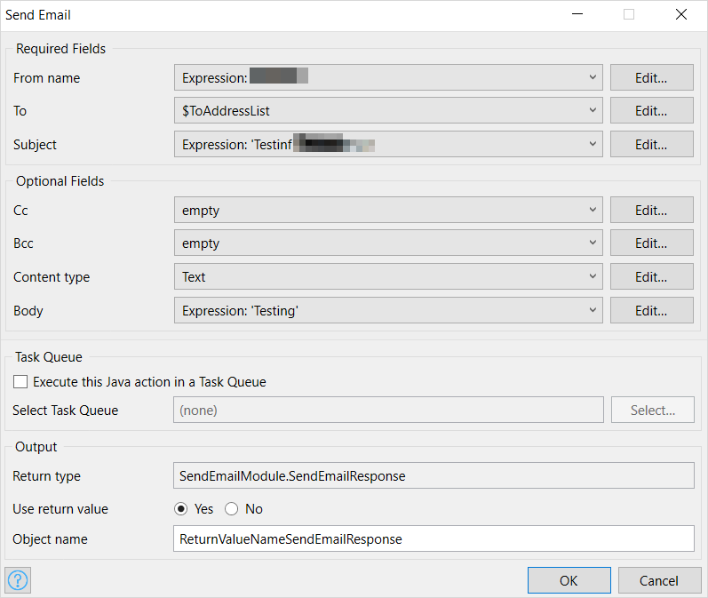
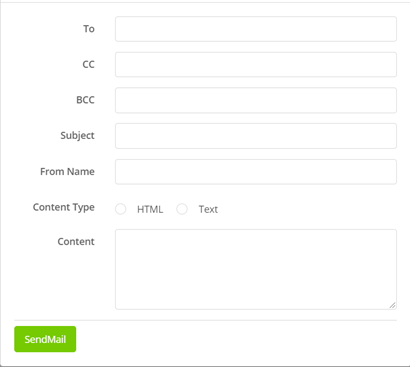

## 1 Introduction

{}[**Verify Marketplace Documentation tab**]{}

The [Email Service](https://marketplace.mendix.com/link/component/118393) app service enables including an email component in your Mendix application. Just add the minimum required configuration and you are good to go.

The app service works with [Mendix SSO](/appstore/modules/mendix-sso), so no additional authentication changes are required.

## 2 Installation

The *.mpk* package available in the Marketplace can be imported into Mendix Studio Pro or Studio. Once imported, the app service is visible in **App Explorer** and in the **Toolbox** pane of a microflow.

## 3 Configuration

The app service can be used into a microflow. This example microflow shows an entity model with the required attributes, a step for sending mail that will internally call the Java action, and a placeholder to capture the return code of the send mail action:

When configuring the Java action in the microflow, specify the **Required Fields** (**From name** and **To**) as well as desired **Optional Fields** using expression syntax:

This Email Service app service supports plain text, HTML formats, and attachments. 

## 4 Usage

You can choose to create a form where the end-user specifies **To**, **CC**, **BCC**, and the email body content. When sending an email, the **To** and **From Name** attributes are required:

Clicking **Send Email** will asynchronously send out the message to intended recipients.

Each individual email ID to whom this message is sent is counted as utilization towards the allocated app service quota. Incorrect email addresses will result in the email bouncing.
