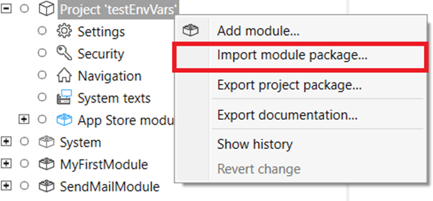
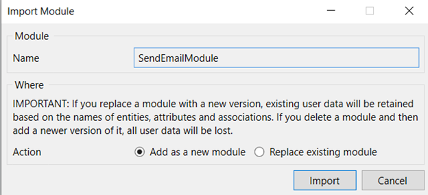
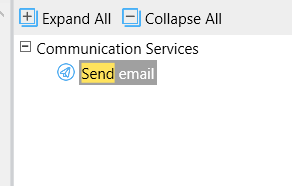
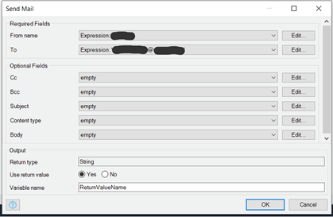
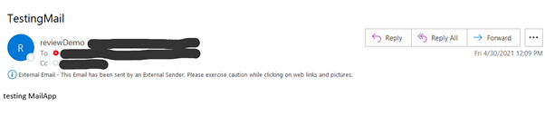

**LOOK AT JIRA ISSUE FOR OTHER SCREENSHOTS, SEE IF COPIES AND BETTER RESOLUTION**

The package (mpk) available in the marketplace can be imported into Studio/StudioPro and can be used into a microflow.

Once the module is imported, it is visible in the app explorer and in the toolbox window of a microflow.

A representative microflow below shows an Entity model with required attributes, send mail step which will internally call the Java action and a placeholder to capture the return code of the send mail action.

Below snapshot indicates the Java action from Studio-pro. You can specify the required attributes (To and From Name) using the “Expression” syntax. Similarly, other attributes from model entity can be populated using Expression syntax.

The email API supports plain-text and HTML formats. Attachments are NOT supported as of now. The maker can choose to create a form where end-user can specify “To”, “CC”, “BCC” and the email body contents. Pressing the “Send Email” button will asynchronously send out the message to intended recipients.

Maker can also choose to populate the “To”, “CC”, “BCC”, “subject” and email body contents non-interactively as part of some upstream action before this microflow is invoked.

“To” and “From Name” are required attributes.

The email will be sent out to intended participants. Each individual email ID to whom this message is sent is counted as utilization towards the allocated quota. Incorrect email address will result into email message bouncing. A snapshot below shows a test email in the recipient’s Inbox.

