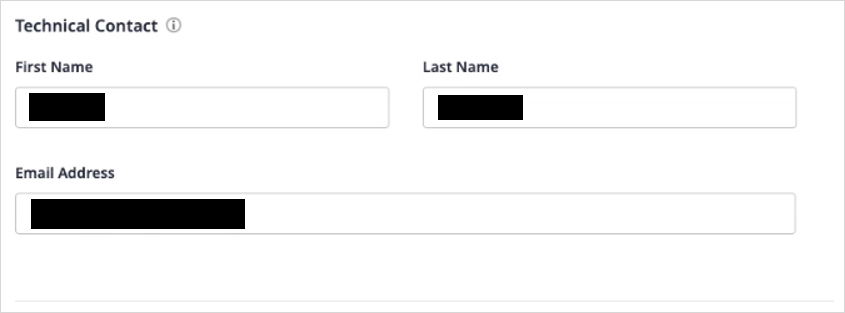

## 1 Introduction

{}[**Verify Marketplace Documentation tab**]{}

The [Email Service](https://marketplace.mendix.com/link/component/118393) app service enables including an email component in your Mendix application. Just add the minimum required configuration and you are good to go.

The app service works with [Mendix SSO](/appstore/modules/mendix-sso), so no additional authentication changes are required.

### 1.1 Typical Use Cases

* The service supports sending HTML and plain-text messages.
* You can add recipients in the "To", "CC" and "BCC" buckets to send emails to multiple recipients. 
* You can use this email-service to send emails with or without attachments. 

### 1.2 Features

This app service enables doing the following:

* Sending HTML and plain-text messages to multiple recipients
* Sending attachment(s) with message.

### 1.3 Limitations
The email-service has folowing limitations:

*  The number of recipients (To + cc + bcc) cannot exceed 50.
*  The cumulative size of the attachment(s) cannot exceed 10MB
*  Certain files (executables/scripts/macro) are not supported as attachments. For exhausitve list of unsupported file types, please refer link [Unsupported File Types](https://docs.aws.amazon.com/ses/latest/DeveloperGuide/mime-types-appendix.html)

### 1.4 Prerequisites
This app service can only be used with Studio Pro 8 versions starting with [8.18.5](../../releasenotes/studio-pro/8.18#8185).

## 2 Installation

First, download the *SendEmailModule.mpk* file for the [Email Service](https://marketplace.mendix.com/link/component/118393) from the Marketplace. When you want to add the email-service to your app in Mendix Studio Pro, follow these steps:

1. Right-click the project in the **Project Explorer**, click **Import module package**, and select the *SendEmailModule.mpk*. 
2.  In the **Import Module** dialog box, **Add as a new module** is the default option when the module is being downloaded for the first time, which means that new entities will be created in your project.
	
	{}If you have made any edits or customization to a module that you have already downloaded, be aware of the **Replace existing module** option. This will override all of your changes with the standard App Store content, which will result in the creation of new entities and attributes, the deletion of renamed entities and attributes, and the deletion of their respective tables and columns represented in the database. Therefore, unless you understand the implications of your changes and you will not update your content in the future, making edits to the downloaded modules is not recommended.{}

3. Click **Import** on the **Import Module** dialog box, and a pop-up stating that “The app was successfully imported into the project” will appear. Click **OK**.
4. Open the **Project Explorer** to view the SendEmailModule module.

The *SendEmailModule.mpk* package available in the Marketplace can be imported into Mendix Studio Pro. Once imported, the app service is visible in **App Explorer** and in the **Toolbox** pane of a microflow.

## 3 Obtaining a userName & secretKey {#obtain}

Email-service is a premium Mendix product that is subject to a purchase and subscription fee. To successfully deploy an app that uses email-service, you need to provide a valid combination of **userName and secretKey** as an environment variable in the deployment setting.
 
### 3.1  Subscribing to Get a userName & secretKey

On the [Email Service](https://marketplace.mendix.com/link/component/118393) page, click **Subscribe** to go to the subscription order page and follow these steps:

1. Fill in technical contact information (first name, last name, email address), the subscription amount, billing account information, and other required information. 

 
 
2. Upon successful order creation, if you are the app's [Technical Contact](/developerportal/collaborate/app-roles#technical-contact), you will receive an order confirmation email.
3. Click the link in the email to the Marketplace [Subscriptions](/appstore/general/app-store-overview#subscriptions) page and log in there.
4. In the list of your organization's subscriptions, click the **Email Service** subscription link to open the subscription details page.
5. Click **Create Binding Keys** , give the key a meaningful name (which should include the name of the app where you are using Email-service), then click **Create Keys**.
6. When the **userName and secretKey** are generated, copy and save it for later use in your app.
7. Along with **userName** and **secretKey**, **MailFromDomain** and **SPF Record Settings** & **MX Record Settings** records are returned during Binding Key generation. Please refer Section 5.1 for for further details on MX & SPF configuration.
8. Post successful order creation, the App's Technical Contact will also receive an email asking to verify the email address. Please follow the steps in that email to verify the "From Email"

### 3.2 Configuring userName & secretKey for App Deployment

In Mendix Studio Pro please follow the below steps:

1. Expand **SendEmailModule**.
2. In the **Configurations** tab, you will see **userName and secretKey** defined as Constants. 
3. Click on the **uerName** Constant and fill in the value of userName generated during Binding.
4. Click on the **secretKey** Constant and fill in the value of secretKey generated during Binding.
5. Click **OK** to confirm the settings.
6. When you finish building the app, click **Run** to deploy your app to the cloud.

## 4 Usage

### 4.1 Sending text message to recipients 

The email-service can be used into a microflow. The Email Service supports sending messages in plain text or HTML formats.. This representative microflow shows an entity model with the required attributes, a step for sending mail that will internally call the Java action, and a placeholder to capture the return code of the send mail action.

Email-service comes bundled with predefined Domain entities viz **EmailAttr** and **SendEmailResponse**. You can create a list using **EmailAttr** entity to specify  **To**, **CC**, **BCC** recipients. 
[Working with Lists in microflow](https://docs.mendix.com/howto/logic-business-rules/working-with-lists-in-a-microflow)

	
When configuring the **Send email** activity in the microflow, specify the **Required Fields** (**From name**, **To**, and **Subject**) as well as desired **Optional Fields** using expression syntax:

For optional fields or the ones which need not be populated, you should select **Empty** from the dropdown against that field.

You need to choose the **Content Type** and specify if you want to send **Text** or **HTML** message. After choosign the **Content Type** as "Text", the email body content can be specified by choosing **Edit** option against the attribute **Body**.

Clicking **Send Email** will asynchronously send out the message to intended recipients.

Each individual email ID to whom this message is sent is counted as utilization towards the allocated app service quota. Incorrect email addresses will result in the email bouncing.

### 4.2 Sending HTML message to recipients

Choosing the **ContentType** as **HTML** will enable sending HTML messages to recipients.
The HTML string can be generated using **Mendix Template** and injecting contents into the template. The generated HTML string can be then included in the **Body** attribute.

### 4.3 Sending message along with attachment(s) to recipients

This representative microflow shows sending email with file attachments.
	

	
For sending messages with attachments, you need to first create Domain Model **System.FileDocument**. The **Attachment** attribute accepts a list of **FileDocumentObject**. 

<< screenshot needed - domain model for attachment>>

To create a list of File Objects using File Dropper, please refer the link.
[Working with File Dropper](https://marketplace.mendix.com/link/component/111497)

The size of the attached file(s) multiplied by number of recipients (**TO** + **CC** + **BCC**) will be counted against the Data transfer utilization.

### 4.4 Usage Dashboard

## 5 MAIL FROM Domain Setting

### 5.1 MX & SPF Records

Refer Section 3.1 for generating **MX** and **SPF** records.
The MX and SPF records that are generated needs to be added into your domain's DNS configuration. These records use the formats shown in the following table.

| Name | Tyoe | Value |
| --- | --- | --- |
| notification.domain.com | MX | 10 feedback-smtp.eu-central-1.amazonses.com |
| notification.domain.com | TXT | "v=spf1 include:amazonses.com ~all" |

### 5.2 DKIM & DMARC Compliance
Coming in future release.
